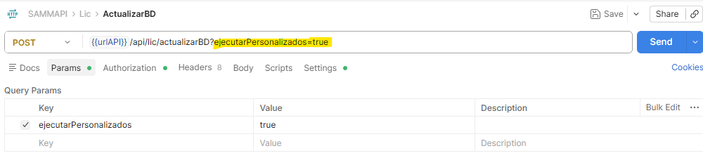

# Ajuste en Scripts para la Actualización de la Base de Datos

Este documento describe el ajuste realizado en el endpoint de actualización de base de datos, mediante el cual se agrega un parámetro que permite controlar si los scripts base del sistema (por ejemplo, `mob_bandejaservicios` y `mob_plantillalistachequeo`) serán alterados durante el proceso de actualización. Anteriormente, estos scripts se ejecutaban de forma directa sobre la base de datos sin posibilidad de omitirlos, lo que representaba un riesgo al actualizar ambientes donde dichos scripts ya habían sido personalizados o no debían ser modificados.

## Referencias

- [SO-2089: Actualizar endpoint de actualizar BD](https://softwaresamm.atlassian.net/browse/SO-2089)

## Información de Versiones

### Versión de Lanzamiento

:::info **v1.2.31.0**
:::

### Versiones Requeridas

| Aplicación | Versión Mínima | Descripción   |
| ---------- | --------------- | ------------- |
| SAMMAPI    | >= 1.2.31.0     | API principal |

## Requisitos Previos

Antes de ejecutar el servicio de actualización de base de datos, asegúrese de tener:

- Acceso al archivo `web.config` tanto de la aplicación **Web** como de la **API** del cliente.
- Permisos para ejecutar peticiones directas al endpoint del servicio (por ejemplo, mediante Postman o curl).
- Conocimiento del ambiente (test o productivo) sobre el cual se va a ejecutar la actualización.

:::important Importante
Tanto el `web.config` del **Web** como el del **API** del cliente deben contener la siguiente llave configurada:

```xml title="web.config - Llave requerida"
<add key="urlApiIDAE" value="https://softwaresamm.com/sa_idae/" />
```

El valor de esta llave puede alternar según el ambiente entre `https://softwaresamm.com/sa_idae/` y `https://app2.softwaresamm.com/sa_idaetest/`. Verifique que el valor configurado corresponda al ambiente correcto antes de ejecutar la actualización.
:::

## Información del Servicio

:::note Información
Este servicio permite ejecutar la actualización de la base de datos, controlando mediante un parámetro si los scripts base personalizables del sistema deben ser afectados o no durante el proceso.
:::

### Parámetros del Servicio

| Parámetro             | Valor           | Descripción                                                                                                 |
| ---------------------- | --------------- | ------------------------------------------------------------------------------------------------------------ |
| `ejecutarPersonalizados` | `true` / `false` | Determina si los scripts base (`mob_bandejaservicios`, `mob_plantillalistachequeo`, entre otros) serán alterados durante la actualización. `true` los afecta, `false` los omite. |

### Request

```bash title="Ejemplo de petición"
curl --location --request POST '{{urlAPI}}/api/lic/actualizarBD?ejecutarPersonalizados=true' \
--header 'Authorization: Bearer [TOKEN]'
```

### Response

```json title="Ejemplo de respuesta - Actualización exitosa"
{
  "codigo": 200,
  "mensaje": "Actualización exitosa"
}
```

:::tip Consejo
Ajuste el valor de `ejecutarPersonalizados` a `false` cuando el ambiente ya cuente con personalizaciones en los scripts base y no deban sobrescribirse.
:::

### Códigos de Respuesta del Servicio

| Código | Descripción                                    |
| ------ | ----------------------------------------------- |
| `200`  | Actualización exitosa.                          |
| `400`  | La solicitud no es válida.                      |
| `401`  | Se ha denegado la autorización para la solicitud. |
| `402`  | La base de datos ya se encuentra actualizada.   |
| `404`  | No se ha encontrado la ruta solicitada.         |
| `500`  | Ha ocurrido un error interno.                   |



## Configuración

Este servicio no requiere una configuración previa dentro del sistema; se trata de un servicio de ejecución manual que se invoca directamente cuando se necesita actualizar la base de datos de un ambiente, ya sea de test o productivo.

### Paso 1: Verificar la llave `urlApiIDAE`

Confirme que el `web.config` del **Web** y del **API** del cliente contengan la llave `urlApiIDAE` configurada correctamente con la URL correspondiente al ambiente sobre el cual se va a ejecutar la actualización.

### Paso 2: Ejecutar la petición al endpoint

Envíe la petición `POST` al endpoint `/api/lic/actualizarBD`, indicando el valor deseado para el parámetro `ejecutarPersonalizados`:

```bash title="Ejecución del servicio de actualización de BD"
curl --location --request POST '{{urlAPI}}/api/lic/actualizarBD?ejecutarPersonalizados=false' \
--header 'Authorization: Bearer [TOKEN]'
```

:::warning Precaución
Establecer `ejecutarPersonalizados=true` alterará los scripts base del sistema (`mob_bandejaservicios`, `mob_plantillalistachequeo`, entre otros). Verifique el ambiente y las personalizaciones existentes antes de ejecutar con este valor.
:::

### Paso 3: Validar la respuesta del servicio

Revise el código de respuesta recibido para confirmar el resultado de la actualización (ver tabla de **Códigos de Respuesta del Servicio**).

## Casos Especiales

No aplica para esta funcionalidad.

## Resultado Esperado

Una vez ejecutado el servicio correctamente:

1. **Base de datos actualizada**: La base de datos del ambiente indicado queda actualizada a la versión correspondiente.
2. **Control de scripts base**: Los scripts base (`mob_bandejaservicios`, `mob_plantillalistachequeo`, entre otros) son alterados o preservados según el valor enviado en el parámetro `ejecutarPersonalizados`.
3. **Respuesta HTTP 200**: El servicio retorna un código `200` confirmando que la actualización fue exitosa.

## Resolución de Problemas

### El servicio retorna código 400

Verifique que:

- La URL del endpoint esté correctamente construida, incluyendo el parámetro `ejecutarPersonalizados`.
- El valor del parámetro `ejecutarPersonalizados` sea `true` o `false` (sin errores de escritura).

### El servicio retorna código 401

Confirme que:

- El token de autorización enviado en el header sea válido y no haya expirado.
- El header `Authorization` esté correctamente formado (`Bearer [TOKEN]`).

### El servicio retorna código 402

Verifique que:

- La base de datos del ambiente no haya sido actualizada previamente a la misma versión.

### El servicio retorna código 404

Revise que:

- La llave `urlApiIDAE` en el `web.config` del **Web** y del **API** apunte a la URL correcta del ambiente.
- La ruta del endpoint no haya sido modificada o mal escrita.

### El servicio retorna código 500

Confirme que:

- La base de datos del ambiente esté accesible y sin bloqueos activos.
- No existan inconsistencias previas en los scripts base que impidan su ejecución.

## Errores Conocidos

No aplica para esta funcionalidad.

## QA — Pruebas

### Escenario 1: Actualización con scripts personalizados afectados

1. Ejecutar el servicio `POST /api/lic/actualizarBD?ejecutarPersonalizados=true` sobre un ambiente de test.
2. Verificar que los scripts base (`mob_bandejaservicios`, `mob_plantillalistachequeo`) hayan sido alterados.
3. Confirmar que el servicio retorne código `200`.

### Escenario 2: Actualización preservando scripts personalizados

1. Ejecutar el servicio `POST /api/lic/actualizarBD?ejecutarPersonalizados=false` sobre un ambiente con personalizaciones previas en los scripts base.
2. Verificar que los scripts base **no** hayan sido modificados tras la ejecución.
3. Confirmar que el servicio retorne código `200`.

### Escenario 3: Base de datos ya actualizada

1. Ejecutar el servicio sobre un ambiente cuya base de datos ya se encuentra en la versión más reciente.
2. Confirmar que el servicio retorne código `402`, indicando que no se requiere actualización.