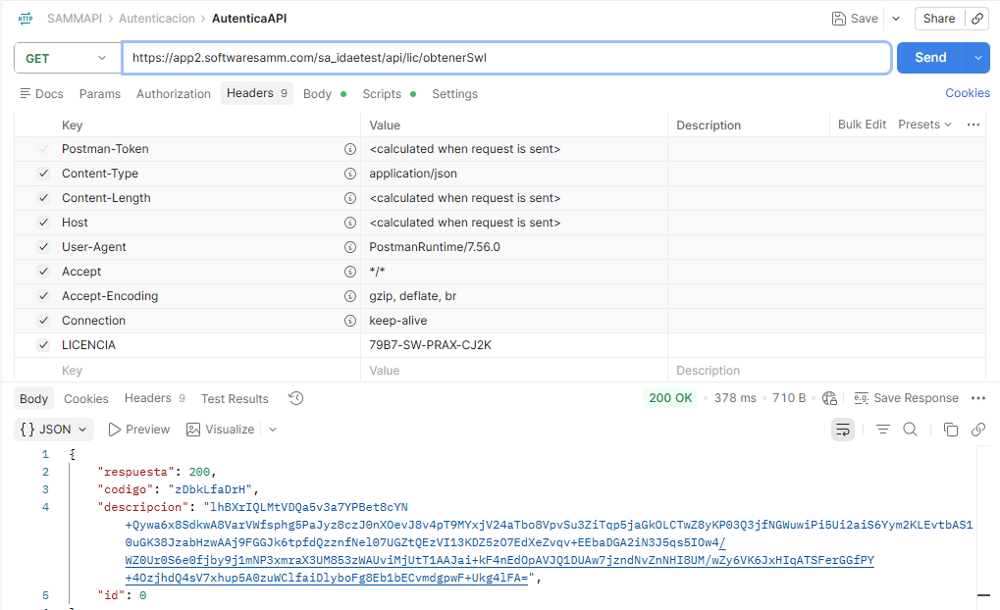

# Servicio de Validación de Licencia

Este documento describe el servicio de validación de licencia, encargado de consumir un endpoint del API cada vez que un usuario inicia sesión, con el objetivo de actualizar la cantidad de usuarios asociados a la licencia. Esta funcionalidad reemplaza la validación previamente realizada a través de la página `keys.aspx`, centralizando el control de licenciamiento en un servicio API dedicado.

## Referencias

- [SO-675: Servicio para validar datos de la licencia, para reemplazar página keys.aspx](https://softwaresamm.atlassian.net/browse/SO-675)

## Información de Versiones

### Versión de Lanzamiento

:::info **v1.2.31.0**
:::

### Versiones Requeridas

| Aplicación | Versión Mínima | Descripción                                  |
| ---------- | --------------- | --------------------------------------------- |
| API        | >= 1.2.31.0     | Servicio de validación de licencia            |

## Requisitos Previos

Antes de que el servicio de validación de licencia opere correctamente, asegúrese de tener:

- Acceso a los archivos `web.config` tanto del aplicativo **Web** como del **API** del cliente.
- Configurada la llave `urlApiIDAE` en ambos archivos `web.config`:

```xml title="web.config - Configuración de URL del API IDAE"
<add key="urlApiIDAE" value="https://softwaresamm.com/sa_idae/" />
```

:::important Importante
El valor de la llave `urlApiIDAE` puede variar según la version a trabajar publicado `https://app2.softwaresamm.com/sa_idaetest/`   o version liberada `https://softwaresamm.com/sa_idae/`
:::

## Información del Servicio

:::note Información
Servicio consumido automáticamente cada vez que un usuario inicia sesión en la aplicación, con el fin de obtener y actualizar la información de la licencia del cliente, incluyendo la cantidad de usuarios habilitados.
:::

### Parámetros del Servicio

| Parámetro  | Ubicación | Valor                     | Descripción                                                |
| ---------- | --------- | -------------------------- | ------------------------------------------------------------ |
| `LICENCIA` | Header    | Licencia del cliente       | Identifica la licencia del cliente que se desea consultar   |

### Request

```bash title="Ejemplo de petición - Obtener licencia"
curl --location --request GET 'https://app2.softwaresamm.com/sa_idaetest/api/lic/obtenerSwl' \
--header 'LICENCIA: {licencia_del_cliente}'
```

:::tip Consejo
El header `LICENCIA` es obligatorio en cada petición. Sin este valor correctamente configurado, el servicio no podrá identificar ni validar la licencia del cliente.
:::

### Respuestas del Servicio

![Mensajes de respuesta del servicio de licencia]

| Código HTTP | Motivo                                                          |
| ----------- | ---------------------------------------------------------------- |
| `403`       | Petición de acceso denegada.                                     |
| `429`       | Demasiados intentos fallidos. Se debe intentar de nuevo más tarde. |
| `500`       | Ha ocurrido un error interno.                                     |
| `200`       | respuesta exitosa                                                  |



## Configuración

No aplica para esta funcionalidad. Se trata de un servicio que se ejecuta automáticamente en cada inicio de sesión del usuario y no requiere pasos de configuración manual.

## Casos Especiales

:::note Comportamientos Predefinidos
El correcto funcionamiento del servicio depende exclusivamente de que el header `LICENCIA` esté presente y correctamente informado en cada petición.
:::

| Caso                                   | Campo/Valor          | Descripción                                                                 |
| --------------------------------------- | --------------------- | ------------------------------------------------------------------------------ |
| Header `LICENCIA` no informado o inválido | Header `LICENCIA`     | El servicio no podrá identificar la licencia del cliente y la petición fallará |

## Resultado Esperado

Una vez que el servicio se ejecuta correctamente durante el inicio de sesión:

1. **Actualización de licencia**: El servicio consulta y actualiza la cantidad de usuarios asociados a la licencia del cliente.
2. **Validación transparente**: El proceso se ejecuta automáticamente en segundo plano sin requerir intervención del usuario.
3. **Reemplazo de `keys.aspx`**: La validación de licencia deja de depender de la página `keys.aspx`, centralizándose en el servicio API.

## Resolución de Problemas

### El servicio responde con código 403

Verifique que:

- El header `LICENCIA` esté presente en la petición.
- El valor enviado en el header `LICENCIA` corresponda a una licencia válida y activa del cliente.

### El servicio responde con código 429

Confirme que:

- No se estén realizando múltiples solicitudes consecutivas en un corto periodo de tiempo.
- El cliente espere el tiempo indicado antes de reintentar la petición.

### El servicio responde con código 500

Revise que:

- La llave `urlApiIDAE` esté correctamente configurada en los archivos `web.config` del Web y del API.
- El endpoint `https://app2.softwaresamm.com/sa_idaetest/api/lic/obtenerSwl` esté disponible y accesible desde el ambiente del cliente.

### La cantidad de usuarios no se actualiza tras el inicio de sesión

Verifique que:

- El servicio esté siendo invocado correctamente en el flujo de inicio de sesión.
- La respuesta del servicio no esté retornando alguno de los códigos de error documentados (`403`, `429`, `500`).

## Errores Conocidos

No aplica para esta funcionalidad. Los códigos `403`, `429` y `500` documentados en la sección **Información del Servicio** corresponden a respuestas esperadas del servicio y no a errores abiertos sin resolver.

## QA — Pruebas

### Escenario 1: Login exitoso con licencia válida

1. Iniciar sesión en la aplicación con un usuario cuyo cliente tenga una licencia activa y válida.
2. Verificar que el servicio `obtenerSwl` sea invocado con el header `LICENCIA` correctamente informado.
3. Confirmar que la respuesta del servicio sea exitosa y que la cantidad de usuarios de la licencia se actualice.

### Escenario 2: Petición con header `LICENCIA` inválido o vacío

1. Simular una petición al servicio `obtenerSwl` sin informar el header `LICENCIA` o con un valor inválido.
2. Verificar que el servicio responda con código `403 - Petición de acceso denegada`.

### Escenario 3: Múltiples intentos fallidos consecutivos

1. Realizar múltiples peticiones fallidas consecutivas al servicio en un corto periodo de tiempo.
2. Verificar que, tras superar el límite permitido, el servicio responda con código `429 - Demasiados intentos fallidos`.