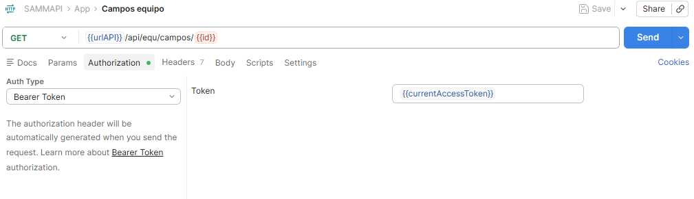

# Consulta de Campos Editables y Requeridos para Equipos

Este documento describe cómo consultar, mediante el servicio API `api/equ/campos/id;`, los campos disponibles para la edición y/o creación de equipos en la App Técnicos, permitiendo validar correctamente qué campos están configurados como visibles y cuáles son obligatorios.

## Referencias

- [SO-1968: Error en la visualización de los campos requeridos en el servicio api/equ/campos/&#123;id&#125;](https://softwaresamm.atlassian.net/browse/SO-1968)

## Información de Versiones

### Versión de Lanzamiento

:::info **v1.2.30.2**
:::

### Versiones Requeridas

| Aplicación | Versión Mínima | Descripción                                   |
| ---------- | --------------- | ---------------------------------------------- |
| SA         | >= V1.2.30.2    | Versión de SAMM en la que se corrige el error  |

## Requisitos Previos

Antes de iniciar la configuración, asegúrese de tener:

- Configuración previa de las columnas de equipos realizada en `_columnas`, siguiendo la [documentación de creación de equipos](../app-tecnicos/Creating-teams-in-the%20team-management-menu).
- Conocimiento básico en la ejecución de servicios mediante Postman.
- Acceso al API del sitio a validar (variable urlAPI) y al ID del equipo a consultar.

:::important Importante
Los campos que se muestran en la respuesta del servicio dependen directamente de la configuración previa realizada en `_columnas`. Si esta configuración no se ha realizado correctamente, el servicio no reflejará los campos esperados como visibles u obligatorios.
:::

## Información del Servicio

:::note Información
Este servicio permite consultar los campos configurados para la edición y/o creación de un equipo específico, incluyendo su tipo, obligatoriedad y, cuando aplica, las opciones disponibles para campos de tipo lista o tabla.
:::

### Parámetros del Servicio

| Parámetro | Valor           | Descripción                                                  |
| --------- | --------------- | -------------------------------------------------------------- |
| urlAPI    | URL del sitio   | Corresponde al API del sitio sobre el cual se desea consultar |
| id        | ID del equipo   | Identificador del equipo a consultar                          |

### Request

```bash title="Ejemplo de petición - Consulta de campos de equipo"
curl --location '{{urlAPI}}/api/equ/campos/{{id}}' \
--header 'Authorization: Bearer {{TOKEN}}'
```

### Response

```json title="Ejemplo de respuesta - HTTP 200"
{
    "principales": [
        {
            "id": "equipo",
            "item": "Equipo",
            "seccion": "",
            "tipo": "textoLargo",
            "obligatorio": false
        },
        {
            "id": "equipo_codigo",
            "item": "Codigo",
            "seccion": "",
            "tipo": "texto",
            "obligatorio": false,
            "longitud": "100"
        },
        {
            "id": "equipo_serial",
            "item": "Serial",
            "seccion": "",
            "tipo": "texto",
            "obligatorio": false,
            "longitud": "100"
        },
        {
            "filtro": "1=1",
            "id": "id_zona",
            "item": "Zona",
            "seccion": "",
            "tipo": "lista",
            "obligatorio": false,
            "opciones": [
                {
                    "id": 1,
                    "opcion": "Mi Zona",
                    "codigo": "",
                    "id_zonaPadre": 0
                }
            ],
            "tipoBusqueda": 1
        },
        {
            "id": "ubicacion",
            "item": "Ubicación",
            "seccion": "",
            "tipo": "texto",
            "obligatorio": false,
            "longitud": "100"
        },
        {
            "id": "fechaPuestaMarcha_fh",
            "item": "F. Marcha ",
            "seccion": "",
            "tipo": "fecha",
            "obligatorio": false
        },
        {
            "id": "horometroActual",
            "item": "Horometro",
            "seccion": "",
            "tipo": "numero",
            "obligatorio": true
        },
        {
            "filtro": "1=1",
            "id": "id_catalogo_equipo",
            "item": "Modelo",
            "seccion": "",
            "tipo": "tabla",
            "obligatorio": false,
            "servicio": "api/buscar/catalogo.equipo",
            "tipoBusqueda": 1
        },
        {
            "filtro": "1=1",
            "id": "id_tercero",
            "item": "Tercero",
            "seccion": "",
            "tipo": "lista",
            "obligatorio": false,
            "opciones": [
                {
                    "id": 1,
                    "opcion": "Mi empresa propia",
                    "codigo": "123456789"
                },
                {
                    "id": 2,
                    "opcion": "RGD AIRE ACONDICIONADO SAS",
                    "codigo": "901121478"
                }
            ],
            "tipoBusqueda": 1
        },
        {
            "filtro": "1=1",
            "id": "id_sucursal",
            "item": "Sucursal",
            "seccion": "",
            "tipo": "tabla",
            "obligatorio": false,
            "servicio": "api/buscar/sucursal",
            "tipoBusqueda": 1
        },
        {
            "filtro": "1=1",
            "id": "id_estadoEquipo",
            "item": "Estado EQ",
            "seccion": "",
            "tipo": "lista",
            "obligatorio": false,
            "opciones": [
                {
                    "id": 1,
                    "opcion": "Activo",
                    "codigo": ""
                },
                {
                    "id": 2,
                    "opcion": "Inactivo",
                    "codigo": ""
                }
            ],
            "tipoBusqueda": 1
        }
    ],
    "atributos": []
}
```

:::tip Consejo
Preste especial atención al campo `obligatorio` dentro de cada objeto del arreglo `principales`. Este valor (`true`/`false`) indica si el campo debe ser diligenciado obligatoriamente al crear o editar un equipo, y es el punto central de la corrección aplicada en esta versión.
:::

## Configuración

### Paso 1: Configuración previa de columnas

Antes de consultar el servicio, es necesario definir qué campos estarán disponibles para la edición y/o creación de equipos. Esta configuración se realiza en `_columnas`, siguiendo el procedimiento descrito en la [documentación de creación de equipos](../app-tecnicos/Creating-teams-in-the%20team-management-menu).

:::note
Esta configuración determina directamente qué campos aparecerán en la respuesta del servicio del Paso 2, así como su condición de obligatoriedad.
:::

### Paso 2: Validación de campos configurados mediante el servicio GET

Una vez realizada la configuración de columnas, se debe ejecutar el servicio GET para validar que los campos configurados en el Paso 1 se reflejen correctamente, incluyendo su obligatoriedad.

```bash title="Consulta de campos de equipo vía Postman"
GET {{urlAPI}}/api/equ/campos/{{id}}
```

Donde:

- urlAPI: corresponde al API del sitio que se desea validar.
- id: corresponde al identificador del equipo a consultar.



:::tip Consejo
Compare el resultado obtenido en la respuesta con la configuración realizada en `_columnas` en el Paso 1, verificando puntualmente el atributo `obligatorio` de cada campo.
:::

## Casos Especiales

No aplica para esta funcionalidad.

## Resultado Esperado

Una vez completada la configuración y ejecutado el servicio:

1. **Visualización correcta de campos**: El servicio de consulta de campos retorna únicamente los campos previamente configurados en `_columnas` para el equipo consultado.
2. **Obligatoriedad reflejada correctamente**: El atributo `obligatorio` de cada campo en la respuesta coincide con la configuración definida, corrigiendo el error previamente reportado en SO-1968.
3. **Respuesta exitosa**: El servicio retorna código de respuesta **200** junto con la estructura JSON esperada.

## Resolución de Problemas

### El servicio no retorna los campos esperados

Verifique que:

- La configuración en `_columnas` se haya realizado correctamente para el equipo o catálogo correspondiente.
- El identificador enviado en la petición corresponda a un equipo existente y válido.
- La URL del API utilizada corresponda al sitio correcto que se desea validar.

### El campo `obligatorio` no refleja el valor configurado

Confirme que:

- La versión de SA instalada sea `>= V1.2.30.2`, donde se aplicó la corrección del error SO-1968.
- No existan configuraciones adicionales o reglas de negocio que sobrescriban la obligatoriedad definida en `_columnas`.

### El servicio no responde o retorna error distinto a 200

Revise que:

- El token de autenticación tipo Bearer sea válido y no haya expirado.
- La conexión al API del sitio consultado esté disponible.
- La sintaxis de la petición GET sea correcta, incluyendo la sustitución adecuada de la URL del API y el identificador del equipo.

## Errores Conocidos

No aplica para esta funcionalidad.

## QA — Pruebas

:::note
Los siguientes escenarios validan tanto la correcta visualización de los campos configurados como la corrección del error reportado en SO-1968 respecto a la obligatoriedad de los campos.
:::

**Escenario 1: Consulta exitosa de campos configurados**

```gherkin title="Validación de respuesta del servicio de campos"
Característica: Consulta de campos editables de un equipo

  Escenario: Consultar campos configurados exitosamente
    Dado que existe un equipo válido con un identificador configurado en el sistema
    Y las columnas del equipo han sido configuradas previamente en "_columnas"
    Cuando se ejecuta el servicio GET de consulta de campos del equipo
    Entonces el servicio debe responder con código HTTP 200
    Y la respuesta debe contener el arreglo "principales" con los campos configurados
```

**Escenario 2: Validación de campos obligatorios (SO-1968)**

```gherkin title="Validación de obligatoriedad de campos"
Característica: Corrección de visualización de campos requeridos

  Escenario: Verificar que los campos obligatorios se reflejen correctamente
    Dado que un campo, por ejemplo "horometroActual", fue configurado como obligatorio en "_columnas"
    Cuando se ejecuta el servicio GET de consulta de campos del equipo
    Entonces el campo "horometroActual" debe retornarse con el atributo "obligatorio" en "true"
    Y ningún campo no configurado como obligatorio debe retornarse con "obligatorio" en "true"
```

**Escenario 3: Consulta con equipo inexistente**

```gherkin title="Validación de manejo de errores"
Característica: Manejo de errores en la consulta de campos

  Escenario: Consultar campos de un equipo inexistente
    Dado que se envía un identificador que no corresponde a ningún equipo registrado
    Cuando se ejecuta el servicio GET de consulta de campos del equipo
    Entonces el servicio debe responder con un código de error correspondiente
    Y no debe retornarse el arreglo "principales" con datos
```