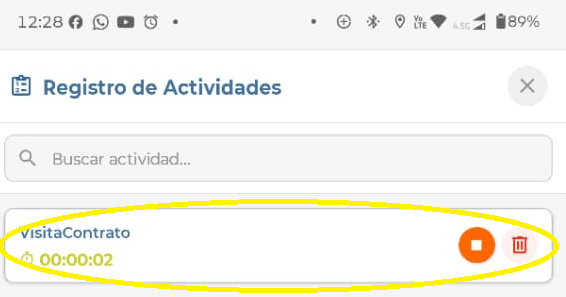

# Cronómetro y Control de Edición en Sección de Actividades

Este documento describe cómo habilitar el cronómetro en la sección de actividades del App Técnicos, permitiendo controlar el tiempo de ejecución de cada actividad de forma automática. Anteriormente el técnico solo podía registrar el tiempo de las actividades de forma manual; con esta mejora se mantiene esa opción y se añade la posibilidad de cronometrar cada actividad directamente desde la app.

## Referencias

- [SO-705: Implementación de cronómetro y control de edición en sección de actividades](https://softwaresamm.atlassian.net/browse/SO-705)

## Información de Versiones

### Versión de Lanzamiento

:::info **v2.3.2.2**
:::

### Versiones Requeridas

| Aplicación | Versión Mínima | Descripción |
| --- | --- | --- |
| SAMMAPI | >= 1.2.29.0 | API principal |
| SAMM LOGICA | >= 5.6.26.1 | Lógica de negocio |
| CAPA DE DATOS | >= 2.1.14.0 | Capa de acceso a datos |
| SAMM CORE | >= 2.0.23.1 | Core del sistema |
| BASE DE DATOS | >= C2.1.14.0 | Base de datos |
| RECURSOS | - | No aplica versión mínima específica |

## Requisitos Previos

Antes de iniciar la configuración, asegúrese de tener:

- Acceso a SQL Server Management Studio (SSMS) con permisos de modificación sobre procedimientos almacenados en la base de datos de SAMM.
- Conocimiento de la estructura de las vistas `view_ort_programacion`, `view_doc_documento_ot` y `view_equ_equipo`, utilizadas por el procedimiento `mob_bandejaServicios`.
- El App Técnicos instalado en los dispositivos móviles debe estar actualizado a la versión `2.3.2.2` o superior.

:::important Importante
El campo `pedirCronometro` del procedimiento `mob_bandejaServicios` controla la habilitación del cronómetro a nivel global para todas las actividades que consume la bandeja de servicios. Antes de alterar el procedimiento en producción, valide el cambio en un ambiente de pruebas.
:::

## Información del Servicio

No aplica para esta funcionalidad.

## Configuración

### Paso 1: Localizar el procedimiento almacenado `mob_bandejaServicios`

Ubique el procedimiento `mob_bandejaServicios` en la base de datos de SAMM. Este procedimiento es el que alimenta la bandeja de servicios consumida por el App Técnicos y contiene el campo que habilita el cronómetro.

```sql title="Consulta del procedimiento actual"
sp_helptext 'dbo.mob_bandejaServicios'
```

### Paso 2: Habilitar el campo `pedirCronometro`

Dentro de la definición del procedimiento, ubique el campo `pedirCronometro` en el `SELECT` principal y asegúrese de que su valor sea `'true'`. Este campo es el que determina si el cronómetro se muestra en la sección de actividades de la app.

```sql title="Campo pedirCronometro habilitado"
,'true' as pedirCronometro --- este campo debe decir true para habilitar la función
```

:::tip Consejo
Si en algún momento se requiere deshabilitar el cronómetro para todos los usuarios, basta con cambiar el valor de `pedirCronometro` a `'false'` y volver a alterar el procedimiento.
:::

### Paso 3: Alterar el procedimiento en la base de datos

Con el campo `pedirCronometro` en `'true'`, ejecute el `ALTER PROCEDURE` completo para aplicar el cambio en la base de datos.

```sql title="Alteración del procedimiento mob_bandejaServicios"
ALTER PROCEDURE [dbo].[mob_bandejaServicios]
	@p_id_usuario int ,
	@p_eid varchar(10)
AS
BEGIN
	SET NOCOUNT ON;

SELECT
	view_ort_programacion.id as id_programacion
	,[id_documento.ot] as id_ot
	,view_doc_documento_ot.[doc_documento_ot_prefijo] + '-' + convert(varchar(max),(view_doc_documento_ot.[doc_documento_ot_documento_numero])) as NumOT
	,'Tipo de Servicio: ' + convert(varchar(max),isnull([gen_tipoServicio_tipoServicio],'NA')) + char(10)
	+ 'Cliente: ' + isnull(view_doc_documento_ot.[doc_documento_ot_ter_tercero_cliente_tercero],'NA') + char(10)
	+ 'Sede: ' + isnull(view_doc_documento_ot.[ter_sucursal_sucursal],'NA') + char(10)
	+ 'Contacto: ' + convert(varchar(max),isnull(contacto,'NA')) + char(10)
	+ 'Cargo: ' + convert(varchar(max),isnull(cargo,'NA')) + char(10)
	+ 'Dirección: ' + convert(varchar(max),isnull(direccionUbicacion,'NA')) + char(10)
	+ 'Teléfono: ' + convert(varchar(max),isnull(telefono,'NA')) + char(10)
	+ 'Motivo servicio: ' + convert(varchar(max),isnull(motivoServicio,'NA')) + char(10)
	+ 'Equipo :' + convert(varchar(max),isnull(equipo,'NA')) + char(10)
	+ 'Serial:' + convert(varchar(max),isnull(equipo_serial,'NA')) + char(10)
	+ 'Prioridad : ' + convert(varchar(max),isnull(doc_documento_ot_doc_prioridadDocumento_prioridadDocumento,'NA')) + char(10)
	 as Ubicacion
	,isnull(view_equ_equipo.equipo,'') + convert(varchar(max),isnull(equipo_serial,'NA')) as Equipo
	,isnull(view_equ_equipo.id,0) as id_equipo
	,isnull(view_equ_equipo.equipo_serial,'')
	,isnull(view_equ_equipo.[cat_catalogo.equipo_manejahorometro],'false') as ConHorometro
	,convert(varchar(30),isnull(view_equ_equipo.[ultimalectura_fh],0),126) as FechaHorometro
	,isnull(view_equ_equipo.[HorometroActual],0) as ValorHorometro
	,convert(varchar(30),desde_fh,126) HoraInicio
	,convert(varchar(30),hasta_fh,126) HoraFin
	,comentario
	,'' as img
	,view_doc_documento_ot.[doc_documento_ot_id_subtipoDocumento] as id_subtipoDocumento
	,view_doc_documento_ot.[doc_documento_ot_id_estadoTipoDocumento] as id_estadoTipoDocumento
	,'true' as editarActividades
	,'true' as pedirCronometro --- este campo debe decir true para habilitar la función
	,'false' as firmaObligatoria
	,'0.1' as imgPorcentaje --Calidad
	,'3000' as imageMaxWidth --Ancho
	,'4000' as imageMaxHeight --Altura
	,'true' as requiredAttachments --Requerir adjuntos

FROM
	view_ort_programacion
	inner join view_doc_documento_ot on view_ort_programacion.[id_documento.ot]=view_doc_documento_ot.id
	left join view_equ_equipo on view_equ_equipo.id=view_doc_documento_ot.id_equipo

WHERE
	id_usuario=@p_id_usuario
	and desde_fh >= dateadd(day,-180,GETDATE())
	and id_tipoprogramacion in (3)
	and view_doc_documento_ot.doc_documento_ot_id_estadoTipoDocumento not in (11,12)
	AND (
		(
			ISNULL(view_ort_programacion.id_programacion, 0) = 0
			AND EXISTS (
				SELECT 1
				FROM ort_programacion hija
				WHERE hija.id_programacion = view_ort_programacion.id
				AND ISNULL(hija.[id_catalogo.actividad], 0) > 0
				AND hija.active = 1
			)
		)
		OR
		(
			ISNULL(view_ort_programacion.id_programacion, 0) = 0
			AND NOT EXISTS (
				SELECT 1
				FROM ort_programacion hija
				WHERE hija.id_programacion = view_ort_programacion.id
				AND ISNULL(hija.[id_catalogo.actividad], 0) > 0
				AND hija.active = 1
			)
		)
		OR
		(
			ISNULL(view_ort_programacion.id_programacion, 0) > 0
			AND ISNULL(view_ort_programacion.[id_catalogo.actividad], 0) = 0
			AND NOT EXISTS (
				SELECT 1
				FROM ort_programacion hermana
				WHERE hermana.id_programacion = view_ort_programacion.id_programacion
				AND ISNULL(hermana.[id_catalogo.actividad], 0) > 0
				AND hermana.active = 1
			)
		)
	)
END
```

:::note Información
Una vez ejecutado el `ALTER PROCEDURE`, el cambio queda activo de forma inmediata. No se requiere reiniciar servicios adicionales, ya que la bandeja de servicios se consulta en tiempo real desde la app.
:::

### Paso 4: visualizar el cronometro



:::note Información
Cabe aclarar que el tiempo minimo debe ser de 1 min
:::
## Casos Especiales

No aplica para esta funcionalidad.

## Resultado Esperado

Una vez completada la configuración:

1. **Cronómetro visible en actividades**: al ingresar a la sección de actividades de una orden de trabajo, el técnico visualiza un cronómetro asociado a cada actividad listada.
2. **Control de tiempo dual**: el técnico puede optar por iniciar/detener el cronómetro o continuar registrando el tiempo de forma manual, sin que ambas opciones sean excluyentes.
3. **Persistencia del tiempo registrado**: los valores de `HoraInicio` y `HoraFin` de cada actividad se registran correctamente en la orden de trabajo, ya sea que se hayan capturado por cronómetro o manualmente.

## Resolución de Problemas

### El cronómetro no aparece en la sección de actividades

Verifique que:

- El campo `pedirCronometro` en el procedimiento `mob_bandejaServicios` esté efectivamente en `'true'`.
- El `ALTER PROCEDURE` se haya ejecutado sin errores sobre la base de datos correcta.
- El App Técnicos del dispositivo esté actualizado a la versión `2.3.2.2` o superior.

### Los tiempos no se guardan correctamente

Confirme que:

- Los campos `desde_fh` y `hasta_fh` se estén enviando desde la app al finalizar el cronómetro o el registro manual.
- No existan conflictos entre el registro manual y el del cronómetro para la misma actividad.
- La orden de trabajo no se encuentre en un estado (`id_estadoTipoDocumento` 11 o 12) que impida su edición.

### La app no refleja el cambio tras alterar el procedimiento

Revise que:

- Las versiones mínimas de `SAMMAPI`, `SAMM LOGICA`, `CAPA DE DATOS`, `SAMM CORE` y `BASE DE DATOS` indicadas en este documento estén desplegadas en el ambiente correspondiente.
- No exista caché intermedia en la API que esté sirviendo una respuesta anterior a la modificación del procedimiento.

## Errores Conocidos

No aplica para esta funcionalidad.

