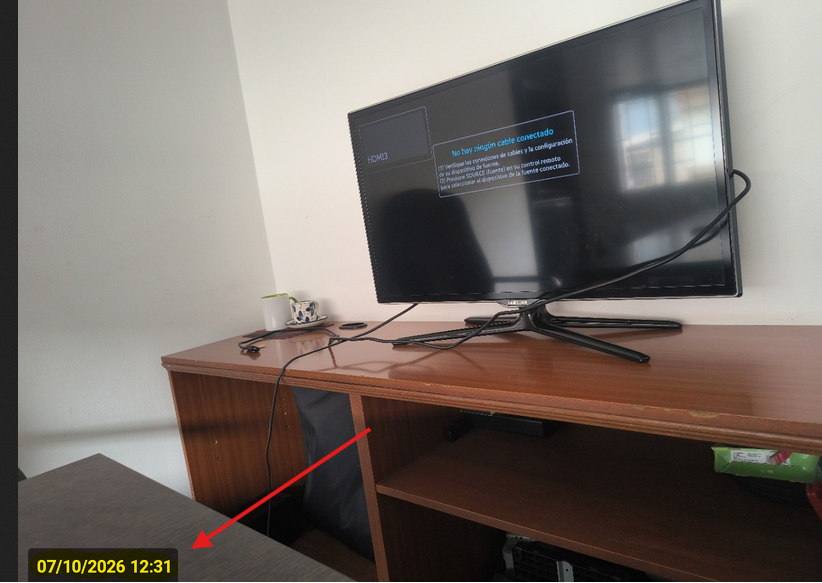

# Marca de Fecha y Hora en Fotos

Este documento describe cómo configurar la funcionalidad de marca de fecha y hora (timestamp) para las fotografías tomadas directamente desde la cámara en la aplicación móvil. Esta configuración resuelve la necesidad de auditar el momento exacto en que se captura la evidencia, añadiendo automáticamente un sello visual en la parte inferior izquierda de la imagen.

## Referencias

- [SO-619: Agregar un timestamp (marca de fecha y hora) sobre las fotos tomadas directamente desde la cámara](https://softwaresamm.atlassian.net/browse/SO-619)
- [SO-2202: Agregar un timestamp (marca de fecha y hora) sobre las fotos tomadas directamente desde la cámara](https://softwaresamm.atlassian.net/browse/SO-2202)

## Información de Versiones

### Versión de Lanzamiento

:::info **v2.3.7.1**
También liberado en conjunto con SN v7.1.19.1
:::

### Versiones Requeridas

| Aplicación    | Versión Mínima | Descripción            |
| ------------- | -------------- | ---------------------- |
| SAMM LOGICA   | >= 5.6.28.0    | Lógica de negocio      |
| CAPA DATOS    | >= 2.1.19.2    | Capa de acceso a datos |
| BASE DE DATOS | >= C2.1.19.2   | Base de datos          |
| SAM CORE      | >= 2.0.28.2    | Core del sistema       |
| SAMMAPI       | >= 1.2.34.2    | API principal          |

## Requisitos Previos

No aplica para esta funcionalidad.

## Información del Servicio

No aplica para esta funcionalidad.

## Configuración

### Paso 1: Actualizar la función de la bandeja de servicios

A partir de esta versión, la información enviada a la aplicación móvil se controla a través de la función `fn_bandejaServicios_core`, la cual es consumida por el procedimiento almacenado principal `mob_bandejaServicios` 

Para habilitar la marca de agua en las fotos, es indispensable asegurar la estructura de la nueva función y establecer el parámetro `printPhotoDate` en `'true'`.

```sql title="Actualización de la función y procedimiento almacenado"
-- 1. Asegurar la estructura del procedimiento principal
CREATE OR ALTER PROCEDURE [dbo].[mob_bandejaServicios]
	@p_id_usuario int ,
	@p_eid varchar(10),
	@p_id_programacion int = null
AS
BEGIN
	SET NOCOUNT ON;

	SELECT
	*
	FROM
		dbo.fn_bandejaServicios_core(@p_id_usuario, @p_eid, @p_id_programacion) core
END
GO

-- 2. Crear/Actualizar la función core para habilitar printPhotoDate
CREATE OR ALTER FUNCTION [dbo].[fn_bandejaServicios_core]
(
	@p_id_usuario int,
	@p_eid varchar(10),
	@p_id_programacion int = null
)
RETURNS TABLE
AS
RETURN
(
	SELECT
		view_ort_programacion.id as id_programacion
		,[id_documento.ot] as id_ot
		,view_doc_documento_ot.[doc_documento_ot_prefijo] + '-' + convert(varchar(max),(view_doc_documento_ot.[doc_documento_ot_documento_numero])) as NumOT
		,'Tipo de Servicio: ' + convert(varchar(max),isnull([gen_tipoServicio_tipoServicio],'NA')) + char(10)
		+ 'Cliente: ' + isnull(view_doc_documento_ot.[doc_documento_ot_ter_tercero_cliente_tercero],'NA') + char(10)
		+ 'Sede: ' + isnull(view_doc_documento_ot.[ter_sucursal_sucursal],'NA') + char(10)
		+ 'Contacto: ' + convert(varchar(max),isnull(contacto,'NA')) + char(10)
		+ 'Cargo: ' + convert(varchar(max),isnull(cargo,'NA')) + char(10)
		+ 'Dirección: ' + convert(varchar(max),isnull(direccionUbicacion,'NA')) + char(10)
		+ 'Teléfono: ' + convert(varchar(max),isnull(telefono,'NA')) + char(10)
		+ 'Motivo servicio: ' + convert(varchar(max),isnull(motivoServicio,'NA')) + char(10)
		+ 'Equipo :' + convert(varchar(max),isnull(equipo,'NA')) + char(10)
		+ 'Prioridad : ' + convert(varchar(max),isnull(doc_documento_ot_doc_prioridadDocumento_prioridadDocumento,'NA')) + char(10)
		 as Ubicacion
		,isnull(view_equ_equipo.equipo,'') as Equipo
		,isnull(view_equ_equipo.id,0) as id_equipo
		,isnull(view_equ_equipo.equipo_serial,'') as EquipoSerial
		,isnull(view_equ_equipo.[cat_catalogo.equipo_manejahorometro],'false') as ConHorometro
		,convert(varchar(30),isnull(view_equ_equipo.[ultimalectura_fh],0),126) as FechaHorometro
		,isnull(view_equ_equipo.[HorometroActual],0) as ValorHorometro
		,convert(varchar(30),desde_fh,126) HoraInicio
		,convert(varchar(30),hasta_fh,126) HoraFin
		,comentario
		,view_doc_documento_ot.[doc_documento_ot_id_subtipoDocumento] as id_subtipoDocumento
		,view_doc_documento_ot.[doc_documento_ot_id_estadoTipoDocumento] as id_estadoTipoDocumento
		,'true' as editarActividades
		,'false' as pedirCronometro
		,'false' as firmaObligatoria
		,'0.1' as imgPorcentaje --Calidad
		,'3000' as imageMaxWidth --Ancho
		,'4000' as imageMaxHeight --Altura
		,'false' as requiredAttachments --Requerir adjuntos (solo aplica con OT)
		,'doc_documento_ot' as additionalReportsCode --SO-2152
		,'true' as printPhotoDate --SO-2202: HABILITADO - sello de fecha/hora sobre fotos tomadas desde la cámara
		,view_ort_programacion.programacion_codigo --SO-2220

	FROM
		view_ort_programacion
		inner join view_doc_documento_ot on view_ort_programacion.[id_documento.ot]=view_doc_documento_ot.id
		left join view_equ_equipo on view_equ_equipo.id=view_doc_documento_ot.id_equipo

	WHERE
		id_usuario=@p_id_usuario
		and desde_fh >= dateadd(day,-180,GETDATE()) --condición temporal
		and id_tipoprogramacion in (3)
		and view_doc_documento_ot.doc_documento_ot_id_estadoTipoDocumento not in (11,12)
		and (@p_id_programacion is null or @p_id_programacion = view_ort_programacion.id)
		AND (
			ISNULL(view_ort_programacion.id_programacion, 0) = 0
			OR
			(
				ISNULL(view_ort_programacion.id_programacion, 0) > 0
				AND ISNULL(view_ort_programacion.[id_catalogo.actividad], 0) = 0
				AND NOT EXISTS (
					SELECT 1
					FROM ort_programacion hermana
					WHERE hermana.id_programacion = view_ort_programacion.id_programacion
					AND ISNULL(hermana.[id_catalogo.actividad], 0) > 0
					AND hermana.active = 1
				)
			)
		)

	UNION ALL
	SELECT
		view_ort_programacion.id as id_programacion
		,0 as id_ot
		,'Sin OT' as NumOT
		,'' as Ubicacion
		,'' as Equipo
		,0 as id_equipo
		,'' as EquipoSerial
		,'false' as ConHorometro
		,convert(varchar(30),getdate(),126) as FechaHorometro
		,0 as ValorHorometro
		,convert(varchar(30),desde_fh,126) HoraInicio
		,convert(varchar(30),hasta_fh,126) HoraFin
		,comentario
		,0 as id_subtipoDocumento
		,0 as id_estadoTipoDocumento
		,'true' as editarActividades
		,'false' as pedirCronometro
		,'false' as firmaObligatoria
		,'0.1' as imgPorcentaje --Calidad
		,'3000' as imageMaxWidth --Ancho
		,'4000' as imageMaxHeight --Altura
		,'false' as requiredAttachments --Requerir adjuntos
		,'' as additionalReportsCode --SO-2152
		,'true' as printPhotoDate --SO-2202: HABILITADO - sello de fecha/hora sobre fotos tomadas desde la cámara
		,view_ort_programacion.programacion_codigo --SO-2220

	FROM
		view_ort_programacion
	WHERE
		id_usuario=@p_id_usuario
		and desde_fh >= dateadd(day,-180,GETDATE()) --condición temporal
		and id_tipoprogramacion in (2)
		and (@p_id_programacion is null or @p_id_programacion = view_ort_programacion.id)
);
```

:::note
El parámetro `printPhotoDate` debe actualizarse a `'true'` en ambas consultas (el bloque principal con OT y el bloque UNION ALL para casos sin OT) para asegurar que aplique en cualquier tipo de asignación que se reciba en el dispositivo móvil.
:::

## Casos Especiales

No aplica para esta funcionalidad.

## Resultado Esperado

Una vez completada la configuración en base de datos:

1. **Captura desde cámara**: Al abrir la opción de la cámara nativa dentro del APP 2.0 y capturar una fotografía.
2. **Marca de agua aplicada**: La imagen final generada contendrá la fecha y hora de la captura impresa en la esquina inferior izquierda de la fotografía.



## Resolución de Problemas

### La marca de agua no se muestra en las fotos de la aplicación

Verifique que:

* El campo `printPhotoDate` haya quedado con el valor exacto de cadena `'true'` y no un booleano sin comillas, en ambos bloques del `SELECT` dentro de `fn_bandejaServicios_core`.
* La foto se haya capturado directamente desde la cámara a través de la app; esta configuración no aplica a fotos seleccionadas desde la galería del dispositivo.

### La APP móvil no refleja los cambios

Confirme que:

* El usuario haya realizado una sincronización manual o cerrado su sesión y vuelto a ingresar, obligando a la aplicación a consultar nuevamente los parámetros de `mob_bandejaServicios`.
* La versión de base de datos sea igual o superior a `C2.1.19.2`.

## Errores Conocidos

No aplica para esta funcionalidad.

## QA — Pruebas

### Escenario 1: Validar impresión de fecha y hora en nueva fotografía

1. Modificar la función en base de datos asegurando que el parámetro `printPhotoDate` es `'true'`.
2. Ingresar a la APP 2.0 con un usuario válido y abrir una asignación.
3. Ir a la sección de adjuntos y seleccionar la opción de capturar con la cámara.
4. Tomar la foto y aceptarla.
5. **Resultado esperado**: En la previsualización de la app, la foto debe contener en la parte inferior izquierda la fecha y hora actual sobreimpresa en la imagen.

### Escenario 2: Validar parámetro desactivado

1. Modificar la función en base de datos cambiando el parámetro `printPhotoDate` a `'false'`.
2. Sincronizar nuevamente la APP móvil.
3. Repetir el flujo de captura de imagen desde la cámara nativa en la app.
4. **Resultado esperado**: La imagen capturada no debe tener ninguna marca de agua de fecha u hora sobreimpresa.


