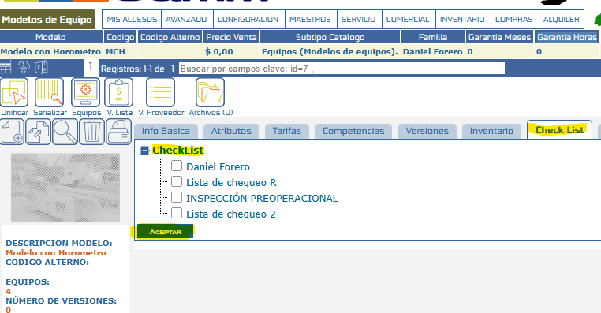
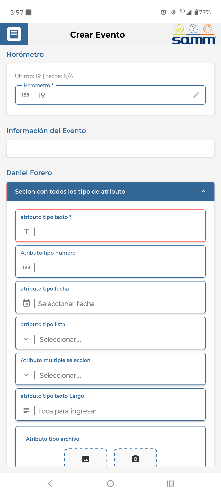

# Registro Preoperacional

Este documento describe cómo configurar el **Registro Preoperacional** para equipos que requieren control de horas trabajadas (horómetro) y, adicionalmente, la ejecución de una verificación previa antes de su operación. Esta funcionalidad permite asociar listas de chequeo específicas a modelos de equipo, garantizando que la información solicitada al operario esté alineada con los requisitos reales del equipo y evitando llamados innecesarios al servicio de inicio de checklist cuando no existe una configuración de preoperacional definida.

## Referencias

- [SO-764: SOL-33139 | Evitar consumo de `api/servicio/checklist/inicio/guardar` cuando no se tiene configurado preoperacional](https://softwaresamm.atlassian.net/browse/SO-764)

## Información de Versiones

### Versión de Lanzamiento

:::info **v2.3.4.6**
:::

### Versiones Requeridas

| Aplicación | Versión Mínima | Descripción                     |
| ---------- | --------------- | -------------------------------- |
| APP 2.0    | >= 2.3.4.6      | Módulo de Gestión de Equipos     |
| SAMM NEW   | >=7.1.15.0      | Pagina Web                       |
| API        | >=1.2.31.1      | API principal                    |
| Capa Datos | >=1.2.31.1      | Capa de acceso a datos           |
|BASE DE DATOS| >= C2.1.16.0   |Base de datos                     |

## Requisitos Previos

Antes de iniciar la configuración, asegúrese de tener:

- Acceso al módulo de **Gestión de Equipos** con permisos de administración de listas de chequeo.
- Conocimiento del modelo del equipo al cual se le asignará el preoperacional.
- Acceso a base de datos para validar el resultado del procedimiento `mob_plantillasListaChequeoXEquipo`, en caso de requerir depuración.

:::important Importante
Si el procedimiento `mob_plantillasListaChequeoXEquipo` ha sido alterado o personalizado, la asignación realizada en el **Paso 2** podría omitirse, ya que la respuesta del procedimiento es la que determina qué información se muestra al usuario final.
:::

## Información del Servicio

No aplica para esta funcionalidad.

## Configuración

### Paso 1: Creación de lista de chequeo

Se debe crear la lista de chequeo (o sección) que contendrá los ítems que el operario deberá verificar antes de iniciar la operación del equipo. Esta lista funcionará como la plantilla base del preoperacional.

:::tip Consejo
Defina ítems claros y concisos en la lista de chequeo, ya que estos serán presentados directamente al operario en campo antes de iniciar la operación del equipo.
:::

### Paso 2: Asignación de lista de chequeo al modelo del equipo

Una vez creada la lista de chequeo, debe asignarse al **modelo del equipo** correspondiente. Esta asociación es la que determina qué equipos, al pertenecer a dicho modelo, solicitarán el preoperacional antes de registrar el horómetro.



### Paso 3: Validación de la información vía procedimiento almacenado

La información configurada se valida ejecutando el procedimiento `mob_plantillasListaChequeoXEquipo`, ya que la respuesta obtenida es la que determina la información que finalmente se muestra en la App.

```sql title="Validación de plantilla de lista de chequeo por equipo"
CREATE   PROCEDURE [dbo].[mob_plantillasListaChequeoXEquipo]
	@p_idEquipo INT,
	@p_idUsuario INT,
	@p_eid VARCHAR(20)
AS
BEGIN
	
	SET NOCOUNT ON;

	SELECT (
		SELECT
			v_PCL.id,
			v_PCL.item,
			v_PCL.seccion,
			v_PCL.tipo,
			v_PCL.IDsOpciones,
			v_PCL.textosOpciones,
			v_PCL.esVariable,
			v_PCL.orden,
			v_PCL.rango,
			v_PCL.obligatorio,
			v_PCL.id_lista,
			dbo.esDependiente(v_PCL.id) as esDependiente,
			v_PCL.vrDefecto,
			v_PCL.lista
		FROM [dbo].[v_checklistTodas] v_PCL
			INNER JOIN [cat_catalogo.equipo_pruebaCheckList] CE_PCL
		ON CE_PCL.id_pruebaCheckList = v_PCL.id_lista
			INNER JOIN [equ_equipo] EQU
		ON EQU.[id_catalogo.equipo] = CE_PCL.[id_catalogo.equipo]
		WHERE
			EQU.id = @p_idEquipo
			and CE_PCL.active = 1
	order by v_PCL.id_lista

		FOR JSON PATH
	)
END
```

:::note Información
Este procedimiento consulta la relación entre el equipo, su modelo y la lista de chequeo asignada, devolviendo la plantilla que debe presentarse como preoperacional.
:::

:::important Importante
Si este procedimiento es alterado o personalizado, puede omitirse la configuración realizada en el **Paso 2**, ya que la lógica de asociación entre modelo y lista de chequeo dependerá directamente del comportamiento definido en la personalización.
:::

### Paso 4: Validación desde la Gestión de Equipos

Finalmente, se debe validar la información directamente en el módulo:

1. Ingresar a **Gestión de Equipos**.
2. Buscar el equipo configurado.
3. Ingresar al detalle del equipo.
4. Hacer clic en **Operación**.

En esta vista se podrá diligenciar el **horómetro** y visualizar el **preoperacional** asignado según la configuración realizada en los pasos anteriores.



## Casos Especiales

No aplica para esta funcionalidad.

## Resultado Esperado

Una vez completada la configuración:

1. **Preoperacional visible**: El equipo mostrará la lista de chequeo (preoperacional) asignada a su modelo al momento de registrar la operación.
2. **Registro de horómetro habilitado**: El usuario podrá diligenciar el horómetro junto con el preoperacional correspondiente desde la sección de **Operación** del equipo.
3. **Consumo controlado del servicio**: El servicio `api/servicio/checklist/inicio/guardar` no será consumido innecesariamente cuando el equipo no tenga preoperacional configurado.

## Resolución de Problemas

### El preoperacional no se visualiza en la operación del equipo

Verifique que:

- La lista de chequeo fue creada correctamente en el **Paso 1**.
- La lista de chequeo fue asignada al **modelo del equipo** correcto en el **Paso 2**.
- El equipo consultado pertenece efectivamente al modelo configurado.

### El procedimiento `mob_plantillasListaChequeoXEquipo` no retorna la información esperada

Confirme que:

- El procedimiento no ha sido alterado o personalizado sin documentar el cambio.
- El `idEquipo` enviado como parámetro corresponde al equipo correcto.
- La relación entre modelo y lista de chequeo existe en base de datos.

### El servicio `api/servicio/checklist/inicio/guardar` se sigue consumiendo sin preoperacional configurado

Revise que:

- La versión de **APP** instalada sea igual o superior a `2.3.4.6`.
- No exista una configuración residual de preoperacional asociada al modelo del equipo.

## Errores Conocidos

No aplica para esta funcionalidad.

## QA — Pruebas

### Escenario 1: Equipo con preoperacional configurado

**Dado** un equipo cuyo modelo tiene asignada una lista de chequeo.
**Cuando** el usuario ingresa a la sección de Operación del equipo.
**Entonces** el sistema debe mostrar el horómetro junto con el preoperacional correspondiente a la lista de chequeo asignada.

### Escenario 2: Equipo sin preoperacional configurado

**Dado** un equipo cuyo modelo no tiene lista de chequeo asignada.
**Cuando** el usuario ingresa a la sección de Operación del equipo.
**Entonces** el sistema no debe consumir el servicio `api/servicio/checklist/inicio/guardar` y solo debe permitir el registro del horómetro.

### Escenario 3: Personalización del procedimiento de validación

**Dado** que el procedimiento `mob_plantillasListaChequeoXEquipo` ha sido personalizado.
**Cuando** se ejecuta la validación de preoperacional para un equipo.
**Entonces** la información mostrada debe corresponder a la lógica personalizada, incluso si el **Paso 2** (asignación estándar) fue omitido.