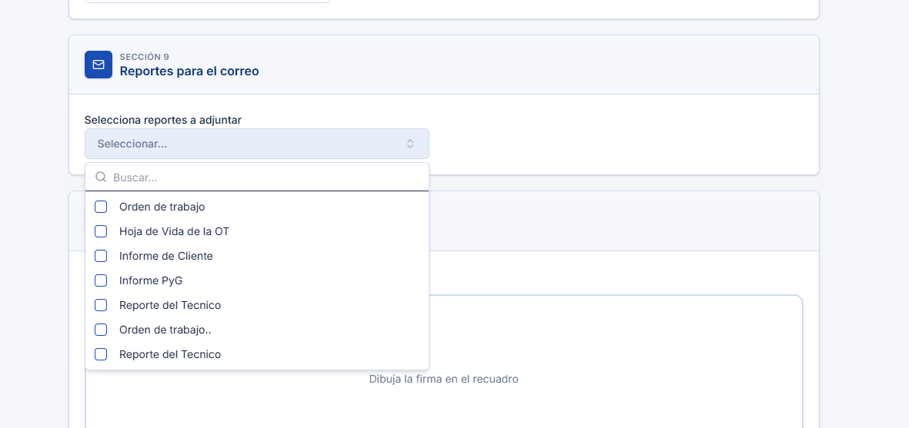

# Reportes Adicionales para el Correo

Esta funcionalidad permite al técnico visualizar, desde el flujo de reporte de la aplicación, un listado de reportes adicionales disponibles para seleccionar e incluir como
adjuntos en el correo que se envía junto con el reporte técnico principal. El objetivo funcional es brindar mayor flexibilidad en el envío de información, permitiendo que el correo generado contenga toda la documentación relevante para el destinatario, sin limitarse únicamente al PDF del reporte técnico.

## Referencias

- [SO-518: OTT - 3576 | Envío de varios formatos RM y RA](https://softwaresamm.atlassian.net/browse/SO-518)
- [SO-2119: Enviar reportes adicionales seleccionados dentro del JSON de reporte](https://softwaresamm.atlassian.net/browse/SO-2119)
- [SO-2120: Habilitar parámetro para controlar visualización de reportes adicionales para el Utilitario de Reporte Técnico](https://softwaresamm.atlassian.net/browse/SO-2120)
- [SO-2121: Exponer listado de reportes disponibles independientemente de la herramienta configurada](https://softwaresamm.atlassian.net/browse/SO-2121)
- [SO-2122: Procesar reportes adicionales seleccionados en el servicio de reportar](https://softwaresamm.atlassian.net/browse/SO-2122)
- [SO-2152: OTT - 3576 | Envío de varios formatos RM y RA](https://softwaresamm.atlassian.net/browse/SO-2152)

## Información de Versiones

### Versión de Lanzamiento

:::info **URT v4.3.0.0**
:::

### Versiones Requeridas

| Aplicación    | Versión Mínima | Descripción            |
| ------------- | --------------- | ----------------------- |
| SAMMAPI       | >= 1.2.33.0     | API principal            |
| SAMMNEW       | >= 7.1.16.3     | Aplicación web           |
| SAMM LOGICA   | >= 5.6.26.6     | Lógica de negocio        |
| SAMM CORE     | >= 2.0.27.0     | Core del sistema         |
| CAPA DATOS    | >= 2.1.17.2     | Capa de acceso a datos   |
| BASE DE DATOS | >= C2.1.17.2    | Base de datos            |

## Requisitos Previos

Antes de iniciar la configuración, asegúrese de tener:

- La plataforma con los envíos de correo configurados
- El documento Orden de Trabajo con los formatos de impresión configurados

:::important Importante
Esta funcionalidad requiere las versiones mínimas especificadas en la tabla anterior. Verifique sus versiones actuales antes de continuar.
:::

## Información del Servicio

:::note Información
El SP `mob_informacion_basica` y `mob_bandejaServicios` (consultado al abrir el reporte) debe exponer la propiedad
`additionalReportsCode`. Ese código es el que **controla la visibilidad** de los "Reportes
para el correo", si trae un valor, la app muestra la sección y usa ese código como
filtro al consultar `_obtenerReportesPorCodigoObjeto`.
:::

```sql title="mob_informacion_basica — exponer additionalReportsCode"
CREATE OR ALTER PROCEDURE [dbo].[mob_informacion_basica]
	@p_id_usuario int ,
	@p_id_ot int
AS
BEGIN
	SET NOCOUNT ON;

	SELECT
		view_doc_documento_ot.id as id_ot
		,view_doc_documento_ot.[doc_documento_ot_prefijo] + '-' + convert(varchar(max),(view_doc_documento_ot.[doc_documento_ot_documento_numero])) as NumOT
		,isnull(view_equ_equipo.equipo,'') as Equipo
		,isnull(view_equ_equipo.id,0) as id_equipo
		,isnull(view_equ_equipo.[cat_catalogo.equipo_manejahorometro],'false') as ConHorometro
		,convert(varchar(30),isnull(view_equ_equipo.[ultimalectura_fh],0),126) as FechaHorometro
		,isnull(view_equ_equipo.[HorometroActual],0) as ValorHorometro
		,convert(varchar(30),dateadd(hour,-1,getdate()),126) HoraInicio
		,convert(varchar(30),getdate(),126) HoraFin
		,'' as comentario
		,view_doc_documento_ot.[doc_documento_ot_id_subtipoDocumento] as id_subtipoDocumento
		,view_doc_documento_ot.doc_documento_ot_doc_subtipoDocumento_subtipoDocumento as subtipoDocumento
		,view_doc_documento_ot.[doc_documento_ot_id_estadoTipoDocumento] as id_estadoTipoDocumento
		,view_doc_documento_ot.doc_documento_ot_doc_estadoTipoDocumento_estadoTipoDocumento as estadoTipoDocumento
		,'false' as firmaObligatoria
		,'true' as requiredAttachments --Requerir adjuntos
		,'doc_documento_ot' as additionalReportsCode --SO-2152: código que reciben los SPs de reportes para armar el listado

	FROM
		view_doc_documento_ot
		left join view_equ_equipo on view_equ_equipo.id=view_doc_documento_ot.id_equipo

	WHERE
	view_doc_documento_ot.id = @p_id_ot
END
```

`_obtenerReportesPorCodigoObjeto` recibe el `additionalReportsCode` y devuelve los formatos activos de `rep_reporte` categorizados en `rep_reporte_categoria` para ese código.

```sql title="_obtenerReportesPorCodigoObjeto"
CREATE OR ALTER PROCEDURE [dbo].[_obtenerReportesPorCodigoObjeto]
    @p_codigo VARCHAR(50),
    @p_codigos dbo.typ_text READONLY,
    @p_eid VARCHAR(50)
AS
BEGIN
    SET NOCOUNT ON;

    IF EXISTS (SELECT 1 FROM @p_codigos)
    BEGIN
        SELECT rep_reporte.*
        FROM rep_reporte_categoria
        INNER JOIN @p_codigos AS codigos
            ON rep_reporte_categoria.reporte_categoria = codigos.[text]
        INNER JOIN rep_reporte
            ON rep_reporte_categoria.id_reporte = rep_reporte.id
        WHERE rep_reporte.esFormato = 1
            AND rep_reporte_categoria.active = 1
            AND rep_reporte.active = 1
            AND rep_reporte_categoria.eid = @p_eid
            AND rep_reporte.eid = @p_eid;
    END
    ELSE IF @p_codigo = 'util_doc_documento_ot'
    BEGIN
        SELECT rep_reporte.*
        FROM rep_reporte_categoria
        INNER JOIN rep_reporte
            ON rep_reporte_categoria.id_reporte = rep_reporte.id
        WHERE rep_reporte_categoria.reporte_categoria = @p_codigo
            AND rep_reporte.esFormato = 1
            AND rep_reporte_categoria.active = 1
            AND rep_reporte.active = 1
            AND rep_reporte_categoria.eid = @p_eid
            AND rep_reporte.eid = @p_eid
            AND rep_reporte.id in (1,2);
    END
    ELSE
    BEGIN
        SELECT rep_reporte.*
        FROM rep_reporte_categoria
        INNER JOIN rep_reporte
            ON rep_reporte_categoria.id_reporte = rep_reporte.id
        WHERE rep_reporte_categoria.reporte_categoria = @p_codigo
            AND rep_reporte.esFormato = 1
            AND rep_reporte_categoria.active = 1
            AND rep_reporte.active = 1
            AND rep_reporte_categoria.eid = @p_eid
            AND rep_reporte.eid = @p_eid;
    END
END
GO
```

:::tip Consejo
La rama `util_doc_documento_ot` del SP es un ejemplo de caso especial: restringe el listado a
reportes puntuales (`rep_reporte.id in (1,2)`) para ese código específico. Use esta rama como
plantilla si necesita acotar el listado de reportes disponibles para un código de objeto en
particular.
:::

## Casos Especiales

:::note Comportamientos Predefinidos
El comportamiento de la sección "Reportes para el correo" depende directamente del valor de
`additionalReportsCode` devuelto por `mob_informacion_basica`.
:::

| Caso                                                    | Campo/Valor                          | Descripción                                                                                   |
| -------------------------------------------------------- | -------------------------------------- | ------------------------------------------------------------------------------------------------ |
| `additionalReportsCode` con valor                       | ej. `'doc_documento_ot'`              | La app muestra la sección y consulta `_obtenerReportesPorCodigoObjeto` con ese código para listar los reportes disponibles |
| Técnico no selecciona ningún reporte adicional          | `reporteCorreo` ausente o vacío en el JSON | El correo se envía únicamente con el PDF del reporte técnico, igual al comportamiento actual   |

## Configuración

### Paso 1: Definir el código en `mob_informacion_basica` y `mob_bandejaServicios`

Agregue la propiedad `additionalReportsCode` al SELECT del SP `mob_informacion_basica` y `mob_bandejaServicios` con el código que identificará el listado de reportes para el objeto.

### Paso 2: Configurar `_obtenerReportesPorCodigoObjeto` y la categorización de reportes

Verifique que exista el SP `_obtenerReportesPorCodigoObjeto`. Luego
categorice en `rep_reporte_categoria` los reportes (`rep_reporte`, con `esFormato = 1` y
`active = 1`) que deben aparecer para el código definido en el Paso 1, usando la misma cadena en `reporte_categoria`.

:::tip Consejo
El listado de reportes es independiente de la herramienta de generación configurada (ReportViewer
o SSRS 2022) — el SP solo filtra sobre `rep_reporte`/`rep_reporte_categoria`, por lo que no requiere
lógica adicional según la herramienta activa.
:::

### Paso 3: Validar requisitos previos

Confirme que la plataforma tenga configurados los envíos de correo y que el documento Orden de Trabajo tenga configurados los formatos de impresión, ya que ambos son necesarios para que el correo final se genere y envíe correctamente con los adjuntos seleccionados.

## Resultado Esperado

Una vez completada la configuración:

1. **Visualización de la sección**: en el flujo de reporte, dentro de "Reportes para el
   correo", el técnico ve un campo de selección múltiple con los reportes entregados por
   `_obtenerReportesPorCodigoObjeto`
2. **Selección enviada al servidor**: los reportes seleccionados se incluyen en el JSON de reporte bajo la propiedad `reporteCorreo` como un arreglo de IDs, por ejemplo `"reporteCorreo": [2,3]`
3. **Correo con adjuntos consolidados**: el correo final incluye tanto el formato configurado en la regla de correo como los reportes adicionales seleccionados por el técnico
4. **Sin selección, sin cambios**: si el técnico no selecciona ningún reporte adicional, el correo se envía igual que antes, solo con el PDF del reporte técnico

### Sección "Reportes para el correo" en la App



## Resolución de Problemas

### La sección "Reportes para el correo" no aparece en la app

Verifique que:

- `mob_informacion_basica` y `mob_bandejaServicios` esté devolviendo `additionalReportsCode` con un valor no vacío
- La versión de la app instalada sea >= URT v4.3.0.0
- La OT consultada corresponda al mismo objeto configurado en el código

### El listado de reportes aparece vacío

Confirme que:

- Existan registros en `rep_reporte_categoria` con `reporte_categoria` igual al
  `additionalReportsCode` configurado
- Los reportes asociados en `rep_reporte` tengan `esFormato = 1` y `active = 1`

### El correo no llega con los reportes adicionales adjuntos

Revise que:

- El JSON enviado al servicio de reportar incluya la propiedad `reporteCorreo` con los IDs
  seleccionados
- Los envíos de correo estén correctamente configurados en la plataforma
- El documento Orden de Trabajo tenga configurados los formatos de impresión requeridos
