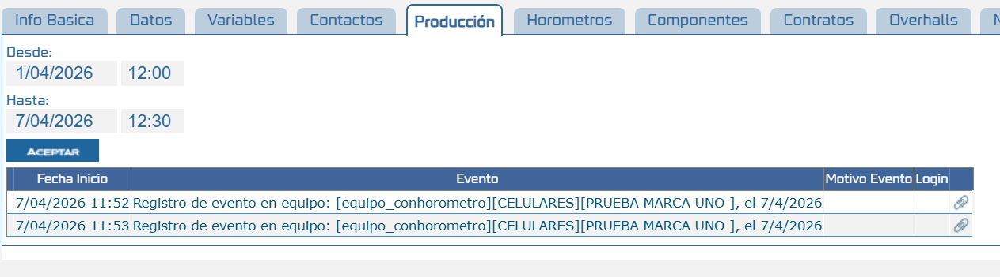
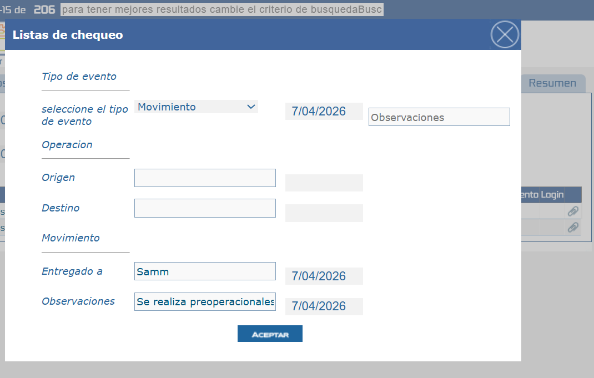
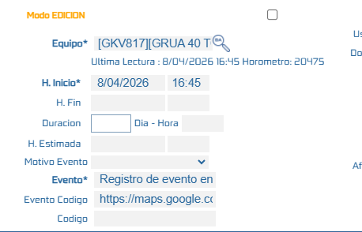

# Configuración de Checklist Condicional para Tipos de Reporte

Este documento describe cómo configurar la funcionalidad de checklist condicional asociado al botón de operación, permitiendo la generación de diferentes tipos de reporte (como preoperacional, movimiento, entre otros) según la configuración definida en el modelo. Esta funcionalidad permite estandarizar la captura de información y automatizar la creación de reportes operativos.

---

## Referencias

- [SO-567: Implementación de checklist condicional en botón de operación](https://softwaresamm.atlassian.net/browse/SO-567)

---

## Información de Versiones

### Versión de Lanzamiento

:::info **APP v 2.3.0.1**
:::

### Versiones Requeridas

| Aplicación    | Versión Mínima | Descripción       |
| ------------- | -------------- | ----------------- |
| SAMMAPI       | >= 1.2.22.0    | API principal     |
| SAMM LOGICA   | >= 5.6.24.2    | Lógica de negocio |
| SAMM CORE     | >= 2.0.19.3    | Core del sistema  |
| BASE DE DATOS | >= C2.1.10.0   | Base de datos     |

## Requisitos Previos

Antes de iniciar la configuración, asegúrese de tener:

- Acceso al módulo de configuración de modelos
- Permisos para parametrización de checklist
- Creacion de lista de chequeo condicional
- en la tabla _columnas que sea la tabla equ_equipo se debe desactivar mostrarenAPI

```
update _columnas
set mostrarEnAPI = 0
where tabla = 'equ_equipo'
and columna  not in ( 'horometroActual','equipo')

--en la tabla _columnas se debe desactivar requeridos
```
```
update _columnas
set requerido = 0
where tabla = 'equ_equipo'
and columna not in ('horometroActual')

--en la tabla _columnas que sea la tabla dis_evento se debe desactivar mostrarenAPI

update _columnas
set mostrarEnAPI = 0
where tabla = 'dis_evento'
```

```
update _columnas
set requerido = 0
where tabla = 'dis_evento'

```

:::important
La funcionalidad depende de una correcta configuración del modelo y del checklist asociado. Si no se configura adecuadamente, el comportamiento del botón de operación no ejecutará el flujo esperado.
:::

---

## Configuración

### Paso 1: Configuración del Modelo

En este paso se define el modelo sobre el cual se aplicará el checklist condicional.

#### Configuración requerida

- Asociar la lista de chequeo al modelo correspondiente
- Definir si el modelo tendrá checklist condicional
- Confirmar la creacion del procedimiento Almacenado mob_plantillasListaChequeoXEquipo
- Confirmar la creacion del procedimiento almacenado v_checklistTodas

```sql title="crear o alterar mob_plantillasListaChequeoXEquipo"
CREATE OR ALTER   PROCEDURE [dbo].[mob_plantillasListaChequeoXEquipo] 
	@p_idEquipo INT,
	@p_idUsuario INT,
	@p_eid VARCHAR(20)
AS
BEGIN
	
	SET NOCOUNT ON;

	SELECT (
		SELECT
			v_PCL.id,
			v_PCL.item,
			v_PCL.seccion,
			v_PCL.tipo,
			v_PCL.IDsOpciones,
			v_PCL.textosOpciones,
			v_PCL.esVariable,
			v_PCL.orden,
			v_PCL.rango,
			v_PCL.obligatorio,
			v_PCL.id_lista,
            dbo.esDependiente(v_PCL.id) as esDependiente,
			v_PCL.vrDefecto,
            v_PCL.lista
		FROM [dbo].[v_checklistTodas] v_PCL
			INNER JOIN [cat_catalogo.equipo_pruebaCheckList] CE_PCL
		ON CE_PCL.id_pruebaCheckList = v_PCL.id_lista
			INNER JOIN [equ_equipo] EQU
		ON EQU.[id_catalogo.equipo] = CE_PCL.[id_catalogo.equipo]
		WHERE 
			EQU.id = @p_idEquipo
		FOR JSON PATH
	)
END

```
```sql title="crear o alterar v_checklistTodas"
CREATE     VIEW [dbo].[v_checklistTodas]
AS
	SELECT 
			CLA.id_atributo id,
			CLA.cat_atributo_atributo as item,
			SA.seccionAtributo as seccion,
			CLA.cat_atributo_id_tipoAtributo as tipo,
			dbo.f_opcionesAtributo(CLA.id_atributo,1) as IDsOpciones,
			dbo.f_opcionesAtributo(CLA.id_atributo,0) as textosOpciones,
			CLA.cat_atributo_esVariable as esVariable,
			CLA.orden as orden,
			'NI' as rango,
			CLA.cat_atributo_esObligatorio as obligatorio,
			CLA.id_pruebaChecklist as id_lista,
            CLA.cat_pruebaCheckList_pruebaCheckList as lista,
			CLA.valorDefecto as  vrDefecto
		FROM view_cat_pruebaCheckList_atributo CLA
			INNER JOIN cat_seccionAtributo SA on SA.id= CLA.cat_atributo_id_seccionAtributo
			INNER JOIN gen_unidad UNI on UNI.id=CLA.cat_atributo_id_unidad
			INNER JOIN cat_pruebaCheckList as pc ON pc.id = CLA.id_pruebaCheckList
		WHERE
			CLA.active = 1
			AND pc.active = 1

```
:::tip Consejo
Se recomienda crear una lista de chequeo con opciones condicionales y sus atributos para diligenciar la información,se recomienda ajustar el SP mob_plantillasListaChequeoXEquipo para que solo retorne la lista de chequeo requerida
:::

#### Comportamiento esperado

-Se debe ingresar al menú Gestion de equipos y buscar el equipo requerido posterior a eso se debe visualizar de manera correcta el botón operación:

  - Al hacer clic en el botón de operación:
  - Se valida si el modelo tiene checklist configurado
  - El flujo debe trabajar de manera corecta
  - Se genera el tipo de reporte asociado
  - En la plataforma se visualizara la información en el botón produccion del equipo



  - Información ya diligenciada




---

## Resolución de Problemas

### El checklist no se ejecuta

Verifique que:

- El modelo tenga configurado un checklist
- La condición esté correctamente definida
- El procedimiento se encuentre creado

:::tip Consejo
Al momento de reportar el evento se tomara las coordenadas del dispositivo y la información se visualizara en el menú eventos campo evento codigo
:::


