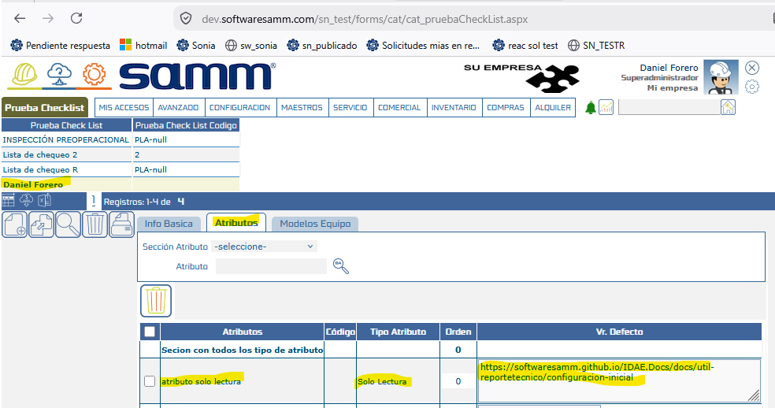

# Apertura de Links en Campos de Lectura

Este documento describe cómo configurar la apertura de links en campos de atributos de solo lectura dentro del App 2.0 , permitiendo enlazar material de apoyo (páginas web, documentos en la nube, políticas de seguridad, entre otros) directamente desde un atributo de tipo lectura. Anteriormente, estos atributos solo permitían mostrar texto informativo estático, sin posibilidad de vincular al usuario a un recurso externo relevante.

## Referencias

- [SO-2078 / OTT-3848: Habilitar apertura de links en campos de lectura del app](https://softwaresamm.atlassian.net/browse/SO-2078)

## Información de Versiones

### Versión de Lanzamiento

:::info **v2.3.4.6**
:::

### Versiones Requeridas

| Aplicación    | Versión Mínima | Descripción        |
| ------------- | --------------- | ------------------ |
| SAMM LOGICA   | >= 5.6.26.3     | Lógica de negocio  |
| CAPA DE DATOS | >= 2.1.16.0     | Capa de datos      |
| RECURSOS      | -               | Recursos           |
| SAMM CORE     | >= 2.0.25.0     | Core del sistema   |
| SAMMAPI       | >= 1.2.31.1     | API principal      |
| BASE DE DATOS | >= C2.1.16.0    | Base de datos      |

## Requisitos Previos

Antes de iniciar la configuración, asegúrese de tener:

- Acceso administrativo al módulo `Maestro-Detalle Equipo` en la web
- Permisos para editar `Listas de Chequeo` y sus atributos asociados.
- Conocimiento previo de las listas de chequeo donde se encuentran los atributos de tipo `lectura` que se desean vincular.
- El recurso o página que se desea enlazar debe estar disponible públicamente o mediante un enlace accesible para los usuarios del app (ej. Google Drive, SharePoint, sitio corporativo).

:::important Importante
El valor ingresado en `Vr. Defecto` solo se reconocerá como link navegable si **inicia con `http://` o `https://`**. Cualquier otro formato de texto se mostrará como texto plano, sin funcionalidad de apertura de enlace.
:::

## Información del Servicio

No aplica para esta funcionalidad.

## Configuración

### Paso 1: Dejar el link como texto por defecto

Este paso permite asociar una URL a un atributo de tipo `lectura` dentro de una lista de chequeo, de modo que se muestre como un enlace navegable en el App 2.0.

1. Ingrese a la ruta **Maestro-Detalle Equipo → Lista de Chequeo**.
2. Busque la o las listas de chequeo que contengan un atributo de tipo `lectura`.
3. Seleccione la lista de chequeo correspondiente y diríjase al tab **Atributos**.
4. Ubique el atributo de tipo `lectura` que desea configurar.
5. En la columna **Vr. Defecto**, ingrese la URL del recurso que desea dejar como material de apoyo (por ejemplo, un documento de políticas de seguridad alojado en un drive corporativo).
6. Guarde los cambios en la lista de chequeo.

:::tip Consejo
Este mecanismo es útil para dejar accesibles políticas de seguridad, manuales técnicos o cualquier documentación de apoyo alojada externamente, sin necesidad de duplicar el contenido dentro del app.
:::

:::warning Precaución
Verifique que la URL ingresada sea correcta y esté activa antes de guardar. Un link roto o mal escrito se mostrará como texto no navegable o llevará a una página inexistente.
:::

:::note Información
comparto video de apoyo https://youtu.be/8K8a00bhnOc 
:::

## Casos Especiales

No aplica para esta funcionalidad.

## Resultado Esperado

Una vez completada la configuración:

1. **Visualización como link**: El atributo de tipo `lectura` que tenga un valor por defecto iniciando con `http://` o `https://` se mostrará en el App 2.0 como un texto con formato de enlace (link navegable), en lugar de texto plano.
2. **Apertura del recurso**: Al dar clic sobre el atributo, el usuario será redirigido a la página o recurso externo asociado, abriéndose en el navegador o visor correspondiente del dispositivo.
3. **Compatibilidad retroactiva**: Los atributos de tipo `lectura` que no cumplan con el formato de URL (`http`/`https`) continuarán mostrándose como texto plano, sin afectar la funcionalidad previa.

## Resolución de Problemas

### El atributo no se muestra como link

Verifique que:

- El valor en `Vr. Defecto` inicie exactamente con `http://` o `https://` (sin espacios adicionales al inicio).
- El atributo esté correctamente configurado como tipo `lectura` en el tab de **Atributos** de la lista de chequeo.
- Las versiones mínimas de `SAMM LOGICA`, `CAPADATOS`, `SAMCORE`, `SAMMAPI` y `BASE DE DATOS` indicadas en este documento estén instaladas.

### El link no abre la página esperada

Confirme que:

- La URL ingresada esté completa y bien formada (sin errores de tipeo).
- El recurso o página de destino esté activo y accesible desde la red donde se usa el dispositivo.
- No existan restricciones de firewall o proxy que bloqueen el acceso al dominio del link.

### Los cambios no se reflejan en el app

Revise que:

- Los cambios en la lista de chequeo hayan sido guardados correctamente en `Maestro-Detalle Equipo`.
- El dispositivo o app móvil haya sincronizado la información más reciente del servidor.
- No exista una versión de app desactualizada por debajo de la versión mínima requerida.

## Errores Conocidos

No aplica para esta funcionalidad.

## QA — Pruebas

### Escenario 1: Atributo de lectura con URL válida

1. Configurar un atributo tipo `lectura` en una lista de chequeo, con `Vr. Defecto` = `https://ejemplo-politica-seguridad.com`.
2. Ingresar al App 2.0 y abrir el registro de equipo asociado a dicha lista de chequeo.
3. **Resultado esperado**: El campo se muestra como link navegable; al dar clic, se abre la página `https://ejemplo-politica-seguridad.com` en el navegador del dispositivo.

### Escenario 2: Atributo de lectura sin formato de URL

1. Configurar un atributo tipo `lectura` en una lista de chequeo, con `Vr. Defecto` = texto plano (ej. "Revisar manual de usuario").
2. Ingresar al App 2.0 y abrir el registro de equipo asociado.
3. **Resultado esperado**: El campo se muestra como texto plano, sin formato de link ni comportamiento de navegación, confirmando que la funcionalidad no afecta atributos sin URL.