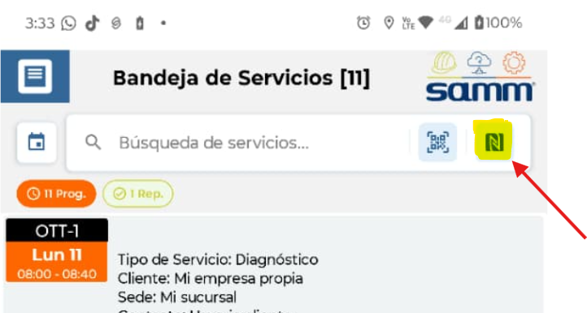

# Lectura por NFC

Este documento describe cómo configurar y utilizar la funcionalidad de **Lectura por NFC** en la App 2.0, permitiendo que los campos de búsqueda de los módulos **Bandeja de Servicio** y **Gestión de Equipos** capturen automáticamente el serial de un equipo al acercar una etiqueta o chip NFC al dispositivo móvil. Antes de esta mejora, la búsqueda de equipos se realizaba únicamente de forma manual, sin soporte para lectura automática por tecnología NFC.

---

## Referencias

- [SO-710 / SOL-33132: Lectura de NFC en el App 2.0](https://softwaresamm.atlassian.net/browse/SO-710)

---

## Información de Versiones

### Versión de Lanzamiento

:::info **v2.3.1.1**
:::

### Versiones Requeridas

| Aplicación    | Versión Mínima | Descripción              |
| ------------- | -------------- | ------------------------ |
| SAMMAPI       | >= 1.2.27.0    | API principal del sistema |
| SAMM LOGICA   | >= 5.6.26.1    | Lógica de negocio        |
| SAMM CORE     | >= 2.0.22.0    | Core del sistema         |
| CAPA DE DATOS | >= 2.1.13.0    | Capa de acceso a datos   |
| BASE DE DATOS | >= C2.1.13.0   | Base de datos            |

---

## Requisitos Previos

Antes de iniciar la configuración, asegúrese de tener:

- Dispositivo Android o iOS con chip NFC integrado y habilitado.
- App 2.0 instalada en versión `2.3.1.1` o superior.
- Conectividad activa al servidor API (`SAMMAPI >= 1.2.27.0`).
- Acceso a los módulos **Bandeja de Servicio** o **Gestión de Equipos** dentro de la App.

:::important Importante
El dispositivo móvil **debe contar con tecnología NFC y tenerla habilitada** en los ajustes del sistema operativo antes de utilizar esta funcionalidad. Sin NFC activo, el ícono puede aparecer en la interfaz pero la lectura no se ejecutará.
:::

---

## Información del Servicio

:::note Información
La funcionalidad consume el endpoint de equipos de la API para consultar la información del activo a partir del serial capturado por NFC. El parámetro `conForeignIds=true` permite incluir identificadores de sistemas externos (SAP, ERP, etc.) en la respuesta.
:::

### Parámetros del Servicio

| Parámetro      | Valor    | Descripción                                                       |
| -------------- | -------- | ----------------------------------------------------------------- |
| `urlAPI`       | Variable | URL base del servidor API configurada en el entorno.              |
| `serial`       | Variable | Número de serie del equipo capturado por la lectura NFC.          |
| `conForeignIds`| `true`   | Incluye los identificadores foráneos del equipo en la respuesta.  |

### Request

```bash title="Consulta de equipo por serial vía NFC"
curl --location '{{urlAPI}}/api/equ/equipo/{{serial}}?conForeignIds=true' \
--header 'Authorization: Bearer {{TOKEN}}'
```

### Response

```json title="Respuesta exitosa — Equipo encontrado (200)"
{
    "equ_equipo": {
        "equipo": {
            "recurso": "Equipo",
            "valor": "[Modelo con Horometro][Daniel Forero][Marca]"
        },
        "horometroActual": {
            "recurso": "Horometro",
            "valor": "17"
        },
        "id": "2",
        "_resaltados": "Equipo",
        "manejaHorometro": true,
        "imagen": "data:image/jpeg;base64,/9j/4AAQSkZJRgABAQEASABIAAD/2wBDAAYEBAQFBAYFBQYJBgUGCQsIBgYICwwKCgsKCgwQDAwMDAwMEAwODxAPDgwTExQUExMcGxsbHCAgICAgICAgICD/2wBDAQcHBw0MDRgQEBgaFREVGiAgICAgICAgICAgICAgICAgICAgICAgICAgICAgICAgICAgICAgICAgICAgICAgICD/wAARCABYAIoDAREAAhEBAxEB/8QAGwAAAwEBAQEBAAAAAAAAAAAAAgMEAQUABgf/xAA/EAABAgIHBQQIBAYCAwAAAAABAhEDIQQSMUFRYfAAIkJxgRORofEFFCMyUrHB0WJykuEVM0OCovJEU2PC0v/EABQBAQAAAAAAAAAAAAAAAAAAAAD/xAAUEQEAAAAAAAAAAAAAAAAAAAAA/9oADAMBAAIRAxEAPwD9f9bjKUfanv1gdWBpj0j/ALD3614BgpkRUq6nFs/LDU2BnrERLus9+wWQo5EHeJra1qYHDiqKROeta3g2urE679f5AuLHigBKJrVIEmQzz11AExVpilNdRASL8+usdghpPpSMiCplPErqSmqbh1yx51ZsHMVTKaCQqkxMVe0UMX+H8WHRvZB71z0gf+RFD4qVm7+41+H9reyCkUinNOkRP1HPNP06cAEY9M/74me8Rj+X6dG3A31ilv8Az4n6jny+nTgDVUuPDhriRI0WogOrebng19rNk26E59PAWqjyt32xf4W91VrNe1VVQOtCpdJMJB7WIHAkSoeBq/LYOcujJCjVLa6YaYVQ92cYFird1yw8uAC9Uq2KbXTDyYVQW64UXfdSfk3dhoDcCiDTkrDAVWF+hhpiwUwKSVLq61rHYKoiwlJUTITOtfcEwjWPaq94yD3Dlc9+hsArJEQqy2CJVFKohiKiqJuGGm0wqhh9GoUHERQVrBsB+zJqhn8MqJrdpZPD7WMP23aoehwgUmoZi7TYeTboKK0p6Xab4fC5twGohWEyTrlh5cIDFhJiUKIxCFY8r+FmbKy1JEg4J9mWsq9Gb9DN2f4Wq8NX2AfVQRVgoFjJAay7Dd+WwIUmKDbLXLX+ICqDSCisOhOXd9OnCDRGEgsEfL6YamwZGVCUQKr+GrNNIOfDUtNm7VLPyll8OVlzezA4UaKmYigNb0teSfhL2WGzgBqqTHWmquI4veX/AM4HC+zgAayxxeP+uBw6cAVwFxFjfL1ZJy+V+rgDdgJNh2AlATJw2BdHgQ+CSc5ZWDl9NgmXDQYhAIGEv3Hw+GW6HvV4hYVgGIMgbrsPK6VUAXQ4pQUw4oSS0yMOTYXNk0qoQfwSlVwe1RdjlgE2Nc3uybc7IO2kVUhOEtWbBBGpEREWIK5KOFrvlgb+stwLaLHSujKD2XeGTMR5WbBPEUxDizX01whikRlLBhmrc+m1/iApoVMU5SkVXmqz7TkPCyVQJVIFFLREe/YQb0j+0cOVgsA9mALiw4QnJs2s/SzVTgzXVfZg6AhEV6hUCmdUhrP0tZlZcU7gW0CDGQhXa1Ul5B8O7Dy90BsKgxURa/aVhOWtf41QpAIBfYBWslQQk71/5eewUw1wwLbB4a1iDvZTVIkWmR8Z6x4g4PpiJvIRWKQuyrlP5A3vfdWQEdeJRVAmkFmc1rBfN6rMxwvsA9kDv4hFAiKrCQ3AQ03vdrkm0iw2TqB04SlGEgqkopBIz61T4DYOcmBUpBVFVXhuWTZ45VejZDswbQzChmJCSKqRMXDDJmbTMkERIy0khB8MD0+HKy5twMo9LpCQZTTLXu4HDpMQwpheky9SIkjO7xbXJVUAimBSUKT2hhrCgEu7OJu0jJjZhcU7oQR6KpC6qVAqJ3QD/pZUxHu8LAwgqoaDRi8doYAtLWdAGDJykLmZAXJpVGb+YA1rysfFrKp7jhIMpVJ7OBEXCWkLTZYQJzfuLzHMWgObRad6QixgIi/Zi2QtGMk/CXsvkJiEHQhJCYionGr3idDDTboVdsr9tgNMZwxstUXn12Dl+k0FdJhkCshA62j7PaLMqyAUqhQIqApRUko/skGIwb3bmsuKRUAxQocBEo1VAt4QGDcNVmAuZmuZNQOjCSEQkIEgkAAWWZS+WwTKSozJZi+u7y4QPsYYev7o6WdzWauDFID7qBkdNh8ugTKgxCAagZNrEdwsZquVgs4AmAiIjLUsKJ1+XDKy5vZBXQwhUc/+MWGX2+HKzJkBWYMJRBUkSvwbyHd3AFajKcEBkvvYFOeTdGykC1+jqBEsSzfAqqzcrGq9GHwhgQfQUD+nEUlrMJflZvdFllzVUVA2H6MiQA0JY+Xyqi65rGDCrUDRRaWJG+yr8pN9OkqgAo0mGQyqgNygf25/b+mG+uRw6VwiUn4T/r9Om9UB0OOKoZBQBIAys7m1YxqgRig6w7sNcIePZNMWX8u7Dwy3QqQAlIAkAGAs+2wQqiRiSAW5Dywy6cACE0mIkAqVVvbdyuq/TpwAcekJhAgyIHL7YZdGNUDgoNpMixq2N8sNcIN7NODa/bVwamGExu0ybXdq4G7uLHPQ2DEQikmoUt3FvLYMVCPHDfMMcL+YHhsC6kIWKKcnOZsOu6QbUiixb/mGWVXnqQZWjC1AP5T9214B71mrbWSM7NauLBiY0NbkkPnb9Ph8O4C7OH8Lcta+QYYSbpa6YauADAEm8JfbDVwUJDJAw1lsHpCwbALhK+dmtfYFUmHDiCY3rjpsNM4AYTpIQ26Bbptf4g7WtfsHlKSlJUosBMnWvoGvsCxS4BJTXYgtOVj/AGPccCwPCzcdgyItSkmtsHOUqIiaVMNcsMujbgHDpUZpz10wy6TqA4UpPEltdMNMWDVdkuHuje7j9MPC5pBGqOmCswzEqqAsMseVyThYbG3AcKSu8d2hh5TqAcSkKhkKaWuWGp1QqQSUJOI1h8tg8QdgBZFWewTrixBZ46GHlwgSVEJdcmtOmw8uEGA4aby1cHlpCkty8C/01cHnCAMNcteAc6JDWIhqqdiTVfA1hJXI3iy5h2YN9H1kxSkiqAmywZeHLwqoC82bBGodNdMPJt0MRDIs18sMujbgExGvLDybdB0ENryw1cE8egoiR+1bfBd9flHcMAUB6PRYq2qmqoauq4ZdJFATqolMG8VlTa/D9OkuzDrQ/wCWm6QlpvlsGKJx1rWALKta19AAora8sNNuhLGoUUj3z0l8quGXRhUCdNHj0f8AlrqtcbJfpFgy6MOyCgekFoDRk1fx3f8ArY2WMmVUCuBFhrhiqp2uvlKyTTB7rmkHlQEKt+32w00gyHA7Myswu+muQqhRw7BEq3X7YeTboMh2ctZYeXCDNasw1cBoE9a13A1MMHYM7E7BhQobBuwZ2UW5Byly+41YGiDELbhyly+42DBAXwoPdy+42D3YxfhPdy+42Ba6PFUJIL3SOTYZasCc0CMWqoVc0jk2GXhZKqEivRlISQUQ1A3VQcsKv4cLrGHZgcNfpVBAMBcVJ/CXm2ScRh0D9mHRhpjqAeEoPkcuWI1YBhESp7p7jlyxGwQRe3B9nBiKw3Tk2GIw6NuAmEr0jWA9XWU3bpy/LiMOk+zC6CIywPZLH9py5Yj9uEHohRDwKykdXjYDTDi/Ce7WOwMAifCS+Wsdg2qs8J7tY7B71Slq3kwYhSZghJ2D/9k=",
        "equ_equipoAtributo": []
    }
}
```

```json title="Respuesta — Equipo no encontrado (404)"
{
    "respuesta": 400,
    "codigo": "ss8",
    "descripcion": "No existe el equipo",
    "id": 0
}
```

:::tip Campo clave: `foreignIds`
El objeto `foreignIds` solo se retorna cuando `conForeignIds=true`. Contiene los identificadores del equipo en sistemas externos como SAP o ERP, útiles para trazabilidad cruzada entre plataformas.
:::

---

## Configuración

### Paso 1: Verificar que el NFC esté activo en el dispositivo

El dispositivo móvil debe tener la tecnología NFC habilitada desde los ajustes del sistema operativo antes de usar la funcionalidad.

#### En Android

1. Ve a **Ajustes** → **Conexiones** (o **Dispositivos conectados**).
2. Busca la opción **NFC** y actívala.

#### En iOS

1. El NFC en iOS se activa automáticamente cuando una app lo solicita.
2. Confirme que el dispositivo sea **iPhone 7 o superior**.

:::tip Verifica la compatibilidad del dispositivo
No todos los dispositivos cuentan con NFC. Si la opción no aparece en los ajustes, el hardware no es compatible con esta funcionalidad.
:::

---

### Paso 2: Identificar y activar el ícono NFC en el campo de búsqueda

Una vez dentro de la App 2.0, el ícono NFC es visible al extremo derecho del campo de búsqueda en los módulos **Bandeja de Servicio** y **Gestión de Equipos**.

1. Ingrese al módulo correspondiente (**Bandeja de Servicio** o **Gestión de Equipos**).
2. Localice el campo de búsqueda en la parte superior de la pantalla.
3. Identifique el **ícono de NFC** al extremo derecho del rectángulo de búsqueda.
4. Toque el ícono para activar el modo de lectura NFC.
5. Acerque el chip o etiqueta NFC al lector del dispositivo.
6. La App capturará automáticamente el serial y ejecutará la búsqueda.




:::note Comportamiento al activar el ícono
Al tocar el ícono, el dispositivo entra en modo de escucha NFC. Al detectar un chip compatible, el serial es enviado al endpoint `GET /api/equ/equipo/{{serial}}` y el resultado se despliega en pantalla sin intervención manual.
:::

---

## Casos Especiales

No aplica para esta funcionalidad.

---

## Resultado Esperado

Una vez completada la configuración:

1. **Ícono NFC visible**: El ícono aparece al extremo derecho del campo de búsqueda en los módulos Bandeja de Servicio y Gestión de Equipos.
2. **Captura automática del serial**: Al activar el ícono y acercar un chip NFC compatible, el sistema lee y captura el serial sin intervención manual.
3. **Búsqueda inmediata**: La consulta al endpoint se ejecuta automáticamente con el serial capturado.
4. **Información del equipo desplegada**: Se muestra en pantalla el nombre, código interno, ubicación, estado e identificadores foráneos del equipo (cuando `conForeignIds=true`).
5. **Experiencia fluida**: El flujo completo elimina la necesidad de tipear el serial manualmente, reduciendo errores de ingreso.

---

## Resolución de Problemas

### El ícono NFC no aparece en el campo de búsqueda

Verifique que:

- La App 2.0 esté instalada en la versión `2.3.1.1` o superior.
- El módulo al que ingresó sea **Bandeja de Servicio** o **Gestión de Equipos**.
- No exista ninguna caché de una versión anterior de la App que esté interfiriendo.

### El dispositivo no detecta el chip NFC al acercarlo

Confirme que:

- El NFC esté habilitado en los ajustes del sistema operativo (ver **Paso 1**).
- El dispositivo cuente con hardware NFC integrado.
- El chip o etiqueta NFC esté en buen estado y sea de un estándar compatible (ISO 14443 / NFC Forum).

### La búsqueda falla después de leer el chip correctamente

Revise que:

- El servidor `SAMMAPI >= 1.2.27.0` esté disponible y en línea.
- El token de autenticación utilizado sea válido y no haya expirado.
- La URL base (`urlAPI`) esté correctamente configurada en el entorno.

### La API retorna error 404 al buscar por el serial capturado

Verifique que:

- El serial del chip esté registrado en la base de datos (`BASE DE DATOS >= C2.1.13.0`).
- El equipo no haya sido dado de baja o eliminado del sistema.
- El serial leído coincida exactamente con el formato almacenado (mayúsculas, guiones, etc.).

### El serial capturado es incorrecto o ilegible

Revise que:

- El chip NFC no esté físicamente dañado.
- La etiqueta NFC esté correctamente programada con el serial del equipo.
- El dispositivo se acerque a menos de 4 cm del chip durante la lectura.

---

## Errores Conocidos

No aplica para esta versión.

---

## QA — Pruebas

### Escenario 1: Lectura NFC exitosa en Bandeja de Servicio

**Precondiciones:**
- Dispositivo con NFC habilitado.
- App 2.0 `v2.3.1.1` instalada.
- `SAMMAPI >= 1.2.27.0` disponible.
- Equipo con serial registrado en la base de datos.

**Pasos:**
1. Ingresar al módulo **Bandeja de Servicio**.
2. Localizar el ícono NFC al extremo derecho del campo de búsqueda.
3. Tocar el ícono para activar el modo de lectura.
4. Acercar un chip NFC con serial registrado al lector del dispositivo.

**Resultado esperado:**
- El sistema captura el serial automáticamente.
- La búsqueda se ejecuta sin intervención manual.
- La información del equipo se despliega correctamente en pantalla.

---

### Escenario 2: Lectura NFC exitosa en Gestión de Equipos

**Precondiciones:**
- Dispositivo con NFC habilitado.
- App 2.0 `v2.3.1.1` instalada.
- Equipo con serial registrado en la base de datos.

**Pasos:**
1. Ingresar al módulo **Gestión de Equipos**.
2. Localizar el ícono NFC al extremo derecho del campo de búsqueda.
3. Tocar el ícono para activar el modo de lectura.
4. Acercar el chip NFC al lector.

**Resultado esperado:**
- El serial es capturado y la búsqueda se ejecuta automáticamente.
- Los datos del equipo (nombre, código interno, ubicación, estado) se muestran correctamente.

---

### Escenario 3: Lectura con serial no registrado (manejo de error)

**Precondiciones:**
- Dispositivo con NFC habilitado.
- Chip NFC con un serial que **no** existe en la base de datos.

**Pasos:**
1. Ingresar a cualquier módulo con campo de búsqueda NFC.
2. Activar el ícono NFC.
3. Acercar un chip con serial no registrado.

**Resultado esperado:**
- El sistema captura el serial correctamente.
- La API retorna `404`.
- La App muestra un mensaje de error amigable indicando que el equipo no fue encontrado.
- No se produce un crash ni comportamiento inesperado.

---

### Escenario 4: Intento de uso con NFC deshabilitado

**Precondiciones:**
- NFC **deshabilitado** en el sistema operativo del dispositivo.
- App 2.0 `v2.3.1.1` instalada.

**Pasos:**
1. Ingresar al módulo **Bandeja de Servicio** o **Gestión de Equipos**.
2. Intentar activar el ícono NFC.

**Resultado esperado:**
- La App detecta que el NFC está inactivo.
- Se muestra un mensaje informando al usuario que debe habilitar el NFC desde los ajustes del dispositivo.
- La búsqueda manual no se bloquea.
