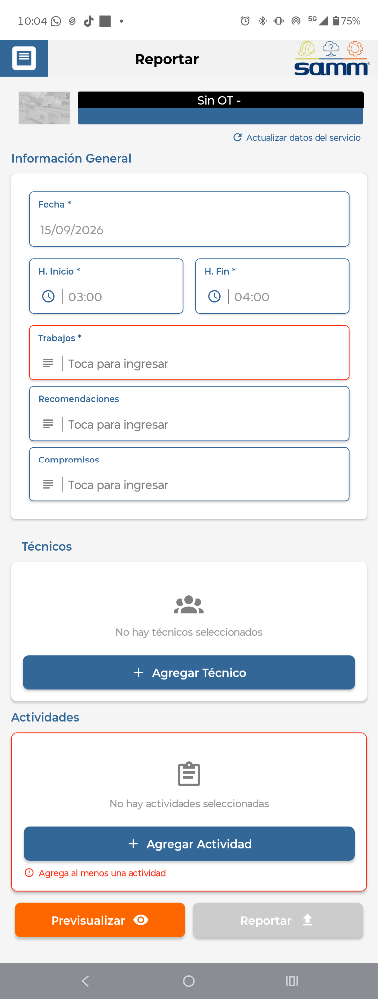

# Reporte de No Disponibilidades

Este documento describe la nueva forma de reportar no disponibilidades desde la App, permitiendo a los técnicos registrar bloques de tiempo en los que no estarán disponibles para atender un servicio (por ejemplo, permisos o capacitaciones), solicitando únicamente los campos que aportan valor al reporte: fecha, trabajos, compromisos, recomendaciones , actividades y canal de atencion.

## Referencias

- [SO-2180: Reportar no disponibilidades](https://softwaresamm.atlassian.net/browse/SO-2180)
- [SO-2145: Reportar no disponibilidades](https://softwaresamm.atlassian.net/browse/SO-2145)

## Información de Versiones

### Versión de Lanzamiento

:::info **v2.3.6.3**
:::

### Versiones Requeridas

| Aplicación    | Versión Mínima | Descripción              |
| ------------- | -------------- | ------------------------ |
| APP           | >= 2.3.6.3     | Aplicación móvil         |
| SAMMNEW       | >= 7.1.16.3    | Aplicación web           |
| SAMM LOGICA   | >= 5.6.26.6    | Lógica de negocio        |
| SAMM CORE     | >= 2.0.27.0    | Core del sistema         |
| SAMMAPI       | >= 1.2.33.0    | API principal            |
| CAPA DE DATOS | >= 2.1.17.2    | Capa de datos            |
| BASE DE DATOS | >= C2.1.17.2   | Base de datos            |

## Requisitos Previos

Antes de iniciar la configuración, asegúrese de tener:

- Acceso a la base de datos SAMM con permisos para crear o alterar procedimientos almacenados.
- Conocimiento del flujo de programación de servicios (`ort_programacion`) y su relación con las no disponibilidades (`id_tipoprogramacion in (2)`).
- La versión de APP actualizada a `>= 2.3.6.3` en los dispositivos de los técnicos.

:::important Importante
El correcto funcionamiento de esta funcionalidad depende de que los procedimientos `mob_bandejaServicios` y `_actividadesReporteUnificado` se actualicen juntos. Aplicar solo uno de los dos puede generar inconsistencias al listar o reportar las no disponibilidades.
:::

## Información del Servicio

No aplica para esta funcionalidad.

## Configuración

### Paso 1: Actualizar el procedimiento `mob_bandejaServicios`

Este procedimiento se modifica para incorporar, mediante un `UNION ALL`, las programaciones de tipo "no disponible" (`id_tipoprogramacion in (2)`), las cuales no tienen una orden de trabajo asociada. Por ello, este bloque no realiza `join` contra `view_doc_documento_ot` ni retorna columnas dependientes de la OT.

```sql title="Actualización de mob_bandejaServicios para incluir no disponibilidades"
CREATE OR ALTER PROCEDURE [dbo].[mob_bandejaServicios]
	@p_id_usuario int,
	@p_eid varchar(10),
	@p_id_programacion int = null
AS
BEGIN
	SET NOCOUNT ON;

	SELECT
		view_ort_programacion.id as id_programacion
		,[id_documento.ot] as id_ot
		,view_doc_documento_ot.[doc_documento_ot_prefijo] + '-' + convert(varchar(max),(view_doc_documento_ot.[doc_documento_ot_documento_numero])) as NumOT
		,'Tipo de Servicio: ' + convert(varchar(max),isnull([gen_tipoServicio_tipoServicio],'NA')) + char(10)
		+ 'Cliente: ' + isnull(view_doc_documento_ot.[doc_documento_ot_ter_tercero_cliente_tercero],'NA') + char(10)
		+ 'Sede: ' + isnull(view_doc_documento_ot.[ter_sucursal_sucursal],'NA') + char(10)
		+ 'Contacto: ' + convert(varchar(max),isnull(contacto,'NA')) + char(10)
		+ 'Cargo: ' + convert(varchar(max),isnull(cargo,'NA')) + char(10)
		+ 'Dirección: ' + convert(varchar(max),isnull(direccionUbicacion,'NA')) + char(10)
		+ 'Teléfono: ' + convert(varchar(max),isnull(telefono,'NA')) + char(10)
		+ 'Motivo servicio: ' + convert(varchar(max),isnull(motivoServicio,'NA')) + char(10)
		+ 'Equipo :' + convert(varchar(max),isnull(equipo,'NA')) + char(10)
		+ 'Prioridad : ' + convert(varchar(max),isnull(doc_documento_ot_doc_prioridadDocumento_prioridadDocumento,'NA')) + char(10)
		 as Ubicacion
		,isnull(view_equ_equipo.equipo,'') as Equipo
		,isnull(view_equ_equipo.id,0) as id_equipo
		,isnull(view_equ_equipo.equipo_serial,'')
		,isnull(view_equ_equipo.[cat_catalogo.equipo_manejahorometro],'false') as ConHorometro
		,convert(varchar(30),isnull(view_equ_equipo.[ultimalectura_fh],0),126) as FechaHorometro
		,isnull(view_equ_equipo.[HorometroActual],0) as ValorHorometro
		,convert(varchar(30),desde_fh,126) HoraInicio
		,convert(varchar(30),hasta_fh,126) HoraFin
		,comentario
		,'' as img
		,view_doc_documento_ot.[doc_documento_ot_id_subtipoDocumento] as id_subtipoDocumento
		,view_doc_documento_ot.[doc_documento_ot_id_estadoTipoDocumento] as id_estadoTipoDocumento
		,'true' as editarActividades
		,'false' as pedirCronometro
		,'false' as firmaObligatoria
		,'0.1' as imgPorcentaje
		,'3000' as imageMaxWidth
		,'4000' as imageMaxHeight
		,'true' as requiredAttachments
		,'doc_documento_ot' as additionalReportsCode

	FROM
		view_ort_programacion
		inner join view_doc_documento_ot on view_ort_programacion.[id_documento.ot]=view_doc_documento_ot.id
		left join view_equ_equipo on view_equ_equipo.id=view_doc_documento_ot.id_equipo

	WHERE
		id_usuario=@p_id_usuario
		and desde_fh >= dateadd(day,-180,GETDATE())
		and id_tipoprogramacion in (3)
		and view_doc_documento_ot.doc_documento_ot_id_estadoTipoDocumento not in (11,12)
		and (@p_id_programacion is null or @p_id_programacion = view_ort_programacion.id)
		AND (
			ISNULL(view_ort_programacion.id_programacion, 0) = 0
			OR
			(
				ISNULL(view_ort_programacion.id_programacion, 0) > 0
				AND ISNULL(view_ort_programacion.[id_catalogo.actividad], 0) = 0
				AND NOT EXISTS (
					SELECT 1
					FROM ort_programacion hermana
					WHERE hermana.id_programacion = view_ort_programacion.id_programacion
					AND ISNULL(hermana.[id_catalogo.actividad], 0) > 0
					AND hermana.active = 1
				)
			)
		)

	-- SO-2180: programaciones tipo "no disponible" (sin OT asociada) — se reportan sin generar OT,
	-- por eso no hay join contra view_doc_documento_ot ni columnas dependientes de la OT.
	UNION ALL
	SELECT
		view_ort_programacion.id as id_programacion
		,0 as id_ot
		,'Sin OT' as NumOT
		,'' as Ubicacion
		,'' as Equipo
		,0 as id_equipo
		,''
		,'false' as ConHorometro
		,convert(varchar(30),getdate(),126) as FechaHorometro
		,0 as ValorHorometro
		,convert(varchar(30),desde_fh,126) HoraInicio
		,convert(varchar(30),hasta_fh,126) HoraFin
		,comentario
		,'' as img
		,0 as id_subtipoDocumento
		,0 as id_estadoTipoDocumento
		,'true' as editarActividades
		,'false' as pedirCronometro
		,'false' as firmaObligatoria
		,'0.1' as imgPorcentaje
		,'3000' as imageMaxWidth
		,'4000' as imageMaxHeight
		,'false' as requiredAttachments
		,'' as additionalReportsCode

	FROM
		view_ort_programacion
	WHERE
		id_usuario=@p_id_usuario
		and desde_fh >= dateadd(day,-180,GETDATE())
		and id_tipoprogramacion in (2)
		and (@p_id_programacion is null or @p_id_programacion = view_ort_programacion.id)
END
```

:::tip Consejo
El nuevo bloque de `UNION ALL` identifica las no disponibilidades mediante `id_tipoprogramacion in (2)`. Si en el futuro se agregan nuevos tipos de programación sin OT, deberán evaluarse ambos bloques del procedimiento.
:::

### Paso 2: Actualizar el procedimiento `_actividadesReporteUnificado`

Se ajusta este procedimiento para contemplar el **Caso 1: No disponibilidades**, donde `@p_id_OT = 0`. En este escenario se retorna el catálogo completo de actividades activas, sin filtrar por planeación ni por programación específica.

```sql title="Actualización de _actividadesReporteUnificado para no disponibilidades"
CREATE OR ALTER PROCEDURE [dbo].[_actividadesReporteUnificado]
		@p_id_OT as int = 0,
		@p_id_programacion as int = 0,
		@p_eid as varchar(500),
		@p_id_usuario as int
	AS
	BEGIN
		SET NOCOUNT ON;

		declare @comillaDoble char
		set @comillaDoble = '"'

		declare @comillaSimple char
		set @comillaSimple = ''''''''

		declare @limit as int = (select top 1 valor from gen_config where config like '%registrosEnCheckList%')

		declare @tablaCatalogo table (idCatalogo int, textoDescripcion varchar(max), codigoInventario varchar(max),obligatorio varchar(45),sugerido varchar(45),categoria varchar(100),orden int, id int);

		declare @activitiesBySchedule as bit = (select doc_subtipoDocumento_programarPlaneadas from view_doc_documento where id = @p_id_OT)

		-- CASO 1: No disponibilidades
		if @p_id_OT = 0
		begin
			insert into @tablaCatalogo
				select distinct
					view_cat_catalogo_actividad.id as idCatalogo
					,replace(replace([catalogo.actividad],@comillaDoble,''''),@comillaSimple,'''') as textoDescripcion
					,cat_catalogo_actividad_codigoInventario as codigoInventario
					,'false' as obligatorio
					,'false' as sugerido
					,'CATEGORIA' as categoria
					,'1' as orden
					,view_cat_catalogo_actividad.id
				from
					view_cat_catalogo_actividad
				where
					view_cat_catalogo_actividad.active = 1
		end
		-- CASO 2: Asignadas, si el documento está configurado para programar actividades Y se proporciona un id_programacion
		else if @activitiesBySchedule = 1 and @p_id_programacion > 0
		begin
			insert into @tablaCatalogo
				select distinct
					view_cat_catalogo_actividad.id as idCatalogo
					,replace(replace([catalogo.actividad],@comillaDoble,''''),@comillaSimple,'''') as textoDescripcion
					,cat_catalogo_actividad_codigoInventario as codigoInventario
					,'false' as obligatorio
					,'false' as sugerido
					,'CATEGORIA' as categoria
					,'1' as orden
					,view_cat_catalogo_actividad.id
				from
					view_cat_catalogo_actividad
				where
					view_cat_catalogo_actividad.active = 1
					and view_cat_catalogo_actividad.id in (
						select [id_catalogo.actividad] from ort_programacion
						where id = @p_id_programacion and [id_catalogo.actividad] is not null and active = 1
						UNION
						select [id_catalogo.actividad] from ort_programacion
						where id_programacion = @p_id_programacion and [id_catalogo.actividad] is not null and active = 1
					)
		end
		else
		begin
			-- CASO 3: Buscar actividades planeadas de la OT
			if exists (select 1 from doc_itemDocumento where id_documento = @p_id_OT and cantidadPlaneado > 0 and active = 1 and id_catalogo in (select id from [cat_catalogo.actividad] where active = 1))
			begin
				insert into @tablaCatalogo
					select distinct
						view_cat_catalogo_actividad.id as idCatalogo
						,replace(replace([catalogo.actividad],@comillaDoble,''''),@comillaSimple,'''') as textoDescripcion
						,cat_catalogo_actividad_codigoInventario as codigoInventario
						,'false' as obligatorio
						,'false' as sugerido
						,'CATEGORIA' as categoria
						,'2' as orden
						,view_cat_catalogo_actividad.id
					from
						view_cat_catalogo_actividad
						INNER JOIN doc_itemDocumento on doc_itemDocumento.id_catalogo = view_cat_catalogo_actividad.id
					where
						view_cat_catalogo_actividad.active = 1
						AND doc_itemDocumento.id_documento = @p_id_OT
						AND doc_itemDocumento.cantidadPlaneado > 0
						AND doc_itemDocumento.active = 1
			end
			else
			begin
				-- CASO 4: Si no hay actividades planeadas, retornar actividades de catálogo genéricas
				insert into @tablaCatalogo
					select distinct
						view_cat_catalogo_actividad.id as idCatalogo
						,replace(replace([catalogo.actividad],@comillaDoble,''''),@comillaSimple,'''') as textoDescripcion
						,cat_catalogo_actividad_codigoInventario as codigoInventario
						,'false' as obligatorio
						,'false' as sugerido
						,'CATEGORIA' as categoria
						,'3' as orden
						,view_cat_catalogo_actividad.id
					from
						view_cat_catalogo_actividad
					where
						view_cat_catalogo_actividad.active = 1
			end
		end

		select * from @tablaCatalogo

	END
```

A continuacion un ejemplo de lo que veremos en el app



:::note Información
El procedimiento `mob_bandejaServicios` ahora combina, mediante `UNION ALL`, el escenario de órdenes de trabajo (`id_tipoprogramacion = 3`) con el escenario de no disponibilidades (`id_tipoprogramacion = 2`), permitiendo que ambos tipos de programación convivan en la misma bandeja de servicios del técnico.
:::

## Resultado Esperado

Una vez completada la configuración:

1. **Bandeja de servicios unificada**: La App mostrará tanto las órdenes de trabajo como las no disponibilidades en la misma bandeja de servicios del técnico.
2. **Formulario simplificado**: Al reportar una no disponibilidad, solo se solicitarán los campos básicos: fecha del reporte, trabajos, compromisos, recomendaciones y actividades (cuando apliquen).
3. **Catálogo completo de actividades**: Al reportar una no disponibilidad, el listado de actividades disponibles corresponderá al catálogo completo de actividades activas, sin restricciones por OT o programación.

## Resolución de Problemas

### La no disponibilidad no aparece en la bandeja de servicios

Verifique que:

- La programación tenga `id_tipoprogramacion = 2` en `ort_programacion`.
- El procedimiento `mob_bandejaServicios` esté actualizado con el bloque `UNION ALL` correspondiente.
- La fecha `desde_fh` de la programación esté dentro de los últimos 180 días.

### El listado de actividades no se muestra correctamente al reportar una no disponibilidad

Confirme que:

- El procedimiento `_actividadesReporteUnificado` esté actualizado y contemple el **Caso 1** (`@p_id_OT = 0`).
- Existan actividades activas en `view_cat_catalogo_actividad`.

### La App muestra campos adicionales que no corresponden a una no disponibilidad

Revise que:

- La versión de APP instalada sea `>= 2.3.6.3`.
- El `additionalReportsCode` retornado para no disponibilidades esté vacío, como se define en el procedimiento actualizado.

## Errores Conocidos

No aplica para esta funcionalidad.

## QA — Pruebas

**Escenario 1: Reportar una no disponibilidad**

1. Crear una programación con `id_tipoprogramacion = 2` para un técnico.
2. Ingresar a la bandeja de servicios de la App con ese usuario.
3. Seleccionar la no disponibilidad y reportarla.
4. **Resultado esperado**: El formulario solo solicita fecha, trabajos, compromisos, recomendaciones y actividades; no se solicitan campos de equipo, adjuntos obligatorios ni firma.

**Escenario 2: Convivencia de OT y no disponibilidades en la bandeja**

1. Asegurarse de que el técnico tenga al menos una OT programada (`id_tipoprogramacion = 3`) y una no disponibilidad (`id_tipoprogramacion = 2`) dentro del rango de 180 días.
2. Consultar la bandeja de servicios desde la App.
3. **Resultado esperado**: Ambos registros aparecen en la bandeja, cada uno con su respectivo comportamiento de reporte (OT completa vs. formulario simplificado de no disponibilidad).