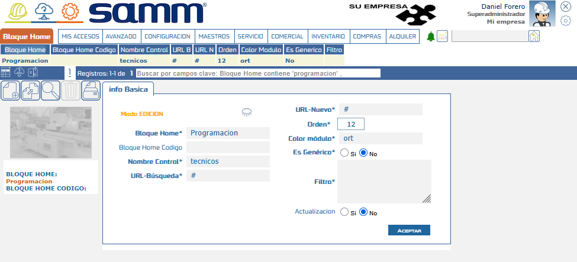
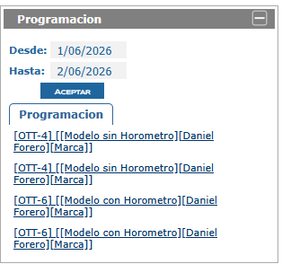

# Configuración del Bloque Home "Técnicos"

Esta guía describe la configuración del nuevo **Bloque Home (BH) "Técnicos"** en Samm New, incorporado como parte de la configuración básica del sistema. El bloque muestra la bandeja de servicios/programaciones asignadas y su nombre puede modificarse desde el menú de bloques home.

:::info Antes de esta versión
No existía un Bloque Home dedicado a mostrar la bandeja de servicios de técnicos en el home de Samm New; esta configuración resuelve ese vacío mediante un nuevo procedimiento almacenado dedicado.
:::

## Referencias

- [SO-778 / OTT-3438: Ajuste BH técnicos](https://softwaresamm.atlassian.net/browse/SO-778)

## Información de Versiones

:::info
Esta funcionalidad requiere las siguientes versiones mínimas para operar correctamente.
:::

| Componente     | Versión mínima |
| -------------- | -------------- |
| Samm New       | 7.1.14.0       |
| Samm Lógica    | 5.6.26.1       |
| Capa de Datos  | 2.1.15.1       |
| Recursos       | -              |
| Base de Datos  | C2.1.15.1      |
| SamCore        | 2.0.24.1       |
| SAMMAPI        | 1.2.30.1       |

## Requisitos Previos

No aplica para esta funcionalidad.

## Información del Servicio

No aplica para esta funcionalidad.

## Configuración

### Paso 1 — Actualizar Samm New y SAMMAPI

Actualiza **Samm New** y **SAMMAPI** a las versiones mínimas indicadas en la tabla anterior. Durante este proceso, el **servicio de actualización** crea automáticamente el procedimiento almacenado `mob_bandejaServicios_bloquehome`, encargado de alimentar el nuevo Bloque Home.

:::note
No es necesario ejecutar el script manualmente: el procedimiento se crea de forma automática al correr la actualización. Se incluye a continuación como referencia técnica.
:::

```sql title="mob_bandejaServicios_bloquehome — creado automáticamente por el servicio de actualización"
CREATE   PROCEDURE [dbo].[mob_bandejaServicios_bloquehome]
    @p_id_usuario        INT,
    @p_eid                VARCHAR(10),
    @p_id_programacion    INT = NULL,
    @p_fecha_desde        SMALLDATETIME = NULL,
    @p_fecha_hasta        SMALLDATETIME = NULL
AS
BEGIN
    SET NOCOUNT ON;
    DECLARE @Resultado TABLE (
        id_programacion         INT             NULL,
        id_ot                   INT             NULL,
        NumOT                   VARCHAR(MAX)    NULL,
        Ubicacion               VARCHAR(MAX)    NULL,
        Equipo                  VARCHAR(MAX)    NULL,
        id_equipo               INT             NULL,
        EquipoSerial            VARCHAR(MAX)    NULL,
        ConHorometro            VARCHAR(10)     NULL,
        FechaHorometro          VARCHAR(30)     NULL,
        ValorHorometro          FLOAT           NULL,
        HoraInicio              VARCHAR(30)     NULL,
        HoraFin                 VARCHAR(30)     NULL,
        comentario              VARCHAR(MAX)    NULL,
        img                     VARCHAR(10)     NULL,
        id_subtipoDocumento     INT             NULL,
        id_estadoTipoDocumento  INT             NULL,
        editarActividades       VARCHAR(10)     NULL,
        pedirCronometro         VARCHAR(10)     NULL,
        firmaObligatoria        VARCHAR(10)     NULL,
        imgPorcentaje           VARCHAR(10)     NULL,
        imageMaxWidth           VARCHAR(10)     NULL,
        imageMaxHeight          VARCHAR(10)     NULL,
        requiredAttachments     VARCHAR(10)     NULL
    );
    IF @p_id_programacion IS NULL
    BEGIN
        INSERT INTO @Resultado
        EXEC [dbo].[mob_bandejaServicios]
            @p_id_usuario = @p_id_usuario,
            @p_eid        = @p_eid;
    END
    ELSE
    BEGIN
        INSERT INTO @Resultado
        EXEC [dbo].[mob_bandejaServicios]
            @p_id_usuario      = @p_id_usuario,
            @p_eid             = @p_eid,
            @p_id_programacion = @p_id_programacion;
    END
    ;WITH Filtrado AS (
        SELECT *
        FROM @Resultado
        WHERE
        (@p_fecha_desde IS NULL OR TRY_CONVERT(SMALLDATETIME, HoraInicio, 126) >= @p_fecha_desde)
        AND (@p_fecha_hasta IS NULL OR TRY_CONVERT(SMALLDATETIME, HoraInicio, 126) < DATEADD(DAY, 1, CONVERT(DATE, @p_fecha_hasta)))
    )
    SELECT
        id_programacion,
        id_ot,
        HoraInicio desde_fh,
        '[' + ISNULL(NumOT, 'NA') + '] ' +
        '[' + ISNULL(Equipo, 'NA') + ']'
        AS resumen
    FROM filtrado
END
```

El procedimiento `mob_bandejaServicios_bloquehome` actúa como una capa sobre `mob_bandejaServicios`:

- Recibe `@p_id_usuario` y `@p_eid` como parámetros obligatorios para identificar al técnico.
- Si `@p_id_programacion` es `NULL`, obtiene la bandeja completa del usuario; si se envía un valor, filtra por esa programación específica.
- Aplica filtros opcionales por rango de fechas (`@p_fecha_desde`, `@p_fecha_hasta`) sobre el campo `HoraInicio`, usando `TRY_CONVERT` para evitar errores de conversión.
- Devuelve únicamente las columnas `id_programacion`, `id_ot`, `desde_fh` y `resumen`, que son las que consume el Bloque Home en el front end.

### Paso 2 — Verificar y personalizar el bloque en el home

Una vez aplicada la actualización, el bloque **"Técnicos"** aparece disponible en el home de Samm New dentro de la configuración de Bloques Home.



Desde el menú de administración de Bloques Home, el nombre **"Técnicos"** puede modificarse por cualquier otro nombre según la necesidad del cliente, sin que esto afecte el funcionamiento del procedimiento subyacente.

en el Bh se vera de la siguiente manera 




Se relaciona video explicativo de como se ve el sp estándar y uno modificado https://youtu.be/aVKFnI5Gcv4

## Casos Especiales

No aplica para esta funcionalidad.

## Resultado Esperado

- Al finalizar la actualización, el procedimiento `mob_bandejaServicios_bloquehome` **debe existir** en la base de datos.
- El nuevo **Bloque Home "Técnicos"** debe estar disponible para ser agregado al home desde la configuración de bloques.
- Al consultar el bloque sin `id_programacion`, debe mostrarse la bandeja completa de servicios del técnico autenticado.
- Al aplicar filtros de fecha, solo deben listarse los registros cuya `HoraInicio` esté dentro del rango indicado.
- El nombre del bloque debe poder editarse desde el menú de Bloques Home sin generar errores.

## Resolución de Problemas

| Síntoma | Posible causa | Acción sugerida |
| --- | --- | --- |
| El bloque "Técnicos" no aparece disponible para agregar al home | La actualización de Samm New/SAMMAPI no llegó a la versión mínima requerida | Verificar versiones instaladas contra la tabla de **Versiones requeridas** |
| El bloque aparece vacío | El procedimiento `mob_bandejaServicios_bloquehome` no fue creado | Ejecutar `SELECT OBJECT_ID('dbo.mob_bandejaServicios_bloquehome')` y validar que no retorne `NULL`; si es necesario, re-ejecutar el servicio de actualización |
| Los filtros de fecha no devuelven resultados esperados | El campo `HoraInicio` no tiene un formato convertible por `TRY_CONVERT` | Revisar el origen de datos en `mob_bandejaServicios` para asegurar formato de fecha compatible con estilo `126` |
| No se puede renombrar el bloque | Falta de permisos de administración sobre Bloques Home | Validar el rol/permiso del usuario en la configuración de Samm New |

## Errores Conocidos

No aplica para esta funcionalidad.

## QA — Pruebas

| # | Escenario | Pasos | Resultado esperado |
| --- | --- | --- | --- |
| 1 | Creación del SP tras actualización | 1. Actualizar Samm New y SAMMAPI a la versión mínima. 2. Ejecutar `SELECT OBJECT_ID('dbo.mob_bandejaServicios_bloquehome')`. | El objeto existe (no retorna `NULL`). |
| 2 | Bandeja completa sin filtro de programación | 1. Ejecutar el SP con `@p_id_programacion = NULL` y sin fechas. | Retorna todos los registros de la bandeja de servicios del usuario/eid indicado. |
| 3 | Filtrado por programación específica | 1. Ejecutar el SP enviando un `@p_id_programacion` válido. | Retorna únicamente los registros asociados a esa programación. |
| 4 | Filtrado por rango de fechas | 1. Ejecutar el SP con `@p_fecha_desde` y `@p_fecha_hasta` definidos. | Retorna solo registros cuya `HoraInicio` está dentro del rango, incluyendo todo el día de `@p_fecha_hasta`. |
| 5 | Renombrado del bloque | 1. Ir a configuración de Bloques Home. 2. Renombrar "Técnicos" a otro nombre. 3. Guardar. | El bloque conserva su funcionalidad con el nuevo nombre. |