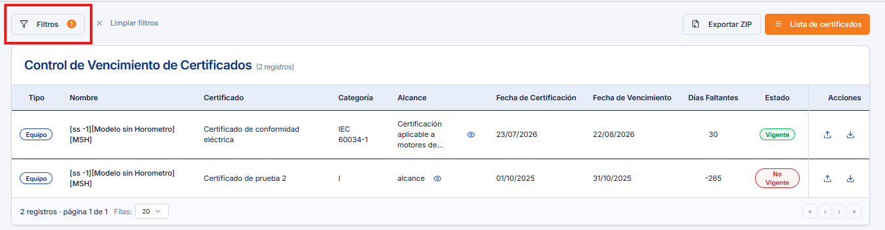
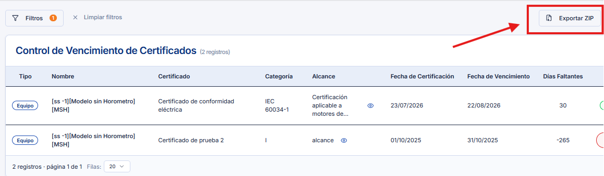

# Utilitario Certificados - Descarga Masiva de Certificados

Este documento describe cómo utilizar el **Utilitario de Certificados** en Samm New para realizar la descarga masiva de certificados disponibles en el sistema, permitiendo exportar múltiples certificados de forma simultánea en un solo archivo comprimido, sin necesidad de descargarlos individualmente.

## Referencias

- [SO-744: Descarga masiva de certificados](https://softwaresamm.atlassian.net/browse/SO-744)

## Información de Versiones

### Versión de Lanzamiento

:::info **v0.3.0-beta**
:::

### Versiones Requeridas

| Aplicación    | Versión Mínima | Descripción       |
| ------------- | --------------- | ------------------ |
| SAMMAPI       | >= 1.2.30.1     | API principal       |
| SAMMNEW       | >= 7.1.14.0     | Aplicación web       |
| SAMM LÓGICA   | >= 5.6.26.1     | Lógica de negocio    |
| SAMM CORE     | >= 2.0.24.1     | Core del sistema     |
| CAPA DE DATOS | >= 2.1.15.1     | Capa de acceso a datos |
| BASE DE DATOS | >= C2.1.15.1    | Base de datos         |

## Requisitos Previos

Antes de iniciar el uso de la funcionalidad, asegúrese de tener:

- Acceso al módulo **Samm New** con permisos sobre la sección **Servicio - Equipos - Certificados**.
- Certificados previamente generados y disponibles en el sistema para el equipo o servicio a consultar.

:::important Importante
No se requiere configuración previa para utilizar esta funcionalidad. Basta con ingresar al módulo y contar con los permisos correspondientes.
:::

## Información del Servicio

No aplica para esta funcionalidad.

## Configuración

### Paso 1: Ingresar al Dashboard de Certificados

Ingrese al Dashboard de certificados a través de la ruta **Servicio > Equipos > Certificados** dentro de Samm New.

:::tip Consejo
Para más detalle sobre la navegación y estructura del módulo, consulte la documentación de referencia: [Utilitario de Certificados](https://softwaresamm.github.io/IDAE.Docs/docs/sammnew/utilitario-certificados).
:::

### Paso 2: Aplicar Filtros de Búsqueda

Utilice los filtros disponibles en la parte superior izquierda del Dashboard para acotar el listado de certificados que desea descargar (por ejemplo, por equipo, servicio o rango de fechas, según los filtros habilitados en el módulo).

### Paso 3: Exportar los Certificados a ZIP

Una vez aplicados los filtros del paso anterior, haga clic en la opción **Exportar a ZIP** para generar la descarga masiva de los certificados que cumplen con los criterios seleccionados.

:::tip Consejo
Puede revisar el siguiente [video de referencia](https://youtu.be/OE6Jwtl1dA4) para ver el flujo completo de filtrado y exportación en acción.
:::

## Casos Especiales

No aplica para esta funcionalidad.

## Resultado Esperado

Una vez completado el proceso de exportación:

1. **Generación del archivo ZIP**: El sistema genera un archivo comprimido (`.zip`) que contiene todos los certificados correspondientes a los filtros aplicados.
2. **Descarga automática**: El navegador inicia la descarga del archivo ZIP generado.
3. **Contenido íntegro**: El archivo ZIP contiene únicamente los certificados disponibles que cumplen con los criterios de filtro seleccionados, sin registros duplicados ni faltantes.

## Resolución de Problemas

### El botón "Exportar a ZIP" no genera ninguna descarga

Verifique que:

- Los filtros aplicados devuelvan al menos un certificado disponible en el listado.
- El usuario cuente con permisos de acceso a la sección **Servicio - Equipos - Certificados**.
- El navegador no esté bloqueando las descargas emergentes (pop-ups) del sitio.

### El archivo ZIP descargado aparece vacío o incompleto

Confirme que:

- Los certificados seleccionados mediante los filtros se encuentren efectivamente generados y disponibles en el sistema.
- No existan errores de conexión durante el proceso de generación del ZIP.
- La versión de **SAMMAPI** instalada sea igual o superior a `1.2.30.1`.

### Los filtros no muestran los certificados esperados

Revise que:

- Los criterios de filtro (equipo, servicio, fechas, etc.) estén correctamente configurados.
- El servicio o equipo consultado tenga certificados asociados en la base de datos.
- La versión de **Samm New** instalada sea igual o superior a `7.1.14.0`.

## Errores Conocidos

En caso de no tener certificados cargados tendremos como respuesta al dar click en el boton exportar a zip 404

## QA — Pruebas

### Escenario 1: Descarga masiva exitosa con filtros aplicados

1. Ingresar al Dashboard mediante **Servicio > Equipos > Certificados**.
2. Aplicar un filtro que devuelva más de un certificado disponible.
3. Hacer clic en **Exportar a ZIP**.
4. **Resultado esperado**: Se descarga un archivo `.zip` que contiene todos los certificados correspondientes a los filtros aplicados.

### Escenario 2: Exportación sin resultados de filtro

1. Ingresar al Dashboard mediante **Servicio > Equipos > Certificados**.
2. Aplicar un filtro que no devuelva ningún certificado disponible.
3. Intentar hacer clic en **Exportar a ZIP**.
4. **Resultado esperado**: El sistema no genera ningún archivo ZIP o notifica al usuario que no existen certificados disponibles para exportar.

### Escenario 3: Validación de contenido del ZIP descargado

1. Aplicar un filtro específico (por ejemplo, un único equipo) que devuelva un número conocido de certificados.
2. Exportar a ZIP.
3. Descomprimir el archivo descargado.
4. **Resultado esperado**: El número de certificados dentro del ZIP coincide exactamente con el número de resultados mostrados en el listado filtrado, sin duplicados ni archivos faltantes.