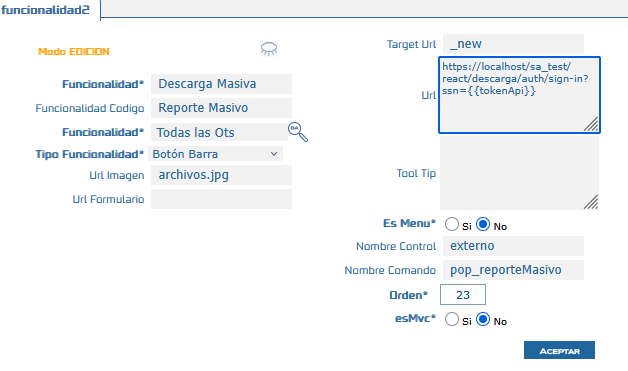

# Descarga Masiva de Órdenes de Trabajo

La funcionalidad **Descarga Masiva** permite a los usuarios de **Samm New** seleccionar múltiples órdenes de trabajo, filtrar por **subtipo** y **formato**, y descargarlas en un único archivo comprimido que contiene los PDF de los documentos seleccionados. Esta ventana funciona de forma independiente dentro del ecosistema Samm y ya se encuentra disponible en versiones anteriores a la de esta documentación; el ticket asociado a esta versión corrige la redirección de URL utilizada por la funcionalidad.

## Referencias

- [SO-1967: Redirección de URL en funcionalidad de descarga masiva](https://softwaresamm.atlassian.net/browse/SO-1967)

## Información de Versiones

:::info
Esta funcionalidad ya lleva tiempo en producción como ventana independiente, por lo que puede encontrarse operativa en versiones **inferiores** a las indicadas a continuación. Las versiones aquí listadas corresponden al lanzamiento en el que se corrige la redirección de URL (SO-1967).
:::

| Componente     | Versión    |
| -------------- | ---------- |
| Samm New       | 7.1.14.0   |
| samm_logica    | 5.6.26.1   |
| capadatos      | 2.1.15.1   |
| recursos       | -          |
| bd             | C2.1.15.1  |
| samcore        | 2.0.24.1   |
| sammapi        | 1.2.30.1   |

## Requisitos Previos

:::important
El área de **Alta Disponibilidad** debe garantizar el despliegue de la ventana de Descarga Masiva antes de que la funcionalidad esté disponible para los usuarios finales.
:::

- Acceso al módulo Samm New con permisos para consultar y descargar órdenes de trabajo.
- Ambiente desplegado con las versiones mínimas indicadas en la tabla anterior.

## Información del Servicio

No aplica para esta funcionalidad.

## Configuración

### Paso 1: Despliegue de la ventana

El área de **Alta Disponibilidad** debe garantizar el despliegue de la ventana de Descarga Masiva en el ambiente correspondiente. Este paso es un prerequisito de infraestructura y no requiere código o script adicional por parte del usuario.

### Paso 2: Validación de la funcionalidad y estructura de URL

Una vez desplegada, se debe validar que la funcionalidad esté correctamente creada. Para ello, se debe verificar que la URL de acceso siga la siguiente estructura, incluyendo el parámetro `ssn` con el token de autenticación (`tokenApi`):

```text title="Estructura de URL esperada"
https://localhost/sa_test/react/descarga/auth/sign-in?ssn={{tokenApi}}
```



*Captura de referencia: estructura de la URL de acceso a la ventana de Descarga Masiva con el parámetro `ssn`.*

:::note
Reemplaza `{{tokenApi}}` por el token de sesión válido generado para el usuario autenticado. `localhost` y `sa_test` deben ajustarse según el ambiente (desarrollo, QA, producción) donde se realice la validación.
:::

## Casos Especiales

No aplica para esta funcionalidad.

## Resultado Esperado

- La ventana de Descarga Masiva se encuentra desplegada y accesible en el ambiente validado.
- Al ingresar a la URL con la estructura `.../descarga/auth/sign-in?ssn={{tokenApi}}`, el usuario **autentica correctamente** sin ser redirigido a una URL incorrecta.
- El usuario puede seleccionar órdenes de trabajo, filtrar por **subtipo** y **formato**, y obtener un **archivo comprimido** con los PDF correspondientes a los documentos seleccionados.
- video donde se muestra resultado esperado https://youtu.be/4bPT9GHr-0Q 

## Resolución de Problemas

| Problema | Posible causa | Acción sugerida |
| -------- | -------------- | ---------------- |
| La ventana de Descarga Masiva no está disponible | El despliegue no fue realizado por el área de Alta Disponibilidad | Confirmar con Alta Disponibilidad que el despliegue se ejecutó en el ambiente correspondiente |
| La URL redirige a una página incorrecta o de error | El parámetro `ssn` está ausente, vencido o mal formado | Validar que la URL siga exactamente la estructura `.../descarga/auth/sign-in?ssn={{tokenApi}}` con un token vigente |
| El archivo comprimido descargado no contiene los PDF esperados | Las versiones desplegadas no cumplen las versiones mínimas requeridas | Verificar versiones de `samm_logica`, `capadatos`, `bd`, `samcore` y `sammapi` contra la tabla de Información de Versiones |

## Errores Conocidos

No aplica para esta funcionalidad.

## QA — Pruebas

**Escenario 1: Validación de la estructura de URL y autenticación**

```gherkin
Feature: Descarga Masiva - Validación de URL de acceso

  Scenario: El usuario accede a la ventana de Descarga Masiva con un token válido
    Given el usuario cuenta con un token de sesión (tokenApi) válido
    When ingresa a la URL "https://localhost/sa_test/react/descarga/auth/sign-in?ssn={{tokenApi}}"
    Then el sistema autentica al usuario correctamente
    And no se produce una redirección a una URL incorrecta
    And la ventana de Descarga Masiva se muestra disponible
```

**Escenario 2: Descarga masiva de órdenes de trabajo en formato comprimido**

```gherkin
Feature: Descarga Masiva - Descarga de órdenes de trabajo

  Scenario: El usuario descarga múltiples órdenes de trabajo filtradas por subtipo y formato
    Given el usuario ha autenticado correctamente en la ventana de Descarga Masiva
    And existen órdenes de trabajo disponibles para su subtipo seleccionado
    When el usuario selecciona el subtipo y formato deseados
    And selecciona una o más órdenes de trabajo
    And confirma la descarga
    Then el sistema genera un archivo comprimido
    And el archivo comprimido contiene los PDF de las órdenes de trabajo seleccionadas
```