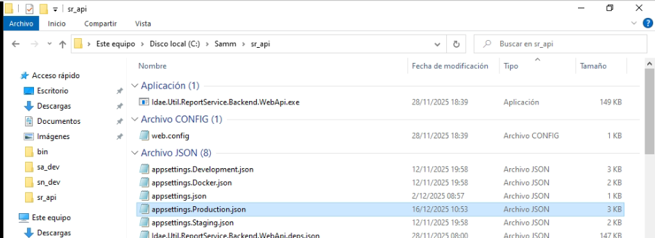
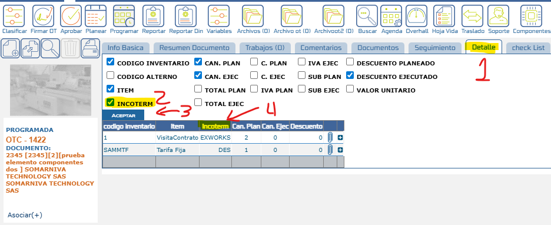

# Visualización de Report services

Este documento describe lo primero a tener en cuenta para poder configurar y ver el nuevo modulo de report services.

## Referencias

- [SO-40: Crear aplicación para visualizar reportes (listar reportes, ver filtros y su contenido)](https://softwaresamm.atlassian.net/browse/SO-40)

## Información de Versiones

### Versión de Lanzamiento

:::info **v7.1.10.9**
:::

### Versiones Requeridas

| Aplicación    | Versión Mínima | Descripción                           |
| ------------- | -------------- | ------------------------------------- |
| SAMMNEW       | >= 7.1.10.9    | Aplicación web principal              |
| SAMM LOGICA   | >= 5.6.23.4   | Lógica de negocio                     |
| BASE DE DATOS | >= C2.1.6.1    | Scripts de configuración de historial |

:::important Importante
Esta funcionalidad requiere las versiones mínimas especificadas. Verifique sus versiones actuales antes de continuar con la configuración.
:::

## Requisitos Previos

Antes de iniciar la configuración, asegúrese de tener:

- Acceso al archivo web.config 
- Permisos para modificar el Archivo
- Conocimiento de la estructura y apuntamiento entre los servicios de reportes 
- Version de instancia minima Microsoft SQL Server 2022  Express Edition
:::note Nota
La configuración del componente a utilizar depende de una instalacion previa ya sea descargando Docker o configuracion por IIS
:::

## Configuración

### Paso 1: validacion web config web  

En este paso se compartira un ejemplo del contenido de los appsettings que debe tener el archivo web config.

```sql title="web.config web"
<appSettings>
    <add key="licencia" value="79B7-SW-WQ11-AD2X" lockItem="true" />
    <add key="correo.soporte" value="" lockItem="true" />
    <add key="hostPruebas" value="" />
    <add key="rsaPrivateKeyFilePath" value="m:\xml\sammpr1.xml" />
    <add key="urlSoporte" value="https://softwaresamm.com/sw_idae;usuario;claveusuario" />
    <add key="maxRegistrosGrilla" value="300" />
    <add key="urlAPI" value="https://localhost:44367/" />
    <add key="urlApiIDAE" value="https://softwaresamm.com/sa_idae/" />
    <add key="urlSAMMReportes" value="http://localhost:3000" />-- Este link debe ser proporcionado previamente con la instalacion del reportservices
    <!--<add key="reportePredeterminado" value="rep/rep_indicadorSM.aspx"/>-->
	<add key="tipoReportServices" value="2" /> <!-- 1. Default, 2. Util.ReportService -->
    <add key="ValidationSettings:UnobtrusiveValidationMode" value="None" />
    <add key="sitioSammReportes" value="C:\Johan\samm_reportes" />
    <add key="maxAlmacenamiento" value="" />
    <add key="porcAdvertenciaMaxAlmacenamiento" value="" />
  </appSettings>
```

:::tip Consejo
Asegúrese de guardar los cambios después de cada modificacion 
:::

### Paso 2: validacion web config api

En este paso se compartira un ejemplo del contenido de los appsettings que debe tener el archivo web.config.

```sql title="web.config api"
<appSettings>
    <add key="JWT_SECRET_KEY" value="clave-secreta-api-clave-secreta-api-clave-secreta-api" />--OJO
    <add key="JWT_AUDIENCE_TOKEN" value="0000-0000-0000-0000-0000" />--OJO
    <add key="JWT_ISSUER_TOKEN" value="http://localhost:44367" />--OJO
    <add key="JWT_EXPIRE_MINUTES" value="240" />--OJO
    <add key="correo.soporte" value="" lockItem="true" />
    <add key="licencia" value="79B7-SW-WQ11-AD2X" lockItem="true" />
    <add key="ubicacionSitioPrincipal" value="C:\idaeSoluciones\sammWeb\sammnew\website" lockItem="true" />
    <add key="descargarArchivo" value="1" lockItem="true" />
    <add key="sitioSammWeb" value="https://localhost:44337/" />
    <add key="url_versionLiberada" value="http://dev.softwaresamm.com/act/version5.txt" />
    <add key="omiteLog" value="f_str_autoguardar,f_str_autoguardarAdjuntos" />
    <add key="enviarAutoguardado" value="true" />
    <add key="urlAPI" value="https://localhost:44367" />
    <add key="urlApiIDAE" value="https://softwaresamm.com/sa_idae/" />
	<add key="ubicacionSitioReportes" value="C:\ubicacionSitioReportes\" lockItem="true" />
	<add key="tipoReportServices" value="2" /> <!-- 1. Default, 2. Util.ReportService -->
  </appSettings>
```

:::important Importante
Para unas llaves (marcadas con la palabra "OJO") es importante que coincida con la seccion Authentications del documento que se ve en la siguiente imagen para garantizar su correcta validacion de seguridad ya que el token tiene cambios importantes a nivel de seguridad.
:::





1. Acceda a la configuración del tab detalle del documento
2. Localice el ítem **"Incoterm"** en la lista de campos disponibles
3. Marque el checkbox del ítem "Incoterm" para habilitarlo


## Resultado Esperado

Una vez completada la configuración:

1. **Visualización en Planeación**: El campo incoterm se mostrará en la planeación del documento, permitiendo su selección y registro desde el inicio del proceso.

2. **Visualización en Tab Detalle**: Al navegar al tab detalle del documento, podrá visualizar el campo incoterm junto con los demás campos configurados, facilitando la consulta de los términos de comercio internacional asociados a cada ítem.

### Visualización en la Interfaz

El campo incoterm aparecerá integrado en la interfaz del documento, permitiendo una gestión completa de los términos de comercio internacional dentro del flujo normal de trabajo.



## Resolución de Problemas

### El campo incoterm no aparece en la planeación

Verifique que:

- El parámetro "Ver incoterm en items" esté activado en el subtipodocumento
- Haya guardado correctamente los cambios en la configuración
- La versión de SAMMNEW sea >= 7.1.10.8

### El campo incoterm no aparece en el tab detalle

Confirme que:

- El ítem "Incoterm" esté marcado en la configuración del tab detalle
- Haya actualizado la página después de realizar los cambios
- La configuración del subtipodocumento incluya el parámetro activado

### Los cambios no se reflejan en documentos existentes

Revise que:

- Los documentos correspondan al subtipodocumento configurado
- Haya cerrado y vuelto a abrir los documentos después de la configuración
- La caché del navegador esté actualizada