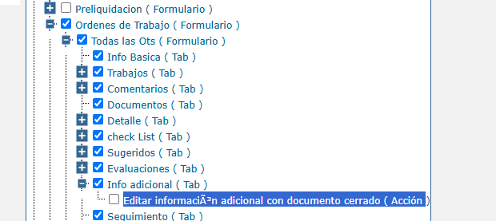
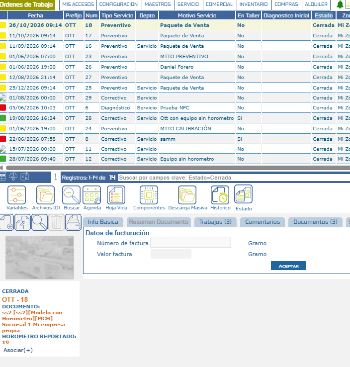

# Edición de Información Adicional en Órdenes de Trabajo Cerradas

Este documento describe cómo habilitar el permiso que permite editar el tab **Información Adicional** de una Orden de Trabajo aunque su estado sea Cerrado (código `CER`), permitiendo corregir o actualizar datos sin necesidad de reabrir el documento y sin afectar el estado ni la trazabilidad del flujo documental.

## Referencias

- [SO-2132: Habilitar edición de información adicional en documentos cerrados mediante permisos](https://softwaresamm.atlassian.net/browse/SO-2132)
- [SO-2136: Habilitar edición de información adicional en documentos cerrados mediante permisos](https://softwaresamm.atlassian.net/browse/SO-2136)

## Información de Versiones

### Versión de Lanzamiento

:::info **v7.1.16.3**
:::

### Versiones Requeridas

| Aplicación    | Versión Mínima | Descripción            |
| ------------- | --------------- | ----------------------- |
| SAMMAPI       | >= 1.2.33.0      | API principal            |
| SAMMNEW       | >= 7.1.16.3      | Aplicación web           |
| SAMM LOGICA   | >= 5.6.26.6      | Lógica de negocio        |
| SAMM CORE     | >= 2.0.27.0      | Core del sistema         |
| CAPA DATOS    | >= 2.1.17.2      | Capa de acceso a datos   |
| BASE DE DATOS | >= C2.1.17.2     | Base de datos            |

## Requisitos Previos

Antes de iniciar la configuración, asegúrese de tener:

- Usuario con el permiso "Editar información adicional con documento cerrado ( Acción )" habilitado en su perfil
- El documento debe encontrarse en un estado cuyo código sea `CER`
- El usuario debe poder visualizar el tab "Información Adicional" del documento

## Configuración

### Paso 1: Verificar existencia de la funcionalidad

Ejecute la siguiente consulta para verificar si el permiso ya existe en la base de datos:

```sql title="Verificar existencia de la funcionalidad"
SELECT *
FROM gui_funcionalidad
WHERE nombreComando like 'editarInformacionAdicionalDocumentoCerrado%'
    AND active = 1;
```

:::tip Resultado Esperado
Si la consulta retorna un registro, la funcionalidad ya está creada. Si no retorna ningún registro, proceda con el paso 2.
:::

### Paso 2: Crear la funcionalidad (si no existe)

Si el permiso no existe, créelo ejecutando el script del repositorio SAMM.DBObjects:

**Script:** [SAMM.DBObjects/SAMMAPI/Versions/Grupo2/2.1.17.0/SO_2136_1.sql](https://github.com/softwaresamm/SAMM.DBObjects/blob/develop/SAMM.DBObjects/SAMMAPI/Versions/Grupo2/2.1.17.0/SO_2136_1.sql)

:::note Información
Este script crea la acción colgada del tab `inc_datosEquipo` (Información Adicional) y la asigna automáticamente a todos los perfiles existentes.
:::

### Paso 3: Asignar el permiso al perfil

En **Configuración → Seguridad → Perfil**, dentro del tab **Permisos**, ubique el nodo **Ordenes de Trabajo → Todas las Ots → Info adicional (Tab)** y habilite la acción **"Editar información adicional con documento cerrado"** para los perfiles que requieran esta capacidad.



:::tip Recomendación
Asigne este permiso de manera granular, solo a los perfiles que efectivamente necesiten corregir información adicional en documentos ya cerrados.
:::

## Resultado Esperado

Una vez completada la configuración:

1. **Usuario con permiso**: puede editar el tab Información Adicional de una Orden de Trabajo en estado Cerrada, guardando los cambios mediante el botón Aceptar.
2. **Usuario sin permiso**: mantiene el tab Información Adicional bloqueado en documentos cerrados, igual que el comportamiento previo a esta versión.
3. **Estado del documento**: permanece inalterado (Cerrada) tras editar la información adicional; el flujo documental y su trazabilidad no se ven afectados.

### Orden de Trabajo en estado Cerrada

Vista de una Orden de Trabajo filtrada por estado Cerrada, con sus tabs disponibles:



## Resolución de Problemas

### El tab de Información Adicional no es editable aunque el permiso esté asignado

Verifique que:

- El estado real del documento tenga código `CER` (`doc_estadoTipoDocumento`)
- El permiso `editarInformacionAdicionalDocumentoCerrado` esté asignado al perfil del usuario conectado
- El usuario haya vuelto a iniciar sesión después de que se le asignó el permiso, para refrescar el rol cargado

### El permiso no aparece en el árbol de funcionalidades del perfil

Confirme que:

- El script `SO_2136_1.sql` fue ejecutado correctamente en la base de datos
- La funcionalidad `editarInformacionAdicionalDocumentoCerrado` exista en `gui_funcionalidad` con `active = 1`
- La aplicación esté consultando la versión actualizada de la base de datos

### Los cambios en Información Adicional no se guardan

Revise que:

- El botón Aceptar esté habilitado (depende del permiso evaluado al cargar el documento)
- No se haya cambiado el estado del documento entre la carga de la pantalla y el guardado
- La versión de SAMMNEW sea >= 7.1.16.3
