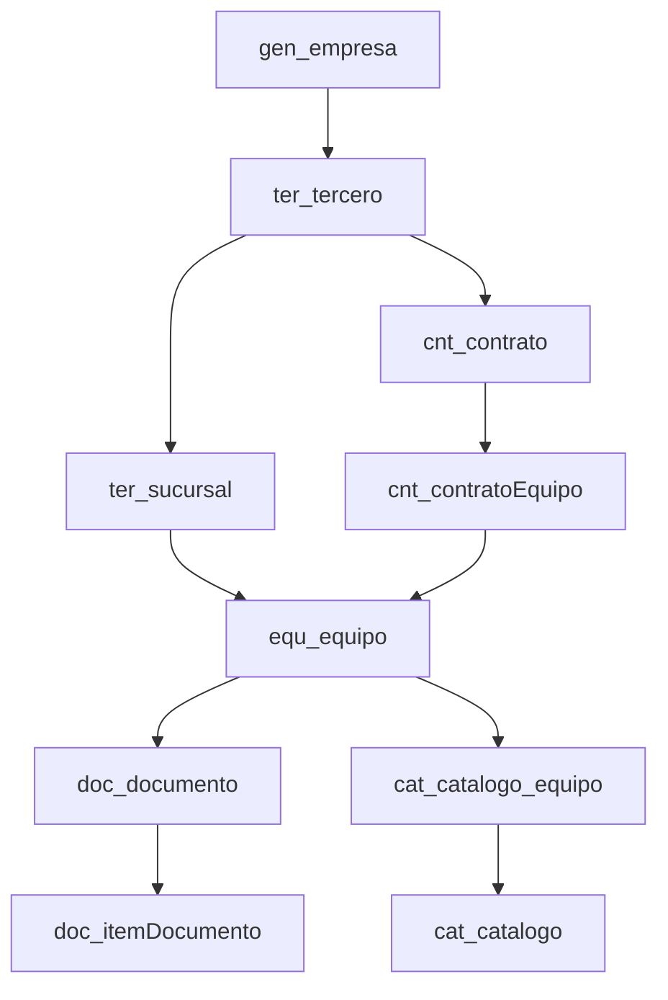

# Diccionario de Datos - Sistema SammNew

Este diccionario de datos documenta el esquema completo del sistema SAMM (Sistema de Administración de Mantenimiento Moderno).

## Resumen Ejecutivo

SAMM es un sistema de gestión de mantenimiento para operaciones de activos, postventa y alquiler, 100% en línea, compuesto de plataforma web y App para trabajo en campo logrando conectividad en tiempo real.

### Estadísticas

- **Total de tablas**: 270+ tablas
- **Módulos funcionales**: 12 módulos principales
- **Base de datos**: SQL Server

### Características Principales

- **Auditoría completa**: Todas las tablas incluyen campos `uid` (user ID) y `eid` (entity ID) para trazabilidad
- **Soft delete**: Campo `active` (bit) en todas las tablas para borrado lógico
- **Relaciones FK**: Campos que comienzan con `id_` representan relaciones de clave foránea
- **Primary keys**: Campo `id` (integer) como clave primaria en todas las tablas

## Módulos del Sistema

### 1. General / Configuración (gen_*)
Tablas maestras y de configuración del sistema.

**Tablas principales:**
- [gen_empresa](./general/gen_empresa) - Empresas y entidades organizacionales
- [gen_bodega](./general/gen_bodega) - Bodegas y almacenes
- [gen_zona](./general/gen_zona) - Zonas geográficas
- [gen_moneda](./general/gen_moneda) - Monedas
- [gen_impuesto](./general/gen_impuesto) - Impuestos y tasas
- [gen_unidad](./general/gen_unidad) - Unidades de medida
- [gen_tipoServicio](./general/gen_tipoServicio) - Tipos de servicio
- [gen_config](./general/gen_config) - Parámetros de configuración del sistema

### 2. Equipos (equ_*)
Gestión completa del ciclo de vida de equipos y activos.

**Tablas principales:**
- [equ_equipo](./equipos/equ_equipo) - Equipos (serial, ubicación, garantía, horómetro, costo)
- [equ_estadoEquipo](./equipos/equ_estadoEquipo) - Estados de equipos (activo, inactivo, mantenimiento)
- [equ_equipoAtributo](./equipos/equ_equipoAtributo) - Atributos personalizados de equipos
- [equ_falla](./equipos/equ_falla) - Registro de fallas
- [equ_tipoFalla](./equipos/equ_tipoFalla) - Catálogo de tipos de falla
- [equ_prestamo](./equipos/equ_prestamo) - Préstamos de equipos
- [equ_alquiler](./equipos/equ_alquiler) - Alquileres de equipos
- [equ_overhall](./equipos/equ_overhall) - Mantenimientos mayores

### 3. Contratos (cnt_*)
Administración de contratos de servicio y mantenimiento.

**Tablas principales:**
- [cnt_contrato](./contratos/cnt_contrato) - Contratos (fechas, montos, condiciones)
- [cnt_tipoContrato](./contratos/cnt_tipoContrato) - Tipos de contrato
- [cnt_contratoEquipo](./contratos/cnt_contratoEquipo) - Equipos asociados a contratos
- [cnt_visitaFija](./contratos/cnt_visitaFija) - Programación de visitas fijas
- [cnt_periodoContrato](./contratos/cnt_periodoContrato) - Períodos de facturación
- [cnt_pagosContrato](./contratos/cnt_pagosContrato) - Pagos de contratos
- [cnt_tiempoRespuesta](./contratos/cnt_tiempoRespuesta) - SLAs de tiempo de respuesta

### 4. Catálogo (cat_*)
Catálogo maestro de productos, repuestos, equipos y servicios.

**Tablas principales:**
- [cat_catalogo](./catalogo/cat_catalogo) - Catálogo maestro de items
- [cat_tipoCatalogo](./catalogo/cat_tipoCatalogo) - Tipos de catálogo (equipo, repuesto, servicio)
- [cat_catalogo_equipo](./catalogo/cat_catalogo_equipo) - Catálogo de equipos
- [cat_marca](./catalogo/cat_marca) - Marcas y fabricantes
- [cat_sistema](./catalogo/cat_sistema) - Sistemas de equipos
- [cat_atributo](./catalogo/cat_atributo) - Definiciones de atributos dinámicos
- [cat_seccionAtributo](./catalogo/cat_seccionAtributo) - Agrupaciones de atributos
- [cat_listaPrecio](./catalogo/cat_listaPrecio) - Listas de precios

### 5. Documentos (doc_*)
Sistema de gestión documental, órdenes, cotizaciones y flujos de trabajo.

**Tablas principales:**
- [doc_documento](./documentos/doc_documento) - Documentos maestros (facturas, OT, cotizaciones)
- [doc_tipoDocumento](./documentos/doc_tipoDocumento) - Tipos de documento
- [doc_subtipoDocumento](./documentos/doc_subtipoDocumento) - Subtipos de documento
- [doc_itemDocumento](./documentos/doc_itemDocumento) - Líneas de documento
- [doc_estadoTipoDocumento](./documentos/doc_estadoTipoDocumento) - Estados por tipo de documento
- [doc_flujoDocumento](./documentos/doc_flujoDocumento) - Flujos de trabajo
- [doc_pendienteDocumento](./documentos/doc_pendienteDocumento) - Tareas pendientes

### 6. Terceros (ter_*)
Gestión de clientes, proveedores y contactos.

**Tablas principales:**
- [ter_tercero](./terceros/ter_tercero) - Terceros (clientes, proveedores, fabricantes)
- [ter_naturalezaTercero](./terceros/ter_naturalezaTercero) - Tipos de tercero (persona, empresa)
- [ter_sucursal](./terceros/ter_sucursal) - Sucursales y locaciones
- [ter_contacto](./terceros/ter_contacto) - Contactos
- [ter_cargoContacto](./terceros/ter_cargoContacto) - Cargos de contactos
- [ter_estadoTercero](./terceros/ter_estadoTercero) - Estados de terceros

### 7. Órdenes de Trabajo (ort_*)
Programación y ejecución de órdenes de servicio.

**Tablas principales:**
- [ort_programacion](./ordenes/ort_programacion) - Programación de trabajos
- [ort_tipoProgramacion](./ordenes/ort_tipoProgramacion) - Tipos de programación
- [ort_reporteTecnico](./ordenes/ort_reporteTecnico) - Reportes técnicos de ejecución
- [ort_canalAtencion](./ordenes/ort_canalAtencion) - Canales de solicitud de servicio
- [ort_departamentoSolicitud](./ordenes/ort_departamentoSolicitud) - Departamentos solicitantes
- [ort_vale](./ordenes/ort_vale) - Vales de trabajo

### 8. Seguridad (seg_*)
Control de acceso, usuarios y perfiles.

**Tablas principales:**
- [seg_usuario](./seguridad/seg_usuario) - Usuarios del sistema
- [seg_perfil](./seguridad/seg_perfil) - Perfiles y roles
- [seg_cargo](./seguridad/seg_cargo) - Cargos laborales
- [seg_grupo](./seguridad/seg_grupo) - Grupos de usuarios
- [seg_sesion](./seguridad/seg_sesion) - Sesiones activas

### 9. Proyectos (pro_*)
Gestión de proyectos y actividades.

**Tablas principales:**
- [pro_actividad](./proyectos/pro_actividad) - Actividades de proyecto
- [pro_etapa](./proyectos/pro_etapa) - Etapas de proyecto
- [pro_entregable](./proyectos/pro_entregable) - Entregables
- [pro_recursoFisico](./proyectos/pro_recursoFisico) - Recursos físicos asignados
- [pro_ejecutores](./proyectos/pro_ejecutores) - Miembros del equipo
- [pro_hito](./proyectos/pro_hito) - Hitos del proyecto

### 10. Integración (syn_*)
Sincronización e integración con sistemas externos.

**Tablas principales:**
- [syn_puntoIntegracion](./integracion/syn_puntoIntegracion) - Puntos de integración/endpoints
- [syn_sistemaIntegrar](./integracion/syn_sistemaIntegrar) - Sistemas a integrar
- [syn_tipoAutenticacion](./integracion/syn_tipoAutenticacion) - Métodos de autenticación

### 11. Licencias (lic_*)
Gestión de licencias y parámetros del sistema.

**Tablas principales:**
- [lic_licencia](./licencias/lic_licencia) - Licencias
- [lic_parametro](./licencias/lic_parametro) - Parámetros de licencia
- [lic_licencia_parametro](./licencias/lic_licencia_parametro) - Valores de parámetros

### 12. Alquileres (alq_*)
Gestión de alquileres de equipos.

**Tablas principales:**
- [alq_tarifa](./alquileres/alq_tarifa) - Tarifas de alquiler
- [alq_tipoTarifa](./alquileres/alq_tipoTarifa) - Tipos de tarifa
- [alq_detalleLiquidacion](./alquileres/alq_detalleLiquidacion) - Detalles de liquidación
- [alq_historicoAlquiler](./alquileres/alq_historicoAlquiler) - Historial de alquileres

## Convenciones del Esquema

### Nomenclatura de Tablas
Las tablas siguen el patrón `[módulo]_[entidad]`:
- `gen_` = General/Configuración
- `equ_` = Equipos
- `cnt_` = Contratos
- `cat_` = Catálogo
- `doc_` = Documentos
- `ter_` = Terceros
- `ort_` = Órdenes de trabajo
- `seg_` = Seguridad
- `pro_` = Proyectos
- `syn_` = Integración (Synchronization)
- `lic_` = Licencias
- `alq_` = Alquileres

### Tipos de Datos
- **INTEGER**: Números enteros, usado para IDs y contadores
- **BIT**: Booleanos (0/1, true/false)
- **VARCHAR/NVARCHAR**: Cadenas de texto
- **DECIMAL/FLOAT**: Números decimales, montos, porcentajes
- **DATE**: Fechas sin hora
- **DATETIME**: Fechas con hora

### Campos Estándar
Todas las tablas incluyen estos campos:

| Campo | Tipo | Descripción |
|-------|------|-------------|
| `id` | INTEGER | Clave primaria, auto-incremental |
| `active` | BIT | Indica si el registro está activo (soft delete) |
| `id_usuario_creo` | INTEGER | ID del usuario que creó el registro |
| `id_usuario_modifico` | INTEGER | ID del usuario que modificó el registro |
| `fechaCreacion` | DATETIME | Fecha y hora de creación del registro |
| `fechaModificacion` | DATETIME | Fecha y hora de última modificación |
| `uid` | VARCHAR | User ID - Control multiempresa |
| `eid` | VARCHAR | Entity ID - Control multiempresa |

### Campos de Relación
- Los campos que comienzan con `id_` son claves foráneas
- Ejemplo: `id_empresa` referencia a la tabla `gen_empresa`
- Los campos `*_codigo` almacenan códigos alternativos de búsqueda

### Campos de Nomenclatura
La mayoría de tablas maestras incluyen:
- `[entidad]`: Nombre o descripción principal
- `[entidad]_codigo`: Código único alfanumérico

## Estructura de este Diccionario

Cada tabla está documentada en un archivo individual organizado por módulo. La documentación de cada tabla incluye:

1. **Descripción funcional**: Propósito de la tabla en el sistema
2. **Tabla de columnas**: Detalle de cada campo (nombre, tipo, nullable, clave, default, constraint)
3. **Relaciones**: Foreign keys que salen (referencias a otras tablas) y que entran (tablas que la referencian)
4. **Índices**: Índices definidos en la tabla (si aplica)

## Diagramas de Relaciones

### Relaciones Principales

### Flujo de Datos

1. **Configuración**: Se definen empresas, zonas, bodegas, monedas, impuestos
2. **Catálogo**: Se crea el catálogo de productos, repuestos y equipos
3. **Terceros**: Se registran clientes, proveedores y contactos
4. **Equipos**: Se registran los equipos de los clientes
5. **Contratos**: Se crean contratos asociando terceros y equipos
6. **Documentos**: Se generan cotizaciones, órdenes de compra, facturas
7. **Órdenes de Trabajo**: Se programan y ejecutan servicios
8. **Reportes Técnicos**: Se registra la ejecución y resultados

## Notas de Implementación

### Performance
- Índices en campos FK para optimizar consultas relacionales
- Soft delete (`active` bit) permite mantener historial sin afectar consultas activas

### Seguridad
- Campo `uid` y `eid` en todas las tablas para trazabilidad completa
- Control de acceso basado en perfiles (`seg_perfil`) y funcionalidades (`gui_funcionalidad`)
- Registro de sesiones en `seg_sesion` para auditoría de acceso

### Extensibilidad
- Sistema de atributos dinámicos (`cat_atributo`, `cat_seccionAtributo`) para personalización sin cambios de esquema
- Tablas de configuración (`gen_config`) para parámetros del sistema
- Sistema de flujos de trabajo configurable (`doc_flujoDocumento`, `doc_estadoTipoDocumento`)

## Referencias

- [Estructura del Proyecto](/docs/intro)
- [Guía de Desarrollo](/docs/sammnew/guia-desarrollo)
- [API Reference](/docs/sammnew/api-reference)

---

**Última actualización**: Mayo 2026  
**Sistema**: SammNew (SAMM - Sistema de Administración de Mantenimiento Moderno)  
**Total de tablas documentadas**: 270+
