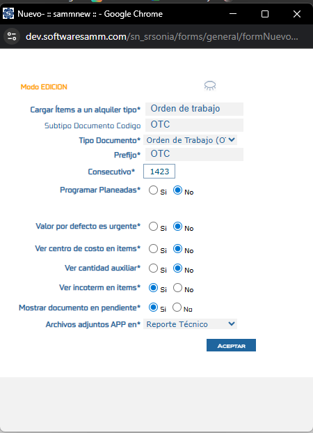

# Visualización de Incoterm en el Tab Detalle

Este documento describe cómo configurar y visualizar el campo incoterm en el tab detalle de documentos, permitiendo visualizar los términos de comercio internacional directamente en la planeación y detalle de los documentos.

## Referencias

- [SO-440: Agregar el campo incoterm a las opciones del tab detalle documento](https://softwaresamm.atlassian.net/browse/SO-440)

## Información de Versiones

### Versión de Lanzamiento

:::info **v7.1.10.8**
:::

### Versiones Requeridas

| Aplicación    | Versión Mínima | Descripción                           |
| ------------- | -------------- | ------------------------------------- |
| SAMMNEW       | >= 7.1.10.8    | Aplicación web principal              |
| SAMM LOGICA   | >= 5.6.23.4    | Lógica de negocio                     |
| BASE DE DATOS | >= C2.1.6.1    | Scripts de configuración de historial |

:::important Importante
Esta funcionalidad requiere las versiones mínimas especificadas. Verifique sus versiones actuales antes de continuar con la configuración.
:::

## Requisitos Previos

Antes de iniciar la configuración, asegúrese de tener:

- Acceso al módulo de configuración de subtipodocumento
- Permisos para modificar la configuración del tab detalle
- Conocimiento de la estructura de documentos en el sistema

:::note Nota
La configuración del campo incoterm debe realizarse a nivel de subtipodocumento para que se refleje correctamente en todos los documentos de ese tipo.
:::

## Configuración

### Paso 1: Habilitar el Parámetro en Subtipodocumento

En este paso debe garantizar que el subtipodocumento tenga activo el parámetro que permite visualizar el incoterm en los ítems del documento.

1. Acceda al módulo de configuración de subtipodocumento
2. Localice el parámetro **"Ver incoterm en items"**
3. Active el checkbox correspondiente

:::tip Consejo
Asegúrese de guardar los cambios después de activar el parámetro para que la configuración se aplique correctamente.
:::

### Paso 2: Configurar el Tab Detalle

Una vez habilitado el parámetro en el subtipodocumento, debe configurar el tab detalle para incluir el campo incoterm en la visualización.

1. Acceda a la configuración del tab detalle del documento
2. Localice el ítem **"Incoterm"** en la lista de campos disponibles
3. Marque el checkbox del ítem "Incoterm" para habilitarlo

:::important Importante
Ambos pasos son necesarios para que el campo incoterm se visualice correctamente. Si solo activa uno de los dos, la funcionalidad no estará completa.
:::

## Resultado Esperado

Una vez completada la configuración:

1. **Visualización en Planeación**: El campo incoterm se mostrará en la planeación del documento, permitiendo su selección y registro desde el inicio del proceso.

2. **Visualización en Tab Detalle**: Al navegar al tab detalle del documento, podrá visualizar el campo incoterm junto con los demás campos configurados, facilitando la consulta de los términos de comercio internacional asociados a cada ítem.

### Visualización en la Interfaz

El campo incoterm aparecerá integrado en la interfaz del documento, permitiendo una gestión completa de los términos de comercio internacional dentro del flujo normal de trabajo.

## Resolución de Problemas

### El campo incoterm no aparece en la planeación

Verifique que:

- El parámetro "Ver incoterm en items" esté activado en el subtipodocumento
- Haya guardado correctamente los cambios en la configuración
- La versión de SAMMNEW sea >= 7.1.10.8

### El campo incoterm no aparece en el tab detalle

Confirme que:

- El ítem "Incoterm" esté marcado en la configuración del tab detalle
- Haya actualizado la página después de realizar los cambios
- La configuración del subtipodocumento incluya el parámetro activado

### Los cambios no se reflejan en documentos existentes

Revise que:

- Los documentos correspondan al subtipodocumento configurado
- Haya cerrado y vuelto a abrir los documentos después de la configuración
- La caché del navegador esté actualizada