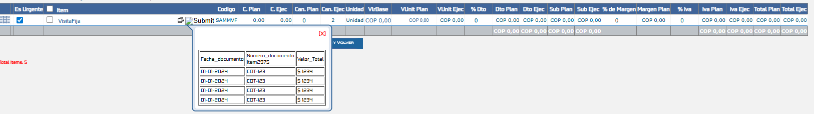
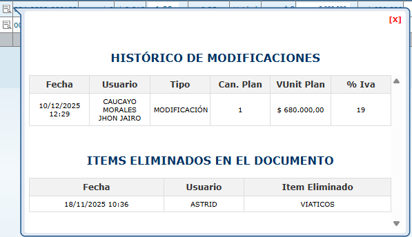
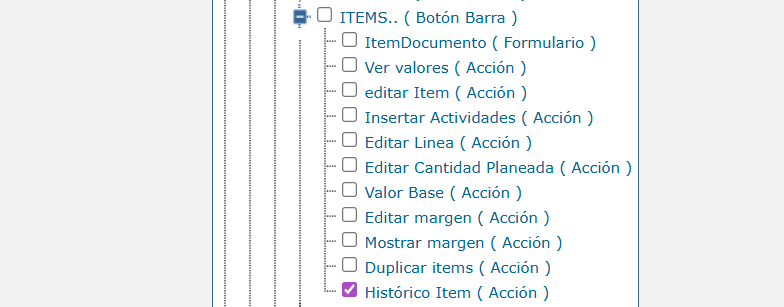

# Historial de Ítems en Documentos

Este documento describe cómo configurar y habilitar la funcionalidad de historial de ítems en la pantalla de ítems de documentos. Esta característica permite visualizar información histórica detallada de cada elemento cargado, incluyendo cambios previos, costos históricos y documentos relacionados, todo mediante un procedimiento almacenado personalizable.

## Referencias

- [SO-328: Configurar historial de ítems en pantalla ítems de documentos](https://softwaresamm.atlassian.net/browse/SO-328)

## Información de Versiones

### Versión de Lanzamiento

:::info **v7.1.10.6**
:::

### Versiones Requeridas

| Aplicación    | Versión Mínima | Descripción                           |
| ------------- | -------------- | ------------------------------------- |
| Base de Datos | >= 2.1.7.1     | Scripts de configuración de historial |

:::important Importante
Asegúrese de tener las versiones mínimas requeridas antes de iniciar la configuración.
:::

## Requisitos Previos

Antes de iniciar la configuración, asegúrese de tener:

- Permisos de administrador en el sistema
- Acceso a la base de datos del sistema con privilegios para crear procedimientos almacenados
- Acceso al repositorio SAMM.DBObjects en GitHub
- Conocimiento de los tipos de documento donde se habilitará la funcionalidad
- Comprensión básica de consultas SQL y procedimientos almacenados

:::tip Preparación
Identifique los tipos de documento (Órdenes de Trabajo, Cotizaciones, Órdenes de Compra, etc.) donde desea habilitar el historial de ítems antes de comenzar.
:::

## Configuración

### Paso 1: Habilitar Funcionalidad en el Sistema

Este paso habilita el permiso de "Historial de Documentos por Ítem" que aparecerá en todas las pantallas de ítems de documentos.

#### 1.1 Verificar Existencia de la Funcionalidad

Ejecute la siguiente consulta para verificar si la funcionalidad ya existe en la base de datos:

```sql title="Verificar existencia de la funcionalidad"
SELECT *
FROM gui_funcionalidad
WHERE nombrecontrol = 'historicoDocumento'
    AND active = 1;
```

:::tip Resultado Esperado
Si la consulta retorna un registro, la funcionalidad ya está creada. Si no retorna ningún registro, proceda con el paso 1.2.
:::

#### 1.2 Insertar Funcionalidad (si no existe)

Si la funcionalidad no existe, créela ejecutando el script del repositorio SAMM.DBObjects:

**Script:** [SAMM.DBObjects/SAMMAPI/Versions/Grupo2/2.1.0.1/SOL - 27062_2.sql](https://github.com/softwaresamm/SAMM.DBObjects/blob/develop/SAMM.DBObjects/SAMMAPI/Versions/Grupo2/2.1.0.1/SOL%20-%2027062_2.sql)

:::important Resultado
Una vez ejecutado el script, el permiso **"Historial de Documentos por Ítem"** estará disponible en todas las pantallas de ítems de documentos del sistema.
:::

### Paso 2: Configurar Contenido del Historial

Este paso crea el procedimiento almacenado que genera el contenido HTML del historial. El procedimiento es personalizable según las necesidades del cliente.

#### 2.1 Verificar Existencia del Procedimiento Almacenado

Ejecute la siguiente consulta para verificar si el procedimiento almacenado ya existe en la base de datos:

```sql title="Verificar existencia del procedimiento"
SELECT *
FROM sys.objects
WHERE name = 'historicoDocumento'
    AND type = 'P';
```

:::tip Resultado Esperado
Si la consulta retorna un registro con `type = 'P'` (Procedure), el procedimiento ya existe. Si no retorna registros, continúe con el paso 2.2.
:::

#### 2.2 Crear Procedimiento Almacenado (si no existe)

:::note Script Base
El repositorio SAMM.DBObjects contiene un procedimiento almacenado de ejemplo que puede adaptarse a las necesidades específicas del cliente.
:::

Si el procedimiento almacenado no existe, puede usar como base el script del repositorio:

**Script:** [SAMM.DBObjects/SAMMAPI/Versions/Grupo2/2.1.0.1/SOL - 27062.sql](https://github.com/softwaresamm/SAMM.DBObjects/blob/develop/SAMM.DBObjects/SAMMAPI/Versions/Grupo2/2.1.0.1/SOL%20-%2027062.sql)

:::warning Consideraciones de Rendimiento

- El procedimiento es **completamente personalizable** según las necesidades del cliente
- Entre más compleja sea la consulta, **mayor será el impacto en el rendimiento**
- Se recomienda optimizar las consultas y agregar índices apropiados
- Limite el número de registros retornados usando `TOP` en las consultas
  :::

#### 2.3 Ejemplo de Procedimiento Personalizado

A continuación se muestra un ejemplo completo de procedimiento almacenado personalizado:

:::note Ejemplo Personalizado
Este procedimiento está adaptado para un cliente específico que requiere mostrar:

- Último cambio del repuesto en equipos (para Órdenes de Trabajo)
- Histórico de modificaciones de ítems
- Ítems eliminados en el documento
- Histórico de costos (para Órdenes de Compra)
- Histórico de cotizaciones aprobadas (para Cotizaciones)

Adapte este código según las necesidades de su implementación.
:::

```sql title="Ejemplo de procedimiento almacenado personalizado"
CREATE PROCEDURE [dbo].[historicoDocumento]
	@p_id_itemDocumento VARCHAR(500)
AS
BEGIN
	SET NOCOUNT ON;

	DECLARE @id_documento INT;
	DECLARE @id_catalogo INT;
	DECLARE @id_item INT;
	DECLARE @id_tipodocumento INT;
	DECLARE @id_equipo INT;


	SELECT TOP (1)
		@id_documento = ITEM.id_documento,
		@id_catalogo = ITEM.id_catalogo,
		@id_item = ITEM.id,
		@id_tipodocumento = DOC.doc_subtipoDocumento_id_tipoDocumento,
		@id_equipo = OT.id_equipo
	FROM dbo.view_doc_itemDocumento as ITEM
	INNER JOIN dbo.view_doc_documento as DOC on DOC.id = ITEM.id_documento
	LEFT JOIN dbo.[doc_documento.ot] as OT on OT.id = DOC.id
	WHERE ITEM.id = CAST(@p_id_itemDocumento AS INT);

	-- ===========================================
	-- TABLAS TEMPORALES
	-- ===========================================

	DECLARE @ITEMEquipo TABLE (
	    Serial_Equipo VARCHAR (60),
		[Fecha Ultimo Cambio] VARCHAR(30),
		[No Documento] NVARCHAR(40),
		id_documento VARCHAR (MAX),
		Can_Eje int,
		Tercero VARCHAR (80)
	);

	DECLARE @ModifITEMTable TABLE (
		Fecha VARCHAR(30),
		Usuario NVARCHAR(40),
		Tipo VARCHAR(50),
		Can_Plan int,
		VUnit_Plan VARCHAR(100),
		Por_IVA int
	);

	DECLARE @ITEMelim TABLE (
		Fecha VARCHAR(30),
		Usuario NVARCHAR(40),
		Item_Elim VARCHAR(150)
	);

	DECLARE @HisCosto TABLE (
		Fecha VARCHAR(30),
		id_documento VARCHAR (MAX),
		Proveedor NVARCHAR(300),
		[No Documento] VARCHAR(250),
		CostoUnitario VARCHAR(30)
	);

	DECLARE @HisCoti TABLE (
	    Fecha VARCHAR(30),
		id_documento VARCHAR (MAX),
		[No Documento] VARCHAR(250),
		Estado VARCHAR (100),
		ValorPlaneado VARCHAR(30)
	);
	-- ===========================================
	-- DATOS: ULTIMO CAMBIO DEL ELEMENTO EN EL EQUIPO
	-- ===========================================
	INSERT INTO @ITEMEquipo
	SELECT TOP 1
	     E.equipo_serial,
		 convert (varchar, I.fechaCreacion, 103),
		 doc_documento_prefijo + '-' + CAST(doc_documento_documento_numero AS VARCHAR),
		 OT.id,
		 cantidadEjecutado,
		 T.tercero

	FROM view_doc_itemDocumento AS I
 	INNER JOIN dbo.[doc_documento.ot] AS OT ON OT.id = i.id_documento
	INNER JOIN equ_equipo AS E on E.id = OT.id_equipo
	INNER JOIN ter_tercero AS T on T.id = I.doc_documento_id_tercero_cliente
	WHERE I.cantidadEjecutado > 0
	AND I.active=1
	AND i.id_catalogo = @id_catalogo
	AND E.id = @id_equipo
	AND I.cat_catalogo_id_subtipoCatalogo in (3,4,15,16) -- APLICA SOLO PARA REPUESTOS
	AND OT.ID < @id_documento
	ORDER BY I.doc_documento_fecha_fh DESC

	-- ===========================================
	-- DATOS: HISTÓRICO DE MODIFICACIONES
	-- ===========================================
	INSERT INTO @ModifITEMTable
	SELECT
		CONVERT(varchar(10), [fecha], 103) + ' ' + LEFT(CONVERT(varchar(8), [fecha], 108), 5),
		[Usuario_modifico],
		[Tipo],
		[Can_Plan],
		FORMAT([VUnit_Plan], 'C', 'es-CO'),
		[Porcentaje_IVA]
	FROM [mod_Items]
	WHERE id = @id_item;

	-- ===========================================
	-- DATOS: ITEMS ELIMINADOS EN EL DOCUMENTO
	-- ===========================================
	INSERT INTO @ITEMelim
	SELECT
		CONVERT(varchar(10), i.fechaModificacion, 103) + ' ' + LEFT(CONVERT(varchar(8), i.fechaModificacion, 108), 5),
		u.usuario,
		i.itemDocumento
	FROM dbo.doc_itemDocumento AS i
	INNER JOIN seg_usuario AS u ON u.id = i.id_usuario_modifico
	WHERE i.active = 0
	  AND i.id_documento = @id_documento;

	-- ===========================================
	-- DATOS: HISTÓRICO DE COSTOS
	-- ===========================================
	INSERT INTO @HisCosto
	SELECT TOP 5
		convert (varchar, v_item.fechaCreacion, 103),
		convert (varchar,v_item.id_documento),
		ter_tercero.tercero,
		doc_documento_prefijo + '-' + CAST(doc_documento_documento_numero AS VARCHAR),
		FORMAT(valorUnitarioPlaneado, 'C', 'es-CO')
	FROM view_doc_itemdocumento AS v_item
	INNER JOIN ter_tercero
		ON ter_tercero.id = v_item.doc_documento_id_tercero_proveedor
	WHERE id_catalogo = @id_catalogo
		AND doc_documento_id_estadoTipoDocumento IN (35)
		AND doc_documento_id_subtipoDocumento IN (8,32,33,34)
	ORDER BY v_item.fechaCreacion DESC;

	-- ===========================================
	-- DATOS: HISTÓRICO DE COTIZACIONES APROBADAS
	-- ===========================================
	INSERT INTO @HisCoti
	SELECT TOP 5
		convert (varchar, v_item.fechaCreacion, 103),
		convert (varchar,v_item.id_documento),
		doc_documento_prefijo + '-' + CAST(doc_documento_documento_numero AS VARCHAR),
		(select top 1 estadoTipoDocumento from doc_estadoTipoDocumento where id = v_item.doc_documento_id_estadoTipoDocumento),
		FORMAT(valorUnitarioPlaneado, 'C', 'es-CO')
	FROM view_doc_itemdocumento AS v_item
	INNER JOIN ter_tercero
		ON ter_tercero.id = v_item.doc_documento_id_tercero_proveedor
	WHERE id_catalogo = @id_catalogo
		AND doc_documento_id_estadoTipoDocumento IN (24,73)
		AND doc_documento_id_subtipoDocumento IN (4,22)
	ORDER BY v_item.fechaCreacion DESC;

	-- ===========================================
	-- VARIABLES PARA CONSTRUIR HTML
	-- ===========================================
	DECLARE @HTML0 NVARCHAR(MAX) = '';
	DECLARE @HTML1 NVARCHAR(MAX) = '';
	DECLARE @HTML2 NVARCHAR(MAX) = '';
	DECLARE @HTML3 NVARCHAR(MAX) = '';
	DECLARE @HTML4 NVARCHAR(MAX) = '';
	DECLARE @HTMLFINAL NVARCHAR(MAX);

	-- ===========================================
	-- TABLA 0: ULTIMO CAMBIO DEL REPUESTO EN EL EQUIPO
	-- ===========================================
	IF EXISTS (SELECT 1 FROM @ITEMEquipo) and @id_tipodocumento=2 --> Solo muestra para ordenes de trabajo
	BEGIN
		SET @HTML0 = '<p style="text-align: center;font-size: 16px; color: #cc0000; font-weight: bold;">ULTIMO CAMBIO DEL REPUESTO EN EL EQUIPO</p>';
		SET @HTML0 += '<div class="table-container"><div style="display: block;max-height: 500px;overflow-y: scroll;width:540px;">'
        SET @HTML0 += '<table border="1" cellpadding="5" cellspacing="0" style="border-collapse: collapse; width: 100%; text-align: center; font-size: 12px; border-color:#ddd; table-layout: fixed;">';
		SET @HTML0 += '<thead><tr style="background-color: #f2f2f2; color: #333; font-weight: bold;">';
		SET @HTML0 += '<th>Serial Equipo</th><th>Fecha</th><th>No de OT</th><th>Can. Eje</th><th>Cliente</th></tr></thead><tbody>';

		DECLARE cur0 CURSOR FOR
		SELECT Serial_Equipo, [Fecha Ultimo Cambio], [No Documento], id_documento ,Can_Eje, Tercero
		FROM @ITEMEquipo;

		DECLARE @S NVARCHAR(60), @F NVARCHAR(50), @N NVARCHAR(100), @ID  NVARCHAR(max), @C NVARCHAR(50), @T NVARCHAR(50);
		OPEN cur0;
		FETCH NEXT FROM cur0 INTO @S, @F, @N, @ID, @C, @T;
		WHILE @@FETCH_STATUS = 0
		BEGIN
			SET @HTML0 += '<tr><td>' + ISNULL(@S,'')
						+ '</td><td>' + ISNULL(@F,'')
						+ '<td style="border:1px solid #ddd;"><a href="https://idae.softwaresamm.com/' + CASE WHEN DB_NAME() = 'sn_dev' THEN 'app_dev'
																								WHEN DB_NAME() = 'sn_test' THEN 'app_test'
																								WHEN DB_NAME() = 'sn_prod' THEN 'app_prod'
																								ELSE '' END
						+ '/forms/doc/doc_documento_ot.aspx?id=' + TRIM(isnull (@ID,0)) + '" target="_blank">' + TRIM(ISNULL(@N,'')) + '</td>'
						+ '</td><td>' + ISNULL(@C,'')
						+ '</td><td>' + ISNULL(@T,'') + '</td></tr>';
			FETCH NEXT FROM cur0 INTO @S, @F, @N, @ID, @C, @T;
		END
		CLOSE cur0;
		DEALLOCATE cur0;

		SET @HTML0 += '</tbody></table><br/><br/>';
	END
	ELSE
	BEGIN
		-- Mostrar tabla vacía si no hay registros
		SET @HTML0 =
		'';
	END;

	-- ===========================================
	-- TABLA 1: HISTÓRICO DE MODIFICACIONES OT
	-- ===========================================
	IF EXISTS (SELECT 1 FROM @ModifITEMTable) and @id_tipodocumento=2 --> Solo muestra para ordenes de trabajo
	BEGIN
		SET @HTML1 = '<p style="text-align: center;font-size: 16px; color: #003366; font-weight: bold;">HISTÓRICO DE MODIFICACIONES</p>';
		SET @HTML1 += '<div class="table-container"><div style="display: block;max-height: 500px;overflow-y: scroll;width:540px;">'
        SET @HTML1 += '<table border="1" cellpadding="5" cellspacing="0" style="border-collapse: collapse; width: 100%; text-align: center; font-size: 12px; border-color:#ddd; table-layout: fixed;">';
		SET @HTML1 += '<thead><tr style="background-color: #f2f2f2; color: #333; font-weight: bold;">';
		SET @HTML1 += '<th>Fecha</th><th>Usuario</th><th>Tipo</th><th>Can. Plan</th><th>VUnit Plan</th><th>% Iva</th></tr></thead><tbody>';

		DECLARE cur1 CURSOR FOR
		SELECT Fecha, Usuario, Tipo, Can_Plan, VUnit_Plan, Por_IVA
		FROM @ModifITEMTable;

		DECLARE @F1 NVARCHAR(50), @U1 NVARCHAR(50), @TM1 NVARCHAR(50), @CM1 NVARCHAR(50), @D1 NVARCHAR(100), @p1 NVARCHAR(50);
		OPEN cur1;
		FETCH NEXT FROM cur1 INTO @F1, @U1, @TM1, @CM1, @D1, @P1;
		WHILE @@FETCH_STATUS = 0
		BEGIN
			SET @HTML1 += '<tr><td>' + ISNULL(@F1,'') + '</td><td>' + ISNULL(@U1,'') + '</td><td>' + ISNULL(@TM1,'') + '</td><td>' + ISNULL(@CM1,'') + '</td><td>' + ISNULL(@D1,'') + '</td><td>' + ISNULL(@p1,'') + '</td></tr>';
			FETCH NEXT FROM cur1 INTO @F1, @U1, @TM1, @CM1, @D1, @P1;
		END
		CLOSE cur1;
		DEALLOCATE cur1;

		SET @HTML1 += '</tbody></table><br/><br/>';
	END
	ELSE
	BEGIN
		-- Mostrar tabla vacía si no hay registros
		SET @HTML1 =
		'';
	END;

	-- ===========================================
	-- TABLA 2: ITEMS ELIMINADOS EN EL DOCUMENTO
	-- ===========================================
	IF EXISTS (SELECT 1 FROM @ITEMelim) and @id_tipodocumento=2 --> Solo muestra para ordenes de trabajo
	BEGIN
		SET @HTML2 = '<p style="text-align: center;font-size: 16px; color: #003366; font-weight: bold;">ITEMS ELIMINADOS EN EL DOCUMENTO</p>';
		SET @HTML2 += '<table border="1" cellpadding="5" cellspacing="0" style="border-collapse: collapse; width: 100%; text-align: center;font-size: 12px;border-color:#ddd;">';
		SET @HTML2 += '<thead><tr style="background-color: #f2f2f2; color: #333; font-weight: bold;">';
		SET @HTML2 += '<th>Fecha</th><th>Usuario</th><th>Item Eliminado</th></tr></thead><tbody>';

		DECLARE cur2 CURSOR FOR
		SELECT Fecha, Usuario, Item_Elim
		FROM @ITEMelim;

		DECLARE @F3 NVARCHAR(30), @U3 NVARCHAR(40), @I3 NVARCHAR(50);
		OPEN cur2;
		FETCH NEXT FROM cur2 INTO @F3, @U3, @I3;
		WHILE @@FETCH_STATUS = 0
		BEGIN
			SET @HTML2 += '<tr><td>' + ISNULL(@F3,'') + '</td><td>' + ISNULL(@U3,'') + '</td><td>' + ISNULL(@I3,'') + '</td></tr>';
			FETCH NEXT FROM cur2 INTO @F3, @U3, @I3;
		END
		CLOSE cur2;
		DEALLOCATE cur2;

		SET @HTML2 += '</tbody></table><br/><br/>';
	END
	ELSE
	BEGIN
		SET @HTML2 = '';
	END;

	-- ===========================================
	-- TABLA 3: HISTÓRICO DE COSTOS
	-- ===========================================
	SET @HTML3 = '<p style="text-align: center;font-size: 16px;color: #003366; font-weight: bold;">HISTÓRICO DE COSTOS</p>';
	SET @HTML3 += '<table border="1" cellpadding="5" cellspacing="0" style="border-collapse: collapse; width: 100%; text-align: center;font-size: 12px;border-color:#ddd;">';
	SET @HTML3 += '<thead><tr style="background-color: #f2f2f2; color: #333; font-weight: bold;">';
	SET @HTML3 += '<th>Fecha</th><th>Proveedor</th><th>No Documento</th><th>Costo Unitario</th></tr></thead><tbody>';

	IF EXISTS (SELECT 1 FROM @HisCosto) AND @id_tipodocumento= 7  --> Solo se muestra para ordenes de compra
	BEGIN
		DECLARE cur3 CURSOR FOR
		SELECT Fecha, id_documento, Proveedor, [No Documento], CostoUnitario
		FROM @HisCosto;

		DECLARE @F2 NVARCHAR(30), @ID2  NVARCHAR(max), @P2 NVARCHAR(300), @N2 NVARCHAR(250), @C2 NVARCHAR(30);
		OPEN cur3;
		FETCH NEXT FROM cur3 INTO @F2, @ID2, @P2, @N2, @C2;
		WHILE @@FETCH_STATUS = 0
		BEGIN
			SET @HTML3 += '<tr><td>' + ISNULL(@F2,'')
			+ '</td><td>' + ISNULL(@P2,'')
			+ '<td style="border:1px solid #ddd;"><a href="https://idae.softwaresamm.com/' + CASE WHEN DB_NAME() = 'sn_dev' THEN 'app_dev'
																								WHEN DB_NAME() = 'sn_test' THEN 'app_test'
																								WHEN DB_NAME() = 'sn_prod' THEN 'app_prod'
																								ELSE '' END
			+ '/forms/doc/doc_documento_ordenCompra.aspx?id=' + TRIM(isnull (@ID2,0)) + '" target="_blank">' + TRIM(ISNULL(@N2,'')) + '</td>'
			+ '</td><td>' + ISNULL(@C2,'') + '</td></tr>';
			FETCH NEXT FROM cur3 INTO @F2, @ID2, @P2, @N2, @C2;
		END
		CLOSE cur3;
		DEALLOCATE cur3;

		SET @HTML3 += '</tbody></table><br/><br/>';
	END
	ELSE
	BEGIN
		SET @HTML3 = '';
	END;

	-- ===========================================
	-- TABLA 4: HISTÓRICO DE COTIZACIONES APROBADAS
	-- ===========================================

	SET @HTML4 = '<p style="text-align: center;font-size: 16px;color: #003366; font-weight: bold;">HISTÓRICO DE COTIZACIONES APR</p>';
	SET @HTML4 += '<table border="1" cellpadding="5" cellspacing="0" style="border-collapse: collapse; width: 100%; text-align: center;font-size: 12px;border-color:#ddd;">';
	SET @HTML4 += '<thead><tr style="background-color: #f2f2f2; color: #333; font-weight: bold;">';
	SET @HTML4 += '<th>Fecha</th><th>No Documento</th><th>Estado</th><th>Valor Planeado</th></tr></thead><tbody>';

	IF EXISTS (SELECT 1 FROM @HisCoti) AND @id_tipodocumento= 4 -- > Solo se muestra para cotizaciones
	BEGIN
		DECLARE cur4 CURSOR FOR
		SELECT Fecha, id_documento, [No Documento], Estado, ValorPlaneado
		FROM @HisCoti;

		DECLARE @F4 NVARCHAR(30), @ID4  NVARCHAR(max) , @N4 NVARCHAR(250), @E4 NVARCHAR(100), @V4 NVARCHAR(30);
		OPEN cur4;
		FETCH NEXT FROM cur4 INTO @F4, @ID4 , @N4, @E4, @V4;
		WHILE @@FETCH_STATUS = 0
		BEGIN
			SET @HTML4 += '<tr><td>' + ISNULL(@F4,'') +
			'<td style="border:1px solid #ddd;"><a href="https://idae.softwaresamm.com/' + CASE WHEN DB_NAME() = 'sn_dev' THEN 'app_dev'
																								WHEN DB_NAME() = 'sn_test' THEN 'app_test'
																								WHEN DB_NAME() = 'sn_prod' THEN 'app_prod'
																								ELSE '' END
			+ '/forms/doc/doc_documento_cotizacion.aspx?id=' + TRIM(isnull (@ID4,0)) + '" target="_blank">' + TRIM(ISNULL(@N4,'')) + '</td>' +
			+ '</td><td>' + ISNULL(@E4,'') + '</td><td>' + ISNULL(@V4,'') + '</td></tr>';
			FETCH NEXT FROM cur4 INTO @F4, @ID4 ,@N4, @E4, @V4;
		END
		CLOSE cur4;
		DEALLOCATE cur4;

		SET @HTML4 += '</tbody></table><br/><br/>';
	END
	ELSE
	BEGIN
		SET @HTML4 = '';
	END;
-- ===========================================
-- UNIR TODAS LAS TABLAS Y RETORNAR
-- ===========================================
SET @HTML0 = ISNULL(@HTML0, '');
SET @HTML1 = ISNULL(@HTML1, '');
SET @HTML2 = ISNULL(@HTML2, '');
SET @HTML3 = ISNULL(@HTML3, '');
SET @HTML4 = ISNULL(@HTML4, '');
SET @HTMLFINAL = @HTML0 + @HTML1 + @HTML2 + @HTML3 + @HTML4;

SELECT @HTMLFINAL AS resumen;

END
```

### Paso 3: Uso de la Funcionalidad

:::tip Acceso a la Funcionalidad
Una vez completada la configuración, el botón de historial aparecerá automáticamente en todas las pantallas de ítems de documentos donde el usuario tenga el permiso habilitado.
:::

#### Cómo Acceder al Historial

1. Abra cualquier documento que contenga ítems (Orden de Trabajo, Cotización, Orden de Compra, etc.)
2. En la grilla de ítems, localice el botón de historial junto a la descripción del ítem
3. Haga clic en el botón para abrir el modal de historial
4. Se mostrará una ventana modal con toda la información generada por el procedimiento almacenado

:::note Rendimiento
La información se carga dinámicamente cada vez que se abre el modal, asegurando que siempre se muestre la información más actualizada.
:::

## Resultado Esperado

Una vez completada la configuración:

1. El botón de historial aparecerá junto a cada ítem en las pantallas de documentos
2. Al hacer clic en el botón, se abrirá un modal con el historial detallado
3. La información mostrada dependerá del contenido del procedimiento almacenado personalizado
4. El modal se cerrará al hacer clic en el botón de cerrar

### Visualización Estándar

Vista del historial con configuración básica del sistema:



### Visualización Personalizada

Vista del historial con procedimiento almacenado personalizado mostrando múltiples secciones:



### Visualizacion del Permiso
en le formulario Configuracion - Seguridad - Perfil en el tab de permisos de acuerdo  a la configuracion hecha en Hijo funcionalidad se visualizara  de la siguiente Manera:




## Resolución de Problemas

### El botón de historial no aparece

:::warning Verificación Requerida
Asegúrese de que el usuario tenga el permiso asignado y que la funcionalidad esté activa en `gui_funcionalidad`.
:::

Verifique que:

- La funcionalidad `historicoDocumento` existe en la tabla `gui_funcionalidad` con `active = 1`
- El usuario tiene el permiso asignado en su perfil
- La versión de SAMMNEW es >= 7.1.10.6
- La caché de la aplicación se haya refrescado

### El modal aparece vacío o con error

Confirme que:

- El procedimiento almacenado `historicoDocumento` existe en la base de datos
- El procedimiento retorna un campo llamado `resumen` con contenido HTML
- No hay errores de sintaxis SQL en el procedimiento
- Las tablas referenciadas en el procedimiento existen y tienen datos
- Los permisos de ejecución del procedimiento están correctamente configurados

### El historial se carga muy lento

Revise que:

- Las consultas dentro del procedimiento estén optimizadas
- Se estén usando cláusulas `TOP` para limitar los resultados
- Existan índices apropiados en las tablas consultadas
- No se estén haciendo consultas recursivas o muy complejas
- Considere reducir la cantidad de información mostrada
