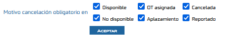

# Parametrización de Obligatoriedad en Motivos de Cancelación

Este documento describe cómo configurar la obligatoriedad del campo **motivo** en las programaciones dentro de Samm New, permitiendo definir para cuáles de los seis tipos de programación el sistema debe exigir su registro al crear en el caso de las **no disponibilidades** o editar una programación a una fecha futura. Anteriormente no existía control granular sobre este comportamiento, lo que impedía estandarizar la trazabilidad de los cambios realizados sobre las programaciones.

## Referencias

- [SO-730: SOL-33106 - Parametrización de Obligatoriedad en motivos de cancelación](https://softwaresamm.atlassian.net/browse/SO-730)

## Información de Versiones

### Versión de Lanzamiento

:::info **v7.1.14.2**
:::

### Versiones Requeridas

| Aplicación    | Versión Mínima | Descripción         |
| ------------- | --------------- | -------------------- |
| SAMMAPI       | >= 1.2.31.0     | API principal         |
| SAMM LOGICA   | >= 5.6.26.3     | Lógica de negocio     |
| SAMM CORE     | >= 2.0.25.0     | Core del sistema      |
| CAPA DE DATOS | >= 2.1.15.3     | Capa de acceso a datos |
| BASE DE DATOS | >= C2.1.15.3    | Base de datos          |

## Requisitos Previos

Antes de iniciar la configuración, asegúrese de tener:

- Acceso al módulo `Configuración` → `Aplicación` → `Parámetros Generales` en Samm New
- Permisos de administración sobre los Parámetros Generales del sistema

:::important Importante
Verifique que todos los componentes cumplan con las versiones mínimas indicadas en la tabla anterior antes de habilitar esta configuración, ya que versiones inferiores pueden no mostrar la sección correspondiente.
:::

## Información del Servicio

No aplica para esta funcionalidad.

## Configuración

### Paso 1: Activar o desactivar la obligatoriedad del motivo por tipo de programación

Este paso permite definir en cuáles de los seis tipos de programación el sistema exigirá el registro de un motivo al momento de crear en el caso de las **no disponibilidades** o editar una programación a una fecha futura.

1. Ingrese a `Configuración` → `Aplicación` → `Parámetros Generales`.
2. Diríjase al tab **OTS**.
3. Ubique la sección **"Motivo cancelación obligatorio en"**.
4. Encontrará los siguientes seis tipos de programación disponibles para marcar:
   - `Disponible`
   - `No disponible`
   - `OT asignada`
   - `Aplazamiento`
   - `Cancelada`
   - `Reportado`
5. Marque los checkboxes correspondientes a los tipos de programación en los cuales desea que el sistema exija el registro de un motivo al crear en el caso de las **no disponibilidades** o editar la programación a una fecha futura.
6. Guarde los cambios realizados en Parámetros Generales.

:::tip Consejo
Puede combinar varios tipos de programación como obligatorios simultáneamente. Por ejemplo, active la obligatoriedad tanto para `Cancelada` como para `Aplazamiento` si su proceso requiere trazabilidad en ambos escenarios.
:::

## Casos Especiales

No aplica para esta funcionalidad.

## Resultado Esperado

Una vez completada la configuración:

1. **Obligatoriedad activa**: Al crear en el caso de las **no disponibilidades** o editar una programación a una fecha futura cuyo estado corresponda a un tipo marcado en "Motivo cancelación obligatorio en", el sistema exigirá el registro de un motivo antes de permitir guardar los cambios.
2. **Obligatoriedad inactiva**: Para los tipos de programación no marcados, el campo `motivo` permanecerá opcional.
3. **Persistencia de la configuración**: Los cambios realizados en Parámetros Generales se mantendrán activos para todos los usuarios del sistema hasta que sean modificados nuevamente.

### Vista de Configuración

Video de apoyo https://youtu.be/RzMo4p8DflI
## Resolución de Problemas

### El campo motivo no se solicita como obligatorio a pesar de haber marcado el tipo de programación

Verifique que:

- Los cambios hayan sido guardados correctamente en Parámetros Generales
- El checkbox correspondiente al tipo de programación esté efectivamente marcado
- La sesión del usuario haya sido refrescada tras el cambio (cerrar e iniciar sesión nuevamente)

### No se visualiza la sección "Motivo cancelación obligatorio en"

Confirme que:

- Todos los componentes cumplan con las versiones mínimas requeridas (`samm_logica`, `sammapi`, `samm core`, `capa de datos`, `base de datos`)
- El usuario cuenta con permisos de administración sobre Parámetros Generales

