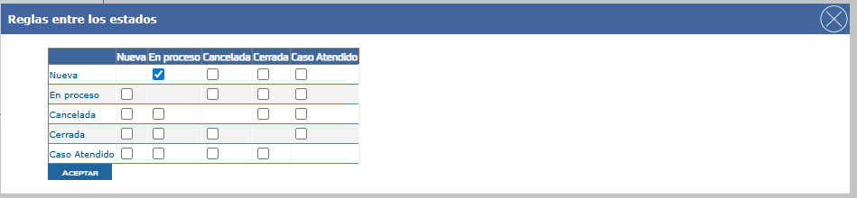

# Validar mensaje por ausencia de cambios de estado en matriz según parámetro gen_config

Este documento describe cómo validar el mensaje que se presenta cuando no existen cambios de estado disponibles en la matriz de la solicitud, controlando su comportamiento según la existencia y configuración del parámetro definido en gen_config.

---

## Referencias

-[SO-423: Controlar mensaje al no tener cambios de estados en la matriz de la solicitud y este creado el parametro en gen_config](https://softwaresamm.atlassian.net/browse/SO-423)


## Información de Versiones

### Versión de Lanzamiento

:::info **v 7.1.11.2**

### Versiones Requeridas

| Aplicación | Versión Mínima | Descripción |
| ---------- | -------------- | ----------- |
| NO aplica  |                |             |


## Requisitos Previos

Antes de iniciar la configuración, asegúrese de tener:

- Usuario superadministrador como consultor
- Acceso a la base de datos del sistema
- Configuración previa de matriz de estados para el tipo de solicitud correspondiente
- Conocimiento de los IDs de los estados que desea habilitar

:::tip Preparación
Se recomienda tener una lista de los estados que desea habilitar antes de comenzar la configuración para agilizar el proceso.
:::

## Configuración

### Paso 1: Configurar Matriz de Estados

1. Acceda al módulo de configuración de matriz de estados
   
2. Seleccione el **subtipo de documento** deseado (debe ser del tipo **solicitud**)
3. Configure los cambios de estado permitidos para este subtipo
4. Los **estados destino** configurados en este paso serán los que se validaran en la configuración de gen_config

:::tip
Los estados destino que configure en la matriz determinarán las opciones que verán los usuarios al reportar atención en una solicitud y de ser necesario se requiera seleccionar un cambio de estado.
:::

### Paso 2: Configurar estados en gen_config

#### 2.1 Verificar Existencia del Parámetro

Ejecute la siguiente consulta para verificar si el parámetro ya existe en la base de datos:

```sql title="Verificar existencia del parámetro"
SELECT *
FROM gen_config
WHERE config = 'estadosReportarAtencionObligatorios';
```

:::tip Consejo
En la columna valor se dejara los IDs de los estados que se requieran visualizar para el cambio de estado del documento]
:::

#### 2.2 Actualizar Parámetro (si ya existe)

:::warning Precaución
Al actualizar los IDs, asegúrese de que correspondan a estados válidos configurados en la matriz de estados. IDs inexistentes causarán errores en la aplicación.
:::

Si necesita actualizar los IDs de estados permitidos:

```sql title="Actualizar parámetro existente"
UPDATE gen_config
SET valor = '1,2,3' -- Reemplace con los IDs correspondientes
WHERE config = 'estadosReportarAtencionObligatorios';

