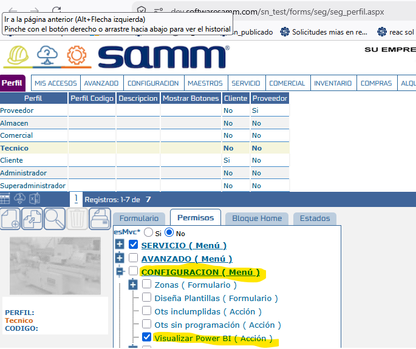
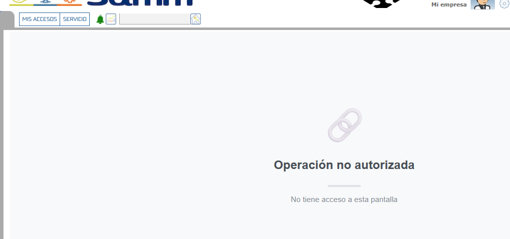
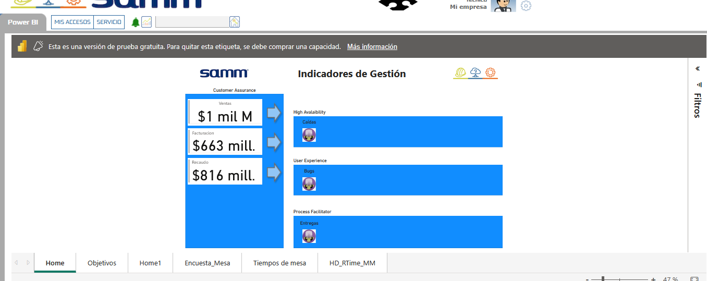

# Permiso Visualizar Power BI

Este documento describe cómo configurar la restricción de acceso a los indicadores de Power BI en el sistema. Anteriormente, estos indicadores eran accesibles para cualquier usuario sin ninguna restricción; con esta nueva funcionalidad, se implementa un permiso específico para controlar de manera segura qué usuarios pueden visualizar y acceder a los reportes configurados.

## Referencias

- [SO-2184: Restringir por permisos el acceso al botón de reportes Power BI](https://softwaresamm.atlassian.net/browse/SO-2184)
- [Documentación Relacionada: Autenticación SAMM PBI](https://softwaresamm.github.io/IDAE.Docs/docs/sammnew/autenticacion-samm-pbi)

## Información de Versiones

### Versión de Lanzamiento

:::info **v7.1.19.0**
:::

### Versiones Requeridas

| Aplicación    | Versión Mínima | Descripción       |
| ------------- | -------------- | ----------------- |
| SAMMNEW       | >= 7.1.19.0    | Aplicación web    |
| SAMM LOGICA   | >= 5.6.27.0    | Lógica de negocio |
| CAPA DATOS    | >= 2.1.19.0    | Capa de datos     |
| SAMM CORE     | >= 2.0.28.0    | Core del sistema  |
| SAMMAPI       | >= 1.2.34.0    | API principal     |
| BASE DE DATOS | >= C2.1.19.0   | Base de datos     |

## Requisitos Previos

No aplica para esta funcionalidad.

## Información del Servicio

No aplica para esta funcionalidad.

## Configuración

### Paso 1: Validar y asignar el permiso

Para restringir o permitir el acceso a los indicadores de Power BI, es necesario habilitar la opción correspondiente desde la configuración de Perfil y permisos.

1. Diríjase al menú de configuración del sistema.
2. Navegue hasta la sección del árbol de permisos.
3. Busque y habilite el permiso llamado `Visualizar Power BI ( Acción )` para los perfiles  que requieran el acceso.

:::tip Consejo
Para comprender cómo configurar los indicadores que este permiso habilitará, consulte la [documentación de Autenticación SAMM PBI](https://softwaresamm.github.io/IDAE.Docs/docs/sammnew/autenticacion-samm-pbi).
:::

## Casos Especiales

No aplica para esta funcionalidad.

## Resultado Esperado

Una vez completada la configuración:

1. **Acceso restringido**: El botón y los indicadores de Power BI dejarán de ser de libre acceso en el sistema.

2. **Visualización controlada**: Únicamente los usuarios que tengan el permiso `Visualizar Power BI ( Acción )` habilitado en su rol podrán visualizar y utilizar los reportes de Power BI.

## Resolución de Problemas

### El botón de Power BI sigue siendo visible para usuarios sin el permiso

Verifique que:
- El usuario afectado no tenga asignado otro rol secundario (o perfil de superadministrador) que posea el permiso `Visualizar Power BI ( Acción )` habilitado.
- El usuario haya cerrado su sesión y vuelto a ingresar para limpiar la caché de permisos en el navegador.

### No se encuentra el permiso en el árbol de configuración

Confirme que:
- Su base de datos haya sido actualizada correctamente a la versión mínima requerida (Base de datos >= C2.1.19.0).
- Todos los scripts de migración asociados a esta versión se hayan ejecutado exitosamente.

## Errores Conocidos

No aplica para esta funcionalidad.

## QA — Pruebas

Para validar la correcta implementación del permiso, ejecute los siguientes escenarios de prueba:

### Escenario 1: Validación de acceso permitido
1. Inicie sesión con un usuario administrador.
2. Asigne el permiso `Visualizar Power BI ( Acción )` al rol del "Usuario A".
3. Inicie sesión en otra sesión con el "Usuario A".
4. Navegue a la vista correspondiente de reportes/indicadores.
5. **Resultado esperado**: El botón o acceso a Power BI debe mostrarse correctamente y permitir la visualización.

### Escenario 2: Validación de restricción de acceso (comportamiento por defecto)
1. Inicie sesión con un usuario administrador.
2. Retire el permiso `Visualizar Power BI ( Acción )` del rol del "Usuario B" (o asegúrese de que un rol nuevo no lo tenga).
3. Inicie sesión en otra sesión con el "Usuario B".
4. Navegue a la misma vista de reportes/indicadores.
5. **Resultado esperado**: El sistema debe bloquear el acceso, ocultando el botón o la sección de indicadores de Power BI para el usuario.