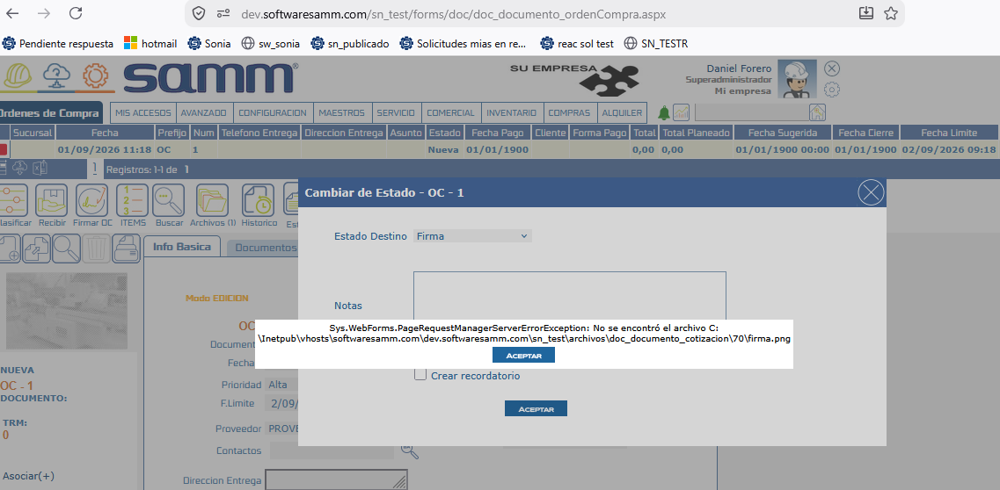

# Firma en Documentos — Replicar Firma Adjunta en el Documento

Este documento describe cómo configurar la funcionalidad de **Firma en Documentos** para que, mediante un cambio de estado, cualquier tipo de documento quede marcado como firmado utilizando el archivo adjunto `firma.png`, permitiendo replicar el comportamiento de una firma manual sin necesidad de ejecutarla directamente. Anteriormente era obligatorio firmar el documento de forma manual para que el registro apareciera en la tabla `gen_firma`; con esta configuración basta con adjuntar la firma como archivo para que el sistema la asocie automáticamente al documento correspondiente.

## Referencias

- [SO-2094: Replicar firma adjunta en la solicitud](https://softwaresamm.atlassian.net/browse/SO-2094)

## Información de Versiones

### Versión de Lanzamiento

:::info **v7.1.16.0**
:::

### Versiones Requeridas

| Aplicación | Versión Mínima | Descripción |
| --- | --- | --- |
| SAMMNEW | >= 7.1.16.0 | Aplicación web (SAMM New) |
| SAMMAPI | >= 1.2.32.0 | API principal |
| SAMM LOGICA | >= 5.6.26.5 | Lógica de negocio |
| SAMM CORE | >= 2.0.26.0 | Core del sistema |
| CAPA DATOS | >= 2.1.17.0 | Capa de acceso a datos |
| BASE DE DATOS | >= C2.1.17.0 | Base de datos |

## Requisitos Previos

No aplica para esta funcionalidad.

## Información del Servicio

No aplica para esta funcionalidad.

## Configuración

### Paso 1: Validación de `web.config`

En el archivo `web.config` del sitio **SN** se debe garantizar la existencia de la key `imgAsSign`, cuyo valor determina sobre qué tipo de documento aplicará el proceso de firma. El valor varía según el tipo de documento a configurar, siguiendo el patrón `[tabla_del_documento]-FIR`.

```xml title="web.config — ejemplo para Solicitud"
<add key="imgAsSign" value="doc_documento_solicitud-FIR" />
```

Este comportamiento aplica para cualquiera de los siguientes tipos de documento, ajustando el valor de la key según corresponda:

| Tipo de Documento | Valor de referencia |
| --- | --- |
| Solicitud | `doc_documento_solicitud-FIR` |
| Orden de Trabajo (OT) | `doc_documento_ot-FIR` |
| Requisición | `doc_documento_requisicion-FIR` |
| Cotización (Documento comercial) | `doc_documento_cotizacion-FIR` |
| Entrada | `doc_documento_entrada-FIR` |
| Salida | `doc_documento_salida-FIR` |
| Orden Compra | `doc_documento_ordencompra-FIR` |
| Traslado | `doc_documento_traslado-FIR` |
| Alquiler | `doc_documento_alquiler-FIR` |
| Proyecto | `doc_documento_proyecto-FIR` |
| Gasto | `doc_documento_gasto-FIR` |

:::note
Los nombres de tabla anteriores son de referencia según la convención `doc_documento_[tipo]`. Verifique el nombre real de la tabla asociada al tipo de documento antes de configurar la key.
:::

:::important Importante
La llave es unica no se puede repetir ya que el sistema solo tendra en cuenta la ultima llave de abajo hacia arriba.
:::
### Paso 2: Crear estado con código `FIR` en el tipo de documento

Se debe crear un **estado** cuyo código sea `FIR` en el tipo de documento correspondiente. Este código le indica al sistema que, al llegar a ese estado, debe ejecutarse el proceso de inserción del registro en la tabla `gen_firma`.

:::important Importante
El código del estado debe ser exactamente `FIR`. Si el código difiere, el sistema no ejecutará el proceso de inserción en `gen_firma`.
:::

### Paso 3: Garantizar el flujo de estados

Una vez creado el estado `FIR`, se debe configurar el **flujo de estados** correspondiente para el momento en que se desea que la firma quede registrada en `gen_firma`.

:::tip Consejo
Este paso debe repetirse por cada **subtipo** existente del documento en el que se desee habilitar este comportamiento; el flujo no se hereda automáticamente entre subtipos.
:::

### Paso 4: Adjuntar la firma en el documento

Para cada documento en el que se quiera aplicar este comportamiento, es necesario adjuntar el archivo de firma con el nombre exacto `firma.png`.

:::warning
El nombre del archivo adjunto debe ser exactamente `firma.png`. Un nombre distinto impedirá que el sistema lo reconozca como la firma a replicar.
:::

### Paso 5: Realizar el cambio de estado

Con toda la configuración anterior completa, se procede a realizar el **cambio de estado** del documento al estado `FIR`. A nivel de base de datos, se generará un nuevo registro en `gen_firma` con las siguientes características:

- `firma_codigo`: contendrá el valor `replica`
- `tabla`: corresponderá a la tabla configurada en el `web.config` (ej. `doc_documento_solicitud`, `doc_documento_ot`, etc.)
- `idobjeto`: corresponderá al `id` del documento firmado

```sql title="Verificación del registro insertado en gen_firma"
SELECT *
FROM gen_firma
WHERE tabla = @tablaDocumento
  AND idobjeto = @idDocumento
  AND firma_codigo = 'replica';
```

## Casos Especiales

:::note Comportamientos Predefinidos
Esta funcionalidad se puede habilitar de forma independiente por cada tipo de documento, según la key configurada en el `web.config`.
:::

| Caso | Campo/Valor | Descripción |
| --- | --- | --- |
| Múltiples tipos de documento | `imgAsSign` | Puede configurarse una key por cada tipo de documento (Solicitud, OT, Requisición, Cotización, Entrada, Salida, Orden Compra, Traslado, Alquiler, Proyecto, Gasto) para habilitar la firma en cada uno de forma independiente |

## Resultado Esperado

Una vez completada la configuración:

1. **Registro automático en `gen_firma`**: al cambiar el estado del documento hacia el código `FIR`, el sistema inserta automáticamente un registro con `firma_codigo = 'replica'`, la `tabla` correspondiente al tipo de documento configurado, e `idobjeto` igual al `id` del documento.
2. **Visualización como firma manual**: el documento se muestra como firmado, visualizando `firma.png` como si correspondiera a una firma realizada de forma manual.
3. **Comportamiento consistente por tipo y subtipo**: el proceso se replica en cada tipo de documento y subtipo donde se haya configurado la key `imgAsSign` y el flujo de estados con el código `FIR`.

## Resolución de Problemas

### No se genera el registro en `gen_firma` al cambiar de estado

Verifique que:

- La key `imgAsSign` exista en el `web.config` del sitio SN
- El valor de la key corresponda a la tabla correcta del tipo de documento (`[tabla_del_documento]-FIR`)
- El sitio haya sido reiniciado o recargado tras el cambio en `web.config`

### El cambio de estado no dispara el proceso de firma

Confirme que:

- El código del estado sea exactamente `FIR` (sin espacios ni variaciones)
- El estado `FIR` pertenezca al tipo de documento correcto
- El estado genera un error



- Valide la llave en el archivo web.config

### La firma no aparece en un subtipo específico

Revise que:

- El flujo de estados haya sido configurado para ese subtipo en particular
- El estado `FIR` esté incluido en la ruta del flujo hacia donde se está transicionando

### El sistema no reconoce el archivo como firma

Confirme que:

- El archivo adjunto se llame exactamente `firma.png`
- El archivo esté adjunto en el documento correcto antes de ejecutar el cambio de estado

### La firma se aplica al tipo de documento equivocado

Verifique que:

- El valor configurado en `imgAsSign` corresponda a la tabla del tipo de documento que se desea firmar, y no a otro tipo de documento configurado previamente

## Errores Conocidos

No aplica para esta funcionalidad.

## QA — Pruebas

:::tip Consejo
Verificar cada escenario tanto a nivel visual (documento marcado como firmado) como a nivel de base de datos (registro en `gen_firma`), y repetir para al menos dos tipos de documento distintos.
:::

**Escenario 1 — Flujo exitoso en Solicitud**

1. Con `imgAsSign` configurado como `doc_documento_solicitud-FIR`, adjuntar `firma.png` a una Solicitud.
2. Realizar el cambio de estado hacia el código `FIR` configurado en el flujo del subtipo correspondiente.
3. **Resultado esperado:** se crea un registro en `gen_firma` con `firma_codigo = 'replica'`, `tabla = 'doc_documento_solicitud'` e `idobjeto` igual al `id` de la Solicitud; el documento se visualiza como firmado.

**Escenario 2 — Flujo exitoso en otro tipo de documento (ej. Orden de Trabajo)**

1. Con `imgAsSign` configurado como `doc_documento_ot-FIR`, adjuntar `firma.png` a una Orden de Trabajo.
2. Realizar el cambio de estado hacia el código `FIR`.
3. **Resultado esperado:** se crea un registro en `gen_firma` con `tabla = 'doc_documento_ot'` e `idobjeto` igual al `id` de la OT; el documento se visualiza como firmado.

**Escenario 3 — Archivo adjunto con nombre incorrecto**

1. Adjuntar un archivo de firma con un nombre distinto a `firma.png` (por ejemplo `firma1.png`).
2. Realizar el cambio de estado hacia el código `FIR`.
3. **Resultado esperado:** el sistema no genera el registro en `gen_firma`, dado que no reconoce el archivo como la firma válida.

**Escenario 4 — Subtipo sin flujo de estados configurado**

1. Sobre un subtipo de documento donde el flujo de estados no fue configurado con el código `FIR`, adjuntar `firma.png` y realizar el cambio de estado.
2. **Resultado esperado:** no se inserta el registro en `gen_firma`, ya que el flujo de ese subtipo no contempla el proceso de firma.