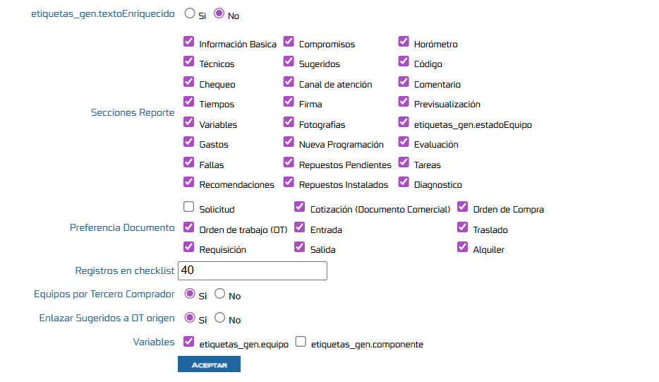
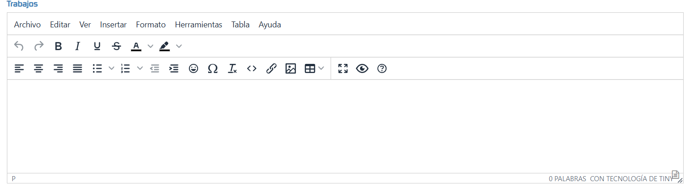
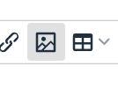
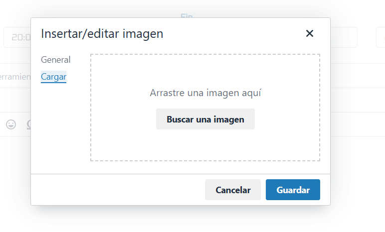
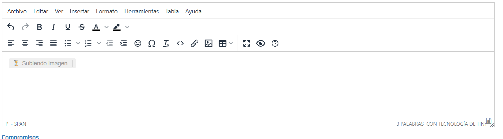
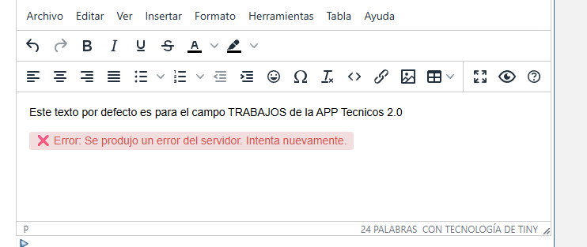

# Configuración del Texto Enriquecido

Este documento describe cómo configurar la funcionalidad del Texto Enriquecido

## Referencias
- [SO-53: Creación de componente para texto enriquecido (reporte clasico y reporte dinámico)](https://softwaresamm.atlassian.net/browse/SO-53)

- [SO-315: Crear parametro general para controlar si se usara componente de Texto Enriquecido)](https://softwaresamm.atlassian.net/browse/SO-315)


- [SO-323: Aplicar restricción de caracteres y obligatoriedad](https://softwaresamm.atlassian.net/browse/SO-324)
- [SO-324: Manejo de imagenes en Texto enriquecido](https://softwaresamm.atlassian.net/browse/SO-324)

## Información de Versiones

### Versión de Lanzamiento

:::info **v7.1.10.8**
:::

### Versiones Requeridas

| Aplicación | Versión Mínima | Descripción |
| ---------- | -------------- | ----------- |
| SAMMAPI    | >= 1.2.19.6     | API principal |

## Requisitos Previos

Antes de iniciar la configuración, asegúrese de tener:

- Permisos de administrador en el sistema
- Acceso a la base de datos del sistema


## Configuración

### Paso 1: Configurar Texto Enriquecido

1. Acceda al módulo de configuración - Aplicacion - Parametros Generales
2. Seleccione el  tab **OTS**
3. Encontraras un campo llamado **Texto Enriquecido**


:::tip
Por defecto este parametro se encontrara en no
:::



### Paso 2: Configurar Parámetros Generales

#### 2.1 Verificar Existencia del Parámetro

Ejecute la siguiente consulta para verificar si el parámetro ya existe en la base de datos:

```sql title="Verificar existencia del parámetro"
SELECT *
FROM gen_config
WHERE config = 'textoEnriquecido';
```
```sql title="Verificar existencia de la columnas de texto enriquecido"
SELECT  top 1 trabajos_enriquecido, recomendaciones_enriquecido, compromisos_enriquecido, diagnostico_enriquecido
FROM  ort_reporteTecnico ;
```
```sql title="Verificar existencia de la columnas en _columnas"
SELECT *
FROM  _columnas
Where tabla = 'ort_reporteTecnico' and Columnas in ('trabajos_enriquecido', 'recomendaciones_enriquecido', 'compromisos_enriquecido', 'diagnostico_enriquecido') ;
```

#### 2.2 Insertar Parámetro y columnas si no existe (si no existe)

Si el parámetro no existe, créelo con la siguiente instrucción del repositorio SAMM.DBObjects:

**Agregar Columnas de texto enriquecido a la tabla ort_reporteTecnico**

[SAMMAPI\Versions\Grupo2\2.1.4.1\SO_53_1.sql](https://github.com/softwaresamm/SAMM.DBObjects/blob/develop/SAMM.DBObjects/SAMMAPI/Versions/Grupo2/2.1.4.1/SO_53_1.sql)

[SAMMAPI\Versions\Grupo2\2.1.4.1\SO_53_2.sql](https://github.com/softwaresamm/SAMM.DBObjects/blob/develop/SAMM.DBObjects/SAMMAPI/Versions/Grupo2/2.1.4.1/SO_53_2.sql)

**Agregar Parametro de Texto Enriquecido**

[SAMMAPI\Versions\Grupo2\2.1.4.2\SO_315_1.sql](https://github.com/softwaresamm/SAMM.DBObjects/blob/develop/SAMM.DBObjects/SAMMAPI/Versions/Grupo2/2.1.4.2/SO_315_1.sql)

[SAMMAPI\Versions\Grupo2\2.1.4.3\SO_315_1.sql](https://github.com/softwaresamm/SAMM.DBObjects/blob/develop/SAMM.DBObjects/SAMMAPI/Versions/Grupo2/2.1.4.2/SO_315_1.sql)


### Valores del Parámetro

| Campo    | Valor                                 | Descripción                                                |
| -------- | ------------------------------------- | ---------------------------------------------------------- |
| `config` | `textoEnriquecido` | Nombre del parámetro de configuración                      |
| `modulo` | `ots`                               | Módulo al que pertenece la configuración                   |
| `valor`  | 0 o 1           | Valores correspondientes a Si (1) o No (0)


## Resultado Esperado

:::note Comportamiento del Sistema
Estos cambios afectarán a todos los usuarios que reporten en los modos de reporte clasico o dinamico 
:::

Una vez completada la configuración, al reportar la orden de trabajo por el modo dinamico y clasico:

- los campos  **Trabajos , Recomendaciones, Compromiso y diagnostico** aparecerá un componente de Barra de Herramientas para dar estilo al texto.



- Solo se mostrarán en los campos  ya mencionados anteriormente 

- Para Agregar imagenes en los campos que cuenta con el texto enriquecido  se puede realizar cargando desde el boton de imagen 



- En el cual se abrira un pop up para el cargue de la imagen, en el cual se dara clic en la sección de cargar,

    

- Tambien se puede realizar la acción de copiar y pegar la imagen lo cual se visualizara de la siguiente manera,

    


- en el cual se puede visualizara de la siguiente manera 
   


## Resolución de Problemas

### No permite el cargue de la imagenes 

si al momento de realiza un cargue de las imagenes en los campos de texto enriquecido se visualiza de esta manera 




Confirme que:

- abrir la opcion de inspeccionar en el navegador 

- Cargue nuevamente la imagen 

- El endpoint llamado  `api/util/adjuntos/subir/archivoTemporal` si genera un status diferente al 200, validar el sammapi que se encuentre activo consumiendo otros endpoints y el endpoint mencionado anteriormente, para validar la novedad.


