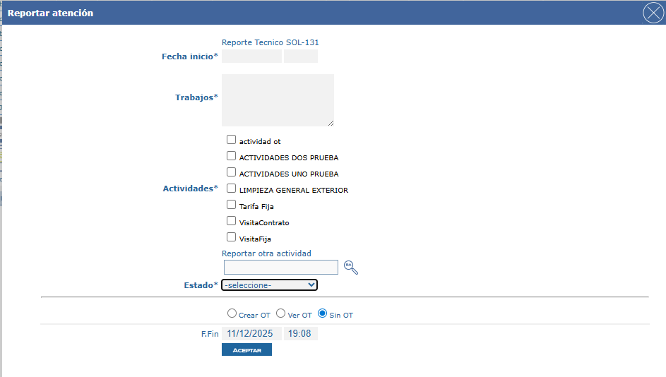

# Configuración de Estados al Reportar Atención

Este documento describe cómo configurar el cambio de estado de las solicitudes dentro del modal de reporte de atención, permitiendo establecer si el campo de estado será obligatorio y qué estados destino estarán disponibles para selección.

## Referencias

- [SO-266: Permitir que el estado de la solicitud sea obligatorio al reportar atención](https://softwaresamm.atlassian.net/browse/SO-266)

## Requisitos Previos

Antes de iniciar la configuración, asegúrese de tener:

- Permisos de administrador en el sistema
- Acceso a la base de datos del sistema
- Configuración previa de matriz de estados para el tipo de solicitud correspondiente
- Conocimiento de los IDs de los estados que desea habilitar

:::tip Preparación
Se recomienda tener una lista de los estados que desea habilitar antes de comenzar la configuración para agilizar el proceso.
:::

## Configuración

### Paso 1: Configurar Matriz de Estados

1. Acceda al módulo de configuración de matriz de estados
2. Seleccione el **subtipo de documento** deseado (debe ser del tipo **solicitud**)
3. Configure los cambios de estado permitidos para este subtipo
4. Los **estados destino** configurados en este paso serán los que aparecerán disponibles en el modal de reportar atención

:::tip
Los estados destino que configure en la matriz determinarán las opciones que verán los usuarios al reportar atención en una solicitud.
:::


### Paso 2: Configurar Parámetros Generales

#### 2.1 Verificar Existencia del Parámetro

Ejecute la siguiente consulta para verificar si el parámetro ya existe en la base de datos:

```sql title="Verificar existencia del parámetro"
SELECT *
FROM gen_config
WHERE config = 'estadosReportarAtencionObligatorios';
```

#### 2.2 Insertar Parámetro (si no existe)

Si el parámetro no existe, créelo con la siguiente instrucción del repositorio SAMM.DBObjects:

[SAMMAPI\Versions\Grupo2\2.1.6.1\4_SO_266.sql](https://github.com/softwaresamm/SAMM.DBObjects/blob/develop/SAMM.DBObjects/SAMMAPI/Versions/Grupo2/2.1.6.1/4_SO_266.sql)

#### 2.3 Actualizar Parámetro (si ya existe)

:::warning Precaución
Al actualizar los IDs, asegúrese de que correspondan a estados válidos configurados en la matriz de estados. IDs inexistentes causarán errores en la aplicación.
:::

Si necesita actualizar los IDs de estados permitidos:

```sql title="Actualizar parámetro existente"
UPDATE gen_config
SET valor = '1,2,3' -- Reemplace con los IDs correspondientes
WHERE config = 'estadosReportarAtencionObligatorios';
```

### Valores del Parámetro

| Campo    | Valor                                 | Descripción                                                |
| -------- | ------------------------------------- | ---------------------------------------------------------- |
| `config` | `estadosReportarAtencionObligatorios` | Nombre del parámetro de configuración                      |
| `modulo` | `otros`                               | Módulo al que pertenece la configuración                   |
| `valor`  | IDs separados por comas               | IDs de la tabla `doc_estadoTipoDocumento_subtipoDocumento` |

:::important Importante
El campo `valor` debe contener los IDs de los registros de la tabla `doc_estadoTipoDocumento_subtipoDocumento`, separados por comas (ejemplo: `1,2,3,5`). El valor de la columna `id_estadoTipoDocumento_destino` de estos registros determinará qué estados aparecen en el dropdown del modal de reporte.
:::

## Resultado Esperado

:::note Comportamiento del Sistema
Estos cambios afectarán a todos los usuarios que reporten atención en solicitudes del tipo configurado.
:::

Una vez completada la configuración, al reportar atención en una solicitud:

- El campo de **estado** aparecerá como **obligatorio**
- Solo se mostrarán los estados destino configurados en el dropdown
- Los usuarios deberán seleccionar un estado antes de completar el reporte



## Resolución de Problemas

### El dropdown de estados aparece vacío

Verifique que:

- Los IDs en el parámetro `valor` correspondan a registros existentes en `doc_estadoTipoDocumento_subtipoDocumento`
- La matriz de estados esté correctamente configurada para el subtipo de documento
- Los estados destino estén activos en el sistema

### El campo de estado no es obligatorio

Confirme que:

- El parámetro `estadosReportarAtencionObligatorios` existe en la tabla `gen_config`
- El campo `valor` contenga al menos un ID válido
- La aplicación se haya reiniciado después de aplicar los cambios (si aplica)

## Notas Adicionales

- Los cambios en la configuración pueden requerir reiniciar la aplicación para que surtan efecto
- Se recomienda probar la configuración en un ambiente de pruebas antes de aplicarla en producción
- Mantenga un registro de los IDs de estados configurados para futuras referencias
- Documente cualquier cambio realizado en la matriz de estados para trazabilidad
