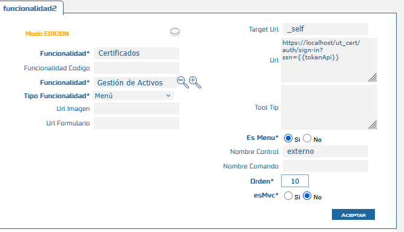
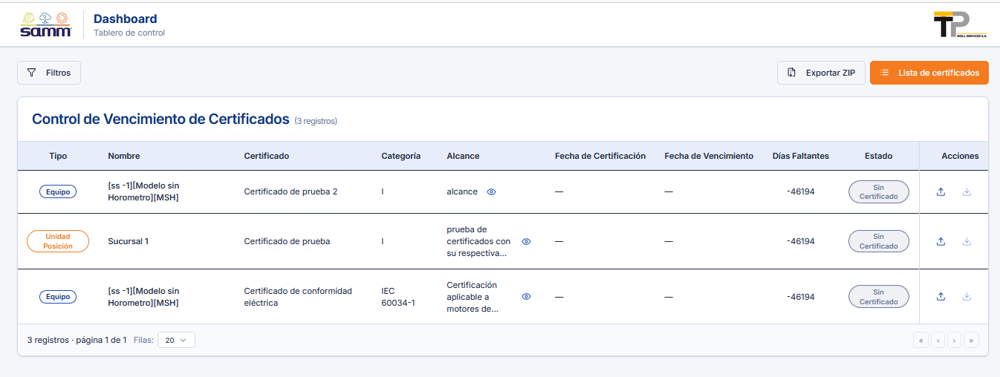

# Utilitario Certificados

El **Utilitario Certificados** es una nueva ventana dentro del módulo **Samm New** que permite almacenar y centralizar los certificados asociados a un activo (equipo) o a una sucursal. La funcionalidad gestiona atributos como tipo, nombre, categoría, alcance, vigencia, fechas de emisión y vencimiento, estándares aplicables y observaciones, permitiendo llevar un control estructurado y centralizado de la información de certificación.

Antes de esta funcionalidad, no existía un espacio dedicado para registrar y consultar de forma centralizada los certificados vinculados a equipos o sucursales, lo que dificultaba su trazabilidad y control de vigencia.

## Referencias

- [SO-734: Guardado de certificados válidos](https://softwaresamm.atlassian.net/browse/SO-734)

## Información de Versiones

:::info
Esta funcionalidad requiere las siguientes versiones mínimas para operar correctamente.
:::

| Componente     | Versión mínima |
| -------------- | -------------- |
| Samm New       | 7.1.14.0       |
| samm_logica    | 5.6.26.1       |
| capadatos      | 2.1.15.1       |
| recursos       | -              |
| Base de Datos  | C2.1.15.1      |
| samcore        | 2.0.24.1       |
| SAMMAPI        | 1.2.30.1       |

## Requisitos Previos

No aplica para esta funcionalidad. No se requieren permisos especiales, accesos ni conocimientos previos no estándar.

## Información del Servicio

No aplica para esta funcionalidad.

## Configuración

Esta ventana de certificados no requiere configuración previa por parte del usuario final. Basta con tener la funcionalidad desplegada e instalada correctamente. Los pasos son los siguientes:

### 1. Despliegue por parte de Alta Disponibilidad

El equipo de Alta Disponibilidad debe realizar el despliegue de la funcionalidad en el ambiente correspondiente, incluyendo la instalación del recurso `utilcertificados`.

### 2. Validar existencia de la funcionalidad

Confirmar que la funcionalidad `certificados` fue desplegado correctamente y se encuentra disponible en el ambiente.




### 3. Validar el acceso desde el menú

Verificar que la ruta de navegación **Servicio → Equipo → Certificados** direccione correctamente a la ventana de Dashboard. 



Ver video de como se ingresa https://youtu.be/5tpZyEU6ico

:::tip
Si el menú no direcciona correctamente, revisar la funcionalidad `certificados` esté correctamente apuntado en el cuadro de url y que la versión de Samm New instalada sea igual o superior a `7.1.14.0`.
:::

## Casos Especiales

No aplica para esta funcionalidad.

## Resultado Esperado

- El usuario puede acceder a la ventana de **Certificados** desde la ruta **Servicio → Equipo → Certificados**.
- El usuario puede registrar un certificado asociado a un **equipo** o a una **sucursal**, completando los campos: tipo, nombre, certificado, categoría, alcance, vigencia, fecha de certificado, fecha de vencimiento, estándares aplicables y observaciones.
- Los certificados guardados quedan **centralizados** y disponibles para consulta posterior, permitiendo el control de vigencia y trazabilidad.

## Resolución de Problemas

| Problema | Posible causa | Solución |
| --- | --- | --- |
| El menú **Servicio → Equipo → Certificados** no aparece o no direcciona correctamente | El recurso `utilcertificados` no fue desplegado o no está registrado en el menú | Validar con Alta Disponibilidad que el despliegue del recurso `utilcertificados` se haya completado |
| La ventana de certificados no carga | Versión de Samm New inferior a la mínima requerida | Verificar que la versión instalada de Samm New sea `>= 7.1.14.0` y que los componentes dependientes (samm_logica, capadatos, samcore, SAMMAPI) cumplan la versión mínima |
| No se puede guardar un certificado | Campos obligatorios incompletos o falta de asociación a equipo/sucursal | Confirmar que el certificado esté asociado a un activo (equipo) o a una sucursal antes de guardar |

## Errores Conocidos

No aplica para esta funcionalidad.

## QA — Pruebas

### Escenario 1: Registro de certificado asociado a un equipo

```gherkin
Característica: Gestión de certificados en Samm New

  Escenario: Guardar un certificado válido asociado a un equipo
    Dado que el usuario navega a "Servicio > Equipo > Certificados"
    Y selecciona un equipo existente
    Cuando completa los campos tipo, nombre, certificado, categoría, alcance, vigencia,
      fecha de certificado, fecha de vencimiento, estándares aplicables y observaciones
    Y guarda el certificado
    Entonces el certificado queda registrado y asociado al equipo seleccionado
    Y el certificado es visible en la lista centralizada de certificados del equipo
```

### Escenario 2: Registro de certificado asociado a una sucursal

```gherkin
Característica: Gestión de certificados en Samm New

  Escenario: Guardar un certificado válido asociado a una sucursal
    Dado que el usuario navega a "Servicio > Equipo > Certificados"
    Y selecciona una sucursal existente
    Cuando completa los campos obligatorios del certificado
    Y guarda el certificado
    Entonces el certificado queda registrado y asociado a la sucursal seleccionada
    Y la fecha de vencimiento se refleja correctamente en el registro guardado
```

### Escenario 3: Validación de acceso al menú

```gherkin
Característica: Navegación a la ventana de certificados

  Escenario: Acceso correcto desde el menú de servicio
    Dado que el usuario tiene instalada la versión "7.1.14.0" o superior de Samm New
    Cuando navega a "Servicio > Equipo > Certificados"
    Entonces el sistema direcciona correctamente a la ventana de gestión de certificados

```
