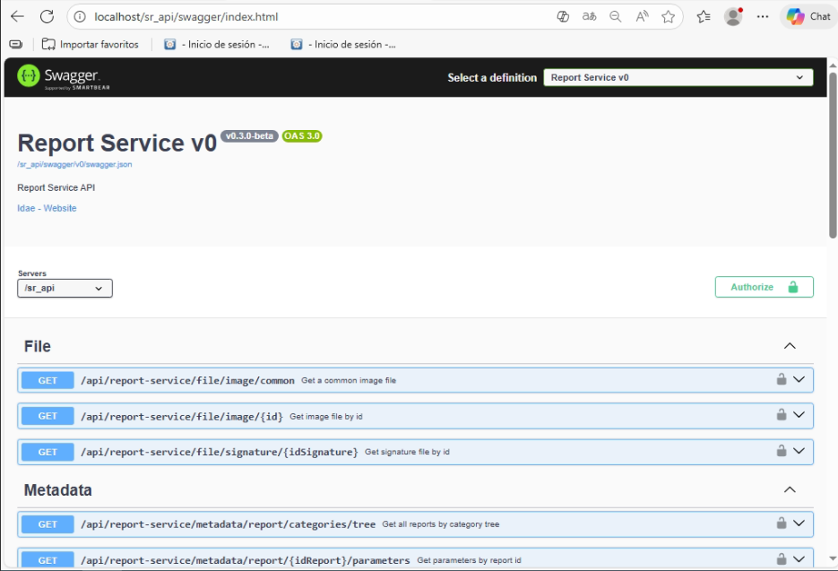
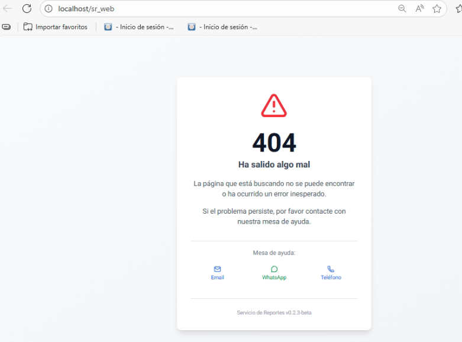
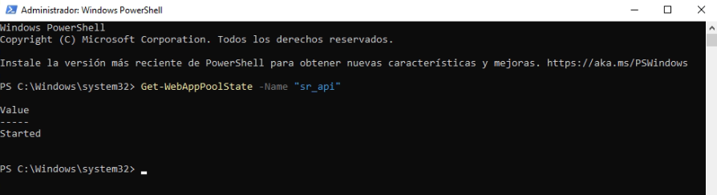
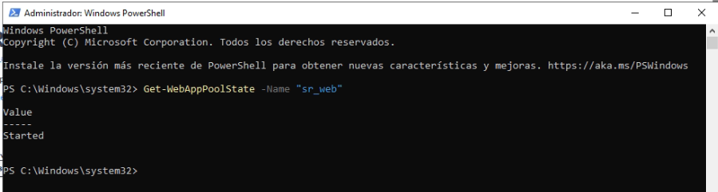

### Versiones Requeridas

| Aplicación    | Versión Mínima | Descripción                           |
| ------------- | -------------- | ------------------------------------- |
| SAMMNEW       | >= 7.1.10.9    | Aplicación web principal              |
| SAMM LOGICA   | >= 5.6.23.4    | Lógica de negocio                     |
| BASE DE DATOS | >= C2.1.6.1    | Scripts de configuración de historial |

## Requisitos Previos
Antes de iniciar la configuración, asegúrese de tener:

### 1. Windows Server con IIS instalado

- Windows Server 2019 o superior
- Windows 10/11 también funciona para pruebas
- Report services instalado: https://www.microsoft.com/en-us/download/details.aspx?id=104502&msockid=064b61102bd46bce203a75fc2a6a6a9f
- Windows Server con IIS

### 2. Instalar IIS con las características necesarias

Ejecutar como Administrador en PowerShell:

```powershell
# Habilitar IIS con todas las características necesarias
Enable-WindowsOptionalFeature -Online -FeatureName IIS-WebServerRole
Enable-WindowsOptionalFeature -Online -FeatureName IIS-WebServer
Enable-WindowsOptionalFeature -Online -FeatureName IIS-CommonHttpFeatures
Enable-WindowsOptionalFeature -Online -FeatureName IIS-HttpErrors
Enable-WindowsOptionalFeature -Online -FeatureName IIS-HttpRedirect
Enable-WindowsOptionalFeature -Online -FeatureName IIS-ApplicationDevelopment
Enable-WindowsOptionalFeature -Online -FeatureName IIS-NetFxExtensibility45
Enable-WindowsOptionalFeature -Online -FeatureName IIS-HealthAndDiagnostics
Enable-WindowsOptionalFeature -Online -FeatureName IIS-HttpLogging
Enable-WindowsOptionalFeature -Online -FeatureName IIS-LoggingLibraries
Enable-WindowsOptionalFeature -Online -FeatureName IIS-RequestMonitor
Enable-WindowsOptionalFeature -Online -FeatureName IIS-HttpTracing
Enable-WindowsOptionalFeature -Online -FeatureName IIS-Security
Enable-WindowsOptionalFeature -Online -FeatureName IIS-RequestFiltering
Enable-WindowsOptionalFeature -Online -FeatureName IIS-Performance
Enable-WindowsOptionalFeature -Online -FeatureName IIS-WebServerManagementTools
Enable-WindowsOptionalFeature -Online -FeatureName IIS-IIS6ManagementCompatibility
Enable-WindowsOptionalFeature -Online -FeatureName IIS-Metabase
Enable-WindowsOptionalFeature -Online -FeatureName IIS-ManagementConsole
Enable-WindowsOptionalFeature -Online -FeatureName IIS-BasicAuthentication
Enable-WindowsOptionalFeature -Online -FeatureName IIS-WindowsAuthentication
Enable-WindowsOptionalFeature -Online -FeatureName IIS-StaticContent
Enable-WindowsOptionalFeature -Online -FeatureName IIS-DefaultDocument
Enable-WindowsOptionalFeature -Online -FeatureName IIS-DirectoryBrowsing
Enable-WindowsOptionalFeature -Online -FeatureName IIS-ISAPIExtensions
Enable-WindowsOptionalFeature -Online -FeatureName IIS-ISAPIFilter
Enable-WindowsOptionalFeature -Online -FeatureName IIS-HttpCompressionStatic
Enable-WindowsOptionalFeature -Online -FeatureName IIS-ASPNET45
```

### 3. Instalar Node.js v20 LTS (64-bit)

```powershell
# Opción 1: Con winget
winget install OpenJS.NodeJS.LTS

# Opción 2: Descargar desde https://nodejs.org/
# IMPORTANTE: Instalar versión 64-bit LTS (v20.x.x)
```

**Verificar instalación:**

```powershell
node -version o node - v # Debe mostrar v20.x.x

npm -version 
```

### 4. Instalar ASP.NET Core Hosting Bundle 8.0

**CRÍTICO**: Este módulo es el que permite que IIS ejecute Node.js

```powershell
# Descargar e instalar ASP.NET Core Hosting Bundle 8.0
# URL: https://dotnet.microsoft.com/download/dotnet/8.0
# Buscar: "Hosting Bundle" para Windows
```

Después de instalar, **REINICIAR EL SERVIDOR** o ejecutar:

```powershell
net stop was /y
net start w3svc
```

**Verificar instalación:**

```powershell
# Buscar el módulo en IIS
Get-WebGlobalModule | Where-Object { $_.Name -like '*AspNetCore*' }
```

Debe mostrar: `AspNetCoreModuleV2`

### 5. Instalar URL Rewrite Module (Opcional pero recomendado)

```powershell
# Descargar desde: https://www.iis.net/downloads/microsoft/url-rewrite
# Instalar el MSI
```

### 6. ❌ NO instalar iisnode

**iisnode v0.2.26 (última versión de 2017) NO funciona con Node.js v20**. Usaremos AspNetCore Module V2 en su lugar.

### 7. Scripts de instalación automatizados

Los scripts de instalación están en:

```
IDAE.UTIL.ReportService.Container\iis\
├── sr_api_iis_install.ps1   (Instala backend)
└── sr_web_iis_install.ps1   (Instala frontend)
```
**¿Qué hacen estos scripts?**

- ✅ Crean carpetas en `C:\Samm\sr_api` y `C:\Samm\sr_web`
- ✅ Copian archivos desde `Downloads`
- ✅ Crean Application Pools en IIS
- ✅ Crean aplicaciones web bajo Default Web Site
- ✅ Configuran permisos automáticamente
- ✅ Inician las aplicaciones
- ✅ Verifican que funcionan correctamente

### 8. Carpetas compiladas

De parte de desarrollo se deben recibir las carpetas de `sr_api` y `sr_web` 

### 9. Estructura de carpetas en el servidor (opcional y puede cambiar segun estructura del cliente)

```
C:\Samm\
├── sr_api\                           # Backend .NET 8.0 WebAPI
│   ├── web.config                    # Configuración IIS para .NET
│   ├── appsettings.Production.json   # Configuración producción
│   ├── Idae.Util.ReportService.Backend.WebApi.dll
│   └── ...
│
└── sr_web\                           # Frontend Next.js 15
    ├── iis-server.js                 # ⭐ Wrapper para AspNetCore Module (CRÍTICO)
    ├── server.js                     # Servidor Next.js standalone
    ├── web.config                    # ⭐ Configuración IIS para Node.js (CRÍTICO)
    ├── .env.production               # Variables de entorno
    ├── package.json                  # Dependencias
    ├── .next\                        # Build de Next.js
    │   ├── static\                   # Assets compilados
    │   └── standalone\               # Archivos standalone
    ├── public\                       # Assets estáticos
    ├── node_modules\                 # Dependencias empaquetadas
    └── logs\                         # ⭐ Logs de AspNetCore Module
        └── stdout_*.log              # Logs de Node.js/Next.js
```

 


# Despliegue de IDAE Report Service en IIS - Guía Completa


## 📋 Descripción

Esta guía detalla el despliegue del **Backend** (.NET 8 WebAPI) y **Frontend** (Next.js 15) en IIS usando scripts automatizados. El proceso está dividido en dos roles:

- **👨‍💻 Desarrollador**: Compila las aplicaciones usando scripts de build
- **👨‍🔧 Usuario/Administrador**: Instala las aplicaciones en IIS usando scripts de instalación

## ⚠️ IMPORTANTE: Este despliegue NO usa iisnode

**iisnode v0.2.26 NO es compatible con Node.js v20**. Esta guía usa **AspNetCore Module V2** como reverse proxy, que es el mismo módulo que usa el backend .NET y funciona correctamente con Node.js moderno.

---

## 🚀 Inicio Rápido (Para usuarios que reciben las carpetas compiladas)

Si recibes las carpetas `sr_api` y `sr_web` ya compiladas:

1. **Copia las carpetas a `Downloads`:**

   - `C:\Users\TuUsuario\Downloads\sr_api` (Backend)
   - `C:\Users\TuUsuario\Downloads\sr_web` (Frontend)

2. **Ejecuta los scripts de instalación:**

   ```powershell
   # En el repositorio, carpeta iis/
   cd C:\ruta\al\repo\IDAE.UTIL.ReportService.Container\iis

   # Instalar backend (como Administrador)
   .\sr_api_iis_install.ps1

   # Instalar frontend (como Administrador)
   .\sr_web_iis_install.ps1
   ```
**El script hará automáticamente:**

1. ✅ Verificar que Node.js está instalado
2. ✅ Crear carpeta `C:\Samm\sr_web`
3. ✅ Copiar archivos desde Downloads
4. ✅ Crear web.config para AspNetCore Module V2
5. ✅ Crear Application Pool `sr_web`
6. ✅ Crear aplicación en IIS bajo Default Web Site
7. ✅ Configurar permisos
8. ✅ Iniciar aplicación
9. ✅ Verificar que funciona
10. ✅ Abrir aplicación en navegador

**Resultado esperado:**

```
=========================================
  INSTALACION COMPLETADA EXITOSAMENTE
=========================================

Accede a la aplicacion desde:
  URL: http://localhost/sr_web
```


3. **Acceder a las aplicaciones:**
   - Backend: `http://localhost/sr_api/swagger`

   

   - Frontend: `http://localhost/sr_web`

   


---

## 📦 Para Desarrolladores: Compilar las aplicaciones

### Compilar Backend (.NET 8 WebAPI)

```powershell
# Desde la carpeta del backend
cd C:\idaeSoluciones\UTIL\IDAE.UTIL.ReportService.Backend

# Ejecutar script de build
.\build-for-iis.ps1
```

**El script hará:**

- ✅ Compilar proyecto en modo Release
- ✅ Generar archivos en `%USERPROFILE%\Downloads\sr_api`
- ✅ Crear web.config para IIS
- ✅ Abrir carpeta de salida

**Resultado:** Carpeta `sr_api` lista para entregar

### Compilar Frontend (Next.js 15)

```powershell
# Desde la carpeta del frontend
cd C:\idaeSoluciones\UTIL\IDAE.UTIL.ReportService.Web

# Ejecutar script de build
.\build-for-iis.ps1
```

**El script hará:**

- ✅ Instalar dependencias con npm
- ✅ Compilar Next.js en modo standalone
- ✅ Generar archivos en `%USERPROFILE%\Downloads\sr_web`
- ✅ Crear `iis-server.js` (wrapper para IIS)
- ✅ Crear `web.config` para IIS
- ✅ Abrir carpeta de salida

**Resultado:** Carpeta `sr_web` lista para entregar

### Entregar al usuario

Comprimir las carpetas y enviar:

```powershell
# Comprimir backend
Compress-Archive -Path "$env:USERPROFILE\Downloads\sr_api" -DestinationPath "sr_api.zip"

# Comprimir frontend
Compress-Archive -Path "$env:USERPROFILE\Downloads\sr_web" -DestinationPath "sr_web.zip"

# Enviar al usuario junto con los scripts de instalación en:
# IDAE.UTIL.ReportService.Container\iis\sr_api_iis_install.ps1
# IDAE.UTIL.ReportService.Container\iis\sr_web_iis_install.ps1
```

---


### Paso 4: Verificación final

```powershell
# Verificar que ambas aplicaciones están corriendo
Get-WebAppPoolState -Name "sr_api"




Get-WebAppPoolState -Name "sr_web"



# Ambas deben mostrar: Value: Started
```
:::important Importante
Powershell debe ser ejecutado como administrador 
:::

## 🛠️ Instalación manual (sin scripts)

Si prefieres instalar manualmente o entender qué hacen los scripts, sigue estos pasos:

### Backend Manual - Paso por paso

<details>
<summary>Click para expandir instalación manual del backend</summary>

#### 1. Crear carpeta y copiar archivos

```powershell
# Crear carpeta
New-Item -Path "C:\Samm\sr_api" -ItemType Directory -Force

# Copiar archivos desde Downloads
Copy-Item -Path "$env:USERPROFILE\Downloads\sr_api\*" -Destination "C:\Samm\sr_api" -Recurse -Force
```

#### 2. Crear Application Pool

```powershell
Import-Module WebAdministration

New-WebAppPool -Name "sr_api" -Force
Set-ItemProperty "IIS:\AppPools\sr_api" -Name "managedRuntimeVersion" -Value ""
Set-ItemProperty "IIS:\AppPools\sr_api" -Name "startMode" -Value "AlwaysRunning"
```

#### 3. Crear aplicación en IIS

```powershell
New-WebApplication -Name "sr_api" `
                   -Site "Default Web Site" `
                   -PhysicalPath "C:\Samm\sr_api" `
                   -ApplicationPool "sr_api"
```

#### 4. Configurar permisos

```powershell
icacls "C:\Samm\sr_api" /grant "IIS_IUSRS:(OI)(CI)F" /T
```

#### 5. Iniciar

```powershell
Start-WebAppPool -Name "sr_api"
```

</details>

### Frontend Manual - Paso por paso

<details>
<summary>Click para expandir instalación manual del frontend</summary>

#### 1. Crear carpeta y copiar archivos

```powershell
New-Item -Path "C:\Samm\sr_web" -ItemType Directory -Force
Copy-Item -Path "$env:USERPROFILE\Downloads\sr_web\*" -Destination "C:\Samm\sr_web" -Recurse -Force
```

#### 2. Verificar archivos críticos

```powershell
Test-Path "C:\Samm\sr_web\server.js"       # Debe ser True
Test-Path "C:\Samm\sr_web\iis-server.js"   # Debe ser True
Test-Path "C:\Samm\sr_web\web.config"      # Debe ser True
```

#### 3. Crear Application Pool

```powershell
Import-Module WebAdministration

New-WebAppPool -Name "sr_web" -Force
Set-ItemProperty "IIS:\AppPools\sr_web" -Name "managedRuntimeVersion" -Value ""
Set-ItemProperty "IIS:\AppPools\sr_web" -Name "enable32BitAppOnWin64" -Value $false
Set-ItemProperty "IIS:\AppPools\sr_web" -Name "startMode" -Value "AlwaysRunning"
```

#### 4. Crear aplicación en IIS

```powershell
New-WebApplication -Name "sr_web" `
                   -Site "Default Web Site" `
                   -PhysicalPath "C:\Samm\sr_web" `
                   -ApplicationPool "sr_web"
```

#### 5. Configurar permisos

```powershell
icacls "C:\Samm\sr_web" /grant "IIS_IUSRS:(OI)(CI)F" /T
icacls "C:\Program Files\nodejs\node.exe" /grant "IIS_IUSRS:(RX)"
```

#### 6. Iniciar

```powershell
iisreset /restart
Start-WebAppPool -Name "sr_web"
```

</details>

---

## Configuracion final

### Ubicacion de archivos:

- **Backend API**: `C:\Samm\sr_api`
- **Frontend Web**: `C:\Samm\sr_web`

### URLs de acceso:

- **Backend API**: `http://servidor/sr_api`
- **Backend Swagger**: `http://servidor/sr_api/swagger`
- **Frontend Web**: `http://servidor/sr_web`

### Variables de entorno (.env.production):

```
NEXT_PUBLIC_API_URL=http://servidor/sr_api
NEXT_PUBLIC_BASE_PATH=/sr_web
```

## Troubleshooting - Solución de problemas

### ❌ Error: "HTTP 500.0 - ANCM In-Process Handler Load Failure"

**Causa:** AspNetCore Module V2 no está instalado

**Solución:**

```powershell
# Instalar ASP.NET Core Hosting Bundle 8.0
# Descargar: https://dotnet.microsoft.com/download/dotnet/8.0

# Después de instalar, REINICIAR:
net stop was /y
net start w3svc
iisreset

# Verificar instalación:
Get-WebGlobalModule | Where-Object { $_.Name -like '*AspNetCore*' }
```

### ❌ Error: "HTTP 502.5 - ANCM Out-Of-Process Startup Failure"

**Causa:** Node.js no puede iniciar (permisos, puerto ocupado, etc.)

**Solución:**

```powershell
# 1. Verificar logs de Node.js
Get-Content "C:\Samm\sr_web\logs\*.log" -Tail 50

# 2. Verificar permisos
icacls "C:\Samm\sr_web"
# Debe mostrar: IIS_IUSRS:(OI)(CI)(F)

# 3. Si no tiene permisos:
icacls "C:\Samm\sr_web" /grant "IIS_IUSRS:(OI)(CI)F" /T /Q
icacls "C:\Program Files\nodejs\node.exe" /grant "IIS_IUSRS:(RX)"

# 4. Si hay un proceso de Node.js zombie:
Get-Process node | Stop-Process -Force

# 5. Reiniciar Application Pool
Restart-WebAppPool -Name "sr_web"
Start-Sleep -Seconds 10

# 6. Ver logs de nuevo
Get-Content "C:\Samm\sr_web\logs\*.log" -Tail 30
```

### ❌ Error: "listen EADDRINUSE: address already in use 0.0.0.0:3000"

**Causa:** Hay otro proceso usando el puerto 3000 o el web.config está mal configurado

**Solución:**

```powershell
# 1. Verificar que web.config NO tiene PORT=3000
# El web.config NO debe tener esta variable de entorno:
# <environmentVariable name="PORT" value="3000" />

# 2. Verificar que iis-server.js existe
Test-Path "C:\Samm\sr_web\iis-server.js"

# 3. Verificar que web.config apunta a iis-server.js (NO server.js)
Get-Content "C:\Samm\sr_web\web.config" | Select-String "arguments"
# Debe mostrar: arguments="iis-server.js"

# 4. Matar procesos de Node.js
Get-Process node -ErrorAction SilentlyContinue | Stop-Process -Force

# 5. Reiniciar
Restart-WebAppPool -Name "sr_web"
```

### ❌ Error: "HTTP 503 - Service Unavailable"

**Causa:** Application Pool detenido o crasheando

**Solución:**

```powershell
# 1. Ver estado del Application Pool
Get-WebAppPoolState -Name "sr_web"

# 2. Si está detenido, iniciarlo
Start-WebAppPool -Name "sr_web"

# 3. Ver eventos de Windows
Get-EventLog -LogName Application -Source "IIS*" -Newest 10 | Format-List

# 4. Ver logs de AspNetCore Module
Get-EventLog -LogName Application -Source "IIS AspNetCore Module V2" -Newest 10 | Format-List

# 5. Si sigue fallando, revisar identidad del Application Pool
Get-ItemProperty IIS:\AppPools\sr_web -Name processModel
# identityType debe ser 4 (ApplicationPoolIdentity)
```

### ❌ Error: "HTTP 404.4 - Not Found (Handler not configured)"

**Causa:** Handler de AspNetCore no está configurado o registrado

**Solución:**

```powershell
# 1. Verificar que AspNetCore Module V2 está registrado
Get-WebGlobalModule | Where-Object { $_.Name -eq 'AspNetCoreModuleV2' }

# 2. Si no aparece, reinstalar Hosting Bundle
# Descargar: https://dotnet.microsoft.com/download/dotnet/8.0

# 3. Verificar que web.config tiene el handler correcto
Get-Content "C:\Samm\sr_web\web.config"
# Debe tener: modules="AspNetCoreModuleV2"

# 4. Verificar que la aplicación existe en IIS
Get-WebApplication -Site "Default Web Site" -Name "sr_web"

# 5. Si no existe, crearla:
New-WebApplication -Name "sr_web" `
                   -Site "Default Web Site" `
                   -PhysicalPath "C:\Samm\sr_web" `
                   -ApplicationPool "sr_web"
```

### ❌ Error: "iisnode encountered an error when processing the request" (Error antiguo)

**Causa:** El servidor tiene iisnode instalado y web.config está mal configurado

**Solución:**

```powershell
# 1. ELIMINAR cualquier referencia a iisnode del web.config
# El web.config NO debe tener:
# - <iisnode ... />
# - handler name="iisnode"
# - modules="iisnode"

# 2. Usar el web.config correcto (ver Paso 4 arriba)

# 3. NO se requiere iisnode.yml - Borrarlo si existe
Remove-Item "C:\Samm\sr_web\iisnode.yml" -ErrorAction SilentlyContinue

# 4. Reiniciar
iisreset
```

### ❌ Los logs están vacíos (stdout\*.log con 0 bytes)

**Causa:** Node.js está crasheando antes de escribir logs o permisos incorrectos

**Solución:**

```powershell
# 1. Probar Node.js manualmente
cd C:\Samm\sr_web
& "C:\Program Files\nodejs\node.exe" iis-server.js

# Si da error, leer el error y solucionarlo

# 2. Verificar permisos en carpeta logs
icacls "C:\Samm\sr_web\logs"
# Debe tener: IIS_IUSRS:(OI)(CI)(F)

# 3. Dar permisos explícitos
icacls "C:\Samm\sr_web\logs" /grant "IIS_IUSRS:(OI)(CI)F" /T

# 4. Verificar que iis-server.js existe
Test-Path "C:\Samm\sr_web\iis-server.js"
```

### ❌ Node.js no aparece en los procesos

**Causa:** AspNetCore Module no puede ejecutar node.exe

**Solución:**

```powershell
# 1. Verificar que Node.js está instalado
node --version
# Debe mostrar: v20.x.x

# 2. Verificar ruta completa
Test-Path "C:\Program Files\nodejs\node.exe"
# Debe ser True

# 3. Verificar que es 64-bit
& "C:\Program Files\nodejs\node.exe" -p "process.arch"
# Debe mostrar: x64

# 4. Dar permisos de ejecución
icacls "C:\Program Files\nodejs" /grant "IIS_IUSRS:(RX)" /T
icacls "C:\Program Files\nodejs\node.exe" /grant "IIS_IUSRS:(RX)"

# 5. Verificar Application Pool no es 32-bit
Get-ItemProperty IIS:\AppPools\sr_web -Name enable32BitAppOnWin64
# Debe ser: False
```

### ❌ La aplicación no conecta con el API backend

**Causa:** Variables de entorno incorrectas o CORS no configurado

**Solución:**

```powershell
# 1. Verificar que el backend está corriendo
Invoke-WebRequest -Uri "http://localhost/sr_api/swagger" -UseBasicParsing

# 2. Verificar .env.production en el frontend
Get-Content "C:\Samm\sr_web\.env.production"
# Debe tener:
# NEXT_PUBLIC_API_URL=http://servidor/sr_api
# NEXT_PUBLIC_BASE_PATH=/sr_web

# 3. Verificar CORS en backend (appsettings.Production.json)
Get-Content "C:\Samm\sr_api\appsettings.Production.json" | Select-String "CorsOrigins"

# 4. Agregar origen del frontend si falta:
# "CorsOrigins": ["http://localhost", "http://nombre-servidor"]

# 5. Reiniciar ambas aplicaciones
Restart-WebAppPool -Name "sr_api"
Restart-WebAppPool -Name "sr_web"
```

### ❌ Error 404 en todas las rutas (excepto la página de error)

**Causa:** Next.js está sirviendo pero las rutas no coinciden con basePath

**Solución:**

```powershell
# 1. Verificar basePath en next.config.js
# Debe tener: basePath: "/sr_web"

# 2. Acceder con trailing slash
# Probar: http://localhost/sr_web/ (con barra final)

# 3. Verificar que la aplicación IIS se llama "sr_web"
Get-WebApplication -Site "Default Web Site" | Select-Object Path, PhysicalPath

# 4. El Path debe ser: /sr_web
# El PhysicalPath debe ser: C:\Samm\sr_web
```

### 🔍 Comandos útiles para diagnóstico

```powershell
# Ver todos los Application Pools
Get-WebAppPool | Select-Object Name, State, ProcessModel

# Ver todas las aplicaciones en Default Web Site
Get-WebApplication -Site "Default Web Site" | Format-Table

# Ver configuración completa del Application Pool
Get-ItemProperty IIS:\AppPools\sr_web | Format-List

# Ver procesos de Node.js con detalles
Get-Process node | Format-Table Id, StartTime, CPU, WorkingSet

# Ver puertos en uso por Node.js
$nodePid = (Get-Process node).Id
netstat -ano | findstr $nodePid

# Ver logs de Windows del último minuto
Get-EventLog -LogName Application -After (Get-Date).AddMinutes(-1) -Newest 50 |
  Where-Object { $_.Source -like "*IIS*" } | Format-List

# Ver últimos logs de AspNetCore Module
Get-EventLog -LogName Application -Source "IIS AspNetCore Module V2" -Newest 5 | Format-List

# Limpiar logs antiguos de Node.js
Remove-Item "C:\Samm\sr_web\logs\stdout*.log" -Force
Restart-WebAppPool -Name "sr_web"
```

## Actualizaciones posteriores

Para actualizar la aplicación después del primer despliegue:

### Paso 1: Compilar nueva versión (PC desarrollo)

```powershell
cd C:\idaeSoluciones\UTIL\IDAE.UTIL.ReportService.Web
.\build-for-iis.ps1

# Comprimir para transferir
Compress-Archive -Path "C:\Samm\sr_web\*" -DestinationPath "C:\Samm\sr_web_update.zip" -Force
```

### Paso 2: Actualizar en el servidor

```powershell
# Detener el Application Pool
Stop-WebAppPool -Name "sr_web"

# Esperar a que se detenga
Start-Sleep -Seconds 5

# Matar procesos de Node.js si quedan
Get-Process node -ErrorAction SilentlyContinue | Stop-Process -Force

# Hacer backup de la versión actual (opcional pero recomendado)
Compress-Archive -Path "C:\Samm\sr_web\*" -DestinationPath "C:\Samm\Backups\sr_web_$(Get-Date -Format 'yyyyMMdd_HHmmss').zip"

# Extraer nueva versión
Expand-Archive -Path "C:\ruta\sr_web_update.zip" -DestinationPath "C:\Samm\sr_web" -Force

# Verificar que iis-server.js y web.config están correctos
Test-Path "C:\Samm\sr_web\iis-server.js"
Test-Path "C:\Samm\sr_web\web.config"

# Dar permisos de nuevo (por si acaso)
icacls "C:\Samm\sr_web" /grant "IIS_IUSRS:(OI)(CI)F" /T /Q

# Iniciar Application Pool
Start-WebAppPool -Name "sr_web"

# Esperar inicio
Start-Sleep -Seconds 10

# Verificar que funciona
Invoke-WebRequest -Uri "http://localhost/sr_web" -UseBasicParsing

# Ver logs
Get-Content "C:\Samm\sr_web\logs\*.log" -Tail 20
```


## Configuración IIS en detalle

### Application Pools configurados

```
Name: sr_api
- .NET CLR Version: v4.0
- Managed Pipeline Mode: Integrated
- Identity: ApplicationPoolIdentity
- Start Mode: AlwaysRunning

Name: sr_web
- .NET CLR Version: (Sin .NET - es Node.js)
- Managed Pipeline Mode: Integrated
- Identity: ApplicationPoolIdentity
- Start Mode: AlwaysRunning
- Enable 32-Bit Applications: False
```

### Aplicaciones web en IIS

```
Site: Default Web Site
├── /sr_api
│   ├── Physical Path: C:\Samm\sr_api
│   ├── Application Pool: sr_api
│   └── Protocols: http
│
└── /sr_web
    ├── Physical Path: C:\Samm\sr_web
    ├── Application Pool: sr_web
    └── Protocols: http
```

## Variables de entorno y configuración

### Frontend (.env.production)

```env
# URL del backend API
NEXT_PUBLIC_API_URL=http://nombre-servidor/sr_api

# Base path de la aplicación (debe coincidir con nombre en IIS)
NEXT_PUBLIC_BASE_PATH=/sr_web

# Entorno
NODE_ENV=production
```

### Backend (appsettings.Production.json)

```json
{
  "ProjectSettings": {
    "UseHttps": false,
    "PathBase": "/sr_api",
    "CorsOrigins": [
      "http://localhost",
      "http://nombre-servidor",
      "http://192.168.x.x"
    ]
  },
  "ConnectionStrings": {
    "DefaultConnection": "Server=servidor-sql;Database=app_basica;User Id=usuario;Password=contraseña;"
  }
}
```

**⚠️ IMPORTANTE sobre CORS:**

El backend DEBE tener el origen del frontend en CorsOrigins para que las peticiones funcionen:

```powershell
# Editar appsettings.Production.json del backend
notepad "C:\Samm\sr_api\appsettings.Production.json"

# Agregar el servidor a CorsOrigins:
# "CorsOrigins": ["http://localhost", "http://nombre-servidor"]

# Reiniciar backend
Restart-WebAppPool -Name "sr_api"
```

## Verificación completa del despliegue

### Checklist final

```powershell
# ✅ 1. IIS está instalado y corriendo
Get-Service W3SVC

# ✅ 2. Node.js instalado (64-bit, v20+)
node --version

# ✅ 3. AspNetCore Module V2 registrado
Get-WebGlobalModule | Where-Object { $_.Name -eq 'AspNetCoreModuleV2' }

# ✅ 4. Archivos del frontend existen
Test-Path "C:\Samm\sr_web\iis-server.js"
Test-Path "C:\Samm\sr_web\server.js"
Test-Path "C:\Samm\sr_web\web.config"
Test-Path "C:\Samm\sr_web\.next"

# ✅ 5. Permisos correctos
icacls "C:\Samm\sr_web" | Select-String "IIS_IUSRS"

# ✅ 6. Application Pool existe y está corriendo
Get-WebAppPoolState -Name "sr_web"

# ✅ 7. Aplicación web existe en IIS
Get-WebApplication -Site "Default Web Site" -Name "sr_web"

# ✅ 8. Node.js está corriendo
Get-Process node

# ✅ 9. Logs muestran inicio exitoso
Get-Content "C:\Samm\sr_web\logs\*.log" -Tail 10

# ✅ 10. Backend está accesible
Invoke-WebRequest -Uri "http://localhost/sr_api/swagger" -UseBasicParsing

# ✅ 11. Frontend está accesible
Invoke-WebRequest -Uri "http://localhost/sr_web" -UseBasicParsing
```

### URLs de prueba

Después del despliegue, probar estas URLs en el navegador:

1. **Backend API:**

   - `http://localhost/sr_api` - Debe redirigir a Swagger
   - `http://localhost/sr_api/swagger` - Documentación de la API
   - `http://nombre-servidor/sr_api/swagger` - Desde otro equipo

2. **Frontend Web:**
   - `http://localhost/sr_web` - Aplicación Next.js
   - `http://localhost/sr_web/` - Con trailing slash
   - `http://nombre-servidor/sr_web` - Desde otro equipo

### Verificar integración Frontend-Backend

```powershell
# Desde el servidor, verificar que el frontend puede llamar al backend
# Abrir el frontend en navegador y abrir Developer Tools (F12)

# En la consola, probar fetch al API:
# fetch('http://localhost/sr_api/api/algo')
#   .then(r => r.json())
#   .then(d => console.log(d))

# Si da error CORS, revisar CorsOrigins en appsettings.Production.json
```

## Monitoreo y mantenimiento

### Logs importantes

```powershell
# Logs de Node.js/Next.js (frontend)
Get-Content "C:\Samm\sr_web\logs\stdout_*.log" -Tail 50 -Wait

# Logs de IIS
Get-Content "C:\inetpub\logs\LogFiles\W3SVC1\*.log" -Tail 20

# Eventos de Windows - AspNetCore Module
Get-EventLog -LogName Application -Source "IIS AspNetCore Module V2" -Newest 10

# Eventos de Windows - Errores generales de IIS
Get-EventLog -LogName Application -EntryType Error -Newest 20 |
  Where-Object { $_.Source -like "*IIS*" }
```

### Reinicio rápido si hay problemas

```powershell
# Script de reinicio completo
Stop-WebAppPool -Name "sr_web"
Start-Sleep -Seconds 3
Get-Process node -ErrorAction SilentlyContinue | Stop-Process -Force
Start-Sleep -Seconds 2
Start-WebAppPool -Name "sr_web"
Start-Sleep -Seconds 10

# Verificar que inició
Get-Process node
Get-Content "C:\Samm\sr_web\logs\*.log" -Tail 15
```

### Limpieza periódica de logs

```powershell
# Eliminar logs antiguos (más de 7 días)
Get-ChildItem "C:\Samm\sr_web\logs\*.log" |
  Where-Object { $_.LastWriteTime -lt (Get-Date).AddDays(-7) } |
  Remove-Item -Force

# Eliminar logs de IIS antiguos
Get-ChildItem "C:\inetpub\logs\LogFiles\W3SVC1\*.log" |
  Where-Object { $_.LastWriteTime -lt (Get-Date).AddDays(-30) } |
  Remove-Item -Force
```

## Seguridad adicional

### Recomendaciones

```powershell
# 1. Deshabilitar directory browsing
Set-WebConfigurationProperty -Filter /system.webServer/directoryBrowse `
  -Name enabled -Value $false -PSPath "IIS:\Sites\Default Web Site\sr_web"

# 2. Configurar límites de solicitud
Set-WebConfigurationProperty -Filter /system.webServer/security/requestFiltering/requestLimits `
  -Name maxAllowedContentLength -Value 52428800 -PSPath "IIS:\Sites\Default Web Site\sr_web"

# 3. Ocultar encabezados de servidor
# Agregar al web.config dentro de <system.webServer>:
# <httpProtocol>
#   <customHeaders>
#     <remove name="X-Powered-By" />
#   </customHeaders>
# </httpProtocol>

# 4. Habilitar compresión
Enable-WindowsOptionalFeature -Online -FeatureName IIS-HttpCompressionStatic
Enable-WindowsOptionalFeature -Online -FeatureName IIS-HttpCompressionDynamic
```

## Resumen de diferencias clave vs despliegue tradicional

### ❌ Lo que NO se usa en este despliegue:

- ❌ **iisnode** - Incompatible con Node.js v20, reemplazado por AspNetCore Module V2
- ❌ **iisnode.yml** - No se necesita con AspNetCore Module
- ❌ **web.config con handler "iisnode"** - Usa "aspNetCore" en su lugar
- ❌ **PORT=3000 fijo** - AspNetCore Module asigna puerto dinámico
- ❌ **URL Rewrite para proxy manual** - AspNetCore Module hace proxy automático

### ✅ Lo que SÍ se usa en este despliegue:

- ✅ **AspNetCore Module V2** - Módulo moderno que maneja Node.js
- ✅ **iis-server.js wrapper** - Traduce ASPNETCORE_PORT a PORT para Next.js
- ✅ **hostingModel="OutOfProcess"** - Node.js corre en proceso separado
- ✅ **Puerto dinámico** - Evita conflictos, cada reinicio puede usar puerto diferente
- ✅ **Logs en carpeta logs/** - stdout\_\*.log con salida de Node.js

### 🎯 Ventajas de este enfoque:

1. ✅ Compatible con Node.js v20+ (actual y futuras versiones)
2. ✅ Usa módulo mantenido por Microsoft (AspNetCore Module)
3. ✅ Mismo módulo para backend .NET y frontend Node.js
4. ✅ Proceso de Node.js gestionado automáticamente por IIS
5. ✅ Reinicio automático si Node.js crashea
6. ✅ Logs centralizados y fáciles de acceder
7. ✅ No requiere módulos de terceros abandonados

---

## 🐳 Compatibilidad con Docker

### ¿Esta configuración afecta el despliegue con Docker?

**NO**. Los cambios para IIS son completamente independientes del despliegue con Docker.

### Archivos específicos por entorno

| Archivo              | Docker    | IIS                       | Ubicación                          |
| -------------------- | --------- | ------------------------- | ---------------------------------- |
| `Dockerfile`         | ✅ Usa    | ❌ No usa                 | Repositorio                        |
| `docker-compose.yml` | ✅ Usa    | ❌ No usa                 | IDAE.UTIL.ReportService.Container/ |
| `server.js`          | ✅ Usa    | ✅ Usa (standalone build) | Generado por `next build`          |
| `iis-server.js`      | ❌ No usa | ✅ Usa                    | **Solo para IIS** (C:\Samm\sr_web) |
| `web.config`         | ❌ No usa | ✅ Usa                    | **Solo para IIS** (C:\Samm\sr_web) |

### Cómo funcionan ambos despliegues

**Docker (sin cambios):**

```bash
# En Linux/Docker, Next.js se inicia directamente con server.js
CMD ["node", "server.js"]

# Variables de entorno en docker-compose.yml
environment:
  - NODE_ENV=production
  - PORT=3001
  - HOSTNAME=0.0.0.0
```

**IIS (nueva configuración):**

```bash
# En IIS, AspNetCore Module inicia Node.js con iis-server.js
# iis-server.js lee ASPNETCORE_PORT y luego carga server.js

# Variables de entorno en web.config
<environmentVariable name="NODE_ENV" value="production" />
# PORT se asigna automáticamente via ASPNETCORE_PORT
```

### Proceso de build independiente

**Para Docker:**

```bash
# Build de imagen Docker (desde raíz del proyecto)
cd IDAE.UTIL.ReportService.Container
docker-compose -f docker-compose.sammai-rs-staging.yml build

# El Dockerfile maneja todo internamente
```

**Para IIS:**

```bash
# Build para IIS (crea archivos locales)
cd IDAE.UTIL.ReportService.Web
.\build-for-iis.ps1

# Crea archivos adicionales: iis-server.js, web.config
# Estos NO se commitean al repositorio
```

### ¿Qué archivos commitear al repositorio?

```bash
# ✅ Commitear (usados por ambos entornos):
- Dockerfile
- next.config.js
- package.json
- Código fuente de la aplicación
- docker-compose*.yml

# ❌ NO commitear (específicos de IIS, generados localmente):
- iis-server.js (se crea al ejecutar build-for-iis.ps1)
- web.config (se crea al ejecutar build-for-iis.ps1)
- C:\Samm\sr_web\* (archivos de despliegue local)

# ✅ Commitear (documentación):
- DEPLOY-IIS-README.md (esta guía)
- build-for-iis.ps1 (script de compilación)
```

### Verificación de no-interferencia

```bash
# 1. Verificar que Dockerfile no cambió
git diff Dockerfile

# 2. Verificar que next.config.js sigue siendo compatible
cat next.config.js
# Debe tener: basePath: process.env.NEXT_PUBLIC_BASE_PATH

# 3. Verificar que package.json no cambió scripts de build
cat package.json | grep "\"build\""
# Debe seguir siendo: "build": "next build"

# 4. Build de Docker debe funcionar sin cambios
docker-compose -f docker-compose.sammai-rs-staging.yml build rs-frontend-web
```

### Variables de entorno por entorno

| Variable                | Docker (docker-compose)  | IIS (web.config o .env.production) |
| ----------------------- | ------------------------ | ---------------------------------- |
| `NODE_ENV`              | ✅ `production`          | ✅ `production`                    |
| `PORT`                  | ✅ Explícito (3001)      | ✅ Dinámico (via ASPNETCORE_PORT)  |
| `HOSTNAME`              | ✅ `0.0.0.0`             | ✅ Automático                      |
| `NEXT_PUBLIC_API_URL`   | ✅ Build arg             | ✅ .env.production                 |
| `NEXT_PUBLIC_BASE_PATH` | ✅ Build arg (`/sammai`) | ✅ .env.production (`/sr_web`)     |

### Migración entre entornos

Si tienes una aplicación funcionando en Docker y quieres moverla a IIS:

1. ✅ El código fuente es el mismo
2. ✅ El build de Next.js es el mismo (`npm run build`)
3. ✅ Solo cambia la forma de ejecutar (`server.js` vs `iis-server.js + web.config`)
4. ✅ Las variables de entorno se configuran diferente

**No se requiere modificar el código de la aplicación**.

### Resumen de compatibilidad

| Aspecto              | Compatible    | Notas                                       |
| -------------------- | ------------- | ------------------------------------------- |
| Código fuente        | ✅ 100%       | Sin cambios necesarios                      |
| next.config.js       | ✅ 100%       | Mismo archivo para ambos                    |
| package.json         | ✅ 100%       | Sin cambios necesarios                      |
| Dockerfile           | ✅ 100%       | No se modifica                              |
| docker-compose       | ✅ 100%       | No se modifica                              |
| Build de Next.js     | ✅ 100%       | `next build` genera `server.js` standalone  |
| Variables de entorno | ✅ Compatible | Se configuran diferente pero son las mismas |

### Ejemplo de despliegue dual

Puedes tener:

- **Servidor Linux/Docker**: Usando Dockerfile + docker-compose
- **Servidor Windows/IIS**: Usando iis-server.js + web.config

Ambos usan el **mismo código fuente** del repositorio, solo cambia la **forma de desplegar**.

---

## Contacto y soporte

Si después de seguir esta guía sigues teniendo problemas:

1. Revisa la sección de **Troubleshooting** arriba
2. Ejecuta el **Checklist de verificación completa**
3. Captura los logs: `Get-Content "C:\Samm\sr_web\logs\*.log"`
4. Captura eventos: `Get-EventLog -LogName Application -Source "IIS AspNetCore Module V2" -Newest 5`

### Para problemas específicos de Docker

Si tienes problemas con el despliegue en Docker (no relacionados con IIS):

```bash
# Ver logs del contenedor
docker logs sammai-staging.rs.frontendweb-container

# Ver estado de contenedores
docker-compose -f docker-compose.sammai-rs-staging.yml ps

# Rebuild completo
docker-compose -f docker-compose.sammai-rs-staging.yml build --no-cache

# Reiniciar contenedor
docker-compose -f docker-compose.sammai-rs-staging.yml restart rs-frontend-web
```
