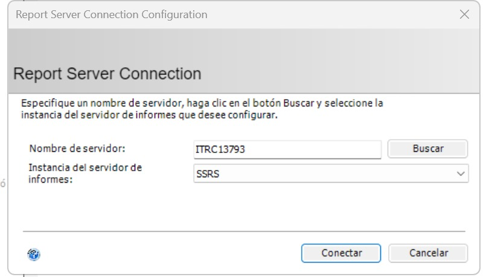
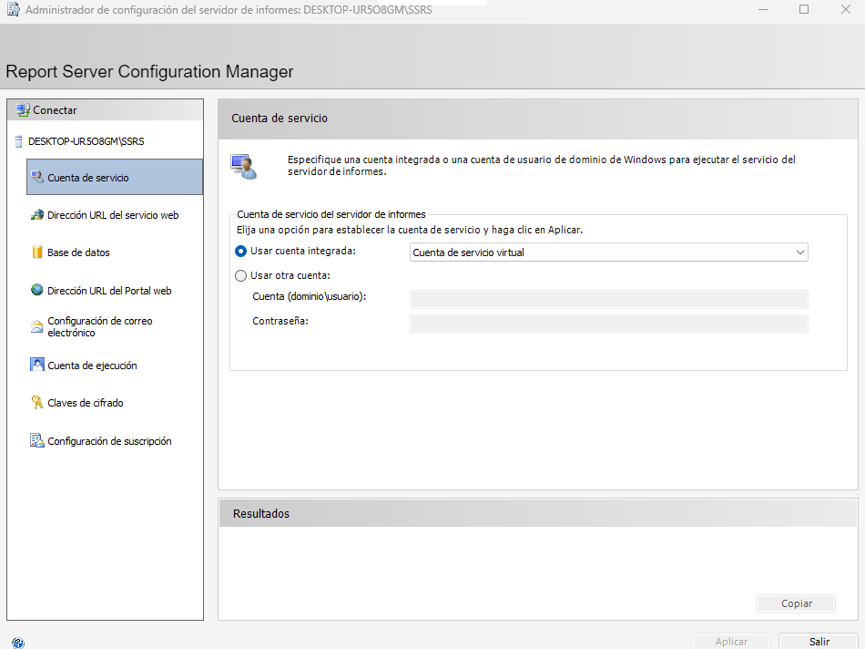
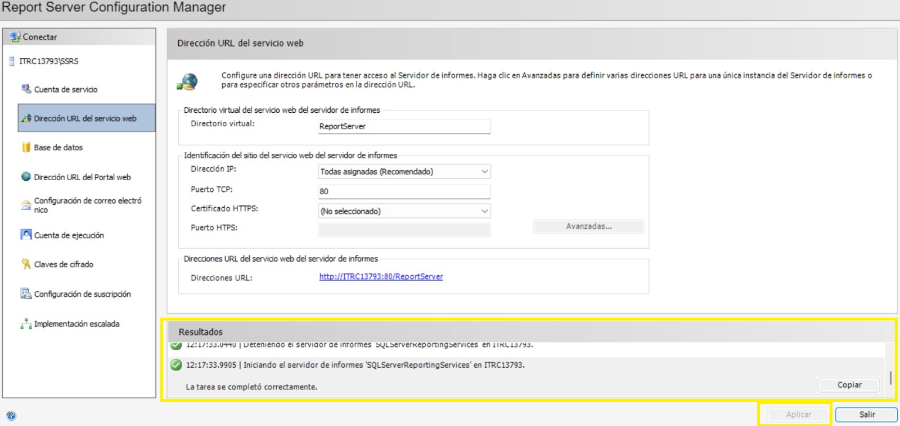
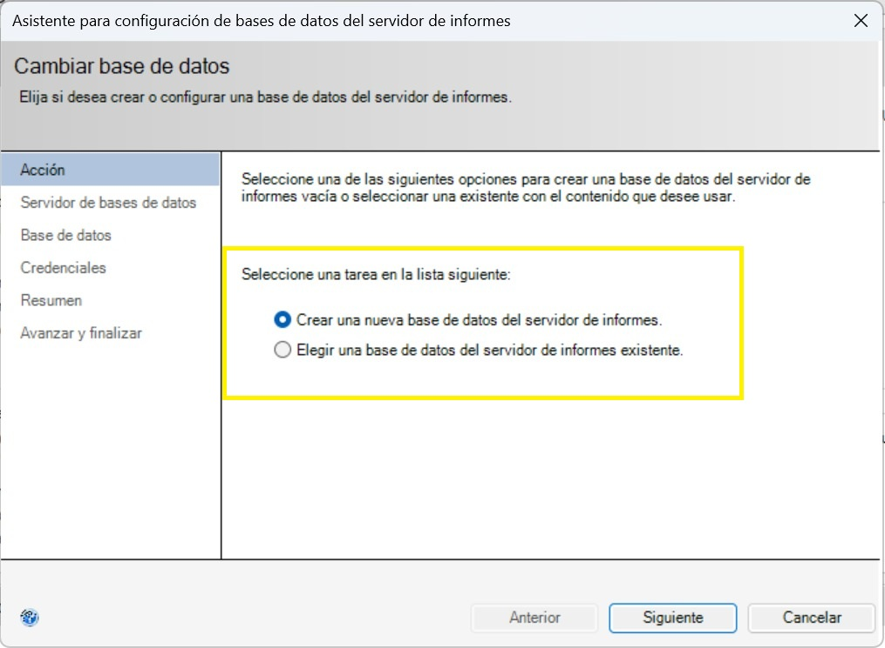

# Despliegue de IDAE Report Service en IIS

Esta guía detalla paso a paso cómo desplegar la aplicación completa (Backend .NET 8.0 + Frontend Next.js 15) en Windows Server usando IIS (Internet Information Services). El sistema proporciona una plataforma completa de generación y visualización de reportes SSRS (SQL Server Reporting Services) usando AspNetCore Module V2 para ejecutar Node.js en IIS.

**Versión:** 0.2.3-beta

## Referencias

_Esta sección será completada con tickets de Jira relacionados cuando estén disponibles._

## Información de Versiones

### Versión de Lanzamiento

:::info **v7.1.10.9**
:::

### Versiones Requeridas

| Aplicación    | Versión Mínima | Descripción                           |
| ------------- | -------------- | ------------------------------------- |
| SAMMNEW       | >= 7.1.10.9    | Aplicación web principal              |
| SAMM LOGICA   | >= 5.6.23.4    | Lógica de negocio                     |
| BASE DE DATOS | >= C2.1.6.1    | Scripts de configuración de historial |

## Requisitos Previos

:::important Importante
Esta guía es para despliegue en **Windows Server con IIS nativo** (sin Docker). Para despliegue con Docker en Linux o Windows con Docker Desktop, consultar: `IDAE.UTIL.ReportService.Container/DEPLOY-DOCKER-README.md`
:::

Antes de iniciar el despliegue, asegúrese de tener:

### 1. Configuracion Report Services

Lo primero que se podra ver es la configuracion estandar la cual podemos dejar tal y como se ve en la foto



### 1.2 Configuracion dentro del Report Server Configuration Manager
#### Seccion Cuenta de Servicio 
en este apartado no sera necesario realizar cambios podemos dejarlo standar como se ve en la foto 



### 1.3 Seccion "Direccion URL del servidor Web"
Para este caso la configuracion que se encuentra disponible se puede mantener, para que se inicie la configuracion se debe dar en el boton `Aplicar` que se encuentra en la parte inferior , en paralelo veremos los resultados de los ajustes aplicados.



### 1.4 Seccion "Base de datos"

Es necesario que se cree la base de datos para lo cual daremos click en el boton `Cambiar base de datos` y seleccionar la opcion 1 como se ve en la imagen.



Luego de esto proporcionaremos los datos que se pidan 

### 1.5 Seccion "Direccion URL del Portal web"

En este basta con dar en el boton `Aplicar` que se encuentra en la parte inferior , esperar un lapso de 1 min despues de abrir la direccion url del portal web.


### 2. Windows Server con IIS instalado

- Windows Server 2019 o superior
- Windows 10/11 también funciona para pruebas
- Report services instalado: https://www.microsoft.com/en-us/download/details.aspx?id=104502&msockid=064b61102bd46bce203a75fc2a6a6a9f (Instalar Edicion gratuita Developer)
- Windows Server con IIS

#### Recursos del servidor

**Mínimos:**

- CPU: 2 cores
- RAM: 4 GB
- Disco: 20 GB libres
- Red: Acceso a SQL Server y SSRS

**Recomendados:**

- CPU: 4+ cores
- RAM: 8+ GB
- Disco: 50+ GB SSD
- Red: Gigabit Ethernet

#### Servicios externos requeridos

**SQL Server:**

- SQL Server 2019 o superior
- Base de datos creada (ej: `sai_basica`)
- Usuario con permisos de lectura/escritura

**SSRS (SQL Server Reporting Services):**

- SSRS 2019 o superior
- Accesible via HTTP/HTTPS
- Usuario con permisos para generar reportes
- URL ejemplo: `http://servidor/ReportServer`

#### Red y firewall

**Puertos que se deben abrir:**

| Puerto | Servicio | Descripción                        |
| ------ | -------- | ---------------------------------- |
| 80     | HTTP     | Acceso web (si usa Nginx)          |
| 443    | HTTPS    | Acceso web seguro (si usa Nginx)   |
| 3001   | Frontend | Next.js (si acceso directo)        |
| 7268   | Backend  | .NET API HTTPS (si acceso directo) |
| 5213   | Backend  | .NET API HTTP (si acceso directo)  |

**Acceso a servicios externos:**

- SQL Server (puerto 1433 por defecto)
- SSRS (puerto 80/443)

#### Certificados SSL (opcional pero recomendado)

Si vas a usar HTTPS, necesitas certificados:

```bash title="Generar certificado autofirmado (desarrollo)"
# Opción 1: Certificado autofirmado (solo para desarrollo)
openssl req -x509 -nodes -days 365 -newkey rsa:2048 \
  -keyout certificate.key -out certificate.crt

# Convertir a PFX para .NET
openssl pkcs12 -export -out certificate.pfx \
  -inkey certificate.key -in certificate.crt -password pass:12345

# Opción 2: Certificado de Let's Encrypt (producción)
# Ver: https://letsencrypt.org/getting-started/
```

### 3. Instalar IIS con las características necesarias

Ejecutar como Administrador en PowerShell:

```powershell title="Habilitar características de IIS"
# Habilitar IIS con todas las características necesarias
Enable-WindowsOptionalFeature -Online -FeatureName IIS-WebServerRole
Enable-WindowsOptionalFeature -Online -FeatureName IIS-WebServer
Enable-WindowsOptionalFeature -Online -FeatureName IIS-CommonHttpFeatures
Enable-WindowsOptionalFeature -Online -FeatureName IIS-HttpErrors
Enable-WindowsOptionalFeature -Online -FeatureName IIS-HttpRedirect
Enable-WindowsOptionalFeature -Online -FeatureName IIS-ApplicationDevelopment
Enable-WindowsOptionalFeature -Online -FeatureName IIS-NetFxExtensibility45
Enable-WindowsOptionalFeature -Online -FeatureName IIS-HealthAndDiagnostics
Enable-WindowsOptionalFeature -Online -FeatureName IIS-HttpLogging
Enable-WindowsOptionalFeature -Online -FeatureName IIS-LoggingLibraries
Enable-WindowsOptionalFeature -Online -FeatureName IIS-RequestMonitor
Enable-WindowsOptionalFeature -Online -FeatureName IIS-HttpTracing
Enable-WindowsOptionalFeature -Online -FeatureName IIS-Security
Enable-WindowsOptionalFeature -Online -FeatureName IIS-RequestFiltering
Enable-WindowsOptionalFeature -Online -FeatureName IIS-Performance
Enable-WindowsOptionalFeature -Online -FeatureName IIS-WebServerManagementTools
Enable-WindowsOptionalFeature -Online -FeatureName IIS-IIS6ManagementCompatibility
Enable-WindowsOptionalFeature -Online -FeatureName IIS-Metabase
Enable-WindowsOptionalFeature -Online -FeatureName IIS-ManagementConsole
Enable-WindowsOptionalFeature -Online -FeatureName IIS-BasicAuthentication
Enable-WindowsOptionalFeature -Online -FeatureName IIS-WindowsAuthentication
Enable-WindowsOptionalFeature -Online -FeatureName IIS-StaticContent
Enable-WindowsOptionalFeature -Online -FeatureName IIS-DefaultDocument
Enable-WindowsOptionalFeature -Online -FeatureName IIS-DirectoryBrowsing
Enable-WindowsOptionalFeature -Online -FeatureName IIS-ISAPIExtensions
Enable-WindowsOptionalFeature -Online -FeatureName IIS-ISAPIFilter
Enable-WindowsOptionalFeature -Online -FeatureName IIS-HttpCompressionStatic
Enable-WindowsOptionalFeature -Online -FeatureName IIS-ASPNET45
```

### 4. Instalar Node.js v20 LTS (64-bit)

```powershell title="Instalación de Node.js"
# Opción 1: Con winget
winget install OpenJS.NodeJS.LTS

# Opción 2: Descargar desde https://nodejs.org/
# IMPORTANTE: Instalar versión 64-bit LTS (v20.x.x)
```

**Verificar instalación:**

```powershell title="Verificar versión de Node.js"
node -version # o node -v
# Debe mostrar v20.x.x

npm -version 
```

### 5. Instalar ASP.NET Core Hosting Bundle 8.0

:::important Crítico
Este módulo es el que permite que IIS ejecute Node.js
:::

```powershell title="Instalar ASP.NET Core Hosting Bundle"
# Descargar e instalar ASP.NET Core Hosting Bundle 8.0
# URL: https://dotnet.microsoft.com/download/dotnet/8.0
# Buscar: "Hosting Bundle" para Windows
```

Después de instalar, **REINICIAR EL SERVIDOR** o ejecutar:

```powershell title="Reiniciar servicios IIS"
net stop was /y
net start w3svc
```

**Verificar instalación:**

```powershell title="Verificar módulo AspNetCore"
# Buscar el módulo en IIS
Get-WebGlobalModule | Where-Object { $_.Name -like '*AspNetCore*' }
```

Debe mostrar: `AspNetCoreModuleV2`

### 6. Instalar URL Rewrite Module (Opcional pero recomendado)

```powershell title="Instalar URL Rewrite"
# Descargar desde: https://www.iis.net/downloads/microsoft/url-rewrite
# Instalar el MSI
```

### 7. ❌ NO instalar iisnode

:::warning Advertencia
**iisnode v0.2.26 (última versión de 2017) NO funciona con Node.js v20**. Usaremos AspNetCore Module V2 en su lugar.
:::

### 8. Scripts de instalación automatizados

Los scripts de instalación están en:

```
IDAE.UTIL.ReportService.Container\iis\
├── sr_api_iis_install.ps1   (Instala backend)
└── sr_web_iis_install.ps1   (Instala frontend)
```

**¿Qué hacen estos scripts?**

- ✅ Crean carpetas en `C:\Samm\sr_api` y `C:\Samm\sr_web`
- ✅ Copian archivos desde `Downloads`
- ✅ Crean Application Pools en IIS
- ✅ Crean aplicaciones web bajo Default Web Site
- ✅ Configuran permisos automáticamente
- ✅ Inician las aplicaciones
- ✅ Verifican que funcionan correctamente

### 9. Carpetas compiladas

De parte de desarrollo se deben recibir las carpetas de `sr_api` y `sr_web`

### 10. Estructura de carpetas en el servidor

:::note Información
La estructura puede cambiar según la configuración del cliente
:::

```
C:\Samm\
├── sr_api\                           # Backend .NET 8.0 WebAPI
│   ├── web.config                    # Configuración IIS para .NET
│   ├── appsettings.Production.json   # Configuración producción
│   ├── Idae.Util.ReportService.Backend.WebApi.dll
│   └── ...
│
└── sr_web\                           # Frontend Next.js 15
    ├── iis-server.js                 # ⭐ Wrapper para AspNetCore Module (CRÍTICO)
    ├── server.js                     # Servidor Next.js standalone
    ├── web.config                    # ⭐ Configuración IIS para Node.js (CRÍTICO)
    ├── .env.production               # Variables de entorno
    ├── package.json                  # Dependencias
    ├── .next\                        # Build de Next.js
    │   ├── static\                   # Assets compilados
    │   └── standalone\               # Archivos standalone
    ├── public\                       # Assets estáticos
    └── logs\                         # Logs de Node.js (creada por IIS)
        ├── stdout_*.log              # Salida estándar
        └── stderr_*.log              # Errores
```

## Información del Sistema

### Descripción del sistema

Este sistema proporciona una plataforma completa de generación y visualización de reportes SSRS (SQL Server Reporting Services) desplegada en Windows Server con IIS, utilizando AspNetCore Module V2 para ejecutar tanto aplicaciones .NET 8.0 como Node.js v20.

### Componentes de la aplicación

- **Backend API (.NET 8.0)**: Servicio WebAPI que se conecta a SSRS para generar reportes
- **Frontend Web (Next.js 15)**: Aplicación web con interfaz moderna para navegar y visualizar reportes
- **IIS (Internet Information Services)**: Servidor web de Windows que hospeda ambas aplicaciones
- **AspNetCore Module V2**: Módulo de IIS que permite ejecutar aplicaciones .NET y Node.js
- **SQL Server**: Base de datos (debe estar instalado por separado)
- **SSRS**: SQL Server Reporting Services (debe estar instalado por separado)

### Stack tecnológico

**Backend:**

- .NET 8.0 WebAPI
- Entity Framework Core
- Serilog (logging)
- SQL Server

**Frontend:**

- Next.js 15.5.3 (App Router)
- React 19.1.0
- TypeScript 5
- Tailwind CSS 4
- Radix UI Components
- TanStack Query (data fetching)
- Axios

**Infraestructura:**

- Windows Server 2019+
- IIS 10+
- AspNetCore Module V2
- Node.js v20 LTS
- SQL Server 2019+
- SSRS (SQL Server Reporting Services)

### Arquitectura de despliegue

```
┌─────────────────────────────────────────────────────┐
│               IIS (Default Web Site)                 │
│            Windows Server + IIS Manager              │
│                   Port 80/443                        │
└─────────────────┬───────────────────────────────────┘
                  │
      ┌───────────┴────────────┐
      │                        │
┌─────▼──────┐        ┌────────▼────────┐
│  sr_api    │        │     sr_web      │
│  .NET 8    │◄───────┤   Next.js 15    │
│  WebAPI    │  HTTP  │   Node.js v20   │
│  /sr_api   │        │   /sr_web       │
└────────────┘        └─────────┬───────┘
                                │
                    ┌───────────┴────────────┐
                    │                        │
              ┌─────▼─────┐          ┌──────▼──────┐
              │ SQL Server │          │    SSRS     │
              │  Database  │          │   Server    │
              └────────────┘          └─────────────┘
```

### Resumen de diferencias clave vs despliegue tradicional

#### ❌ Lo que NO se usa en este despliegue:

- ❌ **iisnode** - Incompatible con Node.js v20, reemplazado por AspNetCore Module V2
- ❌ **iisnode.yml** - No se necesita con AspNetCore Module
- ❌ **web.config con handler "iisnode"** - Usa "aspNetCore" en su lugar
- ❌ **PORT=3000 fijo** - AspNetCore Module asigna puerto dinámico
- ❌ **URL Rewrite para proxy manual** - AspNetCore Module hace proxy automático

#### ✅ Lo que SÍ se usa en este despliegue:

- ✅ **AspNetCore Module V2** - Módulo moderno que maneja Node.js
- ✅ **iis-server.js wrapper** - Traduce ASPNETCORE_PORT a PORT para Next.js
- ✅ **hostingModel="OutOfProcess"** - Node.js corre en proceso separado
- ✅ **Puerto dinámico** - Evita conflictos, cada reinicio puede usar puerto diferente
- ✅ **Logs en carpeta logs/** - stdout\_\*.log con salida de Node.js

#### 🎯 Ventajas de este enfoque:

1. ✅ Compatible con Node.js v20+ (actual y futuras versiones)
2. ✅ Usa módulo mantenido por Microsoft (AspNetCore Module)
3. ✅ Mismo módulo para backend .NET y frontend Node.js
4. ✅ Proceso de Node.js gestionado automáticamente por IIS
5. ✅ Reinicio automático si Node.js crashea
6. ✅ Logs centralizados y fáciles de acceder
7. ✅ No requiere módulos de terceros abandonados

## Configuración

### Paso 1: Preparar carpetas en el servidor

```powershell title="Crear estructura de carpetas"
# Crear carpetas base
New-Item -ItemType Directory -Path "C:\Samm\sr_api" -Force
New-Item -ItemType Directory -Path "C:\Samm\sr_web" -Force
New-Item -ItemType Directory -Path "C:\Samm\sr_web\logs" -Force

# Verificar creación
Get-ChildItem "C:\Samm"
```

:::tip Consejo
La ubicación `C:\Samm\` es opcional y puede cambiar según la estructura del cliente. Ajuste los scripts en consecuencia.
:::

### Paso 2: Descargar archivos compilados desde desarrollo

Recibir de desarrollo las carpetas compiladas:

- `sr_api` - Backend compilado (.NET 8.0)
- `sr_web` - Frontend compilado (Next.js 15)

```powershell title="Copiar archivos al servidor"
# Copiar archivos desde Downloads (ajustar ruta según necesidad)
Copy-Item -Path "$env:USERPROFILE\Downloads\sr_api\*" -Destination "C:\Samm\sr_api" -Recurse -Force
Copy-Item -Path "$env:USERPROFILE\Downloads\sr_web\*" -Destination "C:\Samm\sr_web" -Recurse -Force
```

### Paso 3: Configurar Backend API (.NET)

#### Crear Application Pool para el Backend

```powershell title="Crear Application Pool sr_api"
# Importar módulo WebAdministration
Import-Module WebAdministration

# Crear Application Pool
New-WebAppPool -Name "sr_api"

# Configurar Application Pool
Set-ItemProperty -Path "IIS:\AppPools\sr_api" -Name "managedRuntimeVersion" -Value ""
Set-ItemProperty -Path "IIS:\AppPools\sr_api" -Name "processModel.identityType" -Value "ApplicationPoolIdentity"
Set-ItemProperty -Path "IIS:\AppPools\sr_api" -Name "enable32BitAppOnWin64" -Value $false
Set-ItemProperty -Path "IIS:\AppPools\sr_api" -Name "startMode" -Value "AlwaysRunning"

# Reiniciar para aplicar cambios
Restart-WebAppPool -Name "sr_api"
```

#### Crear aplicación web en IIS

```powershell title="Crear aplicación sr_api en IIS"
# Crear aplicación bajo Default Web Site
New-WebApplication -Name "sr_api" -Site "Default Web Site" -PhysicalPath "C:\Samm\sr_api" -ApplicationPool "sr_api"

# Verificar creación
Get-WebApplication -Name "sr_api" -Site "Default Web Site"
```

#### Configurar permisos de archivos

```powershell title="Configurar permisos para sr_api"
# Dar permisos al Application Pool Identity
$acl = Get-Acl "C:\Samm\sr_api"
$permission = "IIS AppPool\sr_api", "ReadAndExecute", "ContainerInherit,ObjectInherit", "None", "Allow"
$accessRule = New-Object System.Security.AccessControl.FileSystemAccessRule $permission
$acl.SetAccessRule($accessRule)
Set-Acl "C:\Samm\sr_api" $acl

# Verificar permisos
Get-Acl "C:\Samm\sr_api" | Format-List
```

#### Configurar web.config del Backend

Verificar que el archivo `C:\Samm\sr_api\web.config` tenga la configuración correcta:

```xml title="C:\Samm\sr_api\web.config"
<?xml version="1.0" encoding="utf-8"?>
<configuration>
  <location path="." inheritInChildApplications="false">
    <system.webServer>
      <handlers>
        <add name="aspNetCore" path="*" verb="*" modules="AspNetCoreModuleV2" resourceType="Unspecified" />
      </handlers>
      <aspNetCore processPath="dotnet" 
                  arguments=".\Idae.Util.ReportService.Backend.WebApi.dll" 
                  stdoutLogEnabled="true" 
                  stdoutLogFile=".\logs\stdout" 
                  hostingModel="inprocess" />
    </system.webServer>
  </location>
</configuration>
```

#### Configurar appsettings.Production.json

```powershell title="Editar configuración de producción"
# Editar archivo de configuración
notepad "C:\Samm\sr_api\appsettings.Production.json"
```

Contenido del archivo:

```json title="C:\Samm\sr_api\appsettings.Production.json"
{
  "ConnectionStrings": {
    "DefaultConnection": "Server=tu-servidor-sql;Database=sai_basica;User Id=usuario;Password=contraseña;TrustServerCertificate=True;"
  },
  "ReportServer": {
    "Url": "http://tu-servidor-ssrs/ReportServer",
    "Username": "usuario_ssrs",
    "Password": "contraseña_ssrs",
    "Domain": "DOMINIO"
  },
  "Logging": {
    "LogLevel": {
      "Default": "Information",
      "Microsoft.AspNetCore": "Warning"
    }
  },
  "AllowedHosts": "*"
}
```

:::important Importante
Asegúrese de reemplazar todos los valores de ejemplo con sus credenciales y configuraciones reales.
:::

### Paso 4: Configurar Frontend Web (Next.js)

#### Crear Application Pool para el Frontend

```powershell title="Crear Application Pool sr_web"
# Crear Application Pool
New-WebAppPool -Name "sr_web"

# Configurar Application Pool (sin managed runtime para Node.js)
Set-ItemProperty -Path "IIS:\AppPools\sr_web" -Name "managedRuntimeVersion" -Value ""
Set-ItemProperty -Path "IIS:\AppPools\sr_web" -Name "processModel.identityType" -Value "ApplicationPoolIdentity"
Set-ItemProperty -Path "IIS:\AppPools\sr_web" -Name "enable32BitAppOnWin64" -Value $false
Set-ItemProperty -Path "IIS:\AppPools\sr_web" -Name "startMode" -Value "AlwaysRunning"

# Reiniciar
Restart-WebAppPool -Name "sr_web"
```

#### Crear aplicación web en IIS

```powershell title="Crear aplicación sr_web en IIS"
# Crear aplicación bajo Default Web Site
New-WebApplication -Name "sr_web" -Site "Default Web Site" -PhysicalPath "C:\Samm\sr_web" -ApplicationPool "sr_web"

# Verificar creación
Get-WebApplication -Name "sr_web" -Site "Default Web Site"
```

#### Configurar permisos de archivos

```powershell title="Configurar permisos para sr_web"
# Dar permisos al Application Pool Identity
$acl = Get-Acl "C:\Samm\sr_web"
$permission = "IIS AppPool\sr_web", "ReadAndExecute", "ContainerInherit,ObjectInherit", "None", "Allow"
$accessRule = New-Object System.Security.AccessControl.FileSystemAccessRule $permission
$acl.SetAccessRule($accessRule)
Set-Acl "C:\Samm\sr_web" $acl

# Permisos adicionales para carpeta logs
$aclLogs = Get-Acl "C:\Samm\sr_web\logs"
$permissionLogs = "IIS AppPool\sr_web", "Modify", "ContainerInherit,ObjectInherit", "None", "Allow"
$accessRuleLogs = New-Object System.Security.AccessControl.FileSystemAccessRule $permissionLogs
$aclLogs.SetAccessRule($accessRuleLogs)
Set-Acl "C:\Samm\sr_web\logs" $aclLogs
```

#### Crear archivo iis-server.js

:::note Información
Este archivo es CRÍTICO - traduce ASPNETCORE_PORT a PORT para Next.js
:::

```powershell title="Crear iis-server.js"
# Crear archivo iis-server.js
notepad "C:\Samm\sr_web\iis-server.js"
```

Contenido del archivo:

```javascript title="C:\Samm\sr_web\iis-server.js"
// iis-server.js
// Wrapper para ejecutar Next.js standalone con AspNetCore Module V2

console.log('🚀 Starting Next.js server via AspNetCore Module V2...');

// 1. AspNetCore Module asigna puerto dinámico en ASPNETCORE_PORT
const port = process.env.ASPNETCORE_PORT || process.env.PORT || 3000;
const hostname = process.env.HOSTNAME || '0.0.0.0';

console.log(`📍 Port from ASPNETCORE_PORT: ${process.env.ASPNETCORE_PORT}`);
console.log(`📍 Final PORT: ${port}`);
console.log(`📍 Hostname: ${hostname}`);

// 2. Configurar PORT para que Next.js lo use
process.env.PORT = port;
process.env.HOSTNAME = hostname;

console.log('✅ Environment variables set:');
console.log(`   - PORT=${process.env.PORT}`);
console.log(`   - HOSTNAME=${process.env.HOSTNAME}`);
console.log(`   - NODE_ENV=${process.env.NODE_ENV}`);

// 3. Cargar el servidor standalone de Next.js
console.log('📦 Loading Next.js standalone server...');
require('./server.js');
```

#### Crear archivo web.config

:::note Información
Este archivo configura AspNetCore Module V2 para ejecutar Node.js
:::

```powershell title="Crear web.config"
# Crear archivo web.config
notepad "C:\Samm\sr_web\web.config"
```

Contenido del archivo:

```xml title="C:\Samm\sr_web\web.config"
<?xml version="1.0" encoding="utf-8"?>
<configuration>
  <system.webServer>
    <handlers>
      <!-- Remover handler por defecto de archivos estáticos -->
      <remove name="StaticFile" />
      
      <!-- Handler para AspNetCore Module V2 ejecutando Node.js -->
      <add name="aspNetCore" 
           path="*" 
           verb="*" 
           modules="AspNetCoreModuleV2" 
           resourceType="Unspecified" />
    </handlers>

    <!-- Configuración del AspNetCore Module -->
    <aspNetCore processPath="C:\Program Files\nodejs\node.exe"
                arguments="iis-server.js"
                stdoutLogEnabled="true"
                stdoutLogFile=".\logs\stdout"
                hostingModel="OutOfProcess">
      
      <!-- Variables de entorno para Next.js -->
      <environmentVariables>
        <environmentVariable name="NODE_ENV" value="production" />
        <environmentVariable name="NEXT_PUBLIC_API_URL" value="http://localhost/sr_api" />
        <environmentVariable name="NEXT_PUBLIC_BASE_PATH" value="/sr_web" />
      </environmentVariables>
    </aspNetCore>

    <!-- Configuración de seguridad -->
    <security>
      <requestFiltering>
        <requestLimits maxAllowedContentLength="52428800" /> <!-- 50 MB -->
      </requestFiltering>
    </security>

    <!-- Headers de respuesta -->
    <httpProtocol>
      <customHeaders>
        <remove name="X-Powered-By" />
      </customHeaders>
    </httpProtocol>

    <!-- Compresión -->
    <urlCompression doStaticCompression="true" doDynamicCompression="true" />
  </system.webServer>
</configuration>
```

:::tip Consejo
Ajuste las variables de entorno `NEXT_PUBLIC_API_URL` y `NEXT_PUBLIC_BASE_PATH` según su configuración específica.
:::

#### Crear archivo .env.production

```powershell title="Crear .env.production"
# Crear archivo .env.production
notepad "C:\Samm\sr_web\.env.production"
```

Contenido del archivo:

```env title="C:\Samm\sr_web\.env.production"
NODE_ENV=production
NEXT_PUBLIC_API_URL=http://localhost/sr_api
NEXT_PUBLIC_BASE_PATH=/sr_web
```

### Paso 5: Usar scripts de instalación automatizados

:::tip Consejo
Los scripts automatizan todos los pasos anteriores. Puede usarlos en lugar de la configuración manual.
:::

#### Ejecutar script de instalación del Backend

```powershell title="Instalar Backend con script"
# Navegar a la carpeta de scripts
cd "IDAE.UTIL.ReportService.Container\iis"

# Ejecutar script de instalación
.\sr_api_iis_install.ps1

# El script preguntará por la ubicación de los archivos compilados
# Ejemplo: C:\Users\Administrator\Downloads\sr_api
```

#### Ejecutar script de instalación del Frontend

```powershell title="Instalar Frontend con script"
# Ejecutar script de instalación
.\sr_web_iis_install.ps1

# El script preguntará por la ubicación de los archivos compilados
# Ejemplo: C:\Users\Administrator\Downloads\sr_web
```

### Paso 6: Verificar el despliegue

#### Probar el Backend

```powershell title="Verificar Backend API"
# Probar endpoint de health
Invoke-WebRequest -Uri "http://localhost/sr_api/api/health" -UseBasicParsing

# Debe retornar status 200
```

#### Probar el Frontend

```powershell title="Verificar Frontend Web"
# Abrir en navegador
Start-Process "http://localhost/sr_web"

# O usar PowerShell
Invoke-WebRequest -Uri "http://localhost/sr_web" -UseBasicParsing
```

#### Verificar logs

```powershell title="Ver logs de la aplicación"
# Ver logs del Backend
Get-Content "C:\Samm\sr_api\logs\stdout_*.log" -Tail 50

# Ver logs del Frontend
Get-Content "C:\Samm\sr_web\logs\stdout_*.log" -Tail 50
```

### Paso 7: Configurar HTTPS (Opcional)

#### Importar certificado SSL

```powershell title="Importar certificado en IIS"
# Importar certificado PFX
$certPassword = ConvertTo-SecureString -String "TuPassword" -Force -AsPlainText
Import-PfxCertificate -FilePath "C:\Certificates\certificate.pfx" -CertStoreLocation Cert:\LocalMachine\My -Password $certPassword

# Obtener thumbprint del certificado
Get-ChildItem -Path Cert:\LocalMachine\My | Where-Object { $_.Subject -like "*tu-dominio*" }
```

#### Agregar binding HTTPS al sitio

```powershell title="Configurar HTTPS binding"
# Agregar binding HTTPS (reemplazar THUMBPRINT con el valor real)
New-WebBinding -Name "Default Web Site" -Protocol "https" -Port 443 -HostHeader "" -SslFlags 0

# Asignar certificado al binding
$cert = Get-Item "Cert:\LocalMachine\My\THUMBPRINT"
$binding = Get-WebBinding -Name "Default Web Site" -Protocol "https"
$binding.AddSslCertificate($cert.Thumbprint, "my")
```

### Paso 8: Configuraciones de seguridad adicionales

```powershell title="Aplicar configuraciones de seguridad"
# 1. Deshabilitar listado de directorios
Set-WebConfigurationProperty -Filter /system.webServer/directoryBrowse `
  -Name enabled -Value $false -PSPath "IIS:\Sites\Default Web Site\sr_web"

# 2. Configurar límites de solicitud
Set-WebConfigurationProperty -Filter /system.webServer/security/requestFiltering/requestLimits `
  -Name maxAllowedContentLength -Value 52428800 -PSPath "IIS:\Sites\Default Web Site\sr_web"

# 3. Habilitar compresión
Enable-WindowsOptionalFeature -Online -FeatureName IIS-HttpCompressionStatic
Enable-WindowsOptionalFeature -Online -FeatureName IIS-HttpCompressionDynamic
```

### Paso 9: Operaciones comunes

#### Reiniciar aplicaciones

```powershell title="Reiniciar aplicaciones"
# Reiniciar Backend
Restart-WebAppPool -Name "sr_api"

# Reiniciar Frontend
Restart-WebAppPool -Name "sr_web"

# Reiniciar ambos
Restart-WebAppPool -Name "sr_api"
Restart-WebAppPool -Name "sr_web"
```

#### Detener/Iniciar aplicaciones

```powershell title="Controlar estado de aplicaciones"
# Detener
Stop-WebAppPool -Name "sr_api"
Stop-WebAppPool -Name "sr_web"

# Iniciar
Start-WebAppPool -Name "sr_api"
Start-WebAppPool -Name "sr_web"
```

#### Actualizar aplicación

```powershell title="Actualizar a nueva versión"
# 1. Detener aplicaciones
Stop-WebAppPool -Name "sr_api"
Stop-WebAppPool -Name "sr_web"

# 2. Copiar nuevos archivos (reemplazar los existentes)
Copy-Item -Path "$env:USERPROFILE\Downloads\sr_api\*" -Destination "C:\Samm\sr_api" -Recurse -Force
Copy-Item -Path "$env:USERPROFILE\Downloads\sr_web\*" -Destination "C:\Samm\sr_web" -Recurse -Force

# 3. Iniciar aplicaciones
Start-WebAppPool -Name "sr_api"
Start-WebAppPool -Name "sr_web"
```

## Resultado Esperado

Una vez completada la configuración:

1. **Backend API funcionando**: El servicio WebAPI estará accesible en `http://localhost/sr_api`, respondiendo correctamente a las peticiones de salud en `/sr_api/api/health`.

2. **Frontend Web activo**: La aplicación Next.js estará disponible en `http://localhost/sr_web`, mostrando la interfaz de usuario para navegación de reportes.

3. **Application Pools activos**: Ambos Application Pools (`sr_api` y `sr_web`) estarán en estado "Started" y configurados para reinicio automático.

4. **Integración completa**: La aplicación web podrá comunicarse con el backend API, que a su vez se conectará correctamente con SQL Server y SSRS para generar reportes.

5. **Logs accesibles**: Los logs de cada aplicación estarán disponibles en las carpetas `C:\Samm\sr_api\logs\` y `C:\Samm\sr_web\logs\` para monitoreo y troubleshooting.

6. **AspNetCore Module funcionando**: Node.js v20 se ejecutará correctamente a través de AspNetCore Module V2, con puertos dinámicos asignados automáticamente.

## Resolución de Problemas

### Error 500.19: No se puede leer web.config

Verifique que:

- El archivo `web.config` existe en la carpeta de la aplicación
- El archivo `web.config` tiene formato XML válido
- No hay caracteres especiales o encoding incorrecto
- El usuario del Application Pool tiene permisos de lectura en el archivo

### Error 502.5: Process Failure

Confirme que:

- AspNetCore Module V2 está instalado: `Get-WebGlobalModule | Where-Object { $_.Name -like '*AspNetCore*' }`
- Node.js está instalado en `C:\Program Files\nodejs\node.exe`
- La ruta en `processPath` del `web.config` es correcta
- Los archivos `server.js` e `iis-server.js` existen en la carpeta
- Revisar logs en `C:\Samm\sr_web\logs\stdout_*.log`

### Error 500.0: In-Process Handler Load Failure

Revise que:

- Para .NET: El archivo DLL principal existe
- Para Node.js: El `hostingModel` es `OutOfProcess` (no `inprocess`)
- El Application Pool tiene `managedRuntimeVersion` vacío para Node.js
- ASP.NET Core Hosting Bundle 8.0 está instalado

### Frontend no carga archivos estáticos

Verifique que:

- La carpeta `.next/static` existe y contiene archivos
- Los permisos del Application Pool incluyen lectura en toda la carpeta
- El `web.config` no bloquea archivos estáticos
- La variable `NEXT_PUBLIC_BASE_PATH` está configurada correctamente

### Node.js no inicia o crashea

Confirme que:

- Node.js v20 LTS 64-bit está instalado
- La versión es compatible: `node -v` debe mostrar v20.x.x
- El archivo `iis-server.js` existe y tiene la sintaxis correcta
- Las variables de entorno en `web.config` están configuradas
- Revisar errores en `C:\Samm\sr_web\logs\stderr_*.log`

### Error de conexión al Backend API

Revise que:

- El Application Pool del Backend está iniciado
- La URL en `NEXT_PUBLIC_API_URL` es correcta
- El Backend responde: `Invoke-WebRequest -Uri "http://localhost/sr_api/api/health"`
- No hay firewall bloqueando la comunicación local
- El Backend está configurado para permitir CORS

### Error de conexión a base de datos

Confirme que:

- SQL Server es accesible desde el servidor IIS
- Las credenciales en `appsettings.Production.json` son correctas
- El firewall permite conexiones en el puerto 1433
- La cadena de conexión incluye `TrustServerCertificate=True` si es necesario
- El usuario de SQL tiene permisos en la base de datos

### Error de conexión a SSRS

Verifique que:

- La URL del SSRS es correcta y accesible
- Las credenciales de SSRS son válidas
- El usuario tiene permisos para ejecutar reportes
- El servidor SSRS responde: `Invoke-WebRequest -Uri "http://tu-servidor-ssrs/ReportServer"`
- El dominio está configurado correctamente si usa autenticación Windows

### Application Pool se detiene constantemente

Revise que:

- No hay errores críticos en los logs de la aplicación
- Hay suficiente memoria RAM disponible
- No hay errores en Event Viewer de Windows: `Get-EventLog -LogName Application -Source "IIS AspNetCore Module V2" -Newest 10`
- El `startMode` del Application Pool es `AlwaysRunning`
- Los límites de memoria del Application Pool no se están excediendo

### Logs vacíos o no se generan

Confirme que:

- `stdoutLogEnabled="true"` en `web.config`
- La carpeta `logs` existe: `C:\Samm\sr_web\logs`
- El Application Pool tiene permisos de escritura en la carpeta `logs`
- El path `stdoutLogFile=".\logs\stdout"` es correcto en `web.config`

### Checklist de verificación completa

Ejecutar estos comandos para diagnóstico completo:

```powershell title="Checklist de diagnóstico"
# 1. Verificar módulos IIS
Get-WebGlobalModule | Where-Object { $_.Name -like '*AspNetCore*' }

# 2. Verificar Application Pools
Get-WebAppPoolState -Name "sr_api"
Get-WebAppPoolState -Name "sr_web"

# 3. Verificar aplicaciones web
Get-WebApplication -Name "sr_api" -Site "Default Web Site"
Get-WebApplication -Name "sr_web" -Site "Default Web Site"

# 4. Verificar archivos críticos
Test-Path "C:\Samm\sr_api\web.config"
Test-Path "C:\Samm\sr_api\Idae.Util.ReportService.Backend.WebApi.dll"
Test-Path "C:\Samm\sr_web\web.config"
Test-Path "C:\Samm\sr_web\iis-server.js"
Test-Path "C:\Samm\sr_web\server.js"

# 5. Verificar Node.js
node -v
npm -v

# 6. Verificar logs
Get-Content "C:\Samm\sr_api\logs\stdout_*.log" -Tail 20
Get-Content "C:\Samm\sr_web\logs\stdout_*.log" -Tail 20

# 7. Verificar Event Viewer
Get-EventLog -LogName Application -Source "IIS AspNetCore Module V2" -Newest 5

# 8. Probar endpoints
Invoke-WebRequest -Uri "http://localhost/sr_api/api/health" -UseBasicParsing
Invoke-WebRequest -Uri "http://localhost/sr_web" -UseBasicParsing
```

## Compatibilidad con Docker

### ¿Esta configuración afecta el despliegue con Docker?

**NO**. Los cambios para IIS son completamente independientes del despliegue con Docker.

### Archivos específicos por entorno

| Archivo              | Docker    | IIS                       | Ubicación                          |
| -------------------- | --------- | ------------------------- | ---------------------------------- |
| `Dockerfile`         | ✅ Usa    | ❌ No usa                 | Repositorio                        |
| `docker-compose.yml` | ✅ Usa    | ❌ No usa                 | IDAE.UTIL.ReportService.Container/ |
| `server.js`          | ✅ Usa    | ✅ Usa (standalone build) | Generado por `next build`          |
| `iis-server.js`      | ❌ No usa | ✅ Usa                    | **Solo para IIS** (C:\Samm\sr_web) |
| `web.config`         | ❌ No usa | ✅ Usa                    | **Solo para IIS** (C:\Samm\sr_web) |

### Cómo funcionan ambos despliegues

**Docker (sin cambios):**

```bash title="Inicio en Docker"
# En Linux/Docker, Next.js se inicia directamente con server.js
CMD ["node", "server.js"]

# Variables de entorno en docker-compose.yml
environment:
  - NODE_ENV=production
  - PORT=3001
  - HOSTNAME=0.0.0.0
```

**IIS (nueva configuración):**

```bash title="Inicio en IIS"
# En IIS, AspNetCore Module inicia Node.js con iis-server.js
# iis-server.js lee ASPNETCORE_PORT y luego carga server.js

# Variables de entorno en web.config
<environmentVariable name="NODE_ENV" value="production" />
# PORT se asigna automáticamente via ASPNETCORE_PORT
```

### Variables de entorno por entorno

| Variable                | Docker (docker-compose)  | IIS (web.config o .env.production) |
| ----------------------- | ------------------------ | ---------------------------------- |
| `NODE_ENV`              | ✅ `production`          | ✅ `production`                    |
| `PORT`                  | ✅ Explícito (3001)      | ✅ Dinámico (via ASPNETCORE_PORT)  |
| `HOSTNAME`              | ✅ `0.0.0.0`             | ✅ Automático                      |
| `NEXT_PUBLIC_API_URL`   | ✅ Build arg             | ✅ .env.production                 |
| `NEXT_PUBLIC_BASE_PATH` | ✅ Build arg (`/sammai`) | ✅ .env.production (`/sr_web`)     |

### Resumen de compatibilidad

| Aspecto              | Compatible    | Notas                                       |
| -------------------- | ------------- | ------------------------------------------- |
| Código fuente        | ✅ 100%       | Sin cambios necesarios                      |
| next.config.js       | ✅ 100%       | Mismo archivo para ambos                    |
| package.json         | ✅ 100%       | Sin cambios necesarios                      |
| Dockerfile           | ✅ 100%       | No se modifica                              |
| docker-compose       | ✅ 100%       | No se modifica                              |
| Build de Next.js     | ✅ 100%       | `next build` genera `server.js` standalone  |
| Variables de entorno | ✅ Compatible | Se configuran diferente pero son las mismas |

## Recursos Útiles

### Documentación oficial

- [IIS Documentation](https://docs.microsoft.com/en-us/iis/)
- [ASP.NET Core Module](https://docs.microsoft.com/en-us/aspnet/core/host-and-deploy/aspnet-core-module)
- [Next.js Standalone Output](https://nextjs.org/docs/advanced-features/output-file-tracing)
- [Node.js Downloads](https://nodejs.org/)

### Soporte

Para problemas o preguntas:

1. Revisar la sección de **Resolución de Problemas**
2. Ejecutar el **Checklist de verificación completa**
3. Capturar los logs: `Get-Content "C:\Samm\sr_web\logs\*.log"`
4. Capturar eventos: `Get-EventLog -LogName Application -Source "IIS AspNetCore Module V2" -Newest 5`
5. Contactar al equipo de desarrollo

### Para problemas específicos de Docker

Si tienes problemas con el despliegue en Docker (no relacionados con IIS):

```bash title="Diagnóstico Docker"
# Ver logs del contenedor
docker logs sammai-staging.rs.frontendweb-container

# Ver estado de contenedores
docker-compose -f docker-compose.sammai-rs-staging.yml ps

# Rebuild completo
docker-compose -f docker-compose.sammai-rs-staging.yml build --no-cache

# Reiniciar contenedor
docker-compose -f docker-compose.sammai-rs-staging.yml restart rs-frontend-web
```

---

**Desarrollado con ❤️ por el equipo de IDAE Development**

**Licencia:** Proyecto privado - Todos los derechos reservados
