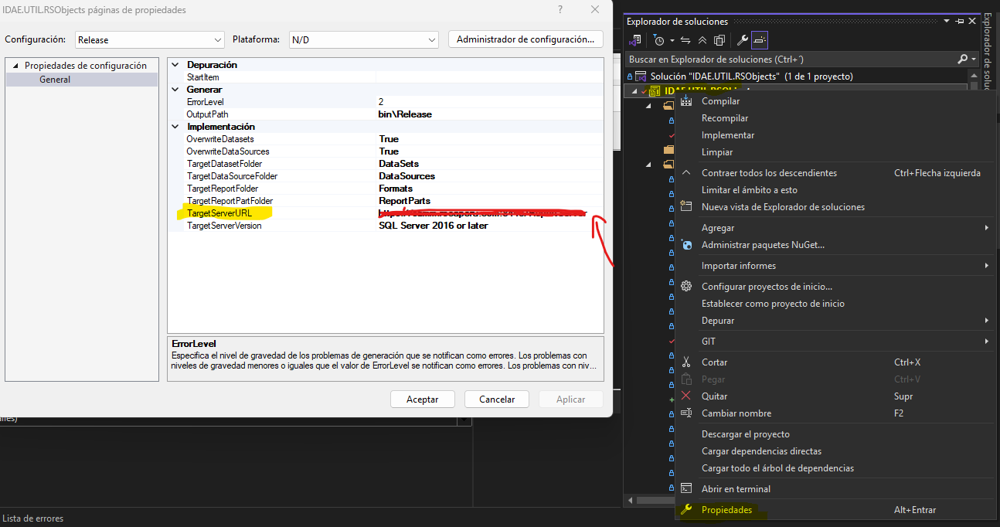
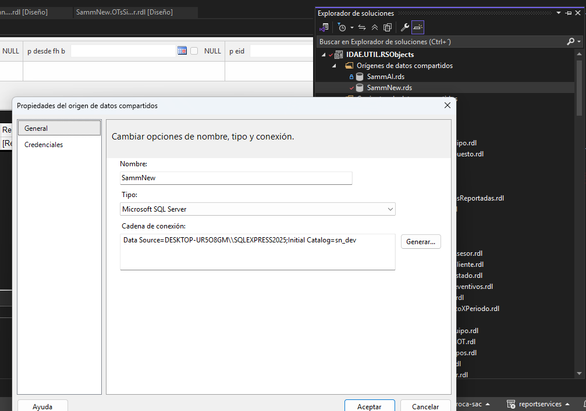
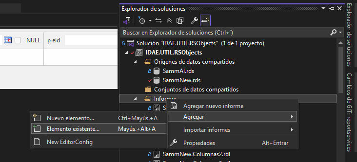
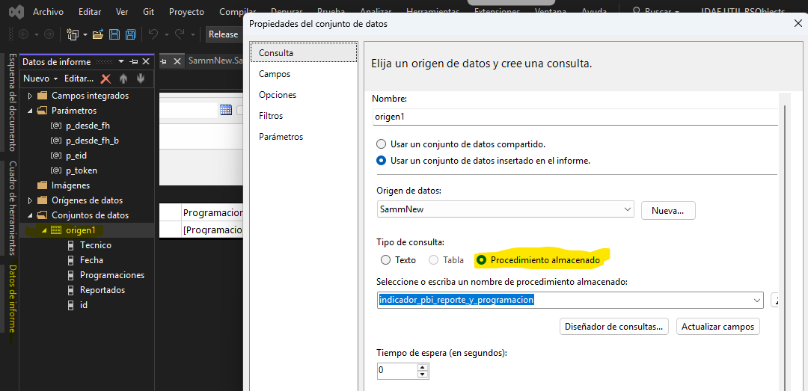
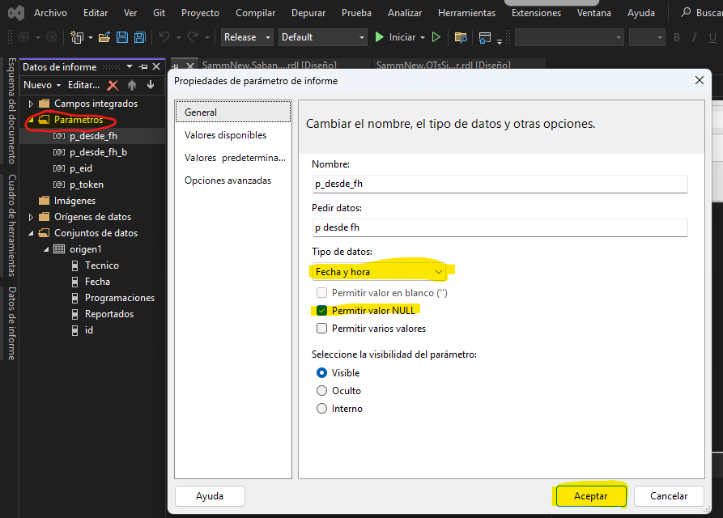
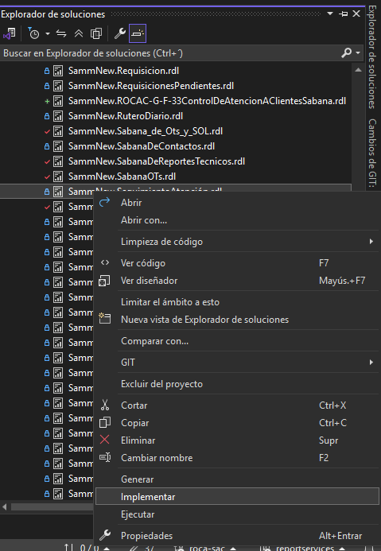
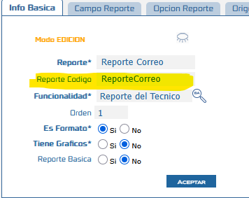
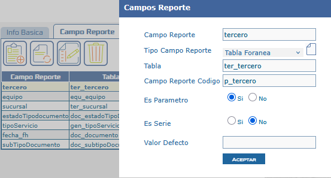
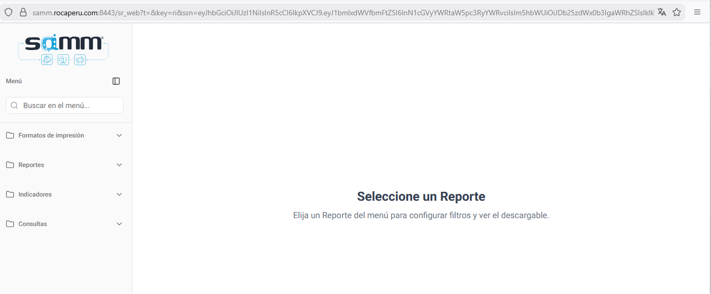

# Interfaz Report Services (Listado de Reportes, Filtros y Contenido)

Este documento describe cómo configurar y visualizar la interfaz de Report Services una vez completado el despliegue. Se detalla el proceso para ver los reportes disponibles y configurar los filtros de búsqueda necesarios para su correcta visualización.

## Referencias

- [SO-40: Crear aplicación para visualizar reportes (listar reportes, ver filtros y su contenido)]

## Información de Versiones

### Versión de Lanzamiento

:::info **v0.3.1**
:::

### Versiones Requeridas

| Aplicación      | Versión Mínima | Descripción                           |
| --------------- | -------------- | ------------------------------------- |
| SAMMNEW         | >= 7.1.10.9    | Aplicación web principal              |
| SAMM LOGICA     | >= 5.6.23.4    | Lógica de negocio                     |
| BASE DE DATOS   | >= C2.1.6.1    | Scripts de configuración de historial |
| REPORT SERVICES | >= 0.3.1       | Utilitario de Reportes                |

## Requisitos Previos

Antes de iniciar la configuración, asegúrese de tener:

- Report Services ya desplegado, ya sea por IIS o por Docker
- Solución ya migrada e instalada
- Web config debidamente configurados en todos los sitios (sr_api, sa_, sr_web, sn_)
- Visual Studio 2022 instalado para modificar reportes
- Acceso al servidor de SQL Server Reporting Services
- Permisos para desplegar reportes en el servidor SSRS

:::important Importante
Esta funcionalidad requiere la versión mínima especificada de Report Services. Verifique su versión actual antes de continuar.
:::

## Información del Servicio

:::note Información
El servicio de Report Services utiliza el endpoint `api/report-service` para generar y visualizar reportes a través de SSRS (SQL Server Reporting Services).
:::

### Parámetros del Servicio

El servicio acepta un parámetro `aplicacion` que identifica desde qué aplicación se realiza la petición:

| Aplicación            | Valor | Descripción      |
| --------------------- | ----- | ---------------- |
| SAMMAPI (por defecto) | 0     | API principal    |
| SAMMWEB               | 1     | Aplicación web   |
| MVC                   | 2     | Aplicación MVC   |
| APPSAMM               | 3     | Aplicación móvil |
| APPKUBO               | 4     | Aplicación Kubo  |

## Configuración

### Paso 1: Verificación de los Web Config

Una vez entregado por parte de desarrollo las carpetas `sr_api` y `sr_web`, debemos garantizar la correcta configuración de los mismos, incluyendo cambios en los web config del sitio `sn_` y del API `sa_`.

#### Web config sr_api

Este es muy estándar y casi no requiere cambios, sin embargo, maneja un archivo llamado `appsettings.Production.json`. Debemos tener en cuenta varias secciones:

**Conexión a la base de datos:**

```json title="Configuración de conexión a base de datos"
"AllowedHosts": "*",
"ProjectSettings": {
  "ConnectionStrings": {
    "DefaultConnection": "Server=ROCA-SAMM\\SQLEXPRESS;Database=sn_dev;user=sa;pwd=SammRoca$;Encrypt=False;"
  }
}
```

**Autenticación:**

```json title="Configuración de autenticación JWT"
"Authentications": {
  "JwtBearer": {
    "Issuer": "https://localhost:7260",  // debe coincidir con el sa_
    "Audience": "0000-0000-0000-0000-0000",  // debe coincidir con el sa_
    "SecretKey": "clave-secreta-api-clave-secreta-api-clave-secreta-api",  // debe coincidir con el sa_
    "ExpireMinutes": 240
  }
}
```

**URL API:**

```json title="Configuración de ruta del sistema origen"
"OriginSystem": {
  "BaseRoute": "https://samm.rocaperu.com:8443/sa_dev/api/"
}
```

**Ruta base de Report Services:**

```json title="Configuración de SSRS"
"EnableSwagger": true,
"UseHttps": true,
"PathBase": "/sr_api",
"Report": {
  "SSRS": {
    "BaseRoute": "http://localhost/ReportServer",  // este campo se obtiene con la instalación del report services
    "DefaultFormat": "PDF",
    "Authentication": {
      "Type": "Basic",
      "Windows": {
        "Domain": "",
        "Username": "",
        "Password": ""
      }
    }
  }
}
```

**Autenticación para Report Services:**

```json title="Credenciales de autenticación SSRS"
"Basic": {
  "Username": "Usuarioservidor-reportservices",
  "Password": "clave**"
}
```

:::tip Consejo
Las credenciales de autenticación Basic deben ser del usuario del servidor donde se instaló Report Services.
:::

#### Web config sa_

Este hace referencia al API que ya se ha manejado, diferente al entregado por desarrollo, ya que este no requiere compilación:

```xml title="C:\Samm\sa_dev\web.config"
<appSettings>
  <add key="JWT_SECRET_KEY" value="clave-secreta-api-clave-secreta-api-clave-secreta-api" /><!-- debe coincidir con el sr_api -->
  <add key="JWT_AUDIENCE_TOKEN" value="0000-0000-0000-0000-0000" /><!-- debe coincidir con el sr_api -->
  <add key="JWT_ISSUER_TOKEN" value="https://localhost:7260" /><!-- debe coincidir con el sr_api -->
  <add key="JWT_EXPIRE_MINUTES" value="30" />
  <add key="correo.soporte" value="" lockItem="true" />
  <add key="licencia" value="79B7-SW-AL14-N9X1" lockItem="true" />
  <add key="ubicacionSitioPrincipal" value="C:\Samm\sn_dev" lockItem="true" />
  <add key="descargarArchivo" value="1" lockItem="true" />
  <add key="sitioSammWeb" value="https://samm.rocaperu.com:8443/sn_dev/" />
  <add key="url_versionLiberada" value="http://dev.softwaresamm.com/act/version5.txt" />
  <add key="omiteLog" value="f_str_autoguardar,f_str_autoguardarAdjuntos" />
  <add key="enviarAutoguardado" value="true" />
  <add key="urlAPI" value="https://samm.rocaperu.com:8443/sa_dev/" />
  <add key="urlApiIDAE" value="https://app2.softwaresamm.com/sa_idaetest/" />
  <add key="ubicacionSitioReportes" value="C:\Samm\sr_test\" lockItem="true" />
  <add key="tipoReportServices" value="2" /> <!-- 1. Default, 2. Util.ReportService -->
  <add key="urlReportService" value="https://samm.rocaperu.com:8443/sr_api/api/report-service" /> <!-- Este campo es muy importante para el envío de correo -->
</appSettings>
```

:::important Importante
El campo `urlReportService` es crítico para el envío de correos con reportes adjuntos.
:::

#### Web config sr_web

Para este caso no requiere cambios, se puede mantener tal y como lo entrega desarrollo:

```xml title="C:\Samm\sr_web\web.config"
<?xml version="1.0" encoding="utf-8"?>
<configuration>
  <system.webServer>
    <handlers>
      <add name="aspNetCore" path="*" verb="*" modules="AspNetCoreModuleV2" resourceType="Unspecified" />
    </handlers>
    <aspNetCore processPath="C:\Program Files\nodejs\node.exe"
                arguments="iis-server.js"
                stdoutLogEnabled="true"
                stdoutLogFile=".\logs\stdout"
                hostingModel="OutOfProcess"
                forwardWindowsAuthToken="false"
                startupTimeLimit="120"
                requestTimeout="00:10:00">
      <environmentVariables>
        <environmentVariable name="NODE_ENV" value="production" />
      </environmentVariables>
    </aspNetCore>
  </system.webServer>
</configuration>
```

#### Web config sn_

```xml title="C:\Samm\sn_dev\web.config"
<appSettings>
  <add key="licencia" value="79B7-SW-AL14-N9X1" lockItem="true" />
  <add key="correo.soporte" value="" lockItem="true" />
  <add key="hostPruebas" value="" />
  <add key="rsaPrivateKeyFilePath" value="m:\xml\sammpr1.xml" />
  <add key="urlSoporte" value="https://softwaresamm.com/sw_idae;usuario;claveusuario" />
  <add key="maxRegistrosGrilla" value="300" />
  <add key="urlAPI" value="https://samm.rocaperu.com:8443/sa_dev/" />
  <add key="urlApiIDAE" value="https://app2.softwaresamm.com/sa_idaetest/" />
  <add key="urlSAMMReportes" value="https://samm.rocaperu.com:8443/sr_web/" /><!-- Campo de conexión con el sr_web -->
  <add key="tipoReportServices" value="2" /> <!-- 1. Default, 2. Util.ReportService -->
  <add key="ValidationSettings:UnobtrusiveValidationMode" value="None" />
  <add key="sitioSammReportes" value="C:\Samm\sr_test" />
  <add key="maxAlmacenamiento" value="" />
  <add key="porcAdvertenciaMaxAlmacenamiento" value="" />
</appSettings>
```

:::tip Consejo
El campo `urlSAMMReportes` debe apuntar a la URL donde está desplegado el sr_web para que la integración funcione correctamente.
:::

### Paso 2: Modificación del nombre de los reportes

Para la correcta visualización de los reportes, deben manejar una estructura específica en su nombre.

**Ejemplo de cambio de nombre:**

- **Nombre anterior:** `pri_ot.rdlc`
- **Nombre nuevo:** `SammNew.pri_ot.rdl`

Este cambio basta con editar el nombre del documento en el explorador de archivos.

:::important Importante
Debe estar activo en el explorador de archivos la opción de "Ver las extensiones". Esto garantiza que modifiquemos tanto el nombre como la extensión correctamente, y no solo el nombre.
:::

**Pasos para cambiar el nombre:**

1. Abrir el Explorador de Windows
2. Navegar a la carpeta de reportes
3. Activar "Ver > Extensiones de nombre de archivo"
4. Hacer clic derecho en el archivo `.rdlc`
5. Seleccionar "Cambiar nombre"
6. Cambiar a formato: `SammNew.[nombre_reporte].rdl`

### Paso 3: Conexión al Report Services del cliente

Para lograr desplegar los reportes que modifiquemos, necesitaremos conectarnos al Report Services del cliente. Esto se realiza desde Visual Studio modificando el campo señalado en la imagen.



**Pasos para configurar la conexión:**

1. Abrir la solución en Visual Studio 2022
2. En el Explorador de soluciones, hacer clic derecho en el proyecto de reportes
3. Seleccionar "Propiedades"
4. En la sección "TargetServerURL", especificar la URL del servidor SSRS
5. Formato: `http://servidor/ReportServer`

### Paso 4: Conexión a una base de datos

Para este paso tendríamos 2 opciones:

1. Tener una copia de la base de datos localmente
2. Conectarnos directamente a la base de datos del reporte que se modificará

**Pasos para configurar la conexión:**

1. Dar clic en la carpeta "Orígenes de datos compartidos"
2. Seleccionar la solución que se esté trabajando (para este caso es `SammNew`)
3. Dar doble clic en el origen de datos
4. En "Nombre", dejar `SammNew`
5. En el campo "Tipo", seleccionar `Microsoft SQL Server`
6. En "Cadena de conexión", especificar la base de datos a la cual conectarse



**Ejemplo de cadena de conexión:**

```
Data Source=SERVIDOR\INSTANCIA;Initial Catalog=nombre_bd;User ID=usuario;Password=clave
```

:::tip Consejo
Si la conexión es con autenticación de Windows, usar `Integrated Security=True` en lugar de especificar usuario y contraseña.
:::

### Paso 5: Agregar los reportes a la solución para su respectivo despliegue

La forma de llevar los reportes a la solución se realizará desde Visual Studio 2022 en el apartado de solución.



**Pasos para agregar reportes:**

1. En el Explorador de soluciones, hacer clic derecho en el proyecto
2. Seleccionar "Agregar > Elemento existente"
3. Navegar a la carpeta donde están los reportes `.rdl`
4. Seleccionar el o los reportes a agregar
5. Hacer clic en "Agregar"

:::note Información
Los reportes deben tener la extensión `.rdl` y seguir la nomenclatura `SammNew.[nombre].rdl` para ser reconocidos correctamente.
:::

### Paso 6: Ajustar orígenes de datos

Al agregar el reporte en la misma ventana anterior, podemos ver el reporte agregado. Dando doble clic, podremos ver las configuraciones del reporte. Buscaremos la opción "Datos de informe" y ajustaremos el origen.



**Pasos para ajustar el origen:**

1. Hacer doble clic en el reporte agregado
2. En el panel "Datos de informe", expandir "Orígenes de datos"
3. Hacer clic derecho en el origen (ej: "Origen1")
4. Seleccionar "Propiedades del conjunto de datos"
5. En "Tipo de consulta", seleccionar `Procedimiento almacenado`
6. En el cuadro de texto, escribir el nombre del procedimiento almacenado
7. Hacer clic en "Actualizar campos"
8. Confirmar con "Aceptar"

:::note Información
Como podemos observar, en "Nombre" está "Origen1", que mantiene el concepto que se manejaba anteriormente. Sin embargo, al no haber un componente de por medio que relaciona el "Origen1" con el orden de los orígenes en la interfaz de SAMM, debemos decirle al Report Services cuál es el procedimiento al que llamamos "Origen1".
:::

Al completar estos pasos, si desplegamos nuestro origen, veremos todas las columnas de nuestra consulta.

### Paso 7: Ajustar parámetros y/o variables

Para el caso de las variables o parámetros, debemos asignar valores por defecto según el tipo de dato.



**Configuración por tipo de dato:**

| Tipo de Dato | Configuración                              |
| ------------ | ------------------------------------------ |
| Enteros      | Valor predeterminado: `0`                  |
| Fechas       | Marcar opción "Permitir valor NULL"        |
| Varchar      | Dejar valor predeterminado sin ningún valor |

**Pasos para configurar parámetros:**

1. En el panel "Datos de informe", expandir "Parámetros"
2. Hacer clic derecho en el parámetro a configurar
3. Seleccionar "Propiedades del parámetro"
4. Configurar según el tipo de dato (tabla anterior)
5. Hacer clic en "Aceptar"

:::tip Consejo
Para parámetros de fecha, permitir valores NULL evita errores cuando el usuario no selecciona una fecha inicialmente.
:::

### Paso 8: Desplegar el reporte

Una vez realizadas las configuraciones y cambios necesarios, se debe realizar el despliegue del reporte.



**Pasos para desplegar:**

1. En el Explorador de soluciones, hacer clic derecho en el reporte
2. Seleccionar "Implementar" o "Deploy"
3. Esperar a que se complete el despliegue
4. Verificar en la ventana de salida que no haya errores

**Verificación del despliegue:**

```powershell title="Verificar reporte desplegado"
# Acceder a la URL del Report Server
# http://servidor/Reports
# Navegar a la carpeta del proyecto (ej: SammNew)
# Verificar que el reporte aparece en la lista
```

:::important Importante
Si hay errores durante el despliegue, revisar la configuración de conexión al servidor SSRS y los permisos del usuario.
:::

### Paso 9: Cambio en el reporte en SAMM

Para lograr una conexión con el despliegue, debemos buscar el reporte en SAMM y en el campo "Código" se colocará el nombre del RDL que desplegamos.



**Pasos para actualizar el código:**

1. Acceder al módulo de configuración de reportes en SAMM
2. Buscar el reporte que se modificó
3. En el campo "Código", ingresar: `SammNew.[nombre_reporte]`
4. Guardar los cambios

**Ejemplo:**

- Si el reporte desplegado es `SammNew.pri_ot.rdl`
- En el campo "Código" colocar: `SammNew.pri_ot`

### Paso 10: Cambio en los parámetros y/o variables

Para el caso de los filtros, estos van a tener un gran cambio en su configuración.



**Configuración de filtros:**

1. **Campo "Campo reporte"**: Puede tomar cualquier nombre y este será el mismo que aparece como filtro al intentar generar el reporte (es el nombre visible para el usuario).

2. **Campo "Campo Reporte Codigo"**: Este debe tener el nombre del parámetro tal y como aparece en el o los procedimientos almacenados, pero **sin el símbolo "@"**.

**Ejemplo de configuración:**

| Campo en SAMM           | Valor               | Descripción                                    |
| ----------------------- | ------------------- | ---------------------------------------------- |
| Campo reporte           | Fecha Inicio        | Nombre visible en la interfaz                  |
| Campo Reporte Codigo    | FechaInicio         | Nombre del parámetro en el SP (sin @)          |
| Parámetro en SP         | @FechaInicio        | Nombre completo del parámetro en el procedimiento |

:::tip Consejo
El nombre en "Campo Reporte Codigo" debe coincidir exactamente con el nombre del parámetro en el procedimiento almacenado (sin incluir el @), respetando mayúsculas y minúsculas.
:::

**Pasos para configurar filtros:**

1. Acceder a la configuración de filtros del reporte en SAMM
2. Para cada parámetro del reporte:
   - Definir "Campo reporte" con un nombre descriptivo para el usuario
   - Definir "Campo Reporte Codigo" con el nombre exacto del parámetro (sin @)
   - Configurar el tipo de control (fecha, texto, lista, etc.)
3. Guardar los cambios

## Resultado Esperado

Una vez completada la configuración:

1. **Interfaz de reportes visible**: Los reportes configurados aparecerán en el listado de la interfaz de Report Services.

2. **Filtros funcionando**: Los filtros configurados se mostrarán correctamente en la interfaz, permitiendo al usuario ingresar valores antes de generar el reporte.

3. **Generación exitosa de reportes**: Al hacer clic en "Generar reporte", el sistema se conectará a SSRS y generará el documento en el formato seleccionado (PDF, Excel, Word).

4. **Visualización en la nueva interfaz**: El reporte se mostrará en un visor integrado o se descargará según la configuración.



### Características de la interfaz resultante

- **Navegación jerárquica**: Los reportes están organizados por categorías y módulos
- **Filtros dinámicos**: Los parámetros se muestran como controles apropiados (calendarios para fechas, listas desplegables, campos de texto)
- **Visor integrado**: Los reportes PDF se pueden visualizar directamente en el navegador
- **Exportación multi-formato**: Opción para descargar en PDF, Excel o Word

## Resolución de Problemas

### Los reportes no aparecen en la interfaz

Verifique que:

- El campo `urlSAMMReportes` en el web.config de `sn_` apunta correctamente al `sr_web`
- El campo `tipoReportServices` está configurado en `2` (Util.ReportService)
- Los reportes están desplegados correctamente en el servidor SSRS
- El código del reporte en SAMM coincide con el nombre del archivo `.rdl` desplegado

### Error al generar el reporte

Confirme que:

- El campo `urlReportService` en el web.config de `sa_` es correcto
- Las credenciales de autenticación SSRS son válidas
- El servidor SSRS está accesible desde el servidor de aplicación
- El procedimiento almacenado especificado en el origen de datos existe
- Los parámetros del reporte coinciden con los del procedimiento almacenado

### Los filtros no funcionan correctamente

Revise que:

- El campo "Campo Reporte Codigo" coincide exactamente con el nombre del parámetro (sin @)
- Los parámetros en el reporte tienen valores predeterminados apropiados
- Los tipos de datos de los parámetros son compatibles con los controles de filtro
- Los parámetros en el procedimiento almacenado coinciden con los del reporte

### Error de autenticación con SSRS

Verifique que:

- Las credenciales en `appsettings.Production.json` del `sr_api` son correctas
- El tipo de autenticación (`Basic` o `Windows`) está configurado correctamente
- El usuario tiene permisos para ejecutar reportes en SSRS
- El dominio está especificado correctamente si usa autenticación Windows

### El reporte se genera pero aparece en blanco

Confirme que:

- El origen de datos del reporte está configurado correctamente
- El procedimiento almacenado retorna datos con los parámetros proporcionados
- La cadena de conexión a la base de datos es válida
- Los campos del conjunto de datos coinciden con las columnas del procedimiento

### Error al desplegar desde Visual Studio

Revise que:

- La URL del servidor SSRS en las propiedades del proyecto es correcta
- El usuario de Visual Studio tiene permisos para desplegar en SSRS
- No hay reportes con el mismo nombre ya desplegados que puedan causar conflicto
- La carpeta de destino en SSRS existe

### Los parámetros JWT no coinciden

Confirme que:

- `JWT_SECRET_KEY` es idéntico en `sa_` web.config y `sr_api` appsettings
- `JWT_AUDIENCE_TOKEN` coincide en ambos archivos
- `JWT_ISSUER_TOKEN` coincide en ambos archivos
- No hay espacios adicionales o caracteres ocultos en los valores

## Casos Especiales

### Reportes con múltiples orígenes de datos

:::note Comportamiento
Cuando un reporte tiene múltiples conjuntos de datos (Origen1, Origen2, etc.), cada uno debe configurarse individualmente con su respectivo procedimiento almacenado.
:::

**Pasos para configurar:**

1. Para cada origen, especificar el procedimiento almacenado correspondiente
2. Actualizar los campos de cada conjunto de datos
3. Configurar los parámetros que cada origen necesita
4. Verificar que no hay conflictos en nombres de parámetros

### Reportes con listas desplegables dinámicas

:::note Comportamiento
Los parámetros de tipo lista requieren configuración adicional para obtener valores desde la base de datos.
:::

**Configuración:**

1. Crear un conjunto de datos adicional para los valores de la lista
2. En las propiedades del parámetro, seleccionar "Obtener valores de una consulta"
3. Especificar el conjunto de datos y los campos para valor y etiqueta
4. Configurar valores predeterminados si es necesario

### Reportes con parámetros en cascada

:::note Comportamiento
Cuando un filtro depende de la selección de otro (ej: Estado depende de País), deben configurarse en el orden correcto.
:::

**Configuración:**

1. Ordenar los parámetros según su dependencia
2. El parámetro dependiente debe referenciar al parámetro padre
3. Configurar el conjunto de datos del parámetro hijo para filtrar según el padre
4. Probar la cascada antes de desplegar

## Recursos Útiles

### Documentación relacionada

- Guía de despliegue IIS: `DEPLOY-IIS-README.md`
- Guía de despliegue Docker: `DEPLOY-DOCKER-README.md`
- Documentación de SSRS: https://docs.microsoft.com/en-us/sql/reporting-services/

### Herramientas recomendadas

- Visual Studio 2022 (para desarrollo de reportes)
- SQL Server Management Studio (para probar procedimientos almacenados)
- Report Builder (para modificaciones rápidas de reportes)

### Soporte

Para problemas o preguntas:

1. Revisar la sección de **Resolución de Problemas**
2. Verificar logs del servidor SSRS
3. Revisar logs de la aplicación en `C:\Samm\sr_api\logs\`
4. Contactar al equipo de desarrollo

---

**Versión del Documento:** 1.0  
**Última Actualización:** Enero 2026  
**Mantenedor:** Equipo de Desarrollo IDAE
