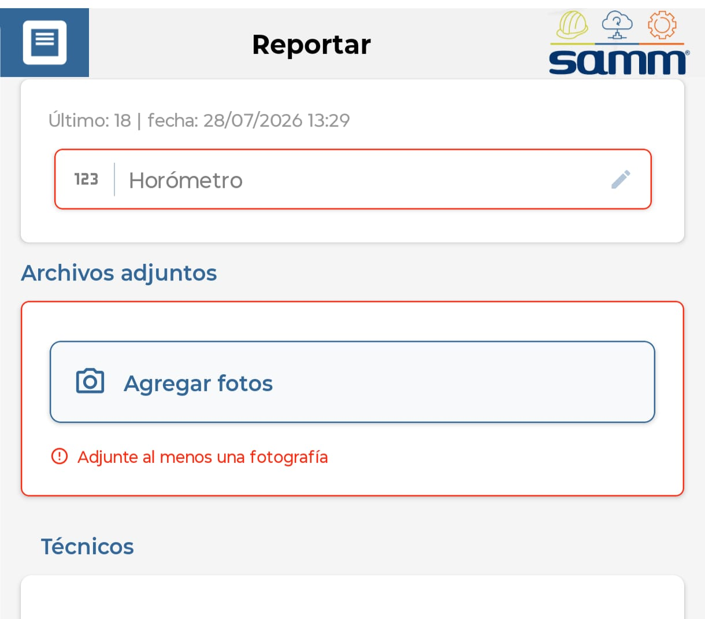
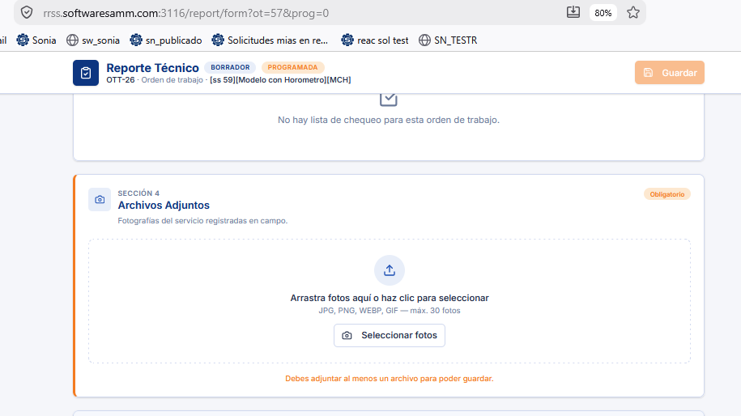

# Controlar obligatoriedad de archivos

Este documento describe cómo habilitar el control de obligatoriedad para los archivos adjuntos 

## Referencias

- [SO-1974: Controlar obligatoriedad de archivos adjuntos según configuración del servicio](https://softwaresamm.atlassian.net/browse/SO-1974)

## Información de Versiones

### Versión de Lanzamiento

:::info **V.3.3.0**
:::

### Versiones Requeridas

| Aplicación | Versión Mínima | Descripción |
| --- | --- | --- |
| Utilitario Reporte Tecnico | >= V.3.3.0 | Utilitario |


## Requisitos Previos

Antes de iniciar la configuración, asegúrese de tener:

- Acceso a SQL Server Management Studio (SSMS) con permisos de modificación sobre procedimientos almacenados en la base de datos de SAMM.
- Conocimiento de la estructura de las vistas `view_ort_programacion`, `view_doc_documento_ot` y `view_equ_equipo`, utilizadas por el procedimiento `mob_bandejaServicios`.
- El App Técnicos instalado en los dispositivos móviles debe estar actualizado a la versión `2.3.2.2` o superior.

:::important Importante
El campo `requiredAttachments` del procedimiento `mob_bandejaServicios` controla la obligatoriedad de los adjuntos que consume la bandeja de servicios. Antes de alterar el procedimiento en producción, valide el cambio en un ambiente de pruebas.
:::

## Información del Servicio

No aplica para esta funcionalidad.

## Configuración

### Paso 1: Localizar el procedimiento almacenado `mob_bandejaServicios` y/o `mob_informacion_basica`

Ubique el procedimiento `mob_bandejaServicios` y/o  `mob_informacion_basica` en la base de datos de SAMM. Estos procedimientos son los que  alimentan la bandeja de servicios del app , pero tambien tenemos el caso del utilitario de reportes donde leera el procedimiento `mob_informacion_basica` para los casos donde no se tiene una programacion previa dicho esto `mob_bandejaServicios` sera consumida por el App Técnicos y contiene el campo que controla si es o no obligatorio adjuntar archivos para la seccion adjuntos y `mob_informacion_basica` sera de ayuda para el caso de no tener una programacion previa y se desee reportar desde el utilitario de reportes.

```sql title="Consulta del procedimiento actual"
sp_helptext 'dbo.mob_bandejaServicios'
sp_helptext 'dbo.mob_informacion_basica'
```

### Paso 2: Habilitar el campo `requiredAttachments`

Dentro de la definición de los procedimientos, ubique el campo `requiredAttachments` en el `SELECT` principal y asegúrese de que su valor sea `'true'`. Este campo es el que determina si es o no obligatorio adjuntar imagenes.

```sql title="Campo requiredAttachments habilitado"
,'true' as requiredAttachments  --- este campo debe decir true para cuando sea obligatorio
```

:::tip Consejo
Si en algún momento se requiere deshabilitar la obligatoriedad para todos los usuarios, basta con cambiar el valor de `requiredAttachments` a `'false'` y volver a alterar el procedimiento.
:::

### Paso 3: Alterar el o los  procedimientos en la base de datos

Con el campo `requiredAttachments` en `'true'`, ejecute el `ALTER PROCEDURE` completo para aplicar el cambio en la base de datos.

```sql title="Alteración del procedimiento mob_bandejaServicios"
ALTER PROCEDURE [dbo].[mob_bandejaServicios]
	@p_id_usuario int ,
	@p_eid varchar(10)
AS
BEGIN
	SET NOCOUNT ON;

SELECT
	view_ort_programacion.id as id_programacion
	,[id_documento.ot] as id_ot
	,view_doc_documento_ot.[doc_documento_ot_prefijo] + '-' + convert(varchar(max),(view_doc_documento_ot.[doc_documento_ot_documento_numero])) as NumOT
	,'Tipo de Servicio: ' + convert(varchar(max),isnull([gen_tipoServicio_tipoServicio],'NA')) + char(10)
	+ 'Cliente: ' + isnull(view_doc_documento_ot.[doc_documento_ot_ter_tercero_cliente_tercero],'NA') + char(10)
	+ 'Sede: ' + isnull(view_doc_documento_ot.[ter_sucursal_sucursal],'NA') + char(10)
	+ 'Contacto: ' + convert(varchar(max),isnull(contacto,'NA')) + char(10)
	+ 'Cargo: ' + convert(varchar(max),isnull(cargo,'NA')) + char(10)
	+ 'Dirección: ' + convert(varchar(max),isnull(direccionUbicacion,'NA')) + char(10)
	+ 'Teléfono: ' + convert(varchar(max),isnull(telefono,'NA')) + char(10)
	+ 'Motivo servicio: ' + convert(varchar(max),isnull(motivoServicio,'NA')) + char(10)
	+ 'Equipo :' + convert(varchar(max),isnull(equipo,'NA')) + char(10)
	+ 'Serial:' + convert(varchar(max),isnull(equipo_serial,'NA')) + char(10)
	+ 'Prioridad : ' + convert(varchar(max),isnull(doc_documento_ot_doc_prioridadDocumento_prioridadDocumento,'NA')) + char(10)
	 as Ubicacion
	,isnull(view_equ_equipo.equipo,'') + convert(varchar(max),isnull(equipo_serial,'NA')) as Equipo
	,isnull(view_equ_equipo.id,0) as id_equipo
	,isnull(view_equ_equipo.equipo_serial,'')
	,isnull(view_equ_equipo.[cat_catalogo.equipo_manejahorometro],'false') as ConHorometro
	,convert(varchar(30),isnull(view_equ_equipo.[ultimalectura_fh],0),126) as FechaHorometro
	,isnull(view_equ_equipo.[HorometroActual],0) as ValorHorometro
	,convert(varchar(30),desde_fh,126) HoraInicio
	,convert(varchar(30),hasta_fh,126) HoraFin
	,comentario
	,'' as img
	,view_doc_documento_ot.[doc_documento_ot_id_subtipoDocumento] as id_subtipoDocumento
	,view_doc_documento_ot.[doc_documento_ot_id_estadoTipoDocumento] as id_estadoTipoDocumento
	,'true' as editarActividades
	,'true' as pedirCronometro 
	,'false' as firmaObligatoria
	,'0.1' as imgPorcentaje --Calidad
	,'3000' as imageMaxWidth --Ancho
	,'4000' as imageMaxHeight --Altura
	,'true' as requiredAttachments -- este campo es el que debe estar en true o false para Requerir adjuntos

FROM
	view_ort_programacion
	inner join view_doc_documento_ot on view_ort_programacion.[id_documento.ot]=view_doc_documento_ot.id
	left join view_equ_equipo on view_equ_equipo.id=view_doc_documento_ot.id_equipo

WHERE
	id_usuario=@p_id_usuario
	and desde_fh >= dateadd(day,-180,GETDATE())
	and id_tipoprogramacion in (3)
	and view_doc_documento_ot.doc_documento_ot_id_estadoTipoDocumento not in (11,12)
	AND (
		(
			ISNULL(view_ort_programacion.id_programacion, 0) = 0
			AND EXISTS (
				SELECT 1
				FROM ort_programacion hija
				WHERE hija.id_programacion = view_ort_programacion.id
				AND ISNULL(hija.[id_catalogo.actividad], 0) > 0
				AND hija.active = 1
			)
		)
		OR
		(
			ISNULL(view_ort_programacion.id_programacion, 0) = 0
			AND NOT EXISTS (
				SELECT 1
				FROM ort_programacion hija
				WHERE hija.id_programacion = view_ort_programacion.id
				AND ISNULL(hija.[id_catalogo.actividad], 0) > 0
				AND hija.active = 1
			)
		)
		OR
		(
			ISNULL(view_ort_programacion.id_programacion, 0) > 0
			AND ISNULL(view_ort_programacion.[id_catalogo.actividad], 0) = 0
			AND NOT EXISTS (
				SELECT 1
				FROM ort_programacion hermana
				WHERE hermana.id_programacion = view_ort_programacion.id_programacion
				AND ISNULL(hermana.[id_catalogo.actividad], 0) > 0
				AND hermana.active = 1
			)
		)
	)
END
```
```sql title="Alteración del procedimiento mob_informacion_basica"
ALTER  PROCEDURE [dbo].[mob_informacion_basica] 
	@p_id_usuario int ,
	@p_id_ot int
AS
BEGIN
	SET NOCOUNT ON;

	SELECT 
		view_doc_documento_ot.id as id_ot 
		,view_doc_documento_ot.[doc_documento_ot_prefijo] + '-' + convert(varchar(max),(view_doc_documento_ot.[doc_documento_ot_documento_numero])) as NumOT 
		,isnull(view_equ_equipo.equipo,'') as Equipo 
		,isnull(view_equ_equipo.id,0) as id_equipo
		,isnull(view_equ_equipo.[cat_catalogo.equipo_manejahorometro],'false') as ConHorometro
		,convert(varchar(30),isnull(view_equ_equipo.[ultimalectura_fh],0),126) as FechaHorometro
		,isnull(view_equ_equipo.[HorometroActual],0) as ValorHorometro
		,convert(varchar(30),dateadd(hour,-1,getdate()),126) HoraInicio
		,convert(varchar(30),getdate(),126) HoraFin
		,'' as comentario
		,view_doc_documento_ot.[doc_documento_ot_id_subtipoDocumento] as id_subtipoDocumento
		,view_doc_documento_ot.doc_documento_ot_doc_subtipoDocumento_subtipoDocumento as subtipoDocumento
		,view_doc_documento_ot.[doc_documento_ot_id_estadoTipoDocumento] as id_estadoTipoDocumento
		,view_doc_documento_ot.doc_documento_ot_doc_estadoTipoDocumento_estadoTipoDocumento as estadoTipoDocumento
		,'false' as firmaObligatoria
		, 'true' as requiredAttachments --Requerir adjuntos

	FROM 
		view_doc_documento_ot
		left join view_equ_equipo on view_equ_equipo.id=view_doc_documento_ot.id_equipo

	WHERE 
	view_doc_documento_ot.id = @p_id_ot
END
```


:::note Información
Una vez ejecutado el `ALTER PROCEDURE`, el cambio queda activo de forma inmediata. No se requiere reiniciar servicios adicionales, ya que la bandeja de servicios se consulta en tiempo real desde la app. Para el caso del utilitario de reportes este se consulta cada que se de click en el boton de reportar o reporte dinamico segun parametrizacion del consultor o las preferencias del usuario.
:::

### Paso 4: visualizar el campo obligatorio






:::note Información
Comparto video de apoyo https://youtu.be/JoB_i_Wm5h0
:::
## Casos Especiales

No aplica para esta funcionalidad.

## Resultado Esperado

Una vez completada la configuración:

1. **Campo archivos adjuntos como obligatorio**: al ingresar a la sección de archivos adjuntos del utilitario de reportes o del app debe mostrarse resaltado en rojo como se ve en las imagenes anteriores .

## Resolución de Problemas

### Seccion de archivos no es obligatorio
Verifique que:

- El campo `requiredAttachments ` en el procedimiento `mob_bandejaServicios` esté efectivamente en `'true'`.
- El `ALTER PROCEDURE` se haya ejecutado sin errores sobre la base de datos correcta.

## Errores Conocidos

No aplica para esta funcionalidad.

