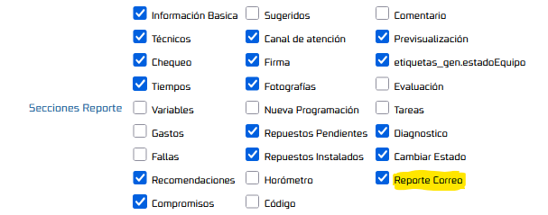
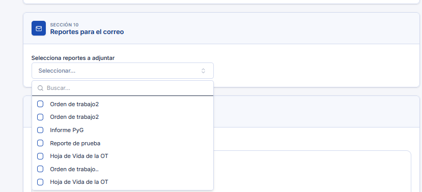

# Reportes Adicionales para el Correo

Esta funcionalidad permite al técnico visualizar, desde el flujo de reporte del **Utilitario de
Reporte Técnico (RT Web)**, un listado de reportes adicionales disponibles para seleccionar e
incluir como adjuntos en el correo que se envía junto con el reporte técnico principal. El objetivo
funcional es brindar mayor flexibilidad en el envío de información, permitiendo que el correo
generado contenga toda la documentación relevante para el destinatario, sin limitarse únicamente al
PDF del reporte técnico.

## Referencias

- [SO-212: OTT3453 ROCA | Texto enriquecido y Envío de varios formatos RM y RA](https://softwaresamm.atlassian.net/browse/SO-212)
- [SO-518: OTT - 3576 | Envío de varios formatos RM y RA](https://softwaresamm.atlassian.net/browse/SO-518)
- [SO-2119: Enviar reportes adicionales seleccionados dentro del JSON de reporte](https://softwaresamm.atlassian.net/browse/SO-2119)
- [SO-2120: Habilitar parámetro para controlar visualización de reportes adicionales para el Utilitario de Reporte Técnico](https://softwaresamm.atlassian.net/browse/SO-2120)
- [SO-2121: Exponer listado de reportes disponibles independientemente de la herramienta configurada](https://softwaresamm.atlassian.net/browse/SO-2121)
- [SO-2122: Procesar reportes adicionales seleccionados en el servicio de reportar](https://softwaresamm.atlassian.net/browse/SO-2122)
- [SO-2152: OTT - 3576 | Envío de varios formatos RM y RA](https://softwaresamm.atlassian.net/browse/SO-2152)

## Información de Versiones

### Versión de Lanzamiento

:::info **V.4.3.0.0**
:::

### Versiones Requeridas

| Aplicación    | Versión Mínima | Descripción                      |
| ------------- | --------------- | ---------------------------------- |
| SAMMAPI       | >= 1.2.33.1     | API principal                      |
| SAMMNEW       | >= 7.1.17.0     | Aplicación web (incluye RT Web)   |
| SAMM LOGICA   | >= 5.6.26.7     | Lógica de negocio                  |
| SAMM CORE     | >= 2.0.27.0     | Core del sistema                   |
| CAPA DATOS    | >= 2.1.18.0     | Capa de acceso a datos             |
| BASE DE DATOS | >= C2.1.18.0    | Base de datos                      |

## Requisitos Previos

Antes de iniciar la configuración, asegúrese de tener:

- La plataforma con los envíos de correo configurados
- El documento Orden de Trabajo con los formatos de impresión configurados
- Acceso a SQL Server Management Studio (SSMS) con permisos de modificación sobre procedimientos
  almacenados en la base de datos de SAMM
- Si también desea habilitar la sección en App Técnicos, la app instalada en los dispositivos
  móviles debe estar actualizada a una versión compatible con `mob_bandejaServicios`
- Identificar qué herramienta de generación de reportes está en uso: **Reporting Services (SR)** o
  **Reporte Clásico (sobre SN)**, ya que esto determina la base de datos donde deben ejecutarse los
  procedimientos `_obtenerFormatosCodigo` y `_obtenerReportesPorCodigoObjeto`
- Parámetro **Reporte Correo** activo, desde el menú `Configuración - Aplicación - Parámetros
  Generales - tab OTS`



A continuación se muestra la imagen de cómo se ve la sección una vez habilitada:



:::important Importante
Esta funcionalidad requiere las versiones mínimas especificadas en la tabla anterior. Verifique sus
versiones actuales antes de continuar.
:::

:::important Importante
El envío simultáneo de varios formatos (registro del reporte + selección de varios formatos) **solo
es compatible** con la regla de envío de correo `9-appSamm` en estrategia `1`. Cualquier otra regla
no soporta este proceso simultáneo.
:::

:::warning Precaución — Base de datos de ejecución según el motor de reportes
Los procedimientos `_obtenerFormatosCodigo` y `_obtenerReportesPorCodigoObjeto` deben crearse/validarse
en la base de datos correcta según la herramienta de reportes utilizada como complemento:

- **Reporting Services (SR) como complemento**: Reporting Services maneja su **propia base de
  datos** para agrupar los reportes. En este caso, ambos procedimientos deben ejecutarse en dicha
  base de datos de Reporting Services, no en la base de datos SN.
- **Reporte Clásico**: Si se utiliza el reporte clásico, los procedimientos se ejecutan en la
  **misma base de datos SN**.

Antes de aplicar los pasos de configuración, confirme cuál es el motor de reportes configurado para
el entorno, ya que ejecutar los procedimientos en la base de datos incorrecta impedirá que el
listado de formatos se obtenga correctamente.
:::

## Información del Servicio

:::note Información
El procedimiento `mob_informacion_basica` (consultado por RT Web cuando no existe una programación
previa) debe exponer la propiedad `additionalReportsCode`. Ese código es el que **controla la
visibilidad** de la sección "Reportes para el correo": si trae un valor, la aplicación la muestra y
la usa como filtro al consultar `_obtenerReportesPorCodigoObjeto`. Para que App Técnicos comparta el
mismo comportamiento, el campo debe agregarse también en `mob_bandejaServicios`.
:::

```sql title="mob_informacion_basica — exponer additionalReportsCode"
CREATE OR ALTER PROCEDURE [dbo].[mob_informacion_basica]
	@p_id_usuario int ,
	@p_id_ot int
AS
BEGIN
	SET NOCOUNT ON;

	SELECT
		view_doc_documento_ot.id as id_ot
		,view_doc_documento_ot.[doc_documento_ot_prefijo] + '-' + convert(varchar(max),(view_doc_documento_ot.[doc_documento_ot_documento_numero])) as NumOT
		,isnull(view_equ_equipo.equipo,'') as Equipo
		,isnull(view_equ_equipo.id,0) as id_equipo
		,isnull(view_equ_equipo.[cat_catalogo.equipo_manejahorometro],'false') as ConHorometro
		,convert(varchar(30),isnull(view_equ_equipo.[ultimalectura_fh],0),126) as FechaHorometro
		,isnull(view_equ_equipo.[HorometroActual],0) as ValorHorometro
		,convert(varchar(30),dateadd(hour,-1,getdate()),126) HoraInicio
		,convert(varchar(30),getdate(),126) HoraFin
		,'' as comentario
		,view_doc_documento_ot.[doc_documento_ot_id_subtipoDocumento] as id_subtipoDocumento
		,view_doc_documento_ot.doc_documento_ot_doc_subtipoDocumento_subtipoDocumento as subtipoDocumento
		,view_doc_documento_ot.[doc_documento_ot_id_estadoTipoDocumento] as id_estadoTipoDocumento
		,view_doc_documento_ot.doc_documento_ot_doc_estadoTipoDocumento_estadoTipoDocumento as estadoTipoDocumento
		,'false' as firmaObligatoria
		,'true' as requiredAttachments --Requerir adjuntos
		,'doc_documento_ot' as additionalReportsCode --SO-2152: código que reciben los SPs de reportes para armar el listado

	FROM
		view_doc_documento_ot
		left join view_equ_equipo on view_equ_equipo.id=view_doc_documento_ot.id_equipo

	WHERE
	view_doc_documento_ot.id = @p_id_ot
END
```


`_obtenerFormatosCodigo` devuelve el código correspondiente al `id` del documento sobre el cual se
está realizando el reporte técnico. Aplica únicamente cuando `@p_codigo` sigue el patrón
`doc_documento_%` con exactamente dos guiones bajos.

```sql title="_obtenerFormatosCodigo"
CREATE PROCEDURE [dbo].[_obtenerFormatosCodigo]
	@p_codigo AS VARCHAR(50),
	@p_id_objeto AS INT,
	@p_id_usuario AS INT,
	@p_eid AS VARCHAR(50)
AS
BEGIN
	IF @p_codigo LIKE 'doc_documento_%' AND LEN(@p_codigo) - LEN(REPLACE(@p_codigo, '_', '')) = 2
	BEGIN
		SELECT 
			doc_subtipoDocumento.subtipoDocumento_codigo AS codigo
		FROM doc_documento
			INNER JOIN doc_subtipoDocumento
		ON doc_documento.id_subtipoDocumento = doc_subtipoDocumento.id
		WHERE 
			doc_documento.id = @p_id_objeto AND
			doc_documento.active = 1 AND
			doc_subtipoDocumento.active = 1 AND
			doc_documento.eid = @p_eid AND
			doc_subtipoDocumento.eid = @p_eid
	END
	ELSE
	BEGIN
		SELECT 
			'' AS codigo
		WHERE 
			1 = 0
	END
END
```

```sql title="Ejemplo de ejecución"
_obtenerFormatosCodigo
	@p_codigo = 'doc_documento_ot',
	@p_id_objeto = 47, -- id de la OT
	@p_id_usuario = 1,
	@p_eid = '01'
```

`_obtenerReportesPorCodigoObjeto` recibe el `additionalReportsCode` (o la tabla `@p_codigos`) y
devuelve los formatos activos de `rep_reporte` categorizados en `rep_reporte_categoria` para ese
código.

```sql title="_obtenerReportesPorCodigoObjeto"
CREATE OR ALTER PROCEDURE [dbo].[_obtenerReportesPorCodigoObjeto]
    @p_codigo VARCHAR(50),
    @p_codigos dbo.typ_text READONLY,
    @p_eid VARCHAR(50)
AS
BEGIN
    SET NOCOUNT ON;

    IF EXISTS (SELECT 1 FROM @p_codigos)
    BEGIN
        SELECT rep_reporte.*
        FROM rep_reporte_categoria
        INNER JOIN @p_codigos AS codigos
            ON rep_reporte_categoria.reporte_categoria = codigos.[text]
        INNER JOIN rep_reporte
            ON rep_reporte_categoria.id_reporte = rep_reporte.id
        WHERE rep_reporte.esFormato = 1
            AND rep_reporte_categoria.active = 1
            AND rep_reporte.active = 1
            AND rep_reporte_categoria.eid = @p_eid
            AND rep_reporte.eid = @p_eid;
    END
    ELSE IF @p_codigo = 'util_doc_documento_ot'
    BEGIN
        SELECT rep_reporte.*
        FROM rep_reporte_categoria
        INNER JOIN rep_reporte
            ON rep_reporte_categoria.id_reporte = rep_reporte.id
        WHERE rep_reporte_categoria.reporte_categoria = @p_codigo
            AND rep_reporte.esFormato = 1
            AND rep_reporte_categoria.active = 1
            AND rep_reporte.active = 1
            AND rep_reporte_categoria.eid = @p_eid
            AND rep_reporte.eid = @p_eid
            AND rep_reporte.id in (1,2);
    END
    ELSE
    BEGIN
        SELECT rep_reporte.*
        FROM rep_reporte_categoria
        INNER JOIN rep_reporte
            ON rep_reporte_categoria.id_reporte = rep_reporte.id
        WHERE rep_reporte_categoria.reporte_categoria = @p_codigo
            AND rep_reporte.esFormato = 1
            AND rep_reporte_categoria.active = 1
            AND rep_reporte.active = 1
            AND rep_reporte_categoria.eid = @p_eid
            AND rep_reporte.eid = @p_eid;
    END
END
GO
```

```sql title="Ejemplo de ejecución"
declare @p_codigos as dbo.typ_text

insert into @p_codigos values ('OTT')

execute _obtenerReportesPorCodigoObjeto
    @p_codigo = 'doc_documento.ot',
    @p_codigos = @p_codigos,
    @p_eid = '01'
```

:::tip Consejo
La rama `util_doc_documento_ot` del SP es un ejemplo de caso especial: restringe el listado a
reportes puntuales (`rep_reporte.id in (1,2)`) para ese código específico. Use esta rama como
plantilla si necesita acotar el listado de reportes disponibles para un código de objeto en
particular. Igualmente, la tabla `@p_codigos` permite personalizar qué categorías de reportes se
muestran (por ejemplo, `'OTT'`).
:::

:::warning Precaución
Debe garantizarse que los formatos a mostrar cumplan con lo siguiente:

1. Que el o los reportes se puedan generar sin novedad, ya sea que estén configurados en la regla de
   envío de correo o como formato adicional.
2. Que no exista conflicto con el nombre del PDF. Para más detalle, consulte la [documentación de
   nomenclatura de PDF](https://softwaresamm.github.io/IDAE.Docs/docs/util-reportes/PDF-name?_highlight=nombre).
:::

## Casos Especiales

:::note Comportamientos Predefinidos
El comportamiento de la sección "Reportes para el correo" depende directamente del valor de
`additionalReportsCode` devuelto por `mob_informacion_basica` (RT Web) o `mob_bandejaServicios` (App
Técnicos).
:::

| Caso                                              | Campo/Valor                                | Descripción                                                                                        |
| --------------------------------------------------- | --------------------------------------------- | ------------------------------------------------------------------------------------------------------ |
| `additionalReportsCode` con valor                  | ej. `'doc_documento_ot'`                    | La aplicación muestra la sección y consulta `_obtenerReportesPorCodigoObjeto` con ese código para listar los reportes disponibles |
| Técnico no selecciona ningún reporte adicional     | `reporteCorreo` ausente o vacío en el JSON  | El correo se envía únicamente con el PDF del reporte técnico, igual al comportamiento actual         |

## Configuración

### Paso 1: Validar el procedimiento `_obtenerFormatosCodigo`

Confirme que el SP `_obtenerFormatosCodigo` exista y devuelva el código de formato correspondiente
al documento reportado.

:::note Ubicación del procedimiento
Cree o valide este procedimiento en la base de datos de **Reporting Services** si esa es la
herramienta de reportes en uso; si se maneja **reporte clásico**, créelo o valídelo en la base de
datos **SN**.
:::

### Paso 2: Definir el código en `mob_informacion_basica` (y `mob_bandejaServicios` si aplica App Técnicos)

Agregue la propiedad `additionalReportsCode` al `SELECT` del SP `mob_informacion_basica` con el
código que identificará el listado de reportes para el objeto. Si además quiere habilitar la
sección en App Técnicos, replique el mismo campo en `mob_bandejaServicios`.

### Paso 3: Configurar `_obtenerReportesPorCodigoObjeto` y la categorización de reportes

Verifique que exista el SP `_obtenerReportesPorCodigoObjeto`. Luego categorice en
`rep_reporte_categoria` los reportes (`rep_reporte`, con `esFormato = 1` y `active = 1`) que deben
aparecer para el código definido en el Paso 2, usando la misma cadena en `reporte_categoria`.

:::note Ubicación del procedimiento
Al igual que en el Paso 1, este procedimiento debe ejecutarse en la base de datos de **Reporting
Services** cuando esa sea la herramienta de reportes configurada, o en la base de datos **SN** cuando
se utilice el reporte clásico.
:::

:::tip Consejo
El listado de reportes es independiente de la herramienta de generación configurada (ReportViewer o
SSRS 2022) — el SP solo filtra sobre `rep_reporte`/`rep_reporte_categoria`; lo que sí varía según la
herramienta es la **base de datos** en la que debe residir el propio procedimiento (ver precaución
arriba).
:::

### Paso 4: Validar requisitos previos

Confirme que la plataforma tenga configurados los envíos de correo, que el documento Orden de
Trabajo tenga configurados los formatos de impresión, y que el parámetro **Reporte Correo** esté
activo en `Configuración - Aplicación - Parámetros Generales - tab OTS`.

## Resultado Esperado

Una vez completada la configuración:

1. **Visualización de la sección**: en el flujo de reporte de RT Web (o App Técnicos), dentro de
   "Reportes para el correo", el técnico ve un campo de selección múltiple con los reportes
   entregados por `_obtenerReportesPorCodigoObjeto`
2. **Selección enviada al servidor**: los reportes seleccionados se incluyen en el JSON de reporte
   bajo la propiedad `reporteCorreo` como un arreglo de IDs, por ejemplo `"reporteCorreo": [2,3]`
3. **Correo con adjuntos consolidados**: el correo final incluye tanto el formato configurado en la
   regla de correo como los reportes adicionales seleccionados por el técnico
4. **Sin selección, sin cambios**: si el técnico no selecciona ningún reporte adicional, el correo
   se envía igual que antes, solo con el PDF del reporte técnico

### Sección "Reportes para el correo"


## Resolución de Problemas

### La sección "Reportes para el correo" no aparece

Verifique que:

- `mob_informacion_basica` (o `mob_bandejaServicios` en App Técnicos) esté devolviendo
  `additionalReportsCode` con un valor no vacío
- La versión instalada sea >= V.4.3.0.0
- El parámetro **Reporte Correo** esté activo en `Configuración - Aplicación - Parámetros
  Generales - tab OTS`
- La OT consultada corresponda al mismo objeto configurado en el código

### El listado de reportes aparece vacío

Confirme que:

- Existan registros en `rep_reporte_categoria` con `reporte_categoria` igual al
  `additionalReportsCode` configurado
- Los reportes asociados en `rep_reporte` tengan `esFormato = 1` y `active = 1`
- Los procedimientos `_obtenerFormatosCodigo` y `_obtenerReportesPorCodigoObjeto` estén ejecutándose
  contra la base de datos correcta: la de Reporting Services si esa es la herramienta configurada, o
  la base de datos SN si se usa reporte clásico

### El correo no llega con los reportes adicionales adjuntos

Revise que:

- El JSON enviado al servicio de reportar incluya la propiedad `reporteCorreo` con los IDs
  seleccionados
- Los envíos de correo estén correctamente configurados en la plataforma
- El documento Orden de Trabajo tenga configurados los formatos de impresión requeridos
- No exista conflicto en el nombre generado para el PDF, según la documentación de nomenclatura
  referenciada

## Errores Conocidos

No aplica para esta funcionalidad.

## QA — Pruebas

**Escenario 1: Obtención del código de formato de una OT**

1. Ejecutar `_obtenerFormatosCodigo` con `@p_codigo = 'doc_documento_ot'` y el `@p_id_objeto` de una
   OT activa, en la base de datos correspondiente según el motor de reportes en uso.
2. **Resultado esperado**: El procedimiento retorna el `subtipoDocumento_codigo` correspondiente a
   la OT consultada.

**Escenario 2: Visualización y selección de reportes adicionales**

1. Habilitar el parámetro **Reporte Correo** y configurar `additionalReportsCode` en
   `mob_informacion_basica` (o `mob_bandejaServicios`).
2. Ingresar al flujo de reporte de RT Web (o App Técnicos) para la OT correspondiente.
3. **Resultado esperado**: La sección "Reportes para el correo" muestra el listado de reportes
   entregado por `_obtenerReportesPorCodigoObjeto`; al seleccionar reportes, estos se incluyen en el
   JSON bajo `reporteCorreo` y el correo final los adjunta junto al PDF principal.