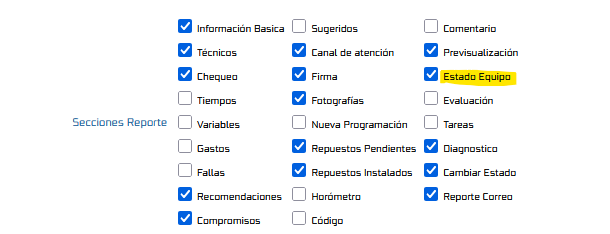
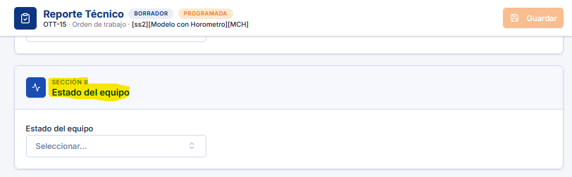

# Cambio de Estado del Equipo en la Orden de Trabajo

Este documento describe cómo habilitar el parámetro que controla la visibilidad de la sección **Estado Equipo** al reportar una orden de trabajo desde el Utilitario de Reporte Tecnico, permitiendo mostrar dicha sección únicamente cuando la orden de trabajo tiene un equipo asociado.

## Referencias

- [SO-2175: Mostrar sección de cambio de estado del equipo al habilitar el parámetro correspondiente](https://softwaresamm.atlassian.net/browse/SO-2175)
- [SO-2153: Mostrar sección de cambio de estado del equipo al habilitar el parámetro correspondiente](https://softwaresamm.atlassian.net/browse/SO-2153)

## Información de Versiones

### Versión de Lanzamiento

:::info **v2.3.6.2**
:::

### Versiones Requeridas

| Aplicación    | Versión Mínima | Descripción              |
| ------------- | -------------- | ------------------------ |
| APP           | >= 2.3.6.2     | Aplicación móvil         |
| SAMMNEW       | >= 7.1.16.3    | Aplicación web           |
| SAMM LOGICA   | >= 5.6.26.6    | Lógica de negocio        |
| SAMM CORE     | >= 2.0.27.0    | Core del sistema         |
| SAMMAPI       | >= 1.2.33.0    | API principal            |
| CAPA DE DATOS | >= 2.1.17.2    | Capa de datos            |
| BASE DE DATOS | >= C2.1.17.2   | Base de datos            |

## Requisitos Previos

Antes de iniciar la configuración, asegúrese de tener:

- Acceso al módulo `Configuración - Aplicación - Parámetros Generales`.
- Permisos de administrador para modificar parámetros generales del sistema.
- Conocimiento de la estructura de `Secciones Reporte` dentro del tab `OTS`.

:::important Importante
La sección **Estado Equipo** solo se mostrará al reportar si la orden de trabajo tiene un equipo asociado. Si la orden de trabajo no tiene equipo, la sección permanecerá oculta aunque el parámetro esté habilitado.
:::

## Información del Servicio

No aplica para esta funcionalidad.

## Configuración

### Paso 1: Habilitar la sección Estado Equipo

Diríjase a `Configuración - Aplicación - Parámetros Generales`, seleccione el tab `OTS` y luego ingrese a `Secciones Reporte`. En el listado de secciones disponibles para reportar, ubique la opción `Estado Equipo` y habilítela.

### Paso 2: Visualizar la sección Estado Equipo

Una vez configurado al momento de reportar si la orden de trabajo cuenta con un equipo asociado se debe mostrar la respectiva seccion 

:::tip Consejo
Verifique que la orden de trabajo tenga un equipo asociado antes de probar el reporte; de lo contrario, la sección no se mostrará aunque el parámetro esté activo.
:::

## Casos Especiales

No aplica para esta funcionalidad.

## Resultado Esperado

Una vez completada la configuración:

1. **Visibilidad condicional**: La sección `Estado Equipo` se mostrará al reportar la orden de trabajo únicamente cuando esta tenga un equipo asociado.
2. **Ocultamiento automático**: Si la orden de trabajo no tiene equipo asociado, la sección `Estado Equipo` no se mostrará, incluso con el parámetro habilitado.

## Resolución de Problemas

### La sección Estado Equipo no aparece al reportar

Verifique que:

- El parámetro `Estado Equipo` esté habilitado en `Configuración - Aplicación - Parámetros Generales - OTS - Secciones Reporte`.
- La orden de trabajo tenga un equipo asociado.
- La versión de APP instalada sea `>= 2.3.6.2`.

### Los cambios no se reflejan tras habilitar el parámetro

Confirme que:

- La configuración de `Parámetros Generales` se haya guardado correctamente.
- La aplicación móvil se haya sincronizado o reiniciado después del cambio.

## Errores Conocidos

No aplica para esta funcionalidad.

## QA — Pruebas

**Escenario 1: Orden de trabajo con equipo asociado**

1. Habilitar el parámetro `Estado Equipo` en `Parámetros Generales - OTS - Secciones Reporte`.
2. Ingresar a reportar una orden de trabajo que tenga un equipo asociado.
3. **Resultado esperado**: La sección `Estado Equipo` se muestra correctamente en el reporte.

**Escenario 2: Orden de trabajo sin equipo asociado**

1. Con el parámetro `Estado Equipo` habilitado, ingresar a reportar una orden de trabajo que **no** tenga equipo asociado.
2. **Resultado esperado**: La sección `Estado Equipo` no se muestra, a pesar de estar habilitado el parámetro.