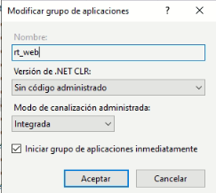

# Configuración del Utilitario de Reporte Técnico (RT Web)

Este documento describe cómo configurar e instalar el **Utilitario de Reporte Técnico (RT Web)**, una nueva funcionalidad que digitaliza el reporte dinámico del técnico en un entorno web, replicando todas las capacidades disponibles en la aplicación móvil (información general, técnicos, repuestos instalados y sugeridos, adjuntos, firma, checklist, ubicación y canal de atención), con la excepción de que **no cuenta con soporte de trabajo fuera de línea**.

## Referencias

- [SO-703: Sección: Información General](https://softwaresamm.atlassian.net/browse/SO-703)
- [SO-711: Envío de ubicación al reportar](https://softwaresamm.atlassian.net/browse/SO-711)
- [SO-712: Manejo de canal de atención](https://softwaresamm.atlassian.net/browse/SO-712)
- [SO-713: Sección de técnicos](https://softwaresamm.atlassian.net/browse/SO-713)
- [SO-717: Sección de repuestos instalados](https://softwaresamm.atlassian.net/browse/SO-717)
- [SO-718: Sección de repuestos sugeridos](https://softwaresamm.atlassian.net/browse/SO-718)
- [SO-727: Sección de adjuntos](https://softwaresamm.atlassian.net/browse/SO-727)
- [SO-731: Sección firma principal](https://softwaresamm.atlassian.net/browse/SO-731)
- [SO-737: Sección de Checklist](https://softwaresamm.atlassian.net/browse/SO-737)
- [SO-740: Limpieza de estado al reportar](https://softwaresamm.atlassian.net/browse/SO-740)
- [SO-752: Envío de identificador en adjuntos](https://softwaresamm.atlassian.net/browse/SO-752)

## Información de Versiones

### Versión de Lanzamiento

:::info **V.3.1.0**
:::

### Versiones Requeridas

| Aplicación    | Versión Mínima | Descripción                          |
| ------------- | --------------- | ------------------------------------- |
| SAMMAPI       | >= 1.2.29.0     | API principal                         |
| SAMM NEW      | >= 7.1.13.0     | Aplicación web (incluye RT Web)       |
| SAMM LOGICA   | >= 5.6.26.1     | Lógica de negocio                     |
| SAMM CORE     | >= 2.0.23.1     | Core del sistema                      |
| CAPA DE DATOS | >= 2.1.14.0     | Capa de acceso a datos                |
| BASE DE DATOS | >= C2.1.11.0    | Base de datos                         |
| RECURSOS      | -               | No aplica versión mínima para este release |

## Requisitos Previos

Antes de iniciar la configuración, asegúrese de tener:

- Acceso administrativo al **IIS Manager** del servidor donde se desplegará la solución.
- Permisos para crear grupos de aplicaciones y sitios/aplicaciones dentro de IIS.
- Acceso al sistema de archivos del despliegue para editar el archivo `.env`.
- Conocimiento de la URL pública específica del cliente (dominio, puerto y protocolo).
- Acceso al `web.config` del sitio `sn` para agregar la clave de configuración correspondiente.

:::important Importante
Las URLs configuradas en `NEXT_PUBLIC_API_URL` y `NEXTAUTH_URL` **varían según el cliente** donde se realice la instalación. Deben apuntar al dominio, puerto y `base path` reales del entorno, o la autenticación fallará.
:::

## Información del Servicio

No aplica para esta funcionalidad.

## Configuración

### Paso 1: Crear el grupo de aplicaciones en IIS

Cree un nuevo grupo de aplicaciones independiente en IIS, dedicado exclusivamente a **RT Web**. Se recomienda nombrarlo `rt_web`.

Configure el grupo de aplicaciones con los siguientes valores:

| Parámetro                              | Valor                        |
| --------------------------------------- | ----------------------------- |
| Nombre                                  | `rt_web`                      |
| Versión de .NET CLR                     | Sin código administrado       |
| Modo de canalización administrada       | Integrada                     |
| Iniciar grupo de aplicaciones inmediatamente | ✅ Habilitado             |



:::tip Consejo
Mantener `rt_web` como un grupo de aplicaciones **independiente** (no compartido con otros sitios como `SAMMAPI` o `SAMM NEW`) evita conflictos de reciclaje de procesos y facilita el diagnóstico de fallos.
:::

### Paso 2: Agregar la aplicación RT Web en IIS

Agregue la aplicación `rt_web` en IIS de la misma manera en que se agregan los demás productos del ecosistema SAMM (`samm_new`, `sammapi`, etc.), asociándola al grupo de aplicaciones creado en el Paso 1.

### Paso 3: Configurar el archivo `.env`

Edite el archivo `.env` del despliegue de RT Web con las siguientes variables:

```bash title="Archivo .env de RT Web"
# URL de la API de SAMM. Varía según el cliente donde se instale.
NEXT_PUBLIC_API_URL=https://tucliente:8443/sa_api/api

# Base path de la aplicación
NEXT_PUBLIC_BASE_PATH=/rt_web

# CRITICAL: debe ser la URL pública completa incluyendo el base path.
# Sin esto, NextAuth construye las callback URLs sin /rt_web y
# redirige a /api/auth/error en lugar de /rt_web/api/auth/error.
NEXTAUTH_URL=https://tucliente:8443/rt_web

NEXTAUTH_SECRET=valor_llave_secreta
```

:::warning Precaución
`NEXT_PUBLIC_API_URL` y `NEXTAUTH_URL` deben ajustarse al dominio y puerto reales del cliente en cada instalación. No reutilizar estos valores de ejemplo en producción.
:::

:::important Importante
`NEXTAUTH_URL` **debe** incluir el `base path` completo (`/rt_web`). Omitirlo provoca que las callback URLs de autenticación se generen de forma incorrecta, causando redirecciones a `/api/auth/error` en vez de `/rt_web/api/auth/error`.
:::

### Paso 4: Verificar el archivo `web.config`

El archivo `web.config` de la aplicación **se deja tal como se encuentra por defecto**, ya que al compilar, la aplicación toma sus valores de configuración directamente desde el archivo `.env` configurado en el Paso 3.

:::note Información
No se requiere modificar el `web.config` propio de la aplicación `rt_web`. Cualquier cambio de configuración debe realizarse únicamente en el `.env`.
:::

### Paso 5: Agregar la llave `urlTechnicalReport` en el sitio SN

En el `web.config` del sitio `sn`, agregue la siguiente llave para habilitar el enlace hacia el nuevo reporte técnico web:

```xml title="web.config del sitio sn"
<add key="urlTechnicalReport" value="https://tucliente:8443/rt_web/" />
```

:::important Importante
El valor de `urlTechnicalReport` debe apuntar a la misma URL pública configurada en `NEXTAUTH_URL` (Paso 3), incluyendo el `/` final, o el enlace desde el sitio `sn` no resolverá correctamente.
:::

## Casos Especiales

No aplica para esta funcionalidad.

## Resultado Esperado

Una vez completada la configuración:

1. **Sitio RT Web accesible**: La aplicación `rt_web` responde correctamente en la URL pública configurada (`https://tucliente:8443/rt_web/`).
2. **Autenticación funcional**: El inicio de sesión mediante NextAuth completa el flujo de callback sin redirigir a `/api/auth/error`.
3. **Reporte dinámico completo**: El técnico puede completar el reporte web con todas las secciones equivalentes a la app móvil: información general, técnicos, repuestos instalados y sugeridos, adjuntos, firma, checklist, ubicación y canal de atención.
4. **Enlace desde SN**: El sitio `sn` muestra y redirige correctamente al Utilitario de Reporte Técnico mediante la clave `urlTechnicalReport`.
5. **Sin soporte offline**: A diferencia de la app móvil, el reporte web **requiere conexión activa** para funcionar; no persiste datos en caso de pérdida de conectividad.

## Resolución de Problemas

### El sitio redirige a `/api/auth/error`

Verifique que:

- `NEXTAUTH_URL` en el `.env` incluya el `base path` completo (`/rt_web`)
- El dominio y puerto en `NEXTAUTH_URL` coincidan exactamente con la URL pública real del cliente.
- `NEXTAUTH_SECRET` esté definido y no haya sido alterado tras el despliegue.

### RT Web no carga o muestra errores 404

Verifique que:

- `NEXT_PUBLIC_BASE_PATH` esté configurado como `/rt_web`.
- El grupo de aplicaciones `rt_web` esté iniciado y en estado "Running" en IIS.
- La aplicación `rt_web` esté correctamente agregada bajo el sitio correspondiente en IIS.

### El reporte no puede consultar datos de SAMM

Verifique que:

- `NEXT_PUBLIC_API_URL` apunte a la URL correcta de `sa_api` del cliente.
- Las versiones mínimas de `SAMMAPI`, `SAMM LOGICA`, `SAMM CORE` y `CAPA DE DATOS` cumplan lo indicado en la tabla de versiones requeridas.
- No existan restricciones de firewall o certificado SSL entre `rt_web` y la API.

### El enlace desde el sitio SN no funciona

Verifique que:

- La clave `urlTechnicalReport` esté presente en el `web.config` del sitio `sn`.
- El valor de `urlTechnicalReport` coincida con `NEXTAUTH_URL` configurado en RT Web, incluyendo el `/` final.

## Errores Conocidos

No aplica para esta funcionalidad.

## QA — Pruebas

### Escenario 1: Instalación y acceso inicial a RT Web

1. Crear el grupo de aplicaciones `rt_web` en IIS con la configuración indicada (Paso 1).
2. Agregar la aplicación `rt_web` en IIS (Paso 2).
3. Configurar el `.env` con las URLs del entorno de pruebas (Paso 3).
4. Navegar a `https://<host-pruebas>:8443/rt_web/`.
5. **Resultado esperado**: la aplicación carga correctamente y permite iniciar sesión sin errores de redirección.

### Escenario 2: Flujo completo de reporte técnico

1. Iniciar sesión en RT Web con un usuario técnico válido.
2. Completar las secciones: información general, técnicos, repuestos instalados, repuestos sugeridos, adjuntos, firma y checklist.
3. Enviar/reportar la OT.
4. **Resultado esperado**: el estado se limpia correctamente tras reportar (SO-740), los adjuntos se registran con su identificador (SO-752), y la ubicación se envía junto con el reporte (SO-711).

### Escenario 3: Validación del enlace desde el sitio SN

1. Configurar `urlTechnicalReport` en el `web.config` del sitio `sn` apuntando al entorno de pruebas.
2. Acceder al sitio `sn` y ubicar el enlace/acceso al reporte técnico.
3. **Resultado esperado**: el sitio `sn` redirige correctamente a RT Web sin errores de URL.

### Escenario 4: Validación de comportamiento sin conexión

1. Con RT Web abierto, interrumpir la conexión de red del dispositivo.
2. Intentar continuar completando o enviando el reporte.
3. **Resultado esperado**: a diferencia de la app móvil, RT Web **no debe** persistir datos localmente; se debe evidenciar que la funcionalidad requiere conexión activa.